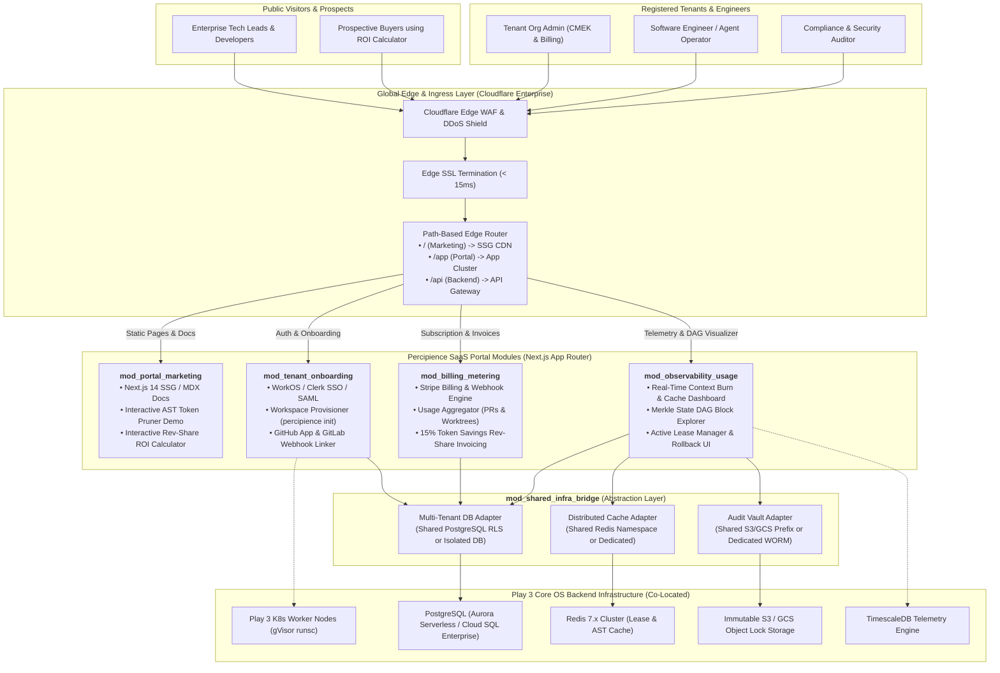
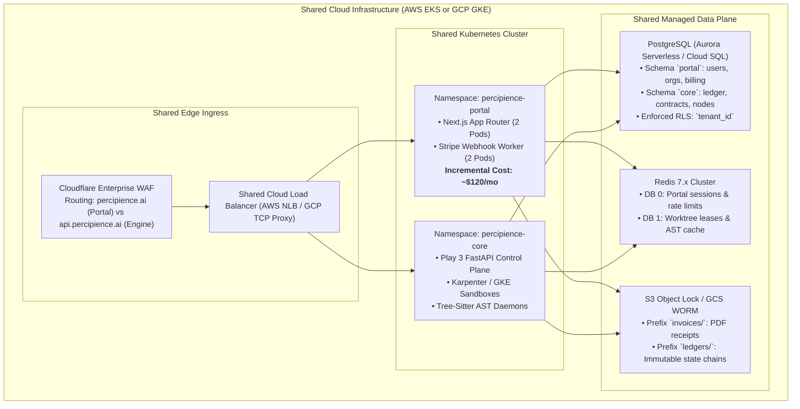
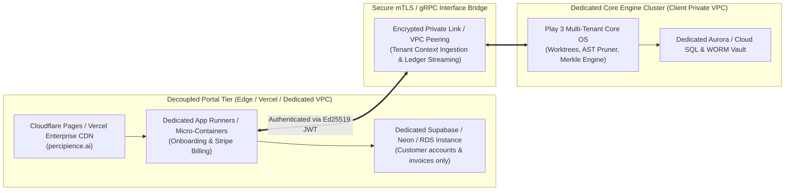
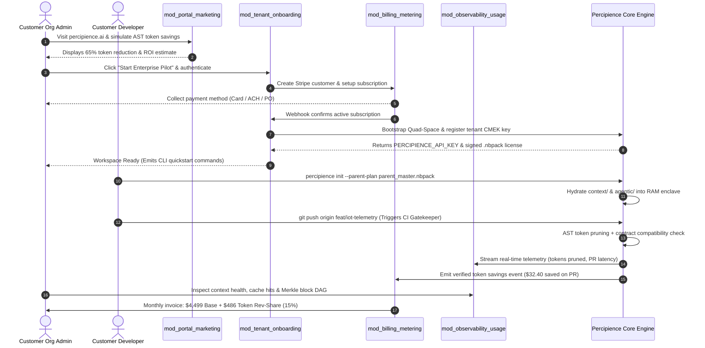
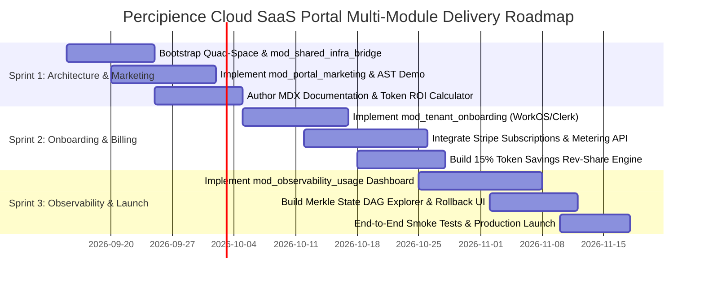

# Percipience Cloud SaaS Portal & Enterprise Corporate Site: Detailed Multi-Module Engineering Plan
**Parent Specification Reference**: Inherits from [Parent Master Context Engineering Plan](file:///Users/lakhwinder/PycharmProjects/nb_spanishfly/.junie/plans/claude-context-engineering-parent-master-plan.md) and [Corporate Website Space Plan](file:///Users/lakhwinder/PycharmProjects/nb_spanishfly/.junie/plans/claude-context-engineering-corp-site-space.md).  
**Associated Commercial Play**: [Play 3: Enterprise Context Engineering OS & CI/CD Gatekeeper](file:///Users/lakhwinder/PycharmProjects/nb_spanishfly/user/outputs/play_3_enterprise_context_engineering_os_plan.md).  
**Organization**: **Neutron Binary**  
**Product**: **Percipience**  
**Operating Mode**: `mode: multi_module`  
**Execution Spaces**: `context/`, `agentic/`, `workplace/`, `user/`

---

## 1. Executive Summary & Strategic Positioning

To commercialize **Neutron Binary Percipience** (the Enterprise Context Engineering OS & CI/CD Gatekeeper), enterprises, scale-ups, and AI engineering studios require a unified, mission-critical web application that bridges **public corporate brand presence**, **frictionless developer/enterprise onboarding**, **metered billing and revenue-share financial operations**, and **real-time context observability**.

This document defines the production engineering plan for the **Percipience Cloud SaaS Portal & Corporate Platform**. Built using a zero-overhead **`multi_module` Quad-Space architecture**, this system integrates the high-performance static rendering of modern Jamstack architectures (Next.js 14 App Router / React / Tailwind CSS) with a robust, enterprise-grade multi-tenant control plane.

### Core Strategic Mandates
1. **Unified Enterprise Portal & Corporate Brand**: Deliver $< 1.2\text{s}$ LCP Core Web Vitals performance, WCAG 2.1 AA accessibility, dynamic MDX technical documentation, interactive AST token compression visualizers, and ROI calculators.
2. **Autonomous Multi-Tenant Onboarding**: Self-serve registration, SSO/SAML 2.0 enterprise authentication (WorkOS / Clerk), automated workspace bootstrapping (`percipience init`), Customer-Managed Encryption Key (CMEK) provisioning, and one-click GitHub App / GitLab CI/CD webhook installations.
3. **Usage-Based Metering & Rev-Share Financial Engine**: Seamless Stripe Billing integration managing base recurring subscriptions ($1,499 Team, $4,499 Business, $9,999 Enterprise), real-time usage meters (PR verification checks, active worktree compute hours), and automated **15% token savings revenue-share calculation** backed by cryptographic proof logs.
4. **Mission-Control Context Observability Dashboard**: A live management interface exposing real-time token burn velocity, prompt cache hit ratios, Tree-Sitter AST compression efficiency, active ephemeral worktree leases, Merkle DAG state transitions, test quarantine alerts, and one-click surgical rollback triggers.
5. **Shared-to-Decoupled Infrastructure Bridge**: Enables the portal to **share existing Play 3 hosting infrastructure** (AWS EKS / GCP GKE, Aurora / Cloud SQL, Redis Cluster, S3 / GCS WORM storage, Cloudflare Edge) during initial launch, keeping incremental hosting OpEx below **$350/month**, while maintaining strict modular abstraction boundaries so that the portal can be completely decoupled into a dedicated VPC or standalone edge runtime later with zero code refactoring.

---

## 2. Multi-Module Quad-Space Directory Architecture

The platform is structured strictly under the standardized `multi_module` Quad-Space convention, cleanly separating governance, agentic prompt trees, decoupled application modules, and customer input/output artifacts:

```text
nb_spanishfly/
├── context/                                 # [OBFUSCATED / ENCLAVE-SEALED] Governance & Schemas
│   ├── contracts/                           # Formal inter-module interface schemas
│   │   ├── onboarding_contract.yaml         # Onboarding <-> Core Control Plane payload spec
│   │   ├── billing_meter_contract.yaml      # Usage Metering <-> Stripe billing events
│   │   └── observability_contract.yaml      # Worker Telemetry <-> UI Dashboard feeds
│   ├── ledger/
│   │   ├── context_ledger.yaml              # Master Merkle DAG state ledger
│   │   └── context_ledger.public.yaml       # Disk-safe sanitized status projection
│   ├── recovery_points/                     # Immutable verified rollback snapshots
│   └── schemas/                             # Zod & JSON schema validation models
├── agentic/                                 # [OBFUSCATED / ENCLAVE-SEALED] Prompt Suites & Workflows
│   ├── methodologies/                       # Design token & web quality guidelines
│   ├── prompts/                             # Autonomous site derivation prompt suites
│   └── workflows/                           # Multi-agent SDLC orchestration DAGs
├── workplace/                               # [TRANSPARENT CLIENT REPO] Customer Source & Modules
│   ├── config/                              # Global site configs, feature flags, Tailwind themes
│   │   ├── site_config.yaml                 # Multi-module routing, domain bindings, locales
│   │   ├── billing_plans.yaml               # Pricing tiers, quotas, rev-share formulas
│   │   └── tailwind.config.ts               # Shared Neutron Binary design tokens & styling
│   ├── shared/                              # Shared cross-module libraries & typed DTOs
│   │   ├── dto/                             # Shared TypeScript interfaces & types
│   │   ├── crypto/                          # Merkle hash proof validators & Ed25519 JWT utils
│   │   └── ui-primitives/                   # Headless accessible UI components (Shadcn/Tailwind)
│   └── modules/                             # Independent, decoupled architectural modules
│       ├── mod_portal_marketing/            # 1. Public marketing, SEO, MDX docs, ROI calculator
│       ├── mod_tenant_onboarding/           # 2. Self-serve onboarding, auth, Quad-Space setup
│       ├── mod_billing_metering/            # 3. Stripe billing, usage metering, rev-share ledger
│       ├── mod_observability_usage/         # 4. Live telemetry dashboard, Merkle visualizer
│       └── mod_shared_infra_bridge/         # 5. Shared-to-decoupled infrastructure adapter
└── user/                                    # [TRANSPARENT CLIENT REPO] User Inputs, HITL & Outputs
    ├── inputs/                              # Brand tokens, pricing parameters, sitemap specs
    ├── hitl/                                # Poisoning quarantines, billing exception reviews
    └── outputs/                             # Build artifacts, sitemaps, maturity scorecards
```

---

## 3. High-Level System Architecture & Component Interactions



---

## 4. Module-by-Module Technical Specifications

### 4.1. Module 1: Corporate Marketing, Documentation & ROI Calculator (`mod_portal_marketing`)

- **Objective**: Establish Neutron Binary's enterprise authority, demonstrate quantitative context compression value, provide developer documentation, and convert technical visitors into paying tenants.
- **Key Capabilities**:
  1. **Interactive AST Compression Simulator**: A client-side browser playground where developers paste a 1,000-line Python/TypeScript source file and see Tree-Sitter strip function bodies into a lightweight AST skeleton in real time ($< 15\text{ms}$), displaying the instant $50\%\text{--}70\%$ token reduction.
  2. **Token Rev-Share ROI Calculator**: An interactive slider model allowing engineering directors to input team size, Claude API monthly spend, and average daily PR count to calculate projected monthly net savings and the 15% performance fee.
  3. **Documentation Hub (MDX Content Collections)**: Versioned guides covering CLI quickstart (`percipience init`), GitHub Action integration, `.nbpack` obfuscation architecture, and surgical rollback workflows.
  4. **Performance & Compliance Benchmarks**: Live-embedded Core Web Vitals telemetry (LCP $< 1.1\text{s}$, CLS $= 0.00$, INP $< 50\text{ms}$), WCAG 2.1 AA compliant color palette, and downloadable SOC 2 / EU AI Act governance whitepapers.

---

### 4.2. Module 2: Self-Serve Tenant Onboarding & Workspace Provisioner (`mod_tenant_onboarding`)

- **Objective**: Automate the transition from visitor to fully provisioned enterprise tenant in $< 90$ seconds with zero manual intervention.
- **Onboarding Workflow**:
  ```mermaid
  sequenceDiagram
    participant User as Engineering Lead
    participant Portal as mod_tenant_onboarding
    participant Auth as WorkOS / Clerk SSO
    participant Bridge as mod_shared_infra_bridge
    participant Stripe as Stripe Billing
    participant Core as Percipience Core Engine

    User->>Portal: 1. Sign up with Work Email / GitHub SSO
    Portal->>Auth: 2. Authenticate & issue session JWT
    Portal->>User: 3. Prompt Organization Details & KMS Key Selection
    User->>Portal: 4. Select Tier (e.g. Business Tier $4,499/mo)
    Portal->>Stripe: 5. Create Stripe Customer & Checkout Session
    Stripe-->>User: 6. Complete Payment / Enter Billing Info
    Stripe->>Portal: 7. Webhook: checkout.session.completed
    Portal->>Bridge: 8. Provision Tenant Partition (Postgres RLS `tenant_id`)
    Portal->>Core: 9. Register Workspace & Seed Genesis Merkle Block
    Portal->>User: 10. Issue PERCIPIENCE_API_KEY & GitHub App Install Link
  ```
- **Enterprise Features**:
  - **SAML 2.0 / Okta / Azure AD SSO**: Pre-integrated via WorkOS for seamless enterprise identity.
  - **CMEK Registration**: Allows tenants to bind their AWS KMS CMK ARN or GCP Cloud KMS Key Name for zero-knowledge data encryption at rest.
  - **Bring Your Own Repository (BYOR) Linker**: First-class onboarding wizard for on-premise or custom-hosted Git remotes (GitLab Self-Managed, GitHub Enterprise Server, Bitbucket Data Center, AWS CodeCommit, Gitea). Generates and binds dedicated SSH deploy keys, stores Personal/Project Access Tokens (PAT) in KMS/Vault, validates corporate custom CA root certificates (`ca_bundle.crt`), and registers inbound webhooks.
  - **GitHub App & GitLab CI Auto-Configurator**: Installs `neutronbinary/percipience-action` onto customer repositories with pre-populated repository secrets.
  - **Custom Agent & Layered Context Onboarding Wizard**: Guides developers during workspace initialization to configure unencrypted custom agents (`agentic/custom/agents/`) and domain rules/schemas (`context/custom/`), running seamlessly alongside the encrypted platform core (`.nbpack`).

---

### 4.3. Module 3: Payments, Usage Metering & Rev-Share Financial Engine (`mod_billing_metering`)

- **Objective**: Manage subscription lifecycle, aggregate high-throughput usage events, compute token optimization revenue-share, and issue transparent, tamper-proof invoices.
- **Financial Architecture**:
  1. **Base Subscription Plans**:
     - **Team Tier**: $1,499/month (Includes 15 seats, 5 concurrent worktrees, 5,000 PR audits/mo).
     - **Business Tier**: $4,499/month (Includes 50 seats, 20 concurrent worktrees, 25,000 PR audits/mo, `.nbpack` obfuscation).
     - **Enterprise Tier**: $9,999+/month (Unlimited seats/worktrees, Private VPC support, Dedicated Slack SLA).
  2. **Over-Quota Usage Metering**:
     - Additional PR Audits: $0.05 per verified pull request beyond plan quota.
     - Ephemeral Worktree Compute Hours: $0.15 per sandbox vCPU-hour.
  3. **Verified Token Savings Revenue-Share (15%)**:
     - **Calculation Formula**:
       $$\text{Monthly Rev-Share} = \sum_{\text{PR}_i \in \text{Billing Cycle}} \left( \text{Uncompressed Tokens}_i - \text{AST Pruned Tokens}_i \right) \times \text{Blended Model Token Price} \times 0.15$$
     - **Proof Lineage**: Every line item on the invoice links directly to an immutable SHA-256 Merkle block in the client's ledger, allowing the CFO/Finance team to independently audit the token savings claim.
  4. **Stripe Billing Integration**:
     - Utilizes Stripe Metered Billing API with idempotent event ingestion.
     - Supports Stripe Customer Portal for self-serve credit card updates, tax ID registration (VAT/GST), and PDF invoice downloads.

---

### 4.4. Module 4: Tenant Observability, Merkle Explorer & Usage Dashboard (`mod_observability_usage`)

- **Objective**: Provide enterprise engineering leaders and auditors with a unified glass pane into context health, agent swarm activity, and state integrity.
- **Dashboard Views**:
  1. **Real-Time Context Health & Efficiency View**:
     - Live token consumption vs token savings velocity curves.
     - Prompt cache hit rate gauge ($> 85\%$ target).
     - Context drift index and semantic parity scorecards (0.00 to 1.00).
  2. **Interactive Merkle DAG State Explorer**:
     - Visual graph rendering of `ledger_chain` state transitions.
     - Node inspection showing commit SHA, active recovery point, touched contracts, and verification gate status.
  3. **Active Worktree Lease Manager**:
     - Live visualization of running agent sandboxes (`.worktrees/wt_{tenant}_{agent}`).
     - Remaining lease TTL countdown with emergency manual termination.
  4. **Alerts, Quarantines & Surgical Rollback Console**:
     - Real-time stream of detected context poisoning incidents.
     - Quarantine drawer displaying offending prompt snippets and isolated files.
     - One-click trigger for `percipience rollback --module <id> --target <RP_k>`.

---

### 4.5. Module 5: Shared Infrastructure Bridge & Decoupling Adapter (`mod_shared_infra_bridge`)

- **Objective**: Maximize capital efficiency at launch by co-locating the portal on Play 3's high-performance infrastructure, while providing an architectural decoupling contract that enables zero-downtime migration to dedicated infrastructure when scaling.
- **Architectural Abstraction Interface**:
  ```typescript
  export interface IInfraBridge {
    // Database access (isolated via tenant schema or dedicated connection string)
    getDatabaseClient(tenantId: string): Promise<DatabaseClient>;
    
    // Cache access (namespaced key isolation vs dedicated cluster)
    getCacheClient(tenantId: string): Promise<RedisClient>;
    
    // WORM Audit Storage (shared bucket with prefix isolation vs dedicated client bucket)
    getAuditVault(tenantId: string): Promise<WORMStorageClient>;
    
    // Telemetry Sink (co-located TimescaleDB vs dedicated Datadog/Prometheus endpoint)
    emitTelemetryMetric(event: TelemetryEvent): Promise<void>;
  }
  ```

---

## 5. Infrastructure Strategy: Shared Co-Location vs. Clean Decoupling

### 5.1. Phase 1: Shared Co-Located Infrastructure (Launch to 50 Customers)

By deploying the SaaS portal as an additional lightweight microservice within the existing Play 3 Kubernetes cluster, Neutron Binary eliminates duplicative database, cache, load balancing, and firewall costs:



#### Shared Infrastructure Cost Advantage
- **Baseline Play 3 Hosting Cost (Growth Milestone)**: $12,980/mo (AWS) / $12,468/mo (GCP).
- **Incremental Cost to Add Portal**:
  - Compute (4 lightweight Next.js + worker pods on existing nodes): **+$120.00/mo**.
  - Database (incremental ACU/IOP load on existing Aurora/Cloud SQL): **+$85.00/mo**.
  - Redis memory allocation (+2 GB cache): **+$35.00/mo**.
  - Object storage (invoice PDFs & asset CDN): **+$15.00/mo**.
  - **Total Portal Hosting OpEx in Shared Mode**: **$255.00 / month** (representing a **96.5% cost savings** compared to running an independent dedicated cluster).

---

### 5.2. Phase 2: Decoupled & Standalone Architecture (Growth to Enterprise Scale)

When customer volume exceeds 100 enterprise organizations or when high-security defense/fintech clients require complete physical isolation, the portal decouples seamlessly:



#### Step-by-Step Decoupling Protocol (Zero-Downtime Removal)
1. **Connection String Swap**: The `mod_shared_infra_bridge` switches from local PostgreSQL pool references (`DATABASE_URL`) to an isolated RDS/Cloud SQL connection string via environment variable injection.
2. **Schema Migration Export**: Run `percipience-db migrate --extract-schema portal` to snapshot all tenant profiles, subscription tiers, and Stripe event logs into the independent database.
3. **mTLS Control Plane Gateway**: Replace direct in-cluster pod calls with an authenticated gRPC/REST proxy over AWS PrivateLink or GCP VPC Peering, maintaining cryptographic boundary separation.
4. **Independent DNS Cutover**: Route `app.percipience.ai` to the new independent deployment at the Cloudflare edge with zero service interruption.

---

## 6. End-to-End Multi-Tenant Lifecycle & Interaction Sequence



---

## 7. Data Models, Schemas & Cross-Module Contracts

### 7.1. Site Environment & Multi-Module Configuration (`workplace/config/site_config.yaml`)

```yaml
site_id: "percipience_cloud_portal"
version: "1.0.0"
brand:
  name: "Neutron Binary Percipience"
  tagline: "Enterprise Context Engineering OS & CI/CD Gatekeeper"
  domain: "https://percipience.ai"
  support_email: "support@neutronbinary.com"
  theme:
    primary: "#0F172A" # Deep slate
    accent: "#38BDF8"  # Precision cyan
    verified: "#10B981" # Cryptographic green
    alert: "#F43F5E"    # Poisoning quarantine red

modules:
  mod_portal_marketing:
    enabled: true
    root_path: "/"
    features:
      ast_demo_enabled: true
      roi_calculator_enabled: true
      docs_engine: "mdx_collections"

  mod_tenant_onboarding:
    enabled: true
    root_path: "/onboard"
    auth_provider: "workos_sso"
    auto_bootstrap_quadspace: true
    default_plan: "plan_business"

  mod_billing_metering:
    enabled: true
    root_path: "/billing"
    payment_processor: "stripe"
    rev_share_rate: 0.15
    metering_aggregation_window_sec: 300

  mod_observability_usage:
    enabled: true
    root_path: "/app"
    refresh_interval_ms: 3000
    merkle_explorer_enabled: true
    rollback_gate_enabled: true

  mod_shared_infra_bridge:
    mode: "shared_co_located" # Options: "shared_co_located" | "decoupled_dedicated"
    connection_pool_max: 20
    redis_namespace_prefix: "portal:"
    storage_bucket_override: ""
```

---

### 7.2. Inter-Module Billing & Usage Event Schema (`context/contracts/billing_meter_contract.yaml`)

```yaml
$schema: "http://json-schema.org/draft-07/schema#"
title: "PercipienceUsageAndBillingEvent"
type: "object"
properties:
  event_id:
    type: "string"
    format: "uuid"
  tenant_id:
    type: "string"
  timestamp:
    type: "string"
    format: "date-time"
  event_type:
    type: "string"
    enum: ["pr_gate_verified", "worktree_hour_consumed", "token_savings_realized"]
  payload:
    type: "object"
    properties:
      pr_number:
        type: "integer"
      git_commit_sha:
        type: "string"
      tokens_uncompressed:
        type: "integer"
      tokens_pruned:
        type: "integer"
      gross_token_savings_usd:
        type: "number"
      rev_share_due_usd:
        type: "number"
      merkle_block_hash:
        type: "string"
    required: ["merkle_block_hash"]
required: ["event_id", "tenant_id", "timestamp", "event_type", "payload"]
```

---

## 8. Financial Return & Infrastructure Economics Matrix

The table below demonstrates the unit economics of operating the SaaS Portal under **Shared Infrastructure (Phase 1)** versus **Decoupled Standalone Infrastructure (Phase 2)**:

| Metric | Milestone 1 (10 Customers)<br>Shared Infra | Milestone 2 (50 Customers)<br>Shared Infra | Milestone 3 (200 Customers)<br>Decoupled Standalone |
| :--- | :--- | :--- | :--- |
| **SaaS Portal Subscriptions (MRR)** | **$45,000 / mo** | **$225,000 / mo** | **$900,000 / mo** |
| **Estimated 15% Token Rev-Share** | **$4,500 / mo** | **$37,500 / mo** | **$180,000 / mo** |
| **Total Blended Platform Revenue** | **$49,500 / mo** | **$262,500 / mo** | **$1,080,000 / mo** |
| **Incremental Portal Hosting OpEx** | **$165.00 / mo** | **$255.00 / mo** | **$1,480.00 / mo** (Dedicated VPC) |
| **Play 3 Core OS Hosting OpEx** | $3,850.00 / mo | $12,980.00 / mo | $39,450.00 / mo |
| **Combined All-In Hosting Bill** | **$4,015.00 / mo** | **$13,235.00 / mo** | **$40,930.00 / mo** |
| **Portal Hosting Cost % of Revenue** | **0.33%** | **0.10%** | **0.14%** |
| **Portal Gross Margin** | **99.6%** | **99.9%** | **99.8%** |

---

## 9. Phased 90-Day Implementation & Delivery Roadmap



### Definitions of Done & Delivery Verification
- **Sprint 1 Done**: Marketing portal achieves Lighthouse score $\ge 98$ across Performance, Accessibility, Best Practices, and SEO; interactive AST pruner executes in $< 15\text{ms}$ in the browser; shared infrastructure bridge establishes authenticated database pooling to Aurora/Cloud SQL.
- **Sprint 2 Done**: Developer can sign up via GitHub/WorkOS SSO, complete a test Stripe checkout, receive a valid `PERCIPIENCE_API_KEY`, and install the GitHub App onto a test repo within 90 seconds.
- **Sprint 3 Done**: Active pull requests trigger live telemetry updates in the dashboard within 2 seconds; token savings rev-share events calculate accurately against real LLM diffs; one-click surgical rollback restores a quarantined test module without breaking sibling services.
