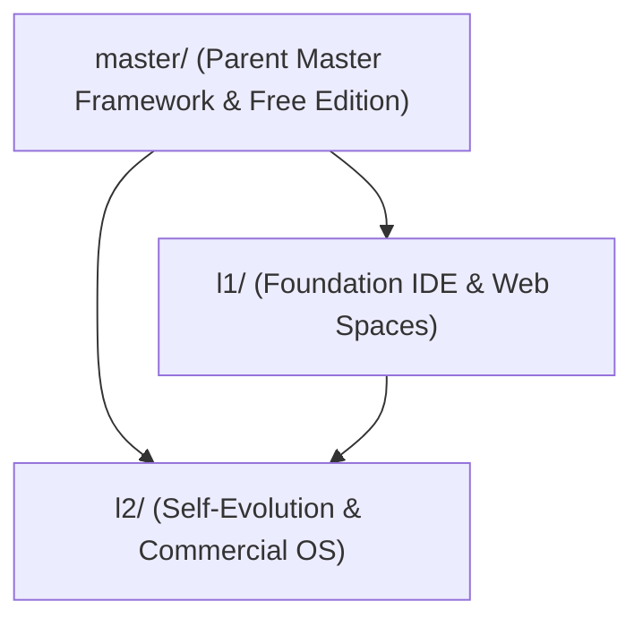

# Human-Readable Plan Guide & Architecture Reference

## Purpose

This guide provides a human-friendly and agentic overview of all context engineering plans in the Percipience framework.

---

## Organization Principles

### 1. Dual-Format Documentation
Every plan is provided in two complementary formats:
- **`concise.md`** (~60–200 lines): Optimized for LLM agentic context windows, fast scanning, and prompt efficiency.
- **`detailed.md`** (~250–1650 lines): Comprehensive implementation blueprint containing code samples, sequence diagrams, failure recovery, and verification suites.

### 2. Plan-Centric Directory Convention (4-File Pattern)
Every plan folder contains exactly 4 standard files:
1. `MANIFEST.yaml`: Cryptographic SHA-256 hashes, line counts, versioning, and capability dependencies.
2. `README.md`: Quick navigation and human overview.
3. `concise.md`: Agentic context specification.
4. `detailed.md`: Extended technical implementation guide.

### 3. Cryptographic Version Synchronization
All plans are continuously tracked with SHA-256 hashes via `sync_plan_versions.py`. Any update to `concise.md` or `detailed.md` is sealed into `MANIFEST.yaml`.

---

## Plan Hierarchy

### Master Plans (`master/`)
Governs the core platform runtime, 38 execution engines, Merkle state ledgers, AST token compression, and autonomous CI/CD (CAP-01 through CAP-35).

### L1 Foundation (`l1/`)
Implements concrete runtime spaces:
- **`intellij-pycharm-plugin`**: JetBrains Platform SDK & PSI AST Analysis.
- **`vscode-plugin`**: VSCode Extension API & LSP 3.17.
- **`saas-portal-domain`**: Next.js App Router, RBAC & PostgreSQL RLS.

### L2 Self-Evolution & Commercial OS (`l2/`)
Defines the enterprise commercial operating system:
- **`enterprise-context-engineering-os`**: Commercial CEPaaS architecture and BYOR multi-VCS adapters.
- **`corp-site-saas-portal`**: Multi-module web portal and Stripe revenue-share financial engine.

---

## How to Use This Guide

### For Developers
1. Start with [PLAN_INDEX.md](./PLAN_INDEX.md) for top-level navigation.
2. Read the plan's `README.md` for a quick overview.
3. Consult `detailed.md` when writing code or implementing features.
4. Run `python3 .nb/plan/sync_plan_versions.py` after editing plan files.

### For AI Agents
1. Load [PLAN_INDEX.md](./PLAN_INDEX.md) into context to locate the relevant domain plan.
2. Load the target plan's `concise.md` to conserve token budget while retaining core rules.
3. Reference `MANIFEST.yaml` for dependency verification.
