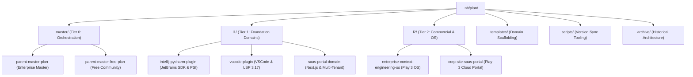

# 🧭 Percipience Context Engineering Plans (`.nb/plan/`)

Welcome to the **Percipience Plan Space**. This directory contains the authoritative architectural blueprints, domain layer specifications, and self-evolution guidelines governing the entire Percipience autonomous context engineering platform.

---

## 1. Architectural Hierarchy

The plan space is organized into a clean **3-Tier Multi-Layer Hierarchy** supported by reusable templates, synchronization tooling, and migration archives:



---

## 2. Standard 4-File Plan Pattern

Every active plan directory adheres strictly to the **Percipience 4-File Convention**:

| File | Purpose | Audience / Consumer |
| :--- | :--- | :--- |
| [`MANIFEST.yaml`](file:///Users/lakhwinder/PycharmProjects/nb_fairyfly/.nb/plan/master/parent-master-plan/MANIFEST.yaml) | Cryptographic metadata, SHA-256 hashes, line counts, and capability mappings. | CI/CD gates, Merkle DAG sealer, automation scripts. |
| `README.md` | Executive summary, subsystem overview, and directory navigation. | Human engineers and high-level agentic orientation. |
| `concise.md` | High-density specification optimized for low token consumption. | LLM prompt injection and agentic attention budgeting. |
| `detailed.md` | Complete architectural specification, API contracts, and implementation blueprints. | Deep cognitive reasoning, code synthesis, and audit verification. |

> [!NOTE]
> **Line Count Invariant**: In accordance with the Percipience Context Engineering Invariants, `concise.md` is strictly more compact than `detailed.md` across all plans ($N_{\text{lines}}(\text{concise}) < N_{\text{lines}}(\text{detailed})$).

---

## 3. Plan Catalog

### 🏛️ Tier 0: Master Orchestration Plans (`master/`)
- **[Parent Master Framework (`parent-master-plan/`)](file:///Users/lakhwinder/PycharmProjects/nb_fairyfly/.nb/plan/master/parent-master-plan/detailed.md)**: Universal blueprint defining core capabilities (`CAP-01` through `CAP-35`), Quad-Space clean partitioning, Merkle DAG ledger engine, and multi-tier commercial models.
- **[Parent Master Free Community Edition (`parent-master-free-plan/`)](file:///Users/lakhwinder/PycharmProjects/nb_fairyfly/.nb/plan/master/parent-master-free-plan/detailed.md)**: Community edition tailored for single-seat local development with zero external dependencies and embedded IDE bootstrapping.

### 🔌 Tier 1: Foundation Domain Layers (`l1/`)
- **[IntelliJ IDEA & PyCharm Plugin Space (`intellij-pycharm-plugin/`)](file:///Users/lakhwinder/PycharmProjects/nb_fairyfly/.nb/plan/l1/intellij-pycharm-plugin/detailed.md)**: JetBrains Platform SDK plugin, PSI multi-language AST token reduction, dockable ToolWindow control plane, and out-of-the-box Claude MCP auto-provisioning.
- **[VSCode Extension Space (`vscode-plugin/`)](file:///Users/lakhwinder/PycharmProjects/nb_fairyfly/.nb/plan/l1/vscode-plugin/detailed.md)**: VSCode Extension API, Language Server Protocol (LSP 3.17), in-editor CodeLens triggers, and nonce CSP Webview panel.
- **[SaaS Portal & Observability Domain (`saas-portal-domain/`)](file:///Users/lakhwinder/PycharmProjects/nb_fairyfly/.nb/plan/l1/saas-portal-domain/detailed.md)**: Next.js 14 App Router, multi-tenant RBAC, PostgreSQL RLS, Stripe billing, and 5-tab Observability Hub dashboard.

### 🧠 Tier 2: Commercial OS & Self-Evolution (`l2/`)
- **[Enterprise Context Engineering OS (`enterprise-context-engineering-os/`)](file:///Users/lakhwinder/PycharmProjects/nb_fairyfly/.nb/plan/l2/enterprise-context-engineering-os/detailed.md)**: Commercial CEPaaS operating system, BYOR multi-VCS adapter, `.nbpack` obfuscation, and enterprise pricing/deployment model (Play 3).
- **[Cloud SaaS Portal & Brand Site (`corp-site-saas-portal/`)](file:///Users/lakhwinder/PycharmProjects/nb_fairyfly/.nb/plan/l2/corp-site-saas-portal/detailed.md)**: Play 3 Cloud SaaS Portal, corporate public landing page, interactive pricing calculator, and enterprise self-serve onboarding.

### 📐 Scaffolding Templates (`templates/`)
- **[Custom Domain Layer Template](file:///Users/lakhwinder/PycharmProjects/nb_fairyfly/.nb/plan/templates/custom_domain_layer_template.md)**: Standardized template for scaffolding custom enterprise domain layers (FinTech, Healthcare, Web3, etc.).

---

## 4. Automation & Tooling

To maintain cryptographic synchronization across all plan manifests, use the automated sync tool:

```bash
# Verify synchronization of all plan manifests (Read-Only)
python3 .nb/plan/scripts/sync_plan_versions.py --check-only

# Automatically update all MANIFEST.yaml hashes and line counts
python3 .nb/plan/scripts/sync_plan_versions.py
```

---

## 5. Backward Compatibility & Integrity Invariants

- **Zero Symlinks Rule**: All files within `.nb/plan/` are physical files. No symbolic links or hard links are utilized, ensuring compatibility with all VCS, cloud build pipelines, and containerized enclaves.
- **Root Aliases**: Root-level aliases (`claude-context-engineering-parent-master-*.md`) are maintained as physical synchronized copies of their respective `detailed.md` source files to guarantee complete backward compatibility for IDE bootstrapper plugins and legacy build scripts.
- **Archival Integrity**: Prior monolithic drafts and migration artifacts are preserved under `archive/legacy_plans/` and `archive/migration/`.
