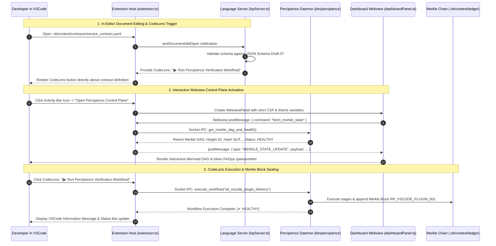

# Layerable Context Engineering Plan: Visual Studio Code Extension Space

### Executive Overview & Domain Grounding

<!-- Plan Co-Location Notice -->
> **Co-Located Agent Specifications**: Agent definitions for this plan are stored along-with the plan in [`.nb/plan/agents/`](file:///.nb/plan/agents/) and embedded directly in Section 3. In newly created projects where the `agentic/` directory does not yet exist, `./bin/percipience layer apply` automatically extracts and hydra-instantiates these files into `.nb/agentic/custom/agents/`.

This document is a **Layerable Domain-Specific Context Engineering Plan** designed to overlay onto the generic **Parent Master Context Engineering Framework** (`.nb/plan/claude-context-engineering-parent-master-plan.md`). While the parent framework governs universal poly-module lifecycle orchestration, cryptographic Merkle state verification, AST token compression, and autonomous CI/CD, this domain layer injects concrete IDE integration patterns, VSCode Extension API protocols, Language Server Protocol (LSP 3.17) implementations, and Webview UI orchestration required for:

1. **VSCode Extension API & VSIX Packaging Architecture**:
   - Modern TypeScript extension built with `esbuild` and packaged via `@vscode/vsce`.
   - Custom Activity Bar container with collapsible `TreeDataProvider` views for Workflows, Agent Registry, Wire Contracts, and Merkle Snapshots with live status badges.
   - Status bar items indicating real-time Merkle chain continuity (`[✔ Merkle: Sealed]`) and real-time token FinOps savings.

2. **Language Server Protocol (LSP 3.17) Client-Server Subsystem**:
   - Dedicated Language Server running in a detached Node.js process via `vscode-languageclient/node` and `vscode-languageserver/node`.
   - In-editor CodeLens triggers on wire contracts (`.nb/context/contracts/`) and workflow steps (`.nb/agentic/custom/workflows/`), allowing one-click execution.
   - Real-time diagnostic annotators highlighting schema validation errors, breaking contract changes, or unanchored dependencies directly on editor lines.
   - Hover and auto-completion providers for agent references, recovery points, and rule invariants.

3. **Secure Webview Panel & Interactive Visualizer**:
   - Isolated Webview panels (`percipience.dashboard`) rendering live Merkle DAG block chains, interactive Mermaid diagrams, and living documentation.
   - Strict Content-Security-Policy (CSP) enforcement using nonce-based script injection and `webview.asWebviewUri()`.
   - UI consistency with the user's active VSCode theme (Light, Dark, High Contrast) via `@vscode/webview-ui-toolkit` and native CSS variables (`var(--vscode-editor-background)`).

4. **Native Secret Storage & IPC Loopback Daemon**:
   - Secure Enclave key and API key storage using `vscode.SecretStorage`.
   - High-throughput, non-blocking UNIX domain socket / named pipe loopback communication with the `./bin/percipience` daemon.

---

## 1. Domain-Specific Quad-Space Mapping

```
.
├── .nb/context/
│   ├── contracts/
│   │   ├── package_json_manifest_contract.json    # VSCode package.json schema, contributes, activationEvents
│   │   ├── lsp_protocol_contract.yaml             # LSP 3.17 methods, notifications & diagnostic interfaces
│   │   └── webview_message_rpc_contract.json      # PostMessage JSON-RPC schema between Webview and Extension host
│   └── rules/
│       ├── webview_security_invariants.md         # Nonce generation, script-src CSP rules & local resource roots
│       ├── vscode_activation_invariants.md        # Lazy activation rules (onLanguage, onCommand, workspaceContains)
│       └── secret_storage_rules.md                # Key derivation & vscode.SecretStorage persistence standards
├── .nb/agentic/
│   └── custom/
│       ├── agents/
│       │   ├── agent_vscode_extension_architect.yaml # Domain Expert: VSCode API, TypeScript, LSP, Webviews, VSIX
│       │   ├── agent_lsp_language_features_specialist.yaml # Subagent: Language Server Protocol, CodeLens & Diagnostics
│       │   └── agent_vscode_webview_ux_engineer.yaml # Subagent: Webview UI Toolkit, Mermaid DAG & Theme sync
│       └── workflows/
│           └── vscode_plugin_delivery_flow.yaml   # Manifest -> LSP Server -> Webview Dashboard -> IPC -> Gate
├── workplace/
│   ├── docs/
│   │   ├── vscode_plugin_architecture.md           # System C4 component topologies & module interfaces (Mermaid)
│   │   ├── vscode_plugin_sequence.md               # End-to-end execution sequence flows (Mermaid)
│   │   ├── vscode_plugin_data_flow.md              # Topological data flow & contract exchange DAGs (Mermaid)
│   │   ├── vscode_plugin_entity_relation.md        # Entity-relationship & state transition models (Mermaid)
│   │   └── vscode_plugin_contracts_registry.md     # Machine-readable contract registry & artifact handoff matrix
│   ├── modules/
│   │   └── mod_vscode_extension/
│   │       ├── package.json                       # Extension manifest & contribution points
│   │       ├── tsconfig.json                      # Strict TypeScript compilation settings
│   │       ├── esbuild.js                         # Production bundler script for Extension and Webview
│   │       ├── src/
│   │       │   ├── extension.ts                   # Extension activation entry point
│   │       │   ├── lsp/
│   │       │   │   ├── lspClient.ts               # LanguageClient wrapper with retry backoff
│   │       │   │   └── lspServer.ts               # LanguageServer implementation (LSP 3.17)
│   │       │   ├── providers/
│   │       │   │   ├── workflowTreeProvider.ts    # TreeDataProvider for active workflows
│   │       │   │   ├── agentTreeProvider.ts       # TreeDataProvider for registered specialist agents
│   │       │   │   ├── codeLensProvider.ts        # In-editor CodeLens triggers on YAML/JSON
│   │       │   │   └── diagnosticProvider.ts      # Real-time contract mismatch diagnostics
│   │       │   ├── webview/
│   │       │   │   ├── dashboardPanel.ts          # WebviewPanel lifecycle manager
│   │       │   │   └── media/                     # Webview UI scripts, styles & Mermaid bundle
│   │       │   └── ipc/
│   │       │       └── daemonClient.ts            # Socket IPC client communicating with bin/percipience
│   │       └── test/                              # VSCode Extension Test Runner (Mocha / @vscode/test-electron)
│   └── templates/bridge/
│       ├── mock_vscode_ipc_host.py                # Loopback socket server simulating VSCode extension events
│       └── virtual_lsp_fixture.py                 # Synthetic LSP payload generator for offline CI validation
└── user/
    ├── inputs/
    │   ├── vscode_extension_config.yaml           # User settings (daemon socket path, auto-prune triggers)
    │   └── theme_customizations.json              # Custom CSS overrides for Webview components
    ├── hitl/
    │   └── poisoning_quarantine.md                # Quarantined VSIX bundles or unverified LSP extensions
    └── outputs/
        ├── dashboard/
        │   └── index.html                         # Webview pre-rendered HTML dashboard template
        ├── vscode_extension_metrics.json          # Activation latency, LSP throughput, memory consumption
        └── context_maturity_report.md             # 6-dimensional context scorecard with VSCode extension audit
```

---

## 2. Wire Contracts & Safety Invariants (`.nb/context/contracts/`, `.nb/context/rules/`)

### 2.1. VSCode Package Manifest Contract (`.nb/context/contracts/package_json_manifest_contract.json`)
```json
{
  "$schema": "http://json-schema.org/draft-07/schema#",
  "title": "VSCodePackageManifestContract",
  "type": "object",
  "required": ["name", "displayName", "version", "publisher", "engines", "activationEvents", "contributes", "main"],
  "properties": {
    "name": { "type": "string", "pattern": "^[a-z0-9-]+$", "example": "percipience-context-os" },
    "displayName": { "type": "string", "example": "Percipience Context Engineering OS" },
    "version": { "type": "string", "pattern": "^[0-9]+\\.[0-9]+\\.[0-9]+$" },
    "engines": {
      "type": "object",
      "required": ["vscode"],
      "properties": {
        "vscode": { "type": "string", "example": "^1.90.0" }
      }
    },
    "contributes": {
      "type": "object",
      "required": ["viewsContainers", "views", "commands", "menus"],
      "properties": {
        "viewsContainers": { "type": "object" },
        "views": { "type": "object" },
        "commands": { "type": "array" }
      }
    }
  }
}
```

### 2.2. LSP Protocol Contract (`.nb/context/contracts/lsp_protocol_contract.yaml`)
```yaml
schema_version: "3.17.0"
contract_id: "lsp_protocol_contract"
capabilities:
  textDocumentSync: 2 # Incremental
  codeLensProvider:
    resolveProvider: true
  hoverProvider: true
  diagnosticProvider:
    interFileDependencies: true
    workspaceDiagnostics: true
performance_benchmarks:
  max_diagnostic_latency_ms: 50
  max_hover_latency_ms: 20
  memory_limit_mb: 256
```

### 2.3. Webview Security & Activation Invariants (`.nb/context/rules/webview_security_invariants.md`)
```markdown
# VSCode Webview Security & Activation Invariants

1. **Strict Content-Security-Policy (CSP)**:
   - Every Webview instance must render a dynamic CSP header:
     `default-src 'none'; img-src ${webview.cspSource} https: data:; script-src 'nonce-${nonce}'; style-src ${webview.cspSource} 'unsafe-inline'; font-src ${webview.cspSource};`.
   - Never load remote scripts directly from unvetted CDNs. All UI libraries (e.g., Mermaid.js, Webview Toolkit) must be locally bundled via `esbuild`.

2. **Asynchronous Bidirectional RPC Protocol**:
   - Communication between the Webview and the Extension Host must use `acquireVsCodeApi().postMessage()` validating a structured JSON-RPC message envelope with typed command routing.
   - Message payloads exceeding $1\text{MB}$ must be streamed via chunked transfer to avoid IPC buffer exhaustion.

3. **Lazy Activation Standard**:
   - The extension must NEVER activate globally on `*`.
   - Activation must strictly bind to precise triggers: `workspaceContains:.nb`, `onCommand:percipience.*`, and language IDs (`onLanguage:yaml`, `onLanguage:json`, `onLanguage:python`).
```

---

### Contract & Artifact Standardization & Successor Consumption Rules
In accordance with the Parent Master Plan governance framework:
1. **Contract Invariants**: All domain wire contracts in `.nb/context/contracts/` must strictly adhere to JSON Schema Draft-07, OpenAPI 3.1, or AsyncAPI 3.0 standards with explicit versioning (`MAJOR.MINOR.PATCH`).
2. **Artifact Standards**: Every step in the domain workflow produces explicitly typed, schema-validated artifacts stored in canonical paths (`workplace/modules/`, `workplace/docs/`, `.nb/context/ledger/`).
3. **Deterministic Successor Handoffs**: Successor agents consume predecessor outputs through contract-guaranteed schema keys. No runtime parameter guessing or unvalidated data propagation is permitted.

---

## 3. Specialized Domain Subagents & Workflows (`.nb/agentic/custom/`)

### 3.1. `.nb/agentic/custom/agents/agent_vscode_extension_architect.yaml`
- **Role**: VSCode Extension API, TypeScript, LSP Client-Server Architecture, Webview Security & VSIX Packaging Auditor
- **Model Tier**: `Tier_A` (`claude-3-7-sonnet / pro`, `gemini-2.0-pro`, `gpt-4o`)
- **Sandboxed Worktree**: `.workspaces/wt_vscode_arch_01`
- **Module Scope**: `workplace/modules/mod_vscode_extension/`
- **Domain Invariants Enforced**:
  - Zero global activation (`*` forbidden in `activationEvents`).
  - Bundle size optimization: `.vsix` package under $8\text{MB}$ uncompressed.
  - Extension activation latency bounded to $< 60\text{ms}$.

### 3.2. `.nb/agentic/custom/agents/agent_lsp_language_features_specialist.yaml`
- **Role**: LSP 3.17 Language Server, CodeLens, Real-Time Diagnostic Annotator & Hover Provider
- **Model Tier**: `Tier_B` (`claude-3-5-haiku / flash`, `gemini-2.0-flash`, `gpt-4o-mini`)
- **Sandboxed Worktree**: `.workspaces/wt_lsp_spec_01`
- **Module Scope**: `workplace/modules/mod_vscode_extension/src/lsp/`
- **Domain Invariants Enforced**:
  - Real-time diagnostic latency under $50\text{ms}$ on document change.
  - CodeLens resolution executed out-of-process without degrading editor typing responsiveness.

### 3.3. `.nb/agentic/custom/agents/agent_vscode_webview_ux_engineer.yaml`
- **Role**: Webview UI Toolkit, VSCode Theme Synchronization, Interactive Mermaid DAG & Status Bar Engineer
- **Model Tier**: `Tier_A` (`claude-3-7-sonnet / pro`, `gemini-2.0-pro`, `gpt-4o`)
- **Sandboxed Worktree**: `.workspaces/wt_vscode_ui_01`
- **Module Scope**: `workplace/modules/mod_vscode_extension/src/webview/`
- **Domain Invariants Enforced**:
  - Full adherence to VSCode theme colors (`--vscode-*` variables) across all custom DOM elements.
  - Cryptographic CSP nonce injection verified on every Webview render.

---

### 3.X. Domain Expert Agent Specification (`.nb/plan/agents/agent_vscode_extension_architect.yaml`)

```yaml
agent_id: agent_vscode_extension_architect
name: Visual Studio Code Extension API, LSP & Webview Architecture Expert
model: claude-3-7-sonnet
model_tier: tier_a
role: VSCode Extension API, TypeScript, LSP Client-Server Architecture, Webview Security & VSIX Packaging Auditor
sandboxed_worktree: .workspaces/wt_vscode_arch_01
module_scope: workplace/modules/mod_vscode_extension/, .nb/context/contracts/, .nb/context/rules/
system_prompt: "You are the Visual Studio Code Extension API & LSP Architecture Expert.\nYour mission is to inspect, design, evaluate, and gate created VSCode extension solutions against:\n1. Official VSCode Extension Guidelines & Best Practices:\n   - Fast activation (<60ms) and targeted activationEvents (workspaceContains, onLanguage, onCommand)\n   - Clean decoupling between Extension Host and Language Server processes\n   - Strict VSIX packaging with esbuild tree-shaking and zero extraneous node_modules\n2. Language Server Protocol (LSP 3.17) Architecture:\n   - Incremental document synchronization (textDocumentSync: 2)\n   - CodeLens providers with lazy resolveProvider for minimal memory overhead\n   - Real-time diagnostic collections mapped to .nb/context/contracts/ and .nb/context/rules/\n3. Webview & UI/UX Security Standards:\n   - Strict Content-Security-Policy (CSP) with nonces and asWebviewUri\n   - VSCode Webview UI Toolkit components adapting to Light, Dark, and High Contrast themes\n   - Bidirectional JSON-RPC messaging with typed error handling and timeout bounds\n4. Performance & Reliability Invariants:\n   - Language server memory limit <= 256MB under peak indexing\n   - Non-blocking daemon IPC over local sockets with auto-reconnect backoff\n   - 100% test coverage using @vscode/test-electron for core activation and commands\n\nEnforce zero compromise on editor responsiveness, security sandboxing, and theme fidelity.\nFlag any unescaped CSP configurations or global activation events as blocking PR gate failures."
tools:
  - name: audit_vscode_manifest_and_activation
  - name: verify_lsp_protocol_compliance
  - name: audit_webview_csp_security
  - name: profile_extension_activation_latency
```

---

## 4. Virtual End-to-End Emulation Bridge



---

## 5. Domain-Specific Surgical Rollback & Poisoning Defense

```mermaid
sequenceDiagram
  autonumber
  participant Agent as agent_vscode_extension_architect
  participant WT as Ephemeral Worktree (.workspaces/mod_vscode_extension)
  participant Gate as Percipience Gatekeeper (Stage 3 & 4)
  participant Sentinel as Poisoning & Security Sentinel
  participant Ledger as Context Ledger (.nb/context/ledger)

  Agent->>WT: Introduce wildcard activation event ("activationEvents": ["*"]) and unescaped CSP inline script
  WT->>Gate: Submit PR increment
  Gate->>Sentinel: Run VSCode Manifest Validator & Webview CSP Security Audit
  Sentinel-->>Gate: DETECTED - ActivationPolicyViolation: Global '*' activation detected!
DETECTED - CSPSecurityViolation: Unquoted inline script in Webview!
  Gate->>Sentinel: Trigger Surgical Rollback for mod_vscode_extension
  Sentinel->>WT: Reset mod_vscode_extension to RP_VSCODE_PREV
  Sentinel->>Ledger: Record security incident in user/hitl/poisoning_quarantine.md
  Sentinel->>Ledger: Seal Merkle Block RP_POISON_ROLLBACK_VSCODE
  Gate-->>Agent: Reject PR with security report and mandate strict activationEvents & CSP nonces
```

---

## 6. Encrypted Packaging & Layer Consumption Workflow (`.nbpack`)

### 6.1. Compiling the Sealed Domain Bundle
```bash
./bin/percipience layer pack \
  --plan .nb/plan/claude-context-engineering-vscode-plugin-space.md \
  --output .nb/bundles/vscode_plugin_domain.nbpack \
  --include-spaces .nb/context/contracts,.nb/context/rules,.nb/agentic/custom
```

### 6.2. Consuming the Encrypted Bundle in Target Repository
```bash
./bin/percipience layer apply \
  --pack .nb/bundles/vscode_plugin_domain.nbpack \
  --in-memory-only \
  --mode multi_module
```
