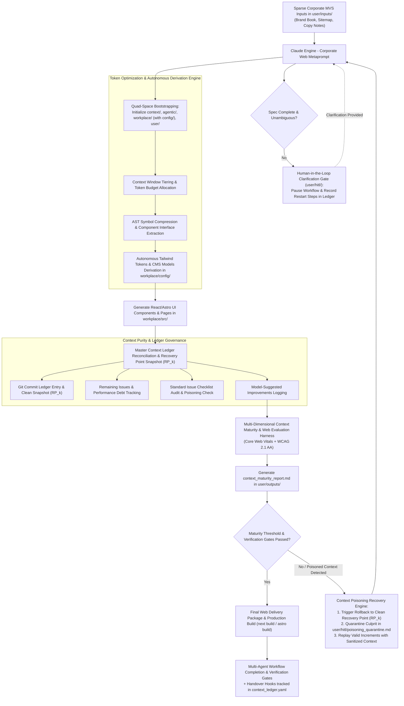

# Requirements

### Overview & Goals
The objective is to design and formulate an autonomous Context Engineering Agentic Space tailored for **Corporate Websites and Enterprise Portals** based on Next.js / Astro, Tailwind CSS, Headless CMS / MDX, SEO & i18n Localization, and Web Quality Benchmarking (Core Web Vitals & WCAG 2.1 AA). 

> [!IMPORTANT]
> **Parent Master Plan Inheritance**: This domain plan explicitly inherits from and implements all core architectural pillars, state governance standards, context security mechanisms, and evaluation frameworks specified in the [Parent Master Context Engineering Plan](file:///Users/lakhwinder/PycharmProjects/nb_spanishfly/.junie/plans/claude-context-engineering-parent-master-plan.md).

This framework introduces six core foundational capabilities to drive autonomous, zero-drift corporate web engineering:
1. **Parent Master Plan Inheritance**: Full alignment with the parent master context engineering standard, maintaining complete lineage traceability across governance, agentic prompts, code/configs, and user spaces.
2. **Autonomous Operations on Minimum Viable Set (MVS) Inputs**: An auto-intelligent derivation engine that consumes sparse corporate web inputs (brand guidelines, color hexes, sitemap sketches, content notes, lead form fields) in `user/inputs/` and automatically populates complete code configurations in `workplace/config/` (Tailwind tokens, CMS content models, site environment settings), source implementations in `workplace/src/` (Next.js/Astro UI components, MDX collections, JSON-LD metadata, contact API routes), and automated test harnesses (Vitest/Jest, Playwright E2E, axe-core WCAG, Lighthouse CI) without manual intervention unless explicit ambiguity gates are triggered.
3. **Context Poisoning Detection, Recovery Point Rollback & Incremental Replay Engine**: A state resilience engine continuously auditing context purity. If invalid schemas, hallucinated APIs, or breaking design tokens pollute the context, the engine rewinds workspace state to a verified clean recovery point snapshot (`recovery_point`), logs and quarantines the offending snippet into `user/hitl/poisoning_quarantine.md`, purges active agent memory, and replays subsequent valid web increments autonomously.
4. **Context Compression & GenAI Optimization Engine**: A systematic token reduction layer utilizing AST symbol signature extraction for web components/utilities, standard unified diff updates (`git diff` style) for code changes, a 3-tier context window allocation model (Immediate Working Memory, Active Ledger Summary, Archived Raw Artifacts), and static prompt cache prefix alignment to reduce API token costs by >= 50%.
5. **Multi-Dimensional Context Maturity Evaluation Report**: Emitting a comprehensive quantitative scorecard to `user/outputs/context_maturity_report.md` evaluating the project across six standard dimensions: Requirement Coverage, Architectural Grounding, Code & Config Quality, Test & Verification Coverage, Security & Compliance, and Token/GenAI Efficiency (incorporating Lighthouse Core Web Vitals and WCAG AA metrics).
6. **Integrated Master Context Ledger (`context_ledger.yaml`)**: Machine-readable DAG ledger in `context/` extended with `recovery_points`, `poisoning_incidents`, `git_commits` with linked requirements, `remaining_issues`, a `standard_issue_checklist` (including `CHK_CONTEXT_POISONING_FREE`), `model_suggestions`, and domain site settings.
7. **Quad-Space Clean Folder Bootstrapping & Multi-Agent Flow**: Scaffolding and isolation across `context/`, `agentic/`, `workplace/` (with `workplace/config/`), and `user/` (`inputs/`, `hitl/`, `outputs/`), orchestrated by multi-agent workflows with completion gates, independent verification gates, handover hooks, and Human-in-the-Loop (HITL) clarification checkpoints.

---

### Scope
#### In Scope
- **Parent Master Plan Inheritance**: Strict adherence to governance, ledger schemas, prompt suites, and recovery/replay protocols defined in `claude-context-engineering-parent-master-plan.md`.
- **Quad-Space Clean Folder Bootstrapping Engine**: Automated scaffolding logic to initialize and isolate four distinct clean directories: `context/` (governance, state ledger, schemas), `agentic/` (prompts, workflows, methodologies), `workplace/` (source code and `workplace/config/` for Tailwind tokens, framework settings, CMS models, and Lighthouse CI parameters), and `user/` (`inputs/`, `hitl/` including `poisoning_quarantine.md`, `outputs/` including `context_maturity_report.md`).
- **Minimum Viable Set (MVS) Corporate Ingestion & Derivation Engine**: Autonomous derivation logic to infer complete corporate site blueprints, sitemap hierarchies, page layouts, component libraries, design tokens, and Headless CMS schemas from minimal inputs in `user/inputs/`.
- **Context Poisoning Detection, Recovery Point Rollback & Incremental Replay Engine**: Continuous auditing of web artifacts against schema contracts and verification gates; saving clean `recovery_points` snapshots in `context_ledger.yaml`; executing `git reset --hard` rollback on context contamination; quarantining culprits in `user/hitl/poisoning_quarantine.md`; and replaying valid downstream increments.
- **Context Compression & GenAI Optimization Engine**: Token budgeting, AST symbol signature extraction for React/Astro components, unified diff updates for file deltas, 3-tier context window management, and prompt cache alignment.
- **Design System & UI Component Framework**: Scaffolding Tailwind CSS tokens (colors, typography scales, spacing grids, theme modes), responsive breakpoints, reusable UI components (Navbar, Hero, Feature Grid, Testimonials, Contact Forms, Footer), and accessibility standards (WCAG 2.1 AA) in `workplace/config/` and `workplace/src/`.
- **Jamstack SSG/SSR & Headless CMS (MDX/Strapi) Scaffolding**: Static site generation / server-side rendering setups, dynamic page routes, MDX/Strapi content models, image optimization pipelines, and serverless lead capture API endpoints.
- **SEO Optimization, Structured Data & i18n Engine**: Meta titles/descriptions, OpenGraph/Twitter cards, JSON-LD structured data (Organization, LocalBusiness, Article, FAQ), XML sitemaps, robots.txt, and multi-language routing (i18n).
- **Multi-Dimensional Context Maturity Evaluation Report**: Automated evaluation scoring all 6 standard dimensions (Requirement Coverage, Architectural Grounding, Code & Config Quality, Test & Verification Coverage, Security & Compliance, Token/GenAI Efficiency) alongside Core Web Vitals (LCP, CLS, INP) and axe-core WCAG audits, emitted to `user/outputs/context_maturity_report.md`.
- **Integrated Master Context Ledger (`context_ledger.yaml`)**: Extended state ledger tracking artifact DAGs, recovery snapshots, Git commits, remaining technical debt, standard issue checklist audits, and model suggestions.
- **Incremental SDLC Lifecycle & Multi-Agent Flow**: SDLC orchestration (architect -> develop -> test -> build -> deploy) with Task Completion Gates, Independent Verification Gates, Handover Hooks, spec-driven auto-completion, and Human-in-the-Loop clarification gates in `user/hitl/`.

#### Out of Scope
- Direct cloud hosting/server deployment execution on Vercel/Netlify/AWS inside Claude's immediate inference loop (Claude generates complete compile-ready codebases, static build configs, CI/CD pipelines, Dockerfiles, and test harnesses).

---

### User Stories
- **As a Web Systems Architect & Lead**, I want this corporate site domain plan to explicitly inherit from the Parent Master Context Engineering Plan so that all web design, component development, and CMS governance follow standardized agentic orchestration rules.
- **As a Corporate Brand Lead**, I want to provide high-level brand guidelines and a rough sitemap in `user/inputs/` so that Claude can autonomously infer design system tokens, Tailwind themes in `workplace/config/`, and responsive UI components in `workplace/src/`.
- **As a System Reliability Engineer**, I want automated context poisoning detection and recovery point rollback so that if hallucinated design tokens or broken API schemas contaminate the context, the workspace rewinds to a clean recovery point snapshot, logs the culprit into `user/hitl/poisoning_quarantine.md`, and replays valid increments autonomously.
- **As a Financial & Engineering Manager**, I want an automated Context Compression & GenAI Optimization Engine utilizing AST symbol extraction and unified diff updates so that web codebase context passing achieves >= 50% token cost reduction.
- **As a Lead Auditor & Web QA Lead**, I want a Multi-Dimensional Context Maturity Evaluation Report emitted to `user/outputs/context_maturity_report.md` evaluating all 6 core dimensions alongside Core Web Vitals and WCAG 2.1 AA scores.
- **As a Release & DevOps Engineer**, I want `context_ledger.yaml` to track Git commits, recovery points, remaining issues, standard issue checklists (including `CHK_CONTEXT_POISONING_FREE`), and model-suggested improvements for zero-drift site releases.
- **As a Delivery Orchestration Lead**, I want multi-agent workflows in `agentic/` with completion gates, independent verification gates, handover hooks, and human clarification checkpoints in `user/hitl/` so that execution auto-completes safely and halts only when inputs are genuinely ambiguous.

---

### Functional Requirements
- **Quad-Space Directory Bootstrapping**: Automated creation and strict isolation of `context/`, `agentic/`, `workplace/` (with `workplace/config/`), and `user/` (`inputs/`, `hitl/`, `outputs/`).
- **Autonomous MVS Ingestion & Web Derivation**: Consuming sparse corporate web inputs from `user/inputs/`, autonomously inferring complete sitemaps, page layouts, Tailwind design tokens in `workplace/config/`, MDX content models, React/Astro UI components in `workplace/src/`, and test harnesses without human manual steps.
- **Context Poisoning Defense, Rollback & Replay**:
  - Save clean `recovery_points` snapshots in `context_ledger.yaml` at each verified milestone.
  - Audit context continuously at verification gates for hallucinations or invalid specifications.
  - Trigger `rollback_to_recovery_point(RP_k)` on detection, executing `git reset --hard C_k`.
  - Isolate offending inputs/prompts into `user/hitl/poisoning_quarantine.md`.
  - Execute `replay_incremental_enhancements()` for subsequent valid steps using sanitized context.
- **Token Budgeting & Context Compression**:
  - Enforce token budget limits per step.
  - Perform AST symbol extraction for React/Astro components and utility signatures.
  - Transmit standard Unified Diffs (`git diff`) for code modifications.
  - Maintain a 3-tier context window model and align static prompt cache prefixes.
- **Multi-Dimensional Maturity Assessment**:
  - Score project maturity (0.00 to 1.00) across 6 standard dimensions: Requirement Coverage, Architectural Grounding, Code & Config Quality, Test & Verification Coverage, Security & Compliance, and Token/GenAI Efficiency.
  - Incorporate web benchmark metrics (Core Web Vitals LCP/CLS/INP, WCAG 2.1 AA violation counts, broken link count).
  - Automatically emit scorecards to `user/outputs/context_maturity_report.md`.
- **Integrated Master Context Ledger (`context_ledger.yaml`)**:
  - Maintain DAG relations across all artifacts (`user/inputs/` -> `workplace/config/` -> `workplace/src/` -> `user/outputs/`).
  - Maintain `recovery_points`, `poisoning_incidents`, `git_commits`, `remaining_issues`, `standard_issue_checklist` (including `CHK_CONTEXT_POISONING_FREE`), and `model_suggestions`.
- **Autonomous Multi-Agent Workflow Engine**:
  - Multi-agent scaffolding (`agent_architect`, `agent_developer`, `agent_evaluator`, `agent_verifier`).
  - Task Completion Gates, Independent Verification Gates, Handover Hooks, spec-driven auto-completion loop, and HITL clarification gates in `user/hitl/` with explicit restart instructions.

---

### Non-Functional Requirements
- **Zero-Drift & Determinism**: 100% lineage traceability from MVS inputs to derived code, configs, and reports.
- **Context Integrity & Poisoning Resilience**: Guaranteed recovery to clean state within < 1 step upon detecting context contamination or severe hallucination.
- **Core Web Vitals & Performance**: Target Lighthouse scores >= 95 across Performance, Accessibility, Best Practices, and SEO; fast initial page load (LCP < 1.2s, CLS < 0.05).
- **Accessibility (a11y)**: Strict adherence to WCAG 2.1 AA standards including keyboard navigation, ARIA attributes, semantic HTML5 tags, and contrast compliance.
- **Token Efficiency**: Achieve >= 50% token reduction via AST extraction, diff updates, and prompt caching.

---

# Technical Design

### Key Decisions
- **Parent Master Plan Alignment**: Inherit all architecture, state governance, context compression, poisoning defense, and maturity evaluation standards from `claude-context-engineering-parent-master-plan.md`.
- **Quad-Space Clean Folder Architecture**: Standardize on four isolated top-level clean folders:
  - `context/`: Holds governance context, schemas, and `context_ledger.yaml`.
  - `agentic/`: Holds prompt suites, agent roles, workflow DAGs, gates, hooks, and methodologies.
  - `workplace/`: Holds source code, test suites, AND `workplace/config/` (Tailwind tokens, CMS content schemas, Lighthouse CI settings, deployment params).
  - `user/`: Dedicated input/output/HITL folder (`inputs/`, `hitl/` containing `poisoning_quarantine.md`, `outputs/` containing `context_maturity_report.md`).
- **Modern Jamstack & SSG Tech Stack**: Next.js (App Router) / Astro, React, Tailwind CSS, Headless CMS / MDX, Vitest/Jest, Playwright E2E, axe-core WCAG.
- **Context Compression & GenAI Optimization**:
  - *AST Symbol Extraction*: Extract component signatures, prop interfaces, and utility exports instead of full implementations during planning.
  - *Unified Diff Updates*: Transmit file deltas (`git diff`) for code modifications.
  - *3-Tier Context Model*: Immediate working memory, active ledger summary, archived raw artifacts.
  - *Prompt Cache Alignment*: Align static system instructions and tool definitions at the prefix.
- **Context Poisoning & Recovery Snapshot Engine**:
  - *Snapshotting*: Save clean recovery point snapshots (`recovery_points`) in `context_ledger.yaml` linked to Git commit SHAs and artifact hashes.
  - *Rollback Protocol*: Execute `git reset --hard C_k`, rewind ledger to snapshot $M_k$, and purge contaminated memory.
  - *Culprit Quarantine*: Log offending inputs or hallucinated prompts into `user/hitl/poisoning_quarantine.md`.
  - *Incremental Replay Protocol*: Re-run downstream steps using sanitized context.
- **Six-Phase Prompt Suite Architecture**:
  1. `system_prompt.md`: Role identity, zero-drift rules, context poisoning protection, token compression, Quad-Space registration rules.
  2. `bootstrapping_prompt.md`: MVS ingestion, Quad-Space scaffolding, design token initialization, initial ledger generation.
  3. `derivation_site_prompt.md`: Deriving sitemaps, Tailwind configs in `workplace/config/`, React/Astro UI components in `workplace/src/`, MDX schemas, JSON-LD generators, contact API routes.
  4. `evaluation_refinement_prompt.md`: Performance and accessibility evaluation harness, 6-dimensional maturity report (`context_maturity_report.md`), issue checklist auditing, model suggestion logging.
  5. `lifecycle_delivery_prompt.md`: Incremental SDLC orchestration (architect -> develop -> unit/E2E test -> build -> deploy) with recovery point snapshot creation and CI/CD generation.
  6. `workflow_orchestration_prompt.md`: Multi-agent role definition, completion & independent-verification gates, handover hooks, auto-completion loop, context rollback/replay handler, and HITL clarification gates in `user/hitl/`.

---

### Data Models / Contracts

```yaml
# Master Context Ledger (context_ledger.yaml) for Corporate Website Space
ledger_version: "6.0.0"
project:
  name: "AcmeCorp_Global_Website"
  domain: "Corporate Website & Enterprise Portal"
  methodology: "Agile / Hybrid SDLC"
  tech_stack:
    framework: "Next.js 14 (App Router) / Astro"
    styling: "Tailwind CSS & Shadcn UI"
    cms: "MDX Content Collections / Strapi"
    form_handling: "React Hook Form & Zod"
    analytics: "Google Tag Manager & PostHog"
  code_config: "workplace/config/site_config.yaml"

token_optimization:
  context_compression_enabled: true
  ast_extraction_level: "signatures_only"
  diff_mode: "unified_diff"
  prompt_caching_aligned: true
  estimated_token_savings_pct: 61.2

recovery_points:
  - snapshot_id: "RP_001"
    timestamp: "2026-09-13T14:00:00Z"
    git_commit_sha: "f1e2d3c4b5a67890123456789abcdef012345678"
    clean_artifacts_hash: "9a8b7c6d5e4f3a2b1c0d9e8f7a6b5c4d"
    verified_maturity: "Design_System_Scaffolded"
    status: "Active_Clean"

poisoning_incidents:
  - incident_id: "POI_001"
    detected_at: "2026-09-13T14:20:00Z"
    culprit_type: "Hallucinated_Tailwind_Class"
    culprit_source: "agent_developer prompt turn 3"
    rolled_back_to: "RP_001"
    quarantine_file: "user/hitl/poisoning_quarantine.md"
    replay_status: "Successfully_Replayed"

site_environment:
  brand_name: "Acme Corporation"
  primary_color: "#1E3A8A"
  secondary_color: "#0D9488"
  supported_locales: ["en", "es", "de"]
  seo_defaults:
    site_url: "https://www.acmecorp.com"
    twitter_handle: "@acmecorp"
  compliance: ["GDPR", "CCPA", "WCAG_2_1_AA"]

artifacts:
  - id: "art_mvs_01"
    name: "brand_and_sitemap_spec.md"
    type: "MinimumViableSet"
    source: "user/inputs/brand_and_sitemap_spec.md"
    hash: "f1e2d3c4b5a67890123456789abcdef0123456789abcdef0123456789abcdef0"
    maturity: "MVS_Ingested"

  - id: "art_design_system_01"
    name: "tailwind.config.ts"
    type: "DesignSystemTokens"
    source: "workplace/config/tailwind.config.ts"
    derived_from: ["art_mvs_01"]
    maturity: "Derived"

  - id: "art_cms_schema_01"
    name: "content_schema.config.ts"
    type: "CMSContentModel"
    source: "workplace/config/content_schema.config.ts"
    derived_from: ["art_mvs_01"]
    maturity: "Design_System_Scaffolded"

  - id: "art_page_components_01"
    name: "LandingPage.tsx"
    type: "WebComponentScaffold"
    source: "workplace/src/components/LandingPage.tsx"
    derived_from: ["art_design_system_01", "art_cms_schema_01"]
    maturity: "CMS_Model_Scaffolded"

  - id: "art_maturity_report_01"
    name: "context_maturity_report.md"
    type: "MaturityReport"
    source: "user/outputs/context_maturity_report.md"
    derived_from: ["art_page_components_01"]
    maturity: "Evaluated"

git_commits:
  - commit_sha: "f1e2d3c4b5a67890123456789abcdef012345678"
    timestamp: "2026-09-13T14:00:00Z"
    author: "Claude Agentic Engine <agent@antigravity.ai>"
    message: "feat(web): initialize Tailwind tokens and Quad-Space folder structure"
    linked_requirements: ["REQ-WEB-01", "REQ-A11Y-01"]
    touched_artifacts: ["art_design_system_01", "art_cms_schema_01"]

remaining_issues:
  - issue_id: "ISSUE-WEB-01"
    category: "Performance"
    severity: "Medium"
    description: "Hero image optimization needed to achieve LCP < 1.0s on 3G network simulation."
    status: "Open"
    target_milestone: "Sprint-2"

standard_issue_checklist:
  - check_id: "CHK_UNHANDLED_EXCEPTIONS"
    description: "Form inputs & API routes gracefully handle validation errors"
    passed: true
  - check_id: "CHK_MISSING_UNIT_TESTS"
    description: "Vitest unit & Playwright E2E coverage >= 85%"
    passed: true
  - check_id: "CHK_TOKEN_BUDGET_EXCEEDED"
    description: "Token budget per step under limit"
    passed: true
  - check_id: "CHK_UNVERIFIED_SCHEMAS"
    description: "Zod schemas and Tailwind configs validated"
    passed: true
  - check_id: "CHK_SECURITY_VULNERABILITIES"
    description: "Zero hardcoded API keys, CSRF flaws, or XSS vulnerabilities"
    passed: true
  - check_id: "CHK_MEMORY_LEAK_RISK"
    description: "No uncleaned DOM event listeners or memory leaks"
    passed: true
  - check_id: "CHK_CONTEXT_POISONING_FREE"
    description: "Context verified clean without hallucinated components or invalid tokens"
    passed: true

model_suggestions:
  - suggestion_id: "SUG-WEB-01"
    area: "Performance"
    recommendation: "Implement Astro dynamic Islands architecture for static testimonial slider."
    expected_impact: "Reduces client JS bundle size by 35KB."
    status: "Proposed"

workflow:
  id: "wf_incremental_delivery_01"
  spec_input: "user/inputs/brand_and_sitemap_spec.md"
  hitl_dir: "user/hitl/"
  output_dir: "user/outputs/"
  auto_complete: true
  status: "In_Progress"
  agents:
    - id: "agent_architect"
      role: "Web Architect"
      stage: "architect"
      task_status: "Verified"
      output_artifact: "art_design_system_01"
      verified_by_gate: "gate_arch_review"
      handoff_hook: "hook_arch_to_dev"
    - id: "agent_developer"
      role: "Frontend Developer"
      stage: "develop"
      task_status: "Verified"
      output_artifact: "art_page_components_01"
      verified_by_gate: "gate_dev_tests"
      handoff_hook: "hook_dev_to_eval"
    - id: "agent_evaluator"
      role: "Web Quality Evaluator"
      stage: "evaluate"
      task_status: "Verified"
      output_artifact: "art_maturity_report_01"
      verified_by_gate: "gate_eval_review"
      handoff_hook: "hook_eval_to_deploy"
  gates:
    - id: "gate_arch_review"
      type: "IndependentVerification"
      verifier_agent: "agent_verifier"
      checks: ["spec_coverage", "zero_drift", "a11y_tokens_valid", "poisoning_check"]
      result: "Passed"
    - id: "gate_dev_tests"
      type: "TaskCompletion"
      verifier_agent: "agent_verifier"
      checks: ["vitest_unit_pass", "playwright_e2e_pass", "next_build_succeeds"]
      result: "Passed"
    - id: "gate_eval_review"
      type: "IndependentVerification"
      verifier_agent: "agent_verifier"
      checks: ["maturity_score_above_threshold", "lighthouse_scores_passed", "checklist_passed"]
      result: "Passed"
  hooks:
    - id: "hook_arch_to_dev"
      trigger: "on_gate_pass:gate_arch_review"
      from_agent: "agent_architect"
      to_agent: "agent_developer"
      payload_artifact: "art_design_system_01"
      status: "Fired"
    - id: "hook_dev_to_eval"
      trigger: "on_gate_pass:gate_dev_tests"
      from_agent: "agent_developer"
      to_agent: "agent_evaluator"
      payload_artifact: "art_page_components_01"
      status: "Fired"
  clarification_requests: []

drift_checks:
  last_evaluated: "2026-09-13T14:00:00Z"
  unmapped_mvs_requirements: []
  drift_detected: false
```

---

### Architecture Diagram



---

### File Structure

```
.
├── context/
│   ├── ledger/
│   │   └── context_ledger.yaml
│   ├── schemas/
│   │   ├── design_system_schema.yaml
│   │   ├── context_ledger_schema.yaml
│   │   ├── recovery_point_schema.yaml
│   │   ├── git_commit_schema.yaml
│   │   ├── issue_checklist_schema.yaml
│   │   └── maturity_report_schema.yaml
│   └── reports/
│       └── context_maturity_report_template.md
├── agentic/
│   ├── prompts/
│   │   ├── system_prompt.md
│   │   ├── bootstrapping_prompt.md
│   │   ├── derivation_site_prompt.md
│   │   ├── evaluation_refinement_prompt.md
│   │   ├── lifecycle_delivery_prompt.md
│   │   └── workflow_orchestration_prompt.md
│   ├── workflows/
│   │   ├── agent_roles_template.yaml
│   │   ├── workflow_dag_template.yaml
│   │   ├── gate_definitions_template.yaml
│   │   ├── handover_hooks_template.yaml
│   │   ├── context_rollback_replay_handler.yaml
│   │   └── clarification_request_template.md
│   └── methodologies/
│       ├── agile_user_story_template.md
│       ├── waterfall_srs_template.md
│       └── token_optimization_playbook.md
├── workplace/
│   ├── config/
│   │   ├── tailwind.config.ts
│   │   ├── content_schema.config.ts
│   │   ├── site_environment_config.yaml
│   │   ├── lighthouse_ci_config.json
│   │   ├── token_compression_rules.yaml
│   │   └── issue_checklist_rules.yaml
│   ├── src/
│   │   ├── app/
│   │   ├── components/
│   │   └── content/
│   ├── templates/
│   │   ├── design_system/
│   │   │   ├── tailwind_config_template.ts
│   │   │   ├── globals_css_template.css
│   │   │   └── theme_provider_template.tsx
│   │   ├── components/
│   │   │   ├── Navbar_template.tsx
│   │   │   ├── HeroBanner_template.tsx
│   │   │   ├── FeatureGrid_template.tsx
│   │   │   ├── Testimonials_template.tsx
│   │   │   ├── ContactForm_template.tsx
│   │   │   └── Footer_template.tsx
│   │   ├── compression/
│   │   │   ├── ast_symbol_extractor.py
│   │   │   └── context_diff_generator.py
│   │   ├── recovery/
│   │   │   ├── recovery_point_manager.py
│   │   │   └── context_poisoning_auditor.py
│   │   ├── evaluation/
│   │   │   ├── maturity_evaluator.py
│   │   │   ├── axe_accessibility_test.ts
│   │   │   └── link_checker_script.sh
│   │   └── delivery/
│   │       ├── github_actions_ci_template.yml
│   │       ├── Dockerfile_template
│   │       ├── vitest_unit_test_template.ts
│   │       ├── playwright_e2e_template.ts
│   │       └── git_commit_formatter.py
│   └── docs/
│       └── corp_site_context_engineering_guide.md
└── user/
    ├── inputs/
    │   └── brand_and_sitemap_spec.md
    ├── hitl/
    │   ├── clr_01.md
    │   └── poisoning_quarantine.md
    └── outputs/
        ├── web_audit_results.json
        └── context_maturity_report.md
```

---

# Testing

### Validation Approach
Verification is performed by executing the Parent-inherited modular prompt suite against synthetic Minimum Viable Set (MVS) corporate packages in `user/inputs/` (e.g., 5-page site outline + color hex codes + mission statement) to confirm:
1. Autonomous derivation and self-bootstrapping starting from minimal MVS inputs.
2. Context Compression Engine achieving >= 50% token reduction via AST component signatures and unified diffs.
3. Multi-Dimensional Context Maturity Evaluation Report emitted to `user/outputs/context_maturity_report.md` scoring all 6 standard dimensions alongside Core Web Vitals and WCAG 2.1 AA checks.
4. Robust context poisoning detection, clean recovery point rollback, culprit quarantine in `user/hitl/poisoning_quarantine.md`, and incremental replay execution.
5. Correct tracking in `context_ledger.yaml` of Git commits, recovery points, remaining issues, standard checklist passes/fails (including `CHK_CONTEXT_POISONING_FREE`), and model suggestions.
6. Autonomous Multi-Agent workflow execution passing completion and verification gates, with graceful HITL pauses when specs contain missing inputs.

### Key Scenarios
- **Autonomous MVS Self-Bootstrapping Test**: Supply a 5-line problem statement for a corporate B2B SaaS website in `user/inputs/`; verify `derivation_site_prompt.md` infers sitemap hierarchy, Tailwind color tokens in `workplace/config/`, MDX case study schemas, JSON-LD Organization markup, and contact form validation rules without human intervention.
- **Context Poisoning Detection & Rollback Test**: Inject an invalid Tailwind configuration or hallucinated component mid-workflow; verify verification gate catches the poisoning, triggers `rollback_to_recovery_point(RP_k)`, logs culprit into `user/hitl/poisoning_quarantine.md`, and restores clean workspace state.
- **Incremental Replay Test**: Following context rollback and culprit quarantine, trigger `replay_incremental_enhancements()`; verify subsequent valid web components are re-executed autonomously with sanitized context.
- **Context Compression Efficiency Test**: Supply a large React component codebase; verify AST symbol extraction compresses context down to interface signatures, reducing prompt token count by >= 50%.
- **Multi-Dimensional Maturity Report Test**: Run `evaluation_refinement_prompt.md`; verify `context_maturity_report.md` is emitted to `user/outputs/` with valid numeric scores across Requirement Coverage, Architectural Grounding, Code Quality, Test Coverage, Security, and Token Efficiency.
- **Git Commit & Ledger Reconciliation Test**: Execute code modifications; verify `context_ledger.yaml` appends structured `recovery_points` and `git_commits` entries, tracks `remaining_issues`, audits `standard_issue_checklist`, and logs `model_suggestions`.
- **Autonomous Workflow, Gates & Hooks Test**: Provide an MVS spec in `user/inputs/`; verify `workflow_orchestration_prompt.md` auto-completes architect -> develop -> unit/E2E test -> build -> deploy with completion and verification gates and handover hooks.
- **Human-in-the-Loop Clarification Test**: Supply an ambiguous spec; verify responsible agent halts at clarification gate in `user/hitl/`, records blocking request in ledger with explicit restart instructions, and resumes after validation.

---

# Delivery Steps

### Step 1: Define Parent Ledger Schema, Recovery Point & Compression Schemas
Establish machine-readable YAML schemas for `context_ledger.yaml` in `context/`, design system token specs in `workplace/config/`, recovery point snapshot rules, and token compression configuration.

- Define `context_ledger_schema.yaml` supporting recovery points, poisoning incidents, Git commits, remaining issues, standard checklist audits (`CHK_CONTEXT_POISONING_FREE`), and model suggestions.
- Formulate `recovery_point_schema.yaml` specifying clean snapshot hash computation, state persistence, and rollback triggers.
- Formulate `token_compression_rules.yaml` specifying AST extraction depth for React/Astro components and unified diff formats.
- Create `maturity_report_schema.yaml` specifying 6-dimensional quantitative scoring rules alongside Core Web Vitals and WCAG AA metrics.

### Step 2: Quad-Space Bootstrapping Metaprompt & Web MVS Derivation Engine
Develop system and bootstrapping prompts establishing Claude's role as a Corporate Web Context Engineering Orchestrator.

- Formulate `system_prompt.md` with zero-drift constraints, context poisoning defense rules, context compression directives, WCAG/SEO guardrails, and Quad-Space registration rules.
- Draft `bootstrapping_prompt.md` for autonomous derivation from MVS inputs and creation of `context/`, `agentic/`, `workplace/` (with `workplace/config/`), and `user/`.

### Step 3: Develop Recovery Point Manager & Context Poisoning Auditor
Build scripts and prompt handlers for state recovery and context purity in corporate web projects.

- Scaffold `recovery_point_manager.py` and `context_poisoning_auditor.py` in `workplace/templates/recovery/`.
- Integrate context poisoning detection and rollback/replay directives into `workflow_orchestration_prompt.md` and `evaluation_refinement_prompt.md`.

### Step 4: Develop Token Compression & AST Extraction Templates for Web Codebase
Build tools and prompt directives for token-efficient web context handling.

- Scaffold `ast_symbol_extractor.py` and `context_diff_generator.py` in `workplace/templates/compression/`.
- Integrate AST extraction and diff-mode directives into `derivation_site_prompt.md`.

### Step 5: Formulate Multi-Dimensional Maturity Report & Web Issue Auditor Engine
Build evaluation modules that calculate 6-dimensional maturity metrics alongside web quality benchmarks.

- Scaffold `maturity_evaluator.py`, `axe_accessibility_test.ts`, and `link_checker_script.sh` in `workplace/templates/evaluation/`.
- Formulate `evaluation_refinement_prompt.md` to compute 6-dimensional maturity scores (plus Core Web Vitals and WCAG 2.1 AA metrics) and emit `context_maturity_report.md` to `user/outputs/`.

### Step 6: Formulate Git Commit Formatting & Web Lifecycle Delivery Metaprompt
Create incremental SDLC orchestration prompts that issue structured Git commit metadata and drive Jamstack release workflows.

- Scaffold `git_commit_formatter.py`, `vitest_unit_test_template.ts`, `playwright_e2e_template.ts`, and `github_actions_ci_template.yml` in `workplace/templates/delivery/`.
- Formulate `lifecycle_delivery_prompt.md` to orchestrate Architect -> Develop -> Unit/E2E Test -> Build (`next build` / `astro build`) -> Deploy while creating recovery point snapshots and populating the Git commit ledger.

### Step 7: Formulate Agentic Workflow Orchestration Metaprompt (Gates, Hooks, Rollback & Replay)
Build the master multi-agent orchestration prompt in `agentic/`.

- Formulate `workflow_orchestration_prompt.md` linking agent role tasks, completion gates, independent verification gates, handover hooks, recovery rollback/replay handlers, and HITL clarification gates in `user/hitl/`.
- Ensure full DAG tracking, recovery point persistence, and state management in `context_ledger.yaml`.

### Step 8: Domain Validation & Evaluation Playbook
Produce comprehensive guidance for applying the parent master plan across corporate website and enterprise portal projects.

- Formulate `workplace/docs/corp_site_context_engineering_guide.md` and `agentic/methodologies/token_optimization_playbook.md`.
- Run verification tests against synthetic MVS packages in `user/inputs/` to validate zero drift, context recovery rollback/replay, and context maturity report generation.
