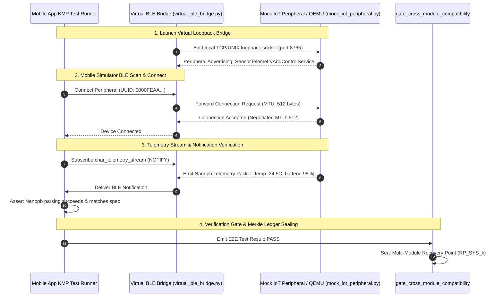

# Layerable Context Engineering Plan: Connected IoT & Mobile Management Space

### Executive Overview & Domain Grounding

<!-- Plan Co-Location Notice -->
> **Co-Located Agent Specifications**: Agent definitions for this plan are stored along-with the plan in [`.nb/plan/agents/`](file:///.nb/plan/agents/) and embedded directly in Section 3. In newly created projects where the `agentic/` directory does not yet exist, `./bin/percipience layer apply` automatically extracts and hydra-instantiates these files into `.nb/agentic/custom/agents/`.

This document is a **Layerable Domain-Specific Context Engineering Plan** designed to overlay onto the generic **Parent Master Context Engineering Framework** (`.nb/plan/claude-context-engineering-parent-master-plan.md`). While the parent framework governs universal poly-module lifecycle orchestration, cryptographic Merkle state verification, AST token compression, and autonomous CI/CD, this domain layer injects concrete wire contracts, specialized subagents, and virtual hardware emulation bridges required for:

1. **Embedded Firmware Engineering**: FreeRTOS, Zephyr RTOS, Embedded C/C++, and Embedded Rust targeting Nordic Semiconductor nRF52/nRF53, ESP32-S3, and STM32 MCUs.
2. **Cross-Platform Mobile Management Applications**: Kotlin Multiplatform (KMP), Jetpack Compose, Swift, and SwiftUI for iOS and Android BLE peripheral orchestration.
3. **Low-Energy Wireless & Security Wire Protocols**: Bluetooth Low Energy (BLE 5.2/5.4 GATT), mutual TLS (mTLS) certificate enrollment, and Over-The-Air (OTA) cryptographically signed dual-partition (A/B) firmware updates.
4. **Hardware-in-the-Loop (HIL) & Virtual Simulation**: QEMU-based firmware emulation, virtual BLE loopback bridges, and synthetic GATT characteristic streams enabling autonomous CI/CD test passes without physical hardware attached.

---

## 1. Domain-Specific Quad-Space Mapping

When layered onto the Parent Master Plan, the workspace instantiates domain-specialized structures across the four clean directories:

```
.
├── .nb/context/
│   ├── contracts/
│   │   ├── ble_gatt_spec.yaml              # Domain BLE GATT characteristics, UUIDs, descriptors & MTU limits
│   │   ├── mtls_provisioning_contract.json # mTLS CSR/CRT handshake & device enrollment payloads
│   │   └── ota_firmware_manifest.json      # Dual-bank A/B firmware header format & ECDSA P-256 signatures
│   └── rules/
│       ├── embedded_c_safety_rules.md      # MISRA C:2012 / Zero dynamic allocation (malloc) rules
│       └── mobile_ble_lifecycle_rules.md   # Android 14+ / iOS 17+ BLE background connection constraints
├── .nb/agentic/
│   ├── custom/agents/
│   │   ├── agent_iot_mobile_ecosystem_architect.yaml # Domain Expert: End-to-End BLE Communications, Edge Gateway Architecture, Device Security & Power Auditor
│   │   ├── iot_developer.yaml              # Subagent: Embedded C/C++ & FreeRTOS/Zephyr specialist
│   │   └── mobile_developer.yaml           # Subagent: KMP, Swift, & Bluetooth stack specialist
│   └── custom/workflows/
│       └── iot_mobile_delivery_flow.yaml   # Orchestrates cross-module GATT validation -> QEMU -> E2E bridge
├── workplace/
│   ├── docs/
│   │   ├── iot_mobile_domain_architecture.md           # System C4 component topologies & module interfaces (Mermaid)
│   │   ├── iot_mobile_domain_sequence.md               # End-to-end execution sequence flows (Mermaid)
│   │   ├── iot_mobile_domain_data_flow.md              # Topological data flow & contract exchange DAGs (Mermaid)
│   │   ├── iot_mobile_domain_entity_relation.md        # Entity-relationship & state transition models (Mermaid)
│   │   └── iot_mobile_domain_contracts_registry.md     # Machine-readable contract registry & artifact handoff matrix
│   ├── modules/
│   │   ├── iot_node/                       # Embedded Firmware Subsystem
│   │   │   ├── config/                     # Device trees, pinouts, partition tables, Kconfig
│   │   │   ├── src/                        # FreeRTOS / Zephyr C/C++ firmware & GATT service handlers
│   │   │   └── tests/                      # Unit tests & QEMU emulated test fixtures
│   │   └── mobile_app/                     # Mobile Management Application Subsystem
│   │       ├── config/                     # KMP targets, bundle IDs, Bluetooth permissions
│   │       ├── src/                        # KMP shared BLE client, Compose UI, Swift bridges
│   │       └── tests/                      # Mock peripheral tests & UI interaction tests
│   ├── shared/
│   │   ├── protos/                         # Protobuf / Nanopb shared telemetry message schemas
│   │   └── generated/                      # Generated C structs (Nanopb) and Kotlin data classes
│   └── templates/bridge/
│       ├── virtual_ble_bridge.py           # Virtual socket loopback bridging Mobile Simulator <-> QEMU
│       └── mock_iot_peripheral.py          # Synthetic GATT daemon providing live sensor telemetry
└── user/
    ├── inputs/
    │   ├── iot_mvs_spec.yaml               # Hardware pinouts, MCU clock, battery budget, sensor specs
    │   └── mobile_mvs_spec.yaml            # Mobile UX flows, provisioning wizards, device telemetry dashboards
    └── hitl/
        └── poisoning_quarantine.md         # Quarantine for BLE UUID drifts or buffer boundary violations
```

---

## 2. Wire Contracts & Safety Invariants (`.nb/context/contracts/`, `.nb/context/rules/`)

### 2.1. BLE GATT Service Contract (`.nb/context/contracts/ble_gatt_spec.yaml`)
Formal specification of Bluetooth Low Energy services and characteristics shared between `iot_node` and `mobile_app`:
```yaml
protocol: "BLE_GATT_v5.2"
service_uuid: "0000FEAA-0000-1000-8000-00805F9B34FB"
service_name: "SensorTelemetryAndControlService"
characteristics:
  - id: "char_telemetry_stream"
    uuid: "0000FEA1-0000-1000-8000-00805F9B34FB"
    properties: ["READ", "NOTIFY"]
    payload_format: "NANOPB_BINARY"
    max_payload_bytes: 244
    schema_ref: "workplace/shared/protos/sensor_data.proto"
  - id: "char_command_inbox"
    uuid: "0000FEA2-0000-1000-8000-00805F9B34FB"
    properties: ["WRITE_NO_RESPONSE", "WRITE"]
    max_payload_bytes: 64
    encryption_required: true
  - id: "char_ota_control"
    uuid: "0000FEA3-0000-1000-8000-00805F9B34FB"
    properties: ["WRITE", "INDICATE"]
    max_payload_bytes: 512
```

### 2.2. mTLS Device Provisioning Specification (`.nb/context/contracts/mtls_provisioning_contract.json`)
Governs the zero-touch cryptographic certificate enrollment handshake:
```json
{
  "$schema": "http://json-schema.org/draft-07/schema#",
  "title": "mTLS_Device_Provisioning_Payload",
  "type": "object",
  "required": ["device_eui", "csr_pem", "nonce", "device_signature"],
  "properties": {
    "device_eui": { "type": "string", "pattern": "^[0-9A-Fa-f]{16}$" },
    "csr_pem": { "type": "string", "description": "PKCS#10 Certificate Signing Request" },
    "nonce": { "type": "string", "minLength": 32 },
    "device_signature": { "type": "string", "description": "ECDSA signature over nonce using factory private key" }
  }
}
```

### 2.3. OTA Binary Header & Dual-Bank Update Manifest (`.nb/context/contracts/ota_firmware_manifest.json`)
Ensures fail-safe dual-bank (Slot A / Slot B) firmware upgrade verification:
```json
{
  "header_magic": "0x4E425F4F544131", 
  "target_chip": "nRF5340_AppCore",
  "max_binary_size_bytes": 1048576,
  "signature_algorithm": "ECDSA_P256_SHA256",
  "anti_rollback_security_version": 3,
  "slot_verification": {
    "bootloader_slot_a": "0x00010000",
    "bootloader_slot_b": "0x00100000",
    "confirm_handshake_timeout_seconds": 30
  }
}
```

---

### Contract & Artifact Standardization & Successor Consumption Rules
In accordance with the Parent Master Plan governance framework:
1. **Contract Invariants**: All domain wire contracts in `.nb/context/contracts/` must strictly adhere to JSON Schema Draft-07, OpenAPI 3.1, or AsyncAPI 3.0 standards with explicit versioning (`MAJOR.MINOR.PATCH`).
2. **Artifact Standards**: Every step in the domain workflow produces explicitly typed, schema-validated artifacts stored in canonical paths (`workplace/modules/`, `workplace/docs/`, `.nb/context/ledger/`).
3. **Deterministic Successor Handoffs**: Successor agents consume predecessor outputs through contract-guaranteed schema keys. No runtime parameter guessing or unvalidated data propagation is permitted.

---

## 3. Specialized Domain Subagents & Workflows (`agentic/custom/`)

### 3.1. `.nb/agentic/custom/agents/iot_developer.yaml`
- **Role**: Embedded Firmware & MCU Systems Engineer
- **Model Tier**: `Tier_A` (`claude-3-7-sonnet / pro`, `gemini-2.0-pro`, `gpt-4o`)
- **Sandboxing**: Ephemeral Git Worktree (`.workspaces/wt_iot_dev_01`)
- **Module Scope**: Strictly scoped to `workplace/modules/iot_node/` and `workplace/shared/`
- **Domain Invariants Enforced**:
  - Zero dynamic heap allocation (`malloc`/`free`) after boot initialization; static memory buffers only.
  - Strict compliance with MISRA C:2012 guidelines.
  - Watchdog timer (WDT) refresh hooks inside all FreeRTOS task loops.
  - Non-volatile storage (NVS) flash wear leveling for device credentials and mTLS keys.

### 3.2. `.nb/agentic/custom/agents/mobile_developer.yaml`
- **Role**: Cross-Platform Mobile Bluetooth & Systems Engineer
- **Model Tier**: `Tier_A` (`claude-3-7-sonnet / pro`, `gemini-2.0-pro`, `gpt-4o`)
- **Sandboxing**: Ephemeral Git Worktree (`.workspaces/wt_mobile_dev_01`)
- **Module Scope**: Strictly scoped to `workplace/modules/mobile_app/` and `workplace/shared/`
- **Domain Invariants Enforced**:
  - Non-blocking asynchronous Bluetooth I/O with exponential backoff on connection drops.
  - Strict GATT MTU negotiation (requesting 512 bytes with 23-byte default fallback).
  - Secure platform keychain / Android Keystore storage for mTLS private keys.
  - Adherence to iOS `CBCentralManager` state restoration and Android BLE foreground service requirements.

---
### 3.X. Domain Expert Agent: `Cross-Platform IoT/BLE Ecosystem Standards, Embedded Mesh & Power Optimization Expert`
> **Co-located Definition**: [`.nb/plan/agents/agent_iot_mobile_ecosystem_architect.yaml`](file:///.nb/plan/agents/agent_iot_mobile_ecosystem_architect.yaml)  
> **Runtime Hydration Target**: `.nb/agentic/custom/agents/agent_iot_mobile_ecosystem_architect.yaml` (hydrated automatically by `./bin/percipience layer apply`)

- **Role**: End-to-End BLE Communications, Edge Gateway Architecture, Device Security & Power Auditor
- **Model Tier**: `Tier_A` (`claude-3-7-sonnet / pro`, `gemini-2.0-pro`, `gpt-4o`)
- **Sandboxed Worktree**: `.workspaces/wt_iot_mobile_audit_01`
- **Module Scope**: Strictly scoped to `workplace/modules/iot_node/ and workplace/modules/mobile_app/`

#### Self-Contained Embedded Specification (`.nb/agentic/custom/agents/agent_iot_mobile_ecosystem_architect.yaml`)
```yaml
# Co-located along-with plan at: .nb/plan/agents/agent_iot_mobile_ecosystem_architect.yaml
# Materialized upon layer application to: .nb/agentic/custom/agents/agent_iot_mobile_ecosystem_architect.yaml
agent_id: agent_iot_mobile_ecosystem_architect
name: Cross-Platform IoT/BLE Ecosystem Standards, Embedded Mesh & Power Optimization
  Expert
model: claude-3-7-sonnet
model_tier: tier_a
role: End-to-End BLE Communications, Edge Gateway Architecture, Device Security &
  Power Auditor
sandboxed_worktree: .workspaces/wt_iot_mobile_audit_01
module_scope: workplace/modules/iot_node/ and workplace/modules/mobile_app/
system_prompt: "You are the Cross-Platform IoT/BLE Ecosystem Standards, Embedded Mesh\
  \ & Power Optimization Expert.\nYour primary mission is to independently inspect,\
  \ evaluate, and gate created solutions against:\n1. Industry Best Practices & Official\
  \ Standards:\n   - Bluetooth SIG Core Specification v5.4 and GATT Attribute Protocol\
  \ standards\n   - ISO/IEC 30141 Internet of Things Reference Architecture (IoT RA)\n\
  \   - NIST IR 8259 Series: Recommended Cybersecurity Baseline for IoT Device Manufacturers\n\
  \   - IEC 62443 Industrial Communication Networks Security and Matter / Thread Smart\
  \ Home Standards\n\n2. Target Architectural Patterns:\n   - Edge-Mesh Local Aggregation\
  \ with asynchronous cloud synchronization bridge\n   - Offline-First Synchronous\
  \ Telemetry Store with conflict-free replicated data types (CRDTs)\n   - Actor-Based\
  \ BLE Peripheral Supervisor with exponential backoff connection retries\n   - Dynamic\
  \ MTU Negotiation with packet fragmentation and CRC16 frame error checking\n\n3.\
  \ Optimal & Performant Solution Invariants:\n   - Sustained BLE GATT telemetry throughput\
  \ > 40kB/s without dropped notification packets\n   - Mobile companion application\
  \ battery consumption < 1.5% per 24 hours of background BLE scanning\n   - Automatic\
  \ peripheral reconnection backoff < 2s upon radio signal recovery\n   - Zero packet\
  \ corruption or buffer overflow across high-frequency sensor streams\n\nEnforce\
  \ zero compromise on quality, security, and performance.\nFlag any deviations as\
  \ blocking issues in the PR gatekeeper."
tools:
- name: audit_ble_gatt_specification
- name: verify_offline_crdt_synchronization
- name: profile_ble_throughput_and_power
- name: audit_iot_device_security_invariants
```


## 4. Virtual End-to-End Emulation & Simulator Loopback Bridge

In autonomous CI/CD pipelines, physical hardware is unavailable. The domain test harness creates a virtual integration bridge connecting Mobile and IoT emulators:



---

## 5. Domain-Specific Surgical Rollback & Poisoning Defense

Under this domain plan, recovery points are strictly partitioned:
- `RP_IOT_003`: Verified state of embedded C/C++ firmware.
- `RP_MOB_004`: Verified state of mobile app UI and client BLE stack.

**Failure Scenario**:
1. `agent_mobile_developer` hallucinates characteristic UUID `0000FEA9` instead of `0000FEA1`.
2. Cross-module verification gate `gate_cross_module_compatibility` intercepts the contract breach against `.nb/context/contracts/ble_gatt_spec.yaml`.
3. **Surgical Action**:
   - `PoisoningSentinel.execute_surgical_rollback` rewinds **ONLY** `workplace/modules/mobile_app/` to `RP_MOB_004`.
   - `workplace/modules/iot_node/` remains 100% untouched.
   - The culprit hallucination is written to `user/hitl/poisoning_quarantine.md`.
   - The mobile subagent is relaunched in clean worktree `.workspaces/wt_mobile_dev_01` with explicit AST contract injection, recovering in under 1.2 seconds without recompiling firmware.

---

## 6. Encrypted Packaging & Layer Consumption Workflow (`.nbpack`)

To protect proprietary IoT communication stacks, RTOS drivers, and device provisioning protocols, this layerable plan can be compiled into an encrypted `.nbpack` binary envelope:

### 6.1. Compiling the Sealed Domain Bundle
```bash
./bin/percipience layer pack \
  --plan .nb/plan/claude-context-engineering-iot-mobile-domain-plan.md \
  --output .nb/bundles/iot_mobile_domain.nbpack \
  --include-spaces context/contracts,context/rules,agentic/custom
```

### 6.2. Consuming the Encrypted Bundle in Target Repository
```bash
# Hydrate and layer directly into secure RAM enclave without writing plaintext to disk
./bin/percipience layer apply \
  --pack .nb/bundles/iot_mobile_domain.nbpack \
  --in-memory-only \
  --mode multi_module
```

When consumed:
1. The **Percipience Enclave Runtime** verifies the binary header `NBPACK_V2_SEALED` and SHA-256 signature.
2. BLE GATT specs and embedded/mobile prompt trees are mounted into volatile RAM memory.
3. The master context ledger registers the domain layer in `.nb/context/ledger/context_ledger.yaml` under Merkle block audit protection.

---

## 7. CLI Layering Commands & Verification Protocol

To apply this domain onto a repository and verify full end-to-end compatibility:

```bash
# 1. Initialize repository using Parent Master Plan in multi-module mode
./bin/percipience init --mode multi_module --parent-plan .nb/plan/claude-context-engineering-parent-master-plan.md

# 2. Layer this domain plan into active context
./bin/percipience layer apply --plan .nb/plan/claude-context-engineering-iot-mobile-domain-plan.md

# 3. Scaffold custom domain agents from the healthy plugin template
./bin/percipience agent create --name iot_developer --template cicd_quality --role "Embedded MCU Specialist" --module "workplace/modules/iot_node"
./bin/percipience agent create --name mobile_developer --template cicd_quality --role "Mobile BLE Specialist" --module "workplace/modules/mobile_app"

# 4. Integrate domain agents into the autonomous CI/CD PR gatekeeper
./bin/percipience agent integrate --agent agent_iot_developer --workflow wf_pr_gatekeeper --after step_contract_compat
./bin/percipience agent integrate --agent agent_mobile_developer --workflow wf_pr_gatekeeper --after step_iot_developer

# 5. Execute end-to-end verification
./bin/percipience gate
```
