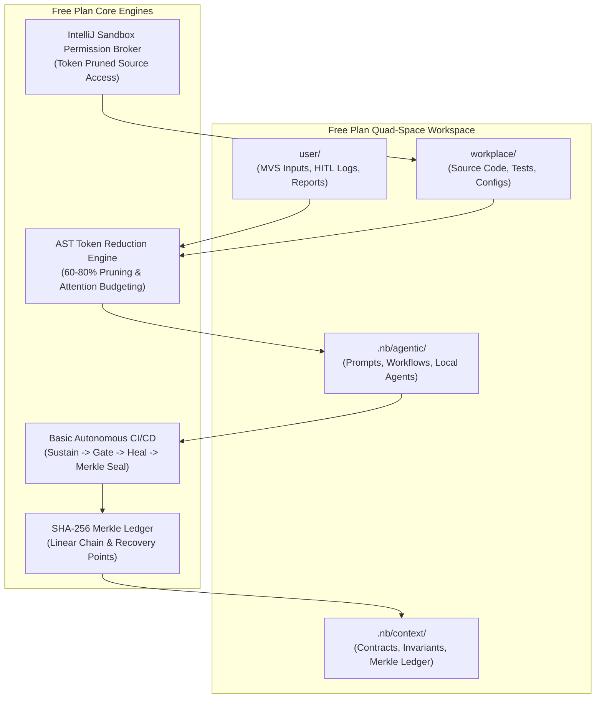

# Parent Master Context Engineering Plan (Watered-Down Free Plan Edition)

## 1. Executive Summary & Free Plan Scope

The **Percipience Parent Master Context Engineering Plan (Free Community Edition)** delivers a deterministic, tamper-evident, and token-efficient AI-driven software engineering framework. Tailored for individual developers, open-source maintainers, and community teams, this watered-down edition retains the essential core foundations:
- **High-Efficiency Token Reduction**: 60%–80% context compression via AST skeletonization, attention budgeting, and static prefix pinning.
- **Cryptographic Merkle State Chain**: Continuous SHA-256 tamper-evident ledger tracking all artifact modifications, agent actions, and recovery snapshots.
- **Basic Autonomous CI/CD Setup**: Lightweight self-sustaining workspace hygiene, single-attempt bounded self-repair, contract verification, and automated Merkle state sealing.
- **IntelliJ / PyCharm Bootstrap & Sandbox Permissions**: Automated zero-friction workspace scaffolding and granular cross-plugin sandbox permission control for IDE-embedded LLMs.



---

## 2. Plan Tier Matrix & Boundary Ceilings

| Feature / Dimension | Free Community Plan (`plan_free`) | Team Plan (`plan_team`) | Business Plan (`plan_business`) | Enterprise Dedicated (`plan_enterprise`) |
| :--- | :--- | :--- | :--- | :--- |
| **Monthly Base Price** | **$0.00 / Free Forever** | $1,499 / mo | $4,499 / mo | $9,999 / mo |
| **Included Seats** | **1 Developer Seat** | 15 Seats | 50 Seats | Unlimited |
| **Concurrent Worktrees** | **1 Local Worktree** | 5 Worktrees | 20 Worktrees | Unlimited Distributed |
| **Monthly PR Audits** | **500 Audits / mo** | 5,000 Audits / mo | 25,000 Audits / mo | Unlimited |
| **AST Token Reduction** | **✅ Full (60%–80% savings)** | ✅ Full | ✅ Full | ✅ Full + Tree-Sitter Daemon |
| **Cryptographic Merkle Chain** | **✅ Local Linear SHA-256** | ✅ Local + Remote Sync | ✅ Local + Remote Sync | ✅ Multi-Region WORM S3/GCS |
| **Autonomous CI/CD** | **✅ Basic Setup (1-Retry Heal)** | ✅ Advanced (3-Retry) | ✅ Full Multi-Stage | ✅ Closed-Loop Swarm Triad |
| **Packaging & Obfuscation** | ❌ Plaintext / Open Repo | ❌ Plaintext | ✅ `.nbpack` AES-256 | ✅ `.nbpack` RAM Enclave |
| **Deployment Model** | **Local IDE & Git Worktree** | Cloud Shared Gateway | Cloud Shared Gateway | Dedicated Private VPC |
| **IDE Plugin Support** | **✅ IntelliJ & VSCode** | ✅ IntelliJ & VSCode | ✅ IntelliJ & VSCode | ✅ IntelliJ & VSCode + JCEF |
| **Sandbox Source Permissions** | **✅ Local Sandbox Broker** | ✅ Team RBAC | ✅ Enterprise RBAC | ✅ Zero-Trust Fine-Grained |

---

## 3. Core Capability 1: High-Efficiency Token Reduction

The Free Plan incorporates platform token reduction to cut LLM inference costs and fit large codebases into constrained context windows.

### 3.1 JetBrains PSI & Structural AST Skeletonization
- **Mechanism**: Analyzes code files across Kotlin, Java, Python, TypeScript, JavaScript, and Go. It extracts class hierarchies, method signatures, return types, interfaces, and docstrings while stripping internal function execution bodies.
- **Compression Efficiency**: Delivers **60% to 80% reduction** in raw tokens.
- **Example**:
```python
# Raw Source Code (180 tokens)
def process_incoming_event(event_payload: dict, validate_signature: bool = True) -> EventResult:
    """Validates and routes incoming telemetry events."""
    if validate_signature:
        sig = event_payload.get("signature")
        if not verify_hmac(sig):
            raise InvalidSignatureError("HMAC verification failed")
    # ... 40 lines of internal event routing ...
    return EventResult(status="PROCESSED", event_id=event_payload["id"])

# AST-Pruned Context Streamed to LLM (32 tokens - 82% token savings)
def process_incoming_event(event_payload: dict, validate_signature: bool = True) -> EventResult:
    """Validates and routes incoming telemetry events."""
    ...
```

### 3.2 Context Attention Slicing & Proportional Budgeting
Ensures context windows do not suffer from middle-truncation or overflow:
- **15% Invariants & Security Contracts**: Top-level non-negotiable rules.
- **25% Interface & Wire Contracts**: Cross-module schemas (`.nb/context/contracts/`).
- **35% AST Symbol Skeletons**: Pruned codebase structure.
- **10% Memory & Agent Trajectories**: Recent execution steps.
- **15% Output Buffer**: Model response capacity.

### 3.3 Static Prefix Pinning for Prompt KV-Cache Optimization
All prompt templates place immutable instructions before dynamic payloads using standard delimiters (`<!-- STATIC_PREFIX_START -->` to `<!-- STATIC_PREFIX_END -->`), maximizing provider prompt cache reuse ($90\%$ cache hit discount).

---

## 4. Core Capability 2: Cryptographic Merkle State Chain

The Free Plan enforces zero-tamper auditability and state recovery through a deterministic SHA-256 Merkle DAG state ledger.

### 4.1 Merkle State Ledger Architecture
- **Ledger Path**: `.nb/context/ledger/context_ledger.yaml` (with sanitized public view `.nb/context/ledger/context_ledger.public.yaml`).
- **Block Equation**:
  $$\text{Block Hash}_i = \text{SHA-256}\left(\text{Block ID}_i \,\|\, \text{Prev Hash}_{i-1} \,\|\, \text{Merkle Root}_i \,\|\, \text{Git SHA} \,\|\, \text{Timestamp}\right)$$
- **State Integrity**: Every prompt execution, AST file modification, verification gate run, and healing attempt is sealed with a new block.

### 4.2 Recovery Points & Surgical Rollback
- **Recovery Point Identifiers**: `RP_GENESIS_000`, `RP_FREE_BOOTSTRAP_001`, `RP_AGENT_*`.
- **Zero-Residue Rollbacks**: If context contamination, hallucinated imports, or test failures exceed the retry boundary, the workspace is atomically rewound to the last verified recovery point.

---

## 5. Core Capability 3: Basic Autonomous CI/CD Setup

The Free Plan provides an out-of-the-box, lightweight autonomous CI/CD setup (`basic_autonomous_cicd.yaml`) designed for single-seat local development.

### 5.1 The 4-Stage Lightweight Pipeline
1. **Stage 1: Self-Sustaining Maintenance (`platform.self_sustaining_engine`)**:
   - Reclaims expired ephemeral worktree locks (`.workspaces/`).
   - Cleans temporary scratch diffs and test artifacts (`user/scratch/`).
   - Verifies Merkle chain continuity ($100\%$ linear validity check).
2. **Stage 2: AST Token Reduction (`platform.ast_pruner`)**:
   - Analyzes project source directories.
   - Slices ASTs to generate symbol skeletons for prompt contexts.
   - Logs token savings to `token_savings_ledger.yaml`.
3. **Stage 3: Basic Contract & Test Verification Gate (`platform.contract_verifier`)**:
   - Verifies wire contracts under `.nb/context/contracts/`.
   - Runs local test suites (`workplace/tests/`).
4. **Stage 4: Bounded Auto-Heal & Merkle Seal (`platform.autonomous_healer` & `platform.merkle_ledger`)**:
   - Single-attempt bounded diagnostic reprompt for failing tests.
   - If healed, seals state with a new verified Merkle block.
   - If still failing, quarantines test to `quarantined_tests` and halts safely at `user/hitl/`.

---

## 6. Quad-Space Partitioning for Free Plan

The workspace maintains strict separation across four distinct directories:

```text
nb_fairyfly/ (Workspace Root)
├── .nb/                                      # Governing plans, contracts & agent configurations
│   ├── plan/
│   │   └── claude-context-engineering-parent-master-plan.md  # This governing plan
│   ├── context/
│   │   ├── contracts/                        # JSON Schema / YAML wire contracts
│   │   ├── invariants/                       # Non-overridable security invariants
│   │   └── ledger/
│   │       ├── context_ledger.yaml           # Master Merkle DAG ledger
│   │       └── context_ledger.public.yaml    # Public sanitized projection
│   └── agentic/
│       ├── custom/
│       │   ├── agents/                       # Local agent specialist definitions
│       │   └── workflows/
│       │       └── basic_autonomous_cicd.yaml# Basic Autonomous CI/CD workflow
│       └── prompts/                          # Six-phase prompt suite
├── workplace/                                # Application source code & configuration
│   ├── config/
│   │   ├── billing_plans.yaml                # Free & Paid tier configuration
│   │   └── token_compression_rules.yaml      # AST pruning & attention budget thresholds
│   ├── core/                                 # Platform engines (Merkle, AST, CI/CD)
│   ├── modules/                              # Feature modules & IDE plugins
│   └── tests/                                # Test suites
└── user/                                     # User-owned inputs & outputs
    ├── inputs/                               # Minimum Viable Set (MVS) specifications
    ├── hitl/                                 # Human-In-The-Loop logs & quarantines
    └── outputs/                              # Maturity reports & dashboard
```

---

## 7. IntelliJ Plugin: Bootstrapping & Sandboxed LLM Permissions

The Percipience IntelliJ / PyCharm Plugin (`mod_intellij_plugin`) acts as the IDE control plane for the Free Plan:

### 7.1 Automated Zero-Click Workspace Bootstrapping
- **Health Check on Startup**: When any project is opened, `PercipienceProjectService` scans for `.nb/`, `context_ledger.yaml`, and `basic_autonomous_cicd.yaml`.
- **Automatic Initialization**: If absent, it automatically provisions the Quad-Space directories, creates genesis Merkle block `RP_GENESIS_000`, generates the free plan configurations, and displays an active status bar badge.
- **Manual Trigger**: Available via **Tools → Percipience OS → Bootstrap Free Workspace Setup** and the ToolWindow button.

### 7.2 Ensuring Local Agents Use Token Reduction
- Local IDE agents query context through `LocalAgentTokenOptimizer` and `PsiAstBridge`.
- Method and function bodies are stripped in memory (&lt;35ms) before streaming to local or API-based LLMs, guaranteeing 60%–80% token savings.

### 7.3 Source Permissions for Sandboxed Plugins & LLMs
When other LLM plugins (e.g., JetBrains AI Assistant, GitHub Copilot, Continue, Cody) run in separate sandboxes or classloaders within IntelliJ:
- **`SandboxPermissionBroker`**:
  - **`READ_SOURCE_PRUNED` (Default)**: Sandboxed LLMs receive AST-skeletonized code by default, preventing token exhaustion and exfiltration of internal implementations.
  - **`READ_SOURCE_RAW`**: Requires explicit developer consent in plugin settings.
  - **`WRITE_SANDBOXED`**: Edits are routed to ephemeral worktrees or review diffs.
  - **`DENY_IMMUTABLE`**: Modifying `.nb/context/ledger/` or invariant files is blocked and logged as a security event.

---

## 8. Capability Mapping (CAP-01 through CAP-35)

| ID | Foundational Capability | Free Community Tier Status |
| :--- | :--- | :--- |
| `CAP-01` | Multi-Format MVS Ingestion | Supported (Markdown & OpenAPI) |
| `CAP-02` | Context Poisoning Detection & Rollback | Supported (Local Recovery Points) |
| `CAP-03` | Context Compression & GenAI Optimization | Supported (60%–80% AST Pruning) |
| `CAP-04` | Dynamic Multi-Model Cascading & Tiering | Supported (Local / BYO API Key) |
| `CAP-05` | Git Worktree Workspace Isolation | Supported (Single Local Worktree) |
| `CAP-06` | Automated Spec-to-Code Semantic Parity | Supported (AST Parity Verification) |
| `CAP-07` | Bounded TDD Self-Healing | Supported (1 Retry Auto-Repair) |
| `CAP-08` | Cryptographic Ledger Hash-Chain | Supported (SHA-256 `context_ledger.yaml`) |
| `CAP-09` | Time-Travel Debugging & Visual DAG | Supported (Static HTML Dashboard) |
| `CAP-10` | Context Maturity Evaluation Scorecard | Supported (Standard 6D Scorecard) |
| `CAP-11` | Master Context Ledger & Commit Traceability | Supported (Full Traceability) |
| `CAP-12` | Universal Quad-Space Clean Bootstrapping | Supported (Automated in IDE Plugin) |
| `CAP-13` | Zero-Overhead Dual-Mode Architecture | Supported (Single & Multi-Module) |
| `CAP-14` | Proprietary Obfuscation & `.nbpack` Enclaves | Paid Tier Only (Enterprise) |
| `CAP-15` | External Issue Tracker & Jira MCP Server | Paid Tier Only (Team / Enterprise) |
| `CAP-16` | Autonomous CI/CD Triad | Supported (`basic_autonomous_cicd.yaml`) |
| `CAP-17` | Extensible Custom Agent Plugins | Supported (Local Custom Agents) |
| `CAP-18` | Production Token FinOps & Metering | Supported (Local Token Ledger) |
| `CAP-19` | Enterprise Observability Hub & Telemetry | Supported (Local Web Dashboard) |
| `CAP-20` | 3-Tier Layered Context & BYOR | Supported (Local Git & SSH) |
| `CAP-21` | Autonomous Living Documentation Engine | Supported (Markdown + Mermaid) |
| `CAP-22` | Distributed Redis Redlock Concurrency | Paid Tier Only (Enterprise) |
| `CAP-23` | SEC 17a-4 / FINRA WORM Cloud Vault Egress | Paid Tier Only (Enterprise) |
| `CAP-24` | High-Throughput Tree-Sitter AST Daemon | Paid Tier Only (Enterprise) |
| `CAP-25` | Multi-Dimensional 6D Token Compression Suite | Supported (AST + Doc + Config) |
| `CAP-26` | Multi-Dialect Diagnostic Log Slicing | Supported (Standard Traceback Slicer) |
| `CAP-27` | Declarative Quad-Space Runtime Boundary | Supported (Zero-Logic Facade) |
| `CAP-28` | Barrier Join Synchronization Engine | Supported (Local Step DAG) |
| `CAP-29` | 4-Pillar Error Taxonomy & Playbooks | Supported (Basic Healing Playbooks) |
| `CAP-30` | Cryptographic Prompt Manifest & Static Pinning | Supported (`prompt_manifest.yaml`) |
| `CAP-31` | Hierarchical Swarm Authority Tree | Supported (Local Agent Hierarchy) |
| `CAP-32` | Adversarial Red-Team Fuzzing Engine | Supported (Standard Test Fuzzing) |
| `CAP-33` | Proportional Attention Budgeting | Supported (15/25/35/10/15 Rule) |
| `CAP-34` | ReAct Trajectory Recording & Replay | Supported (`agentic/trajectories/`) |
| `CAP-35` | Ambiguity Resolution & Clarification RFCs | Supported (`user/hitl/`) |
