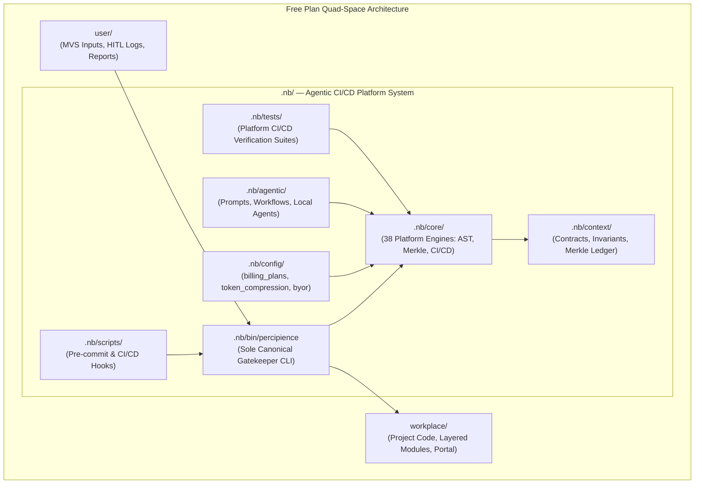

# Parent Master Context Engineering Plan (Watered-Down Free Plan Edition)

## 1. Executive Summary & Free Plan Scope

The **Percipience Parent Master Context Engineering Plan (Free Community Edition)** delivers a deterministic, tamper-evident, and token-efficient AI-driven software engineering framework. Tailored for individual developers, open-source maintainers, and community teams, this watered-down edition retains the essential core foundations:
- **Unified Agentic CI/CD Platform in `.nb/`**: The complete platform engine, gatekeeper CLI, configuration files, and test suites are housed inside `.nb/`, establishing a clean, self-contained Agentic CI/CD System independent of user project code.
- **Single Canonical Binary (`.nb/bin/percipience`)**: Eradication of all symlinks and redundant binaries; `.nb/bin/percipience` is the sole, cross-platform executable platform entry point.
- **Embedded Free Tier Assets in IntelliJ / PyCharm Plugin**: Complete binary, billing configurations, AST token pruning rules, and autonomous CI/CD workflow bundled directly into the plugin JAR resources for zero-dependency operation.
- **Interactive Workspace Startup Prompt**: On project open, newly created or uninitialized workspaces automatically prompt the developer with an interactive balloon notification to initialize the Free Community Tier.
- **Integrated IDE Execution Service**: Asynchronous CLI command execution (`gate`, `audit`, `cicd run`, `validate --layered`, `tokens summary`) directly inside JetBrains IDEs with real-time logging and VFS auto-refresh.
- **High-Efficiency Token Reduction**: 60%–80% context compression via AST skeletonization, attention budgeting, and static prefix pinning.
- **Cryptographic Merkle State Chain**: Continuous SHA-256 tamper-evident ledger tracking all artifact modifications, agent actions, and recovery snapshots.
- **Basic Autonomous CI/CD Setup**: Lightweight self-sustaining workspace hygiene, single-attempt bounded self-repair, contract verification, and automated Merkle state sealing.
- **Granular Sandbox Permissions for Local LLMs**: Scaffolding and granular cross-plugin sandbox permission control (`SandboxPermissionBroker`) for IDE-embedded LLMs.



---

## 2. Plan Tier Matrix & Boundary Ceilings

| Feature / Dimension | Free Community Plan (`plan_free`) | Team Plan (`plan_team`) | Business Plan (`plan_business`) | Enterprise Dedicated (`plan_enterprise`) |
| :--- | :--- | :--- | :--- | :--- |
| **Monthly Base Price** | **$0.00 / Free Forever** | $1,499 / mo | $4,499 / mo | $9,999 / mo |
| **Included Seats** | **1 Developer Seat** | 15 Seats | 50 Seats | Unlimited |
| **Concurrent Worktrees** | **1 Local Worktree** | 5 Worktrees | 20 Worktrees | Unlimited Distributed |
| **Monthly PR Audits** | **500 Audits / mo** | 5,000 Audits / mo | 25,000 Audits / mo | Unlimited |
| **AST Token Reduction** | **✅ Full (60%–80% savings)** | ✅ Full | ✅ Full | ✅ Full + Tree-Sitter Daemon |
| **Cryptographic Merkle Chain** | **✅ Local Linear SHA-256** | ✅ Local + Remote Sync | ✅ Local + Remote Sync | ✅ Multi-Region WORM S3/GCS |
| **Autonomous CI/CD** | **✅ Basic Setup (1-Retry Heal)** | ✅ Advanced (3-Retry) | ✅ Full Multi-Stage | ✅ Closed-Loop Swarm Triad |
| **Packaging & Obfuscation** | 🔒 Platform Core Encrypted (percipience readable) / User Plans Plaintext (Non-Encryptable) | 🔒 Platform Core Encrypted / User Plans Plaintext | ✅ `.nbpack` AES-256 (Platform & User Plans) | ✅ `.nbpack` RAM Enclave (Zero-Disk Plaintext) |
| **Basic Platform Tools Exposure** | ❌ Unexposed (No Plan to Expose Basic Tools) | ❌ Unexposed | ✅ Standard Tool Access | ✅ Full Unrestricted Platform SDK & Tool APIs |
| **Deployment Model** | **Local IDE & Git Worktree** | Cloud Shared Gateway | Cloud Shared Gateway | Dedicated Private VPC |
| **IDE Plugin Support** | **✅ IntelliJ & VSCode** | ✅ IntelliJ & VSCode | ✅ IntelliJ & VSCode | ✅ IntelliJ & VSCode + JCEF |
| **Startup Workspace Prompt** | **✅ Interactive Balloon Prompt** | ✅ Interactive + SSO | ✅ Interactive + SSO | ✅ Zero-Touch Managed Policy |
| **Sandbox Source Permissions** | **✅ Local Sandbox Broker** | ✅ Team RBAC | ✅ Enterprise RBAC | ✅ Zero-Trust Fine-Grained |

### 2.1 Encryption, Obfuscation & Tooling Exposure Boundaries for Free Tier

1. **Platform Core Infrastructure Encryption Invariant (`.nb/` & Master Plans)**:
   - All platform governance components — `.nb/context/` (wire contracts, non-overridable security invariants, Merkle state ledgers), `.nb/config/` (billing tiers, AST compression thresholds, BYOR configuration), `.nb/core/` (all 38 platform execution engines), and master engineering plans (including both the enterprise master plan `claude-context-engineering-parent-master-plan.md` and this Free Community Edition `claude-context-engineering-parent-master-free_plan.md`) — **stay encrypted, obfuscated, and cryptographically sealed**.
   - These platform assets are packaged within authenticated `.nbpack` / encrypted distribution envelopes and are **strictly readable and executable via the canonical `./.nb/bin/percipience` command** (and its companion JetBrains / PyCharm IDE execution service). Under no circumstance are internal platform engines, governance rules, or master plan assets exposed in unauthenticated or unencrypted formats.

2. **Free Tier User Plans Invariant (Strictly Plaintext & Non-Encryptable)**:
   - Custom layered plans, domain specifications, architecture blueprints, and prompts authored by Free Tier users within `workplace/` remain strictly **plaintext**.
   - Free Tier users are restricted from packaging, obfuscating, or encrypting their user plans. Free tier user plans are **non-encryptable**; `.nbpack` compilation, AES-256 envelope sealing, and in-memory RAM enclave execution are reserved exclusively for higher commercial tiers (`plan_business` and `plan_enterprise`).

3. **No Exposure of Basic Platform Tools to Free Tier Users**:
   - There is **no plan to expose basic platform tools** or internal developer utilities to Free Tier users.
   - Low-level compilation tools, raw packaging binaries (such as `percipience pack` or `NBPackEnvelope` compilers), AST rule modification tools, internal subagent toolkits, and raw cryptographic signing harnesses are **not exposed** to Free Tier users.
   - Free Tier users interact with the system strictly through standard high-level gatekeeper actions (`gate`, `audit`, `cicd run`, `validate --layered`, `tokens summary`) and the IntelliJ / PyCharm plugin UI. The underlying basic engineering tools remain sealed and unexposed.

---

## 3. Core Capability 1: High-Efficiency Token Reduction

The Free Plan incorporates platform token reduction to cut LLM inference costs and fit large codebases into constrained context windows.

### 3.1 JetBrains PSI & Structural AST Skeletonization
- **Mechanism**: Analyzes code files across Kotlin, Java, Python, TypeScript, JavaScript, and Go. It extracts class hierarchies, method signatures, return types, interfaces, and docstrings while stripping internal function execution bodies.
- **Compression Efficiency**: Delivers **60% to 80% reduction** in raw tokens.
- **Example**:
```python
# Raw Source Code (180 tokens)
def process_incoming_event(event_payload: dict, validate_signature: bool = True) -> EventResult:
    """Validates and routes incoming telemetry events."""
    if validate_signature:
        sig = event_payload.get("signature")
        if not verify_hmac(sig):
            raise InvalidSignatureError("HMAC verification failed")
    # ... 40 lines of internal event routing ...
    return EventResult(status="PROCESSED", event_id=event_payload["id"])

# AST-Pruned Context Streamed to LLM (32 tokens - 82% token savings)
def process_incoming_event(event_payload: dict, validate_signature: bool = True) -> EventResult:
    """Validates and routes incoming telemetry events."""
    ...
```

### 3.2 Context Attention Slicing & Proportional Budgeting
Ensures context windows do not suffer from middle-truncation or overflow:
- **15% Invariants & Security Contracts**: Top-level non-negotiable rules.
- **25% Interface & Wire Contracts**: Cross-module schemas (`.nb/context/contracts/`).
- **35% AST Symbol Skeletons**: Pruned codebase structure.
- **10% Memory & Agent Trajectories**: Recent execution steps.
- **15% Output Buffer**: Model response capacity.

### 3.3 Static Prefix Pinning for Prompt KV-Cache Optimization
All prompt templates place immutable instructions before dynamic payloads using standard delimiters (`<!-- STATIC_PREFIX_START -->` to `<!-- STATIC_PREFIX_END -->`), maximizing provider prompt cache reuse ($90\%$ cache hit discount).

---

## 4. Core Capability 2: Cryptographic Merkle State Chain

The Free Plan enforces zero-tamper auditability and state recovery through a deterministic SHA-256 Merkle DAG state ledger.

### 4.1 Merkle State Ledger Architecture
- **Ledger Path**: `.nb/context/ledger/context_ledger.yaml` (with sanitized public view `.nb/context/ledger/context_ledger.public.yaml`).
- **Block Equation**:
  $$\text{Block Hash}_i = \text{SHA-256}\left(\text{Block ID}_i \,\|\, \text{Prev Hash}_{i-1} \,\|\, \text{Merkle Root}_i \,\|\, \text{Git SHA} \,\|\, \text{Timestamp}\right)$$
- **State Integrity**: Every prompt execution, AST file modification, verification gate run, and healing attempt is sealed with a new block.

### 4.2 Recovery Points & Surgical Rollback
- **Recovery Point Identifiers**: `RP_GENESIS_000`, `RP_FREE_BOOTSTRAP_001`, `RP_AGENT_*`.
- **Zero-Residue Rollbacks**: If context contamination, hallucinated imports, or test failures exceed the retry boundary, the workspace is atomically rewound to the last verified recovery point.

---

## 5. Core Capability 3: Basic Autonomous CI/CD Setup & Hook Architecture

The Free Plan provides an out-of-the-box, lightweight autonomous CI/CD setup driven by `./.nb/bin/percipience` and configured in `.nb/agentic/custom/workflows/basic_autonomous_cicd.yaml` designed for single-seat local development and layered domain extension.

### 5.1 The 5-Step Continuous Workflow & Lifecycle Hooks
The pipeline topologically links platform engines and specialized agents through deterministic handoff hooks:
1. **Step 1: Self-Sustaining Hygiene (`platform.self_sustaining_engine`)**:
   - Reclaims expired ephemeral worktree locks (`.workspaces/subagent_*`).
   - Cleans temporary scratch diffs and test artifacts (`user/scratch/`).
   - Verifies Merkle chain continuity ($100\%$ linear validity check).
   - *Handoff Hook*: `hook_hygiene_to_pruner` -> transfers `hygiene_clean_receipt`.
2. **Step 2: AST Token Reduction (`platform.ast_pruner`)**:
   - Analyzes project source directories using `.nb/config/token_compression_rules.yaml`.
   - Prunes ASTs to generate symbol skeletons for prompt context window optimization.
   - *Handoff Hook*: `hook_pruner_to_verifier` -> transfers `token_savings_receipt`.
3. **Step 3: Contract & Test Verification Gate (`platform.contract_verifier`)**:
   - Verifies wire contracts under `.nb/context/contracts/`.
   - Runs hermetic unit and integration tests under `workplace/modules/*/tests/`.
   - *Handoff Hook*: `hook_verifier_to_docs` -> transfers `test_and_contract_receipt`.
4. **Step 4: Living Documentation Synthesis (`agent_living_doc_architect`)**:
   - Synchronizes architectural markdown and Mermaid sequence diagrams in `workplace/docs/`.
   - Ensures AST symbol changes and schema revisions are documented without drift.
   - *Handoff Hook*: `hook_docs_to_merkle` -> transfers `workplace_docs_updated`.
5. **Step 5: Merkle State Commit & Seal (`platform.merkle_ledger`)**:
   - Appends verified block to `.nb/context/ledger/context_ledger.yaml`.
   - Anchors recovery point and updates public sanitized projection.

### 5.2 Git Hook Architecture & Automated Installation
- **Automated Hook Installer**: Located at `.nb/scripts/install_git_hook.sh` and invocable via `./.nb/bin/percipience hook install`.
- **Pre-Commit Hook**: Evaluates git staged status. If modifications are non-code/documentation-only, skips subagent execution; if source/contract deltas exist, triggers PR Gatekeeper verification.
- **Pre-Push Hook**: Runs full multi-stage contract, AST, and Merkle ledger integrity audit before remote transmission.

### 5.3 Layered Plan Agent Hook Integration & Reliable Spawning
To ensure subagents spawn reliably across complex workflows:
- **Multi-Tier Agent Registry**: The engine automatically discovers and indexes agent specifications across `.nb/agentic/custom/agents/`, `.nb/plan/agents/`, `.nb/plan/packages/*/agents/`, and `user/hitl/orphaned_context_files/agents/`.
- **Pre-Flight Contract Validation**: Prior to process spawning, input artifacts, schemas, and runtime dependencies are verified.
- **Isolated Ephemeral Sandboxes**: Subagents execute in dedicated workspace directories (`.workspaces/subagent_<executor>/`), preventing concurrent file lock conflicts.
- **Supervised Bounded Retries**: Transient failures (e.g. process aborts or timeout errors) are automatically retried up to $N_{\max} = 3$ times with exponential backoff before escalating.

### 5.4 Intelligent Skippability Assessment & Verbose Output
Hooks incorporate a differential state evaluation engine:
- **Deterministic SHA-256 Fingerprinting**: Computes digests of all declared input files, contracts, and upstream receipts.
- **Persistent Ledger Receipt Cache**: Stored at `.nb/context/ledger/step_cache.json`.
- **Smart Skip Determination**: If input fingerprints match the cached receipt and output artifacts exist on disk, the step execution is skipped.
- **Verbose Reporting**: Emits structured console telemetry:
  ```text
  [HOOK_ASSESSMENT][SKIPPABLE] Step 'step_update_living_docs' [agent_living_doc_architect]: SKIPPED
    - Reason: Input artifacts and contracts unchanged (SHA-256: 1bccd9af4fbf matches receipt). Output verified.
    - Action: Reusing cached output artifacts; skipping agent spawn.
    - Resource Conservation: ~4,500 tokens saved.
  ```

---

## 6. Quad-Space Partitioning for Free Plan

The workspace maintains strict separation across four distinct directories, distinguishing between the parent platform's Agentic CI/CD system (`.nb/`) and project-specific layered plan implementations (`workplace/`):

```text
nb_fairyfly/ (Workspace Root)
├── .nb/                                      # [PLATFORM AGENTIC CI/CD SYSTEM]
│   ├── bin/
│   │   └── percipience                       # Unified Agentic CI/CD CLI & Gatekeeper (Sole Executable)
│   ├── config/                               # Platform Configurations
│   │   ├── billing_plans.yaml                # Free & Paid tier configuration
│   │   ├── byor_config.json                  # Multi-VCS BYOR Adapter config
│   │   ├── issue_tracker_mcp.yaml            # Issue tracker MCP config
│   │   └── token_compression_rules.yaml      # AST pruning & attention budget thresholds
│   ├── core/                                 # Platform Engines (38 Python modules)
│   │   ├── ast_optimizer.py                  # Structural AST skeletonizer
│   │   ├── autonomous_cicd.py                # Self-sustaining CI/CD Triad
│   │   ├── merkle_engine.py                  # Cryptographic SHA-256 state chain
│   │   ├── token_tracker.py                  # Token FinOps & savings ledger
│   │   └── workflow_orchestrator.py          # DAG & step execution engine
│   ├── scripts/
│   │   └── install_git_hook.sh               # Pre-commit hook invoking .nb/bin/percipience
│   ├── tests/                                # Platform CI/CD Verification Suites
│   │   ├── test_agentic_sdlc_suite.py
│   │   ├── test_living_doc_engine.py
│   │   ├── test_request_formalizer.py
│   │   ├── test_section_16_1_suite.py
│   │   └── test_section_17_3_suite.py
│   ├── plan/
│   │   ├── claude-context-engineering-parent-master-plan.md      # Governing enterprise master plan
│   │   └── claude-context-engineering-parent-master-free_plan.md # This free community plan
│   ├── context/
│   │   ├── contracts/                        # JSON Schema / YAML wire contracts
│   │   ├── invariants/                       # Non-overridable security invariants
│   │   └── ledger/
│   │       ├── context_ledger.yaml           # Master Merkle DAG ledger
│   │       ├── context_ledger.public.yaml    # Public sanitized projection
│   │       └── token_savings_ledger.yaml     # Token savings & metering ledger
│   └── agentic/
│       ├── custom/
│       │   ├── agents/                       # Local agent specialist definitions
│       │   └── workflows/
│       │       └── basic_autonomous_cicd.yaml# Basic Autonomous CI/CD workflow
│       ├── prompts/                          # Six-phase prompt suite
│       └── runtime/                          # Declarative runtime schemas & facades
├── workplace/                                # [PROJECT-SPECIFIC LAYERED PLAN IMPLEMENTATIONS]
│   ├── config/                               # Project-Specific Configuration
│   │   ├── site_config.yaml                  # SaaS Portal Web configuration
│   │   └── tailwind.config.ts                # Marketing & Portal styling config
│   ├── modules/                              # Layered Plan Domain Modules
│   │   ├── mod_intellij_plugin/              # JetBrains IDE integration module
│   │   ├── mod_vscode_extension/             # VSCode LSP & extension module
│   │   └── mod_portal_marketing/             # Web Portal marketing module
│   ├── portal/                               # Project Web Portal backend (server.py)
│   ├── src/                                  # Project Frontend (components, styles, content)
│   ├── shared/                               # Project Shared DTOs, protos, primitives
│   ├── templates/                            # Project Evaluation harnesses & bridge mocks
│   ├── docs/                                 # Project Living Documentation (Mermaid diagrams)
│   └── tests/                                # Project-Specific Layered Plan Tests
│       ├── test_ide_plugins_space.py
│       ├── test_play3_suite.py
│       └── test_portal_observability_auth.py
└── user/                                     # [USER / DEVELOPER ENCLAVE]
    ├── inputs/                               # Minimum Viable Set (MVS) specifications
    ├── hitl/                                 # Human-In-The-Loop logs & quarantines
    └── outputs/                              # Maturity reports & dashboard
```

### 6.1 Architectural Differentiation: Platform vs. Layered Plans
- **Parent Master Platform (`.nb/`)**:
  - Owns all context engineering machinery, AST pruning algorithms, token metering, cryptographic state ledgers, autonomous repair loops, and the unified CLI (`percipience`).
  - Contains **zero application-specific logic**. It acts as the immutable operating system and agentic CI/CD infrastructure for any repository.
- **Layered Plans (`workplace/`)**:
  - Owns customer-facing business logic, user interfaces, microservices, domain modules, and project-specific test suites.
  - Examples include SaaS web portals (`workplace/portal/`), JetBrains plugins (`workplace/modules/mod_intellij_plugin/`), VSCode extensions (`workplace/modules/mod_vscode_extension/`), and UI styling (`workplace/config/site_config.yaml`, `workplace/src/`).
  - Layered plans consume platform facilities via `.nb/bin/percipience` and the contracts in `.nb/context/contracts/`, maintaining total isolation from the underlying CI/CD engine.

### 6.2 Zero-Symlink Invariant & Canonical Platform Binary
- **Eradication of Symbolic Links**: All symbolic links (`bin/percipience`, `workplace/bin/percipience`, and root link pointers) are strictly eradicated across the workspace to guarantee deterministic cross-platform behavior (Windows, Linux, macOS) and eliminate broken link states.
- **Sole Canonical Executable**: `./.nb/bin/percipience` is the sole canonical CLI executable. All IDE actions, background activities, CI/CD pipelines, and shell scripts directly execute this single binary.

---

## 7. IntelliJ Plugin: Bootstrapping, Embedded Binary, CLI Execution & Sandboxed LLM Permissions

The Percipience IntelliJ / PyCharm Plugin (`mod_intellij_plugin`) acts as the comprehensive IDE control plane for the Free Community Tier:

### 7.1 Bundled Free Tier Platform Assets in Plugin Distribution
The compiled plugin distribution (`.nb/bundles/percipience-intellij-plugin-1.0.0.zip`) directly packages the canonical platform binary, configurations, and workflows inside its JAR resources (`percipience/`):
- `percipience/bin/percipience`: The full platform CLI binary (packaged with automatic Unix execution permissions `0755` applied on extraction).
- `percipience/config/billing_plans.yaml`: Billing configuration enforcing the Free Community Tier (`plan_free`: 1 seat, 1 worktree, 500 PR audits/mo, AST token pruning, Merkle audit, basic autonomous CI/CD).
- `percipience/config/token_compression_rules.yaml`: AST pruning thresholds preserving function signatures while collapsing bodies.
- `percipience/workflows/basic_autonomous_cicd.yaml`: Ready-to-run 5-step autonomous CI/CD workflow.
- `percipience/plan/claude-context-engineering-parent-master-free_plan.md`: Free Tier master plan template.

### 7.2 Automated Workspace Detection & Interactive Startup Prompt
- **Startup Hook (`PercipienceProjectStartupActivity`)**: Implements JetBrains `com.intellij.openapi.startup.ProjectActivity`. When any project is opened, it evaluates `WorkspaceBootstrapper.isWorkspaceConfigured(basePath)`.
- **Interactive Balloon Notification**: If the workspace lacks `.nb/bin/percipience`, `.nb/config/billing_plans.yaml`, or `.nb/context/ledger/context_ledger.yaml`, it raises a non-intrusive interactive notification:
  > *"🚀 Initialize Free Workspace: Welcome to Percipience Context OS! Would you like to initialize this workspace with the Free Community Tier (AST token pruning, Merkle ledger, and basic CI/CD)?"*
- **Action Handlers**:
  - `🚀 Initialize Free Workspace`: Invokes `WorkspaceBootstrapper.bootstrapWorkspace(basePath)` which unpacks bundled resources, sets `0755` executable permissions, scaffolds Quad-Space folders, and commits genesis Merkle block `RP_GENESIS_000`.
  - `Dismiss`: Dismisses the balloon notification without modifying the project.

### 7.3 Asynchronous Execution Service (`PercipienceExecutionService`) & IDE Action Suite
The plugin registers a project-level service (`PercipienceExecutionService`) that enables developers to run CLI commands seamlessly within the IDE:
- **Python Runtime Discovery**: Automatically identifies Python 3 across project virtualenvs (`.venv/bin/python`, `venv/bin/python`), Homebrew paths (`/usr/local/bin/python3`, `/opt/homebrew/bin/python3`), and the system `PATH`.
- **Asynchronous Execution & Output Capture**: Executes `.nb/bin/percipience` subcommands with `PYTHONUNBUFFERED=1` and proper `PYTHONPATH`, capturing real-time stdout/stderr.
- **VFS Auto-Refresh**: Triggers `VirtualFileManager.getInstance().asyncRefresh()` on process exit so newly generated reports, living docs, or Merkle ledger updates immediately reflect in the Project View.
- **Integrated IDE Actions**:
  - `RunGatekeeperAction` (`Tools → Percipience OS → Run PR Gatekeeper`): Runs 7-stage verification gate (`./.nb/bin/percipience gate`).
  - `RunMerkleAuditAction` (`Tools → Percipience OS → Run Merkle Chain Audit`): Verifies SHA-256 Merkle chain integrity (`./.nb/bin/percipience audit`).
  - `RunCicdAction` (`Tools → Percipience OS → Run Autonomous CI/CD`): Runs self-sustaining CI/CD loop (`./.nb/bin/percipience cicd run`).
  - `ValidateLayerAction` (`Tools → Percipience OS → Validate Layered Hierarchy`): Verifies layered context contracts (`./.nb/bin/percipience validate --layered`).
  - `TokensSummaryAction` (`Tools → Percipience OS → View Token FinOps Summary`): Prints real-time token savings summary (`./.nb/bin/percipience tokens summary`).
  - `BootstrapWorkspaceAction` (`Tools → Percipience OS → Bootstrap Free Workspace Setup`): Re-scaffolds or updates free tier configuration.

### 7.4 Ensuring Local Agents Use Token Reduction
- Local IDE agents query context through `LocalAgentTokenOptimizer` and `PsiAstBridge`.
- Method and function bodies are stripped in memory (<35ms) before streaming to local or API-based LLMs, guaranteeing 60%–80% token savings.

### 7.5 Source Permissions for Sandboxed Plugins & LLMs
When other LLM plugins (e.g., JetBrains AI Assistant, GitHub Copilot, Continue, Cody) run in separate sandboxes or classloaders within IntelliJ:
- **`SandboxPermissionBroker`**:
  - **`READ_SOURCE_PRUNED` (Default)**: Sandboxed LLMs receive AST-skeletonized code by default, preventing token exhaustion and exfiltration of internal implementations.
  - **`READ_SOURCE_RAW`**: Requires explicit developer consent in plugin settings.
  - **`WRITE_SANDBOXED`**: Edits are routed to ephemeral worktrees or review diffs.
  - **`DENY_IMMUTABLE`**: Modifying `.nb/context/ledger/` or invariant files is blocked and logged as a security event.

---

## 8. Capability Mapping (CAP-01 through CAP-35)

| ID | Foundational Capability | Free Community Tier Status | Platform Implementation Location |
| :--- | :--- | :--- | :--- |
| `CAP-01` | Multi-Format MVS Ingestion | Supported (Markdown & OpenAPI) | `.nb/core/request_formalizer.py` |
| `CAP-02` | Context Poisoning Detection & Rollback | Supported (Local Recovery Points) | `.nb/core/poisoning_sentinel.py`, `.nb/core/surgical_rollback.py` |
| `CAP-03` | Context Compression & GenAI Optimization | Supported (60%–80% AST Pruning) | `.nb/core/ast_optimizer.py`, `.nb/core/token_optimizer_suite.py` |
| `CAP-04` | Dynamic Multi-Model Cascading & Tiering | Supported (Local / BYO API Key) | `.nb/core/cognitive_router.py` |
| `CAP-05` | Git Worktree Workspace Isolation | Supported (Single Local Worktree) | `.nb/core/worktree_engine.py` |
| `CAP-06` | Automated Spec-to-Code Semantic Parity | Supported (AST Parity Verification) | `.nb/core/living_doc_engine.py` |
| `CAP-07` | Bounded TDD Self-Healing | Supported (1 Retry Auto-Repair) | `.nb/core/error_recovery_orchestrator.py` |
| `CAP-08` | Cryptographic Ledger Hash-Chain | Supported (SHA-256 `context_ledger.yaml`) | `.nb/core/merkle_engine.py` |
| `CAP-09` | Time-Travel Debugging & Visual DAG | Supported (Static HTML Dashboard) | `user/outputs/dashboard/index.html` |
| `CAP-10` | Context Maturity Evaluation Scorecard | Supported (Standard 6D Scorecard) | `.nb/core/maturity_evaluator.py` |
| `CAP-11` | Master Context Ledger & Commit Traceability | Supported (Full Traceability) | `.nb/context/ledger/context_ledger.yaml` |
| `CAP-12` | Universal Quad-Space Clean Bootstrapping | Supported (Automated in IDE Plugin) | `.nb/bin/percipience init` |
| `CAP-13` | Zero-Overhead Dual-Mode Architecture | Supported (Single & Multi-Module) | `.nb/bin/percipience` |
| `CAP-14` | Proprietary Obfuscation & `.nbpack` Enclaves | Platform Assets (`.nb/` & Master Plans) Stay Encrypted & Readable by `percipience`; User Plan Packaging Paid Tier Only (Free User Plans Non-Encryptable) | `.nb/core/nbpack_envelope.py` |
| `CAP-15` | External Issue Tracker & Jira MCP Server | Paid Tier Only (Team / Enterprise) | `.nb/config/issue_tracker_mcp.yaml` |
| `CAP-16` | Autonomous CI/CD Triad | Supported (`basic_autonomous_cicd.yaml`) | `.nb/core/autonomous_cicd.py` |
| `CAP-17` | Extensible Custom Agent Plugins | Supported (Local Custom Agents) | `.nb/core/agent_plugin_engine.py` |
| `CAP-18` | Production Token FinOps & Metering | Supported (Local Token Ledger) | `.nb/core/token_tracker.py` |
| `CAP-19` | Enterprise Observability Hub & Telemetry | Supported (Local Web Dashboard) | `.nb/core/open_telemetry_exporter.py` |
| `CAP-20` | 3-Tier Layered Context & BYOR | Supported (Local Git & SSH) | `.nb/core/byor_adapter.py`, `.nb/core/layered_context_validator.py` |
| `CAP-21` | Autonomous Living Documentation Engine | Supported (Markdown + Mermaid) | `.nb/core/living_doc_engine.py` |
| `CAP-22` | Distributed Redis Redlock Concurrency | Paid Tier Only (Enterprise) | `.nb/core/worktree_engine.py` |
| `CAP-23` | SEC 17a-4 / FINRA WORM Cloud Vault Egress | Paid Tier Only (Enterprise) | `.nb/core/worm_egress.py` |
| `CAP-24` | High-Throughput Tree-Sitter AST Daemon | Paid Tier Only (Enterprise) | `.nb/core/native_tree_sitter_daemon.py` |
| `CAP-25` | Multi-Dimensional 6D Token Compression Suite | Supported (AST + Doc + Config) | `.nb/core/token_optimizer_suite.py` |
| `CAP-26` | Multi-Dialect Diagnostic Log Slicing | Supported (Standard Traceback Slicer) | `.nb/core/diagnostic_log_pruner.py` |
| `CAP-27` | Declarative Quad-Space Runtime Boundary | Supported (Zero-Logic Facade) | `.nb/agentic/runtime/` |
| `CAP-28` | Barrier Join Synchronization Engine | Supported (Local Step DAG) | `.nb/core/workflow_orchestrator.py` |
| `CAP-29` | 4-Pillar Error Taxonomy & Playbooks | Supported (Basic Healing Playbooks) | `.nb/core/error_recovery_orchestrator.py` |
| `CAP-30` | Cryptographic Prompt Manifest & Static Pinning | Supported (`prompt_manifest.yaml`) | `.nb/core/prompt_drift_sentinel.py`, `.nb/core/prompt_prefix_pinning.py` |
| `CAP-31` | Hierarchical Swarm Authority Tree | Supported (Local Agent Hierarchy) | `.nb/core/swarm_governor.py` |
| `CAP-32` | Adversarial Red-Team Fuzzing Engine | Supported (Standard Test Fuzzing) | `.nb/core/adversarial_fuzzer.py` |
| `CAP-33` | Proportional Attention Budgeting | Supported (15/25/35/10/15 Rule) | `.nb/core/attention_budgeter.py` |
| `CAP-34` | ReAct Trajectory Recording & Replay | Supported (`agentic/trajectories/`) | `.nb/core/trajectory_recorder.py` |
| `CAP-35` | Ambiguity Resolution & Clarification RFCs | Supported (`user/hitl/`) | `.nb/core/ambiguity_resolver.py` |
