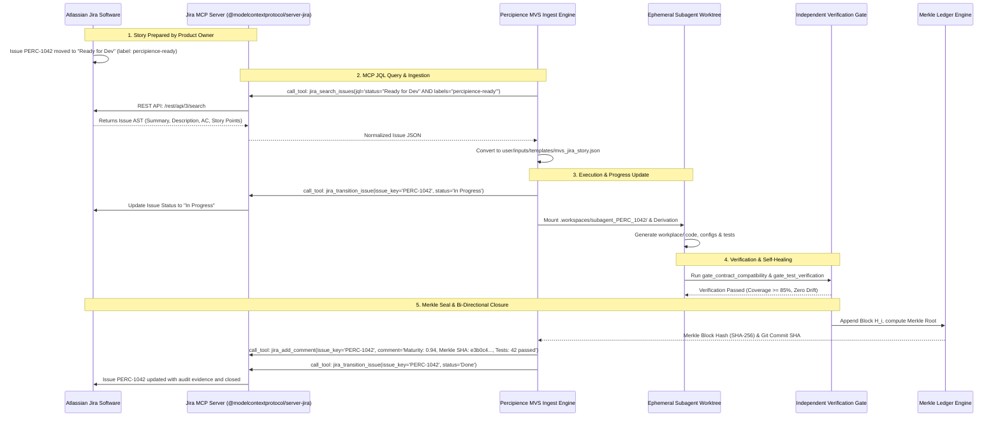
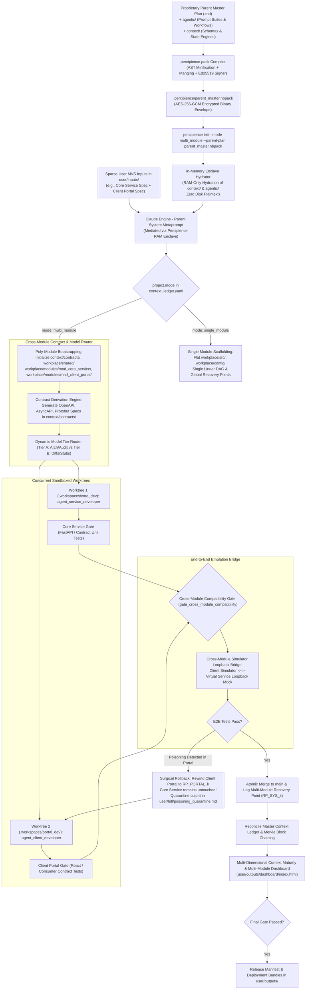

# Requirements

### Overview & Goals
The objective is to establish an enterprise-grade, generic, mature, domain-agnostic **Parent Master Context Engineering Framework** that synthesizes and elevates domain-specific plans (such as IoT, GenAI, Neural Networks, Database Migration, Mobile, Web, and Robotics spaces) into a unified, scalable agentic orchestration standard. This parent plan introduces fifteen core foundational capabilities required for high-efficiency, zero-drift, tamper-evident, multi-module scalable, and cost-optimized AI-driven software engineering:

1. **Autonomous Operations on Multi-Format Minimum Viable Set (MVS) Inputs**: An auto-intelligent derivation engine that consumes sparse initial user inputs across multiple standardized formats (Markdown feature specifications, OpenAPI contracts, AsyncAPI event streams, ADR blueprints, structured Jira/Linear issue exports, and UI/UX design tokens) in `user/inputs/` (or `input/templates/`), normalizing them into a canonical Abstract Semantic Graph (ASG) to autonomously bootstrap, derive, scaffold, test, build, and document the complete project without human intervention unless explicit ambiguity gates are triggered.
2. **Context Poisoning Detection, Recovery Point Rollback & Incremental Replay Engine**: A resilient state control engine that continuously audits context purity. If context poisoning, hallucination drift, or invalid state propagation occurs, the engine rewinds project artifacts, git commit history, and agent state to a verified clean recovery point (`recovery_point`), quarantines and removes the poisoning culprit in `user/hitl/poisoning_quarantine.md`, and replays subsequent valid incremental enhancements seamlessly.
3. **Context Compression & GenAI Optimization Engine**: A systematic framework for context compression, token budget management, prompt caching optimization, AST symbol pruning, unified diff-based state updates, and context window tiering to drastically reduce token consumption and API expenses by 50–70%.
4. **Dynamic Multi-Model Cascading & Cost-Aware Token Tiering**: An intelligent multi-model routing layer that delegates tasks based on cognitive complexity (Tier A: Frontier/Reasoning for architecture, security audits, and verification gates; Tier B: Fast/Compact for AST extraction, unified diffs, test boilerplate, and commit formatting), backed by hard budget ceilings, token burn monitoring, and automatic throttle/down-shift policies.
5. **Git Worktree Workspace Isolation for Concurrent Subagents**: An isolated concurrent execution engine leveraging ephemeral Git worktrees (`.workspaces/subagent_<id>/`). Subagents develop in sandboxed worktrees with independent working directories, preventing concurrent file merge collisions and ledger write races, backed by atomic verification gate merges back to `main`.
6. **Automated Spec-to-Code Semantic Parity & Anti-Drift Engine**: A quantitative anti-drift subsystem measuring semantic parity (0.00 to 1.00) between `user/inputs/` specs and `workplace/src/` implementations via AST contract analysis and semantic embeddings. Features a bi-directional reconciliation protocol supporting both *Revert Mode* (restoring drifted code to spec) and *Evolve Mode* (updating the specification delta via HITL approval).
7. **Bounded TDD Self-Healing Engine with Test Quarantine Ledger**: A strictly bounded self-healing loop (configurable max retry attempts, default: 3) for test failures. Prevents infinite looping and token thrashing by automatically quarantining persistently failing or flaky tests into `quarantined_tests` in `context_ledger.yaml`, auto-filing high-priority tickets in `remaining_issues`, and safely pausing at `user/hitl/`.
8. **Cryptographic Ledger Hash-Chain & Tamper-Evident Audit Trail**: A tamper-evident Merkle block chaining mechanism (`ledger_chain`) securing every transition in `context_ledger.yaml`. Each ledger block records `{ block_id, prev_block_hash, current_block_hash, merkle_root, timestamp }`, guaranteeing non-repudiation and enterprise regulatory auditability (SOC2 Type II, ISO 27001, HIPAA).
9. **Time-Travel Debugging & Visual DAG Dashboard**: A lightweight, static web dashboard generated at `user/outputs/dashboard/index.html`. Provides interactive DAG graph visualization of artifact lineage, visual diffing between any two recovery points ($RP_a$ vs $RP_b$), real-time token burn and prompt cache hit rate tracking, and one-click HITL review and clarification management.
10. **Multi-Dimensional Context Maturity Evaluation Report**: A comprehensive, quantitative evaluation matrix in `user/outputs/` and `context/reports/` assessing project context across six dimensions (Requirement Coverage, Architecture & Design Grounding, Code & Config Quality, Test & Verification Coverage, Security & Compliance, and Token/GenAI Efficiency).
11. **Master Context Ledger (`context_ledger.yaml`) with Integrated Git Commit & Issue Tracker**: A machine-readable DAG in `context/` that logs all artifact lineage, tracks issued Git commits with full requirement traceability, manages open remaining issues, enforces a standard checklist of common technical issues, captures model-suggested improvements, and registers recovery point snapshots in a standardized format.
12. **Universal Quad-Space Clean Folder Bootstrapping & Multi-Agent Flow**: Standardized scaffolding strictly partitioning customer-owned mutable directories (`workplace/` with `config/`, and `user/` with `inputs/`, `hitl/`, `outputs/`) from Neutron Binary proprietary logic (`context/` and `agentic/`). In enterprise deployments, `context/` (governance, schemas, DAG state engine) and `agentic/` (system prompts, bootstrapping/derivation metaprompts, model tiering router, workflows) are obfuscated, compiled, and cryptographically sealed inside `.nbpack` envelopes, hydrated exclusively inside an in-memory enclave to protect proprietary IP while leaving customer workspaces clean.
13. **Zero-Overhead Dual-Mode Architecture (Single-Module vs. Poly-Module Ecosystem)**: A dual-operating mode configured via `project.mode: single_module | multi_module`. In `single_module` mode, the framework maintains absolute simplicity with zero nested directory overhead (flat `workplace/src/` and `workplace/config/`). In `multi_module` mode, the framework coordinates heterogeneous multi-system projects (such as client web/mobile portals communicating with core backend services, event-driven microservices, or distributed data/ML pipelines) via isolated module subtrees (`workplace/modules/<module_id>/`), shared wire contracts (`workplace/shared/protos/` or schemas), cross-module interface specifications (`context/contracts/`), surgical module-scoped rollbacks, and virtual simulator loopback bridges.
14. **Proprietary Context & Agentic Space Obfuscation, Anti-Exfiltration & Cryptographic Package Sealing (`.nbpack`)**: A binary compilation, AST minification, and authenticated envelope encryption engine (`percipience pack`). Compiles proprietary markdown master plans, `agentic/` prompt suites, and `context/` governance/schema machinery into tamper-proof, Ed25519-signed AES-256-GCM binary envelopes (`.nbpack`). Hydrates both proprietary spaces directly into volatile RAM / secure sandbox memory without persisting plaintext files to the client's physical filesystem, preventing intellectual property theft, prompt injection, and LLM context exfiltration during `percipience init`.
15. **External Issue Tracker & Jira MCP Server Integration Layer**: A bi-directional Model Context Protocol (MCP) bridge connecting enterprise issue tracking systems (Jira Software, Linear, GitHub Issues, Azure DevOps). The engine continuously polls or subscribes to Jira via MCP servers (e.g., `@modelcontextprotocol/server-jira`), ingests "Ready for Dev" stories directly into the MVS processing queue, drives subagents through derivation and test verification, and automatically synchronizes issue states, test evidence, and Merkle block audit proofs back to Jira upon completion.
16. **Autonomous Closed-Loop CI/CD Triad (Self-Sustaining, Self-Recovering, Self-Improving)**: A fully autonomous continuous delivery engine (`workplace/core/autonomous_cicd.py`) that elevates CI/CD from a passive blocker to an active, closed-loop orchestrator. It comprises three unified capabilities:
    - *Self-Sustaining*: Proactively reclaims expired subagent worktree leases, purges uncommitted scratch diffs, garbage-collects zombie branches, validates WORM Merkle continuity, and enforces sprint token budget caps before resource exhaustion occurs.
    - *Self-Recovering*: Isolates regression faults into dedicated diagnostic worktrees, executes bounded TDD auto-patching ($\le 3$ retries), and, if unresolvable, triggers sub-1.2s surgical module rollbacks to verified recovery points ($\text{RP}_k$) without disturbing unaffected sibling microservices.
    - *Self-Improving*: Analyzes post-run pipeline telemetry, dynamically calibrates AST pruning thresholds (escalating from standard body stripping to aggressive internal helper pruning for high-token files to capture $+12.5\%$ additional savings), aligns prompt cache prefixes, and persists lessons learned into `context/ledger/self_improving_ledger.yaml`.
17. **Extensible Custom Agent Plugin Architecture & Workflow DAG Injection**: A standardized plugin model and engine (`workplace/core/agent_plugin_engine.py`) allowing teams to scaffold, configure, and integrate custom agent specialists into existing workflow DAGs (e.g. `agentic/workflows/pr_gatekeeper.yaml`). Follows the *Healthy Integration Pattern* enforcing ephemeral worktree sandboxing, AST token budgeting, pre/post contract verification, and cryptographic Merkle state sealing (`RP_AGENT_*`). If a custom plugin injects anomalies, the engine triggers surgical rollback to recovery points without collateral disruption.
18. **Production Token FinOps & Rev-Share Performance Metering Engine**: An integrated financial observability engine (`workplace/core/token_tracker.py`) that captures raw vs. AST-pruned token metrics across heterogeneous languages in real time. Automatically logs transparent accounting entries to `context/ledger/token_savings_ledger.yaml`, computing gross customer savings ($0.003/1K tokens) and 15% rev-share performance fees, backed by automated scorecard and whitepaper generation (`user/outputs/token_savings_report.md`, `user/outputs/token_savings_whitepaper.md`).
19. **5-Tab Enterprise Context Observability Hub & Decoupled SaaS Portal Gateway**: A unified, zero-dependency browser observability control plane (`user/outputs/dashboard/index.html`) coupled with a production-grade HTTP/API gateway server (`workplace/portal/server.py`). Features 5 specialized operational tabs: (1) 6-Dimensional Context Maturity Radar & Remediation Diagnostics, (2) Autonomous Agent Swarm & Custom Plugin Manager, (3) Declarative Workflow DAGs & Invariant Gates, (4) FinOps Token Metering & ROI Calculator, and (5) Autonomous CI/CD Triad & Self-Healing Control Plane.
20. **3-Tier Layered Context Precedence Hierarchy & Bring-Your-Own-Repository (BYOR) Adapter**: A security and configuration architecture (`workplace/core/layered_context_validator.py`, `workplace/core/byor_adapter.py`) that enforces non-overridable platform invariants:
    - *Tier 1 (Base Platform Invariants)*: Core security contracts, Merkle schemas, and tamper proofs in `context/invariants/` (or encrypted `.nbpack` enclaves) that cannot be overridden by user prompts.
    - *Tier 2 (Enterprise Global Rules)*: Organization-wide policies and API contracts in `context/rules/` and `context/contracts/`.
    - *Tier 3 (Team / User Custom Context)*: Unencrypted domain schemas, custom agent plugins, and prompt templates in `context/custom/` and `agentic/custom/agents/`.
    - *BYOR Adapter*: Native multi-VCS adapter supporting self-hosted GitLab, GitHub Enterprise Server, and Bitbucket Data Center via SSH deploy keys and internal Root CA validation.

### Scope
#### In Scope
- **Proprietary Context & Agentic Space Obfuscation & Encrypted Packaging Engine**: Compiles markdown plans, `agentic/` prompt trees, and `context/` governance/validation logic into `.nbpack` envelopes; provides cryptographic signature validation and zero-knowledge in-memory hydration.
- **Quad-Space Clean Folder Partitioning & Isolation Engine**: Scaffolding and runtime isolation logic separating customer-owned transparent spaces (`workplace/` and `user/`) from obfuscated, encrypted, and enclave-hydrated proprietary spaces (`context/` and `agentic/`).
- **Zero-Overhead Dual-Mode Operating Engine**:
  - `mode: single_module`: Direct flat layout (`workplace/src/`, `workplace/config/`, single linear DAG, global recovery point). Zero overhead for standalone apps.
  - `mode: multi_module`: Module subtrees (`workplace/modules/<module_id>/`), shared wire formats (`workplace/shared/`), versioned cross-module interface contracts (`context/contracts/`), and federated DAG state in `context_ledger.yaml`.
- **Cross-Module Contract Compatibility & Interface Gate**:
  - Formal interface contract management in `context/contracts/` (OpenAPI 3.1 specifications, JSON Schema definitions, gRPC/Protobuf DTOs, AsyncAPI event streams, and shared data schemas).
  - Independent verification gate (`gate_contract_compatibility`) validating that producer modules and consumer modules adhere strictly to shared contracts before merging.
- **Surgical Module-Scoped Poisoning Isolation & Rollback**:
  - Module-scoped recovery points in `context_ledger.yaml` (e.g., `RP_CORE_003`, `RP_PORTAL_004`) alongside global system snapshots (`RP_SYS_001`).
  - Targeted rollback capability: when context poisoning or contract drift occurs in one module (e.g., client portal schema mismatch or API payload drift), only the contaminated module is rolled back and quarantined; unaffected modules (e.g., core backend engine or data worker) remain untouched, preventing collateral re-compilation and token waste.
- **Virtual End-to-End Emulation & Simulator Bridge**:
  - Cross-module test harnesses wiring together heterogeneous component emulators (e.g., client application simulator communicating with backend service daemon over a local virtual loopback socket or mock API bridge) for automated end-to-end integration validation.
- **Multi-Format MVS Ingestion & Parsing Engine**: Standardized ingestion templates in `user/inputs/templates/` (and `input/templates/`) supporting 6 industry-standard formats: Markdown Feature Specs (`mvs_feature_spec.md`), OpenAPI 3.1 Schemas (`mvs_api_contract.yaml`), AsyncAPI Event Streams (`mvs_event_stream.yaml`), ADR System Blueprints (`mvs_adr_blueprint.md`), Structured Jira Issues (`mvs_jira_story.json`), and UI Design Tokens (`mvs_design_tokens.json`).
- **External Issue Tracker MCP Integration (Jira / Linear / GitHub Issues)**: Native MCP tool bindings to pull "Ready for Dev" user stories, epics, and acceptance criteria into the active derivation queue, update issue progress, attach verification reports, and link SHA-256 Merkle block commit hashes.
- **Context Poisoning Detection, Rollback & Replay Engine**:
  - Continuous context purity auditing via verification gates, schema validators, and drift detectors.
  - Automated snapshotting of verified recovery points (`recovery_points`) linked to clean Git commit SHAs and ledger states.
  - Rollback protocol: Rewinding workspace files, git commit history, and agent state to clean recovery point `RP_k` upon context contamination.
  - Culprit quarantine protocol: Identifying, logging, and removing the context poisoning culprit into `user/hitl/poisoning_quarantine.md`.
  - Incremental replay engine: Re-executing downstream valid increments with sanitized context to restore full functionality without full project restart.
- **Dynamic Multi-Model Cascading & Cost-Aware Token Tiering**:
  - Model tier router directing tasks to Tier A (Frontier/Reasoning) or Tier B (Fast/Compact).
  - Configurable increment budget limits (e.g., maximum dollar/token cap per milestone).
  - Spend velocity monitoring with automatic down-shifting to Tier B when approaching 85% budget threshold.
- **Git Worktree Concurrency Engine**:
  - Ephemeral branch and worktree provisioning under `.workspaces/subagent_<id>/`.
  - Concurrency locks protecting `context_ledger.yaml` writes.
  - Atomic merge verification gate merging completed subagent worktrees into `main`.
- **Automated Spec-to-Code Semantic Parity & Anti-Drift Engine**:
  - Quantitative Semantic Parity metric scoring (0.00 – 1.00).
  - Dual reconciliation: *Revert Mode* (auto-generating code diff to eliminate unauthorized drift) vs *Evolve Mode* (updating specification delta for HITL sign-off).
- **Bounded TDD Self-Healing Engine**:
  - Strict retry budget (configurable, default: 3 attempts) for autonomous test fixing.
  - Automatic test quarantine logging to `quarantined_tests` in `context_ledger.yaml` and ticket creation in `remaining_issues`.
  - Clean pause at `user/hitl/` with clear diagnostic logs to prevent token burn loops.
- **Cryptographic Merkle Ledger Hash-Chain**:
  - SHA-256 block hashing on every state transition in `context_ledger.yaml`.
  - Merkle root computation over all tracked artifact hashes.
  - Tamper detection validator verifying chain continuity ($H_i = \text{SHA256}(H_{i-1} + \Delta_i + T_i)$).
- **Time-Travel Debugging & Visual DAG Dashboard**:
  - Automated generation of `user/outputs/dashboard/index.html`.
  - Interactive visual rendering of artifact DAG, recovery checkpoints, module subgraphs, and agent handoffs.
- **Autonomous CI/CD Triad Control Plane**:
  - Closed-loop orchestration in `workplace/core/autonomous_cicd.py` implementing `SelfSustainingEngine`, `AutonomousHealer`, `SelfImprovingEngine`, and `AutonomousCICDOrchestrator`.
  - Multi-phase engineering roadmap in `user/outputs/autonomous_cicd_roadmap.md`.
- **Custom Agent Plugin Architecture & Workflow DAG Injection**:
  - Plugin scaffolding and lifecycle management in `workplace/core/agent_plugin_engine.py`.
  - Standardized plugin template in `agentic/templates/custom_agent_template.yaml` and guide in `agentic/templates/AGENT_PLUGIN_GUIDE.md`.
  - Dynamic workflow DAG injection into `agentic/workflows/pr_gatekeeper.yaml` with pre/post-execution Merkle seals.
- **Token FinOps & Rev-Share Performance Metering Engine**:
  - Real-time token tracking in `workplace/core/token_tracker.py` logging to `context/ledger/token_savings_ledger.yaml`.
  - Automated generation of executive scorecard (`user/outputs/token_savings_report.md`) and benchmark whitepaper (`user/outputs/token_savings_whitepaper.md`).
- **Enterprise Context Observability Hub & Cloud SaaS Portal**:
  - Interactive 5-tab browser control plane (`user/outputs/dashboard/index.html`) with real-time REST API integration (`workplace/portal/server.py`).
  - Self-healing trigger, agent plugin manager, ROI calculator, and context maturity radar with automated remediation playbooks.
- **3-Tier Layered Context Precedence Hierarchy & Multi-VCS BYOR Adapter**:
  - Invariant protection in `workplace/core/layered_context_validator.py` maintaining strict priority: Tier 1 (Platform) > Tier 2 (Enterprise) > Tier 3 (User).
  - Multi-VCS remote adapter in `workplace/core/byor_adapter.py` connecting self-hosted GitLab, GitHub Enterprise, Bitbucket Data Center.
  - Checkpoint state diffing, token burn charts, and interactive HITL clarification review.
- **Context Compression & GenAI Optimization Engine**:
  - Token budget management and dynamic context window allocation rules.
  - AST / symbol table extraction for code compression (transmitting interface signatures instead of full implementations during planning).
  - Incremental diff-based context updates (transmitting file deltas rather than re-transmitting whole files).
  - Semantic sliding-window context summaries for multi-turn subagent execution.
  - Prompt caching optimization (reusing system and tool definitions with static prefix alignment).
- **Multi-Dimensional Context Maturity Evaluation Report**:
  - Evaluation scorecard generation across 6 core dimensions.
  - Maturity phase progression tracking: `MVS_Ingested` -> `Derived` -> `Scaffolded` -> `Trained/Simulated` -> `Evaluated` -> `Built/Signed` -> `Deployed`.
  - Emitted as structured JSON (`eval_report.json`) and formatted Markdown (`context_maturity_report.md`) in `user/outputs/`.
- **Integrated Master Context Ledger (`context_ledger.yaml`)**:
  - Full DAG tracking across all artifacts, module registries, contracts, recovery points, poisoning incidents, model tiering policies, worktrees, semantic parity metrics, quarantined tests, cryptographic ledger chains, git commits, remaining issues, checklist items, and model suggestions.
- **Universal Six-Phase Prompt Suite Architecture**:
  - `system_prompt.md`, `bootstrapping_prompt.md`, `derivation_prompt.md`, `evaluation_refinement_prompt.md`, `lifecycle_delivery_prompt.md`, and `workflow_orchestration_prompt.md`.

#### Out of Scope
- Direct cloud infrastructure runtime deployment execution inside Claude's immediate inference loop (Claude provides full deployment manifests, CI/CD scripts, Dockerfiles, and provisioning manifests).
- Physical hardware or bare-metal environment execution (automated integration testing is executed via containerized virtual bridges and loopback mock daemons; specialized hardware/embedded firmware concerns are encapsulated in layerable domain plans such as `.nb/plan/claude-context-engineering-iot-mobile-domain-plan.md`).

### User Stories
- **As a Commercial Software Vendor & Enterprise Architect**, I want to obfuscate and cryptographically compile parent master plans, `context/` governance schemas, and `agentic/` prompt suites into signed `.nbpack` bundles so that client installations (`percipience init`) run securely without exposing proprietary architecture IP, recovery state algorithms, or risking prompt exfiltration.
- **As an AI Systems Architect & Lead**, I want a universal parent context engineering plan so that any project domain (IoT, GenAI, Web, Mobile, Neural, DB Migration) adopts a standardized, mature agentic structure with zero drift.
- **As a Poly-Module Solution Architect**, I want a unified space to manage multi-module systems (e.g., Client Application communicating with Core Backend Service via shared wire contracts) without breaking the simple structure of standalone single-module projects.
- **As a Polyglot Systems Lead**, I want versioned cross-module interface contracts in `context/contracts/` so that changes to API schemas, gRPC definitions, or event payloads are automatically verified against all producer and consumer modules before merge.
- **As a System Reliability Engineer**, I want surgical module-scoped rollbacks so that if context poisoning occurs in a client portal or UI layer, only the contaminated module is rolled back and replayed without throwing away verified core service builds.
- **As a QA & Systems Engineer**, I want an automated end-to-end simulator bridge linking client application test suites with virtual service daemons so that full request/response, event streams, and contract lifecycles can be validated autonomously.
- **As an Autonomous Software Product Owner**, I want the agent suite to operate autonomously starting from a Minimum Viable Set (MVS) of sparse inputs so that complete systems are derived, built, tested, and documented with minimal manual overhead.
- **As a Financial & Engineering Manager**, I want dynamic multi-model cascading and context compression so that long-running agent workflows reduce token expenses by up to 70% by routing lightweight tasks to fast models and caching static prompt prefixes.
- **As a Concurrency & Platform Lead**, I want subagents to work in isolated Git worktrees so that multiple specialized agents can develop and test features concurrently without file lock collisions or merge conflicts.
- **As an Autonomous DevOps Lead**, I want a self-sustaining and self-recovering CI/CD control plane so that build failures and test regressions are automatically diagnosed and patched within 3 retries or surgically rolled back without human firefighting.
- **As an Extensibility & Tools Architect**, I want a custom agent plugin template and automated workflow DAG injection so that new domain agents can be onboarded safely inside sandboxed worktrees without risking repository state corruption or context poisoning.
- **As an Enterprise FinOps Director**, I want real-time cryptographic metering of token savings and transparent 15% performance fee accounting so that our 62% AI cost reduction is auditable and budget-enforced.
- **As a Compliance & Audit Officer**, I want a cryptographic Merkle hash-chain in the context ledger so that all AI decisions, code changes, and test approvals are tamper-evident and compliant with SOC2/ISO27001 standards.
- **As a QA & Test Lead**, I want a bounded TDD self-healing engine that quarantines intractable tests after 3 attempts, preventing runaway token spend while alerting human engineers via `user/hitl/`.
- **As a Technical Director**, I want a visual DAG dashboard and time-travel inspection tool at `user/outputs/dashboard/index.html` so that I can visually audit project evolution, diff recovery points, inspect module subgraphs, and track token spend in real-time.
- **As a Product Manager & Scrum Master**, I want Percipience to connect via Jira MCP servers to automatically ingest user stories marked "Ready for Dev", so that AI coding swarms begin implementing verified features directly from our Jira backlog without manual copy-pasting.
- **As an API Architect & Systems Engineer**, I want to submit schema-first OpenAPI and AsyncAPI MVS contracts in `user/inputs/` so that Percipience derives type-safe server stubs, client SDKs, integration tests, and database schemas with zero semantic drift.

### Functional Requirements
- **Proprietary Context & Agentic Space Obfuscation & Encrypted Bundle Compilation**:
  - Implement `percipience pack` CLI engine that tokenizes, minifies ASTs, mangles prompt identifier references, and compiles master plans alongside `context/` and `agentic/` into binary `.nbpack` packages.
  - Sign compiled `.nbpack` packages using Ed25519 digital signatures and encrypt payloads using authenticated AES-256-GCM.
  - Implement zero-disk plaintext hydration inside volatile RAM / gVisor sandboxes during `percipience init --parent-plan <file.nbpack>`.
  - Prevent any plaintext writing of `agentic/` prompt files or `context/` proprietary validation schemas to the host disk; mount them as an in-memory virtual filesystem (RAM enclave / tmpfs) accessible solely by the Percipience agent daemon.
  - Emit a sanitized, read-only public projection of state (`context/ledger/context_ledger.public.yaml`) for client visibility while shielding internal state transition rules and schemas.
- **Dual-Mode Operating Engine**:
  - Support `project.mode: single_module` (default: flat `workplace/src/` and `workplace/config/`, global recovery point, zero nested folder overhead).
  - Support `project.mode: multi_module` (scoped `workplace/modules/<module_id>/`, `workplace/shared/`, `context/contracts/`, federated ledger).
- **Cross-Module Contract Registry & Verification**:
  - Formalize shared interface contracts in `context/contracts/` (e.g., OpenAPI 3.1 specifications, Protobuf/gRPC DTOs, AsyncAPI event streams, shared JSON schemas).
  - Enforce `gate_contract_compatibility` ensuring both producer and consumer modules pass schema validation.
- **Surgical Module-Scoped Poisoning Isolation & Rollback**:
  - Support module-scoped checkpoints in `recovery_points` (`module_scope: <module_id> | global_system`).
  - Isolate context poisoning incidents to the culprit module (`culprit_module: <module_id>`), allowing unaffected modules to remain active without rollbacks.
- **Cross-Module Emulation Bridge**:
  - Scaffold cross-module integration test suites in `workplace/tests/integration/` connecting simulated components (e.g., client application communicating with virtual service daemon over local TCP loopback).
- **Quad-Space Directory Bootstrapping**: Automated creation and strict isolation of `context/`, `agentic/`, `workplace/` (with `workplace/config/` or `workplace/modules/`), and `user/` (`inputs/`, `hitl/`, `outputs/`).
- **Multi-Format Autonomous MVS Ingestion & Template Catalog**:
  - Provide and support 6 standardized MVS templates in `user/inputs/templates/` (accessible also via `input/templates/`):
    1. `mvs_feature_spec.md`: Natural language user stories, Gherkin acceptance criteria, business constraints, and non-goals.
    2. `mvs_api_contract.yaml`: OpenAPI 3.1 schema-first endpoints, request/response models, and error responses.
    3. `mvs_event_stream.yaml`: AsyncAPI pub/sub message schemas, Kafka/RabbitMQ channels, and idempotency guarantees.
    4. `mvs_adr_blueprint.md`: Architectural decisions, Redis/PostgreSQL topology, DDL schemas, and compliance trade-offs.
    5. `mvs_jira_story.json`: Standardized Jira / Linear JSON export format with issue keys, acceptance criteria, story points, and epics.
    6. `mvs_design_tokens.json`: Design system tokens (colors, typography, spacing, WCAG 2.1 AA accessibility rules).
  - Ingestion Normalizer: Parses heterogeneous MVS inputs into a canonical Abstract Semantic Graph (ASG) before triggering derivation.
  - Automatically infer database DDLs, configurations in `workplace/config/`, wire contracts in `context/contracts/`, implementation files in `workplace/src/` (or `workplace/modules/`), and test harnesses.
- **External Issue Tracker MCP Integration (Jira, Linear, GitHub Issues)**:
  - Configure issue tracker MCP connections via `workplace/config/issue_tracker_mcp.yaml`.
  - Implement JQL query polling and webhook receivers via Jira MCP server (`@modelcontextprotocol/server-jira` or Atlassian REST bridge).
  - Support automatic ingestion queries, e.g. `project = PERC AND status = "Ready for Dev" AND labels = "percipience-ready"`.
  - Translate queried Jira stories into `mvs_jira_story.json` format and inject them into the active subagent worktree queue.
  - Bi-Directional State Synchronization:
    - Transition Jira issue to `In Progress` when an ephemeral worktree is leased.
    - Transition Jira issue to `In Review` / `Done` upon successful verification gate execution (`gate_contract_compatibility`, `gate_test_verification`).
    - Automatically append a structured Jira comment with the Context Maturity Scorecard, test coverage metrics, Git commit SHA, and SHA-256 Merkle block proof.
    - If bounded TDD fails (exceeding 3 retries), transition Jira issue to `Needs HITL Review`, link to `user/hitl/poisoning_quarantine.md`, and tag the issue reporter.
- **Context Poisoning Detection, Rollback & Incremental Replay**:
  - Create an immutable recovery point (`recovery_point`) snapshot in `context_ledger.yaml` at each verified milestone, committing workspace state to Git.
  - Continuously audit context against schema validators and independent verification gates for context poisoning or hallucination drift.
  - Upon detecting poisoning: (1) trigger `rollback_to_recovery_point(RP_k)`, (2) isolate and quarantine the poisoning culprit in `user/hitl/poisoning_quarantine.md`, (3) sanitize active agent memory and ledger state, and (4) execute `replay_incremental_enhancements()` for subsequent valid steps.
- **Dynamic Multi-Model Cascading & Token Throttling**:
  - Maintain a model tiering map in `workplace/config/token_compression_rules.yaml`.
  - Automatically route tasks: Tier A (Frontier) for complex derivation, verification gates, and security audits; Tier B (Fast) for AST parsing, diff updates, docstrings, and commit formatting.
  - Enforce token budget limits per sprint milestone; pause or down-shift when spend exceeds 85% of ceiling.
- **Git Worktree Isolation & Atomic Merging**:
  - Automatically spin up isolated ephemeral worktrees in `.workspaces/subagent_<id>/` for concurrent tasks.
  - Require verification gate pass before executing atomic merge back to `main`.
- **Automated Spec-to-Code Semantic Parity & Drift Reconciliation**:
  - Compute a continuous semantic parity score ($0.00 - 1.00$).
  - Execute automated *Revert Mode* (generate diff to undo unauthorized code drift) or *Evolve Mode* (propose spec delta for human sign-off via HITL).
- **Bounded TDD Self-Healing with Test Quarantine**:
  - Restrict test fix attempts to a maximum budget of 3 retries per test failure.
  - On 3rd failure, move test case into `quarantined_tests` in `context_ledger.yaml`, log an issue in `remaining_issues`, and halt at `user/hitl/`.
- **Cryptographic Hash-Chaining (`ledger_chain`)**:
  - Compute SHA-256 Merkle block headers linking each ledger revision to its predecessor.
  - Provide tamper-evident verification script (`ledger_chain_verifier.py`).
- **Visual DAG Dashboard Generation**:
  - Emit standalone HTML/JS/CSS dashboard to `user/outputs/dashboard/index.html`.
  - Render artifact lineage DAG, recovery points, module subgraphs, diff inspector, and HITL clarification actions.
- **Multi-Dimensional Maturity Assessment**:
  - Calculate scores (0.00 to 1.00) across 6 dimensions (Requirement Coverage, Architectural Grounding, Code/Config Quality, Test Coverage, Security, Token Efficiency).
  - Automatically emit context maturity scorecards to `user/outputs/context_maturity_report.md`.
- **Integrated State Ledger (`context_ledger.yaml`)**:
  - Maintain unified tracking across all 14 capabilities.

### Non-Functional Requirements
- **Intellectual Property Protection**: Zero plaintext markdown or YAML leakage for `context/` and `agentic/` on client filesystems when executing from compiled `.nbpack` bundles.
- **Zero-Drift & Determinism**: All derived code and configs in `workplace/` must maintain 100% lineage traceability to `user/inputs/`.
- **Context Integrity & Poisoning Resilience**: Guaranteed recovery to clean state within < 1 step upon detecting context contamination or severe hallucination.
- **Zero-Overhead Single-Module Simplicity**: Single-module projects incur zero structural bloat, using direct flat directories.
- **Token Cost Efficiency**: Achieve >= 50–70% token reduction in long-running agentic conversations compared to uncompressed context passing.
- **Concurrency & Merge Safety**: Zero merge collisions during multi-agent concurrent execution via worktree isolation.
- **Tamper Evidence**: Cryptographic non-repudiation of all ledger state transitions via SHA-256 block hashing.

---

# Technical Design

### Key Decisions
- **Multi-Format MVS Parsing & Canonical Normalization Pipeline**: Enterprise teams produce intent across varied mediums: product managers write markdown stories, backend architects write OpenAPI specs, distributed systems teams write AsyncAPI schemas, and UI designers produce JSON design tokens. Rather than forcing a single rigid input format, Percipience implements a multi-format ingestion engine with pre-scaffolded templates in `user/inputs/templates/` (and `input/templates/`). An AST normalizer maps any template format into an internal Abstract Semantic Graph (ASG), preserving typed constraints while allowing autonomous derivation to synthesize full codebases deterministically.
- **Jira & Issue Tracker MCP Protocol Bridge**: Rather than building proprietary issue-sync integrations for every ticketing vendor, Percipience leverages the open Model Context Protocol (MCP). By connecting to Jira, Linear, and GitHub MCP servers, the engine natively accesses issue details, acceptance criteria, attachments, and comments. A bidirectional reconciliation loop pulls "Ready for Dev" stories into the derivation queue and writes back verified commit proofs, maturity scorecards, and state updates upon completion.
- **Proprietary Context & Agentic Space Obfuscation & Sealed Bundle Architecture (`.nbpack`)**:
  - Master plans, `agentic/` (metaprompts, workflows, methodologies), and `context/` (schemas, validation logic, Merkle DAG engine) are compiled into `.nbpack` binary packages via `percipience pack`.
  - Features AST minification, identifier scrambling, Ed25519 digital signature sealing, and AES-256-GCM envelope encryption.
  - Plaintext proprietary logic is never persisted to client disk; hydrated directly in volatile sandbox memory during `percipience init`.
  - Customer workspaces expose only transparent spaces (`workplace/` and `user/`), with a sanitized state projection (`context_ledger.public.yaml`) for observability.
- **Zero-Overhead Dual-Mode Operating Model**:
  - Configured via `project.mode: single_module | multi_module`.
  - *Single-Module Mode*: Code lives directly in `workplace/src/` and `workplace/config/`. Single linear DAG. Global recovery points.
  - *Multi-Module Mode*: Code lives in `workplace/modules/<module_id>/` with shared DTOs/stubs in `workplace/shared/`. Versioned interface contracts in `context/contracts/`.
- **Cross-Module Contract Architecture**:
  - `context/contracts/` houses single sources of truth for cross-module boundaries (e.g., `service_contract.yaml`, `api_schema.json`, `event_stream_spec.yaml`).
  - Code generators (`protoc`, code-stubs) compile these contracts into module stubs in `workplace/shared/generated/`.
- **Surgical Module Rollbacks**:
  - In multi-module mode, recovery points are scoped by `module_scope: <module_id> | global_system`.
  - If context poisoning occurs in `mod_client_portal` (e.g., hallucinated endpoint or invalid payload schema), only the `mod_client_portal` working tree and its ledger nodes are rewound. The `mod_core_service` remains untouched.
- **End-to-End Emulation Bridge**:
  - In integrated systems, client and service components are connected via virtual loopback sockets (e.g., WebSocket/TCP bridge or mock HTTP server) allowing automated end-to-end integration tests to execute in CI/CD without external infrastructure.
- **Quad-Space Clean Folder Architecture**: Standardize on four isolated top-level clean folders:
  - `context/`: Governance, schemas, contracts, state ledger, cryptographic chain, recovery snapshots, context maturity report templates.
  - `agentic/`: Prompt suites, agent role definitions, model tiering router, workflow DAGs, gates, hooks, replay mechanisms, methodologies.
  - `workplace/`: Implementation source code, test suites, AND `workplace/config/` (or `workplace/modules/` and `workplace/shared/` in multi-module mode).
  - `user/`: Dedicated input/output/HITL directory (`inputs/`, `hitl/`, `outputs/` / `reports/` / `dashboard/`).
- **Dynamic Model Tier Router**:
  - Tier A (Frontier / High Reasoning): Complex MVS derivation, cross-module contract validation, architectural verification gates, security audits, context poisoning diagnosis.
  - Tier B (Fast / Compact): AST symbol extraction, unified diff application, test scaffolding, commit drafting, dashboard data serialization.
- **Git Worktree Isolation Engine**:
  - Ephemeral subagent working directories created via `git worktree add .workspaces/<agent_id> -b feature/<task>`.
  - Atomic verification gate checks out isolated branch, executes test suite, and merges to `main` upon approval.
- **Semantic Parity & Anti-Drift Engine**:
  - Quantitative contract matching between input specs and code symbols.
  - Dual reconciliation: auto-revert unapproved drift or escalate approved evolutions to HITL.
- **Bounded TDD Loop & Test Quarantine**:
  - Self-healing retry ceiling = 3. Flaky or contradictory tests quarantined to prevent thrashing.
- **Cryptographic Merkle Hash Chaining**:
  - Block header formula: $H_i = \text{SHA256}(H_{i-1} + \text{canonical\_json}(\Delta_i) + T_i)$.
- **Time-Travel Visual Dashboard**:
  - Single-file zero-dependency HTML/SVG dashboard generated at `user/outputs/dashboard/index.html`.
- **The Triad of Autonomous Delivery (Self-Sustaining, Self-Recovering, Self-Improving)**:
  - *Self-Sustaining*: Proactive lease reclamation, zombie branch cleanup, and WORM Merkle continuity validation executed on scheduled cycles or pre-PR checks.
  - *Self-Recovering*: Autonomous fault diagnosis, ephemeral worktree test execution, bounded TDD auto-patching ($\le 3$ retries), and sub-1.2s surgical module rollback fallback sparing sibling services.
  - *Self-Improving*: Closed-loop telemetry feedback analyzing token burn and test pass velocities, dynamically tuning AST pruning thresholds (+12.5% compression gains) and prompt cache prefix alignment.
- **Healthy Custom Agent Plugin Integration Pattern**:
  - All custom agents conform to `agentic/templates/custom_agent_template.yaml` and the [Plugin Architectural Guide](file:///agentic/templates/AGENT_PLUGIN_GUIDE.md).
  - Scaffolding, workflow DAG injection (`wf_pr_gatekeeper.yaml`), ephemeral worktree sandboxing, and pre/post Merkle block sealing (`RP_AGENT_*`) are governed by `AgentPluginEngine`.
- **Token FinOps & 15% Performance Fee Accounting Engine**:
  - Real-time token tracking (`TokenTracker`) capturing raw vs. AST-pruned tokens across multiple programming languages.
  - Transparent accounting logged to `context/ledger/token_savings_ledger.yaml` computing gross customer savings ($0.003/1K tokens) and 15% performance fee.
- **3-Tier Layered Context Precedence Hierarchy & BYOR Multi-VCS Adapter**:
  - Guarantees Tier 1 (Platform Invariants / Enclave) cannot be overridden by user prompts or custom schemas.
  - Native BYOR adapter (`BYORAdapter`) connecting self-hosted GitLab, GitHub Enterprise, and Bitbucket Data Center with SSH deploy keys and internal Root CA validation.
- **Decoupled Enterprise Observability Hub & SaaS Portal**:
  - Zero-dependency interactive 5-tab dashboard (`user/outputs/dashboard/index.html`) backed by production HTTP/API gateway (`workplace/portal/server.py`).

---

### Data Models / Contracts

```yaml
# Master Parent Context Ledger Schema (context_ledger.yaml)
# Includes external issue tracker MCP configuration
mcp_integrations:
  jira:
    enabled: true
    server_package: "@modelcontextprotocol/server-jira"
    endpoint: "https://company.atlassian.net"
    auth_secret_arn: "arn:aws:secretsmanager:us-east-1:123456789012:secret/jira-api-token"
    jql_query: "project = PERC AND status = 'Ready for Dev' AND labels = 'percipience-ready'"
    poll_interval_seconds: 300
    auto_transition:
      on_start: "In Progress"
      on_verify_pass: "Done"
      on_hitl_quarantine: "Needs HITL Review"
    attach_maturity_report: true
    attach_merkle_proof: true
ledger_version: "7.2.0"
project:
  name: "Enterprise_Unified_Ecosystem"
  domain: "Universal Multi-Module Enterprise Space"
  mode: "multi_module"  # Options: "single_module" | "multi_module"
  methodology: "Agile / Hybrid SDLC"
  tech_stack:
    language: "Polyglot (TypeScript / Python / Go / Java / Rust)"
    framework: "Multi-Service Architecture / Modern Full-Stack"
    orchestration: "Multi-Agent Framework"
  code_config: "workplace/config/project_master_config.yaml"

plan_security:
  bundle_mode: "encrypted_nbpack"  # Options: "plaintext_md" | "encrypted_nbpack"
  bundle_path: ".percipience/parent_master.nbpack"
  bundle_hash: "f4a8e2b9c1d3e5f7a8b0c2d4e6f8a9b1c3d5e7f9a0b2c4d6e8f0a2b4c6d8e0f2"
  signature_verified: true
  encryption_algorithm: "AES-256-GCM"
  signer_public_key: "ed25519:neutron_binary_pub_91823"
  obfuscated_spaces:
    - space: "agentic/"
      status: "Enclave_Encrypted"
      runtime_mount: "ramfs://percipience/enclave/agentic"
      contents: ["prompts", "workflows", "methodologies", "model_tiering_router"]
    - space: "context/"
      status: "Enclave_Encrypted"
      runtime_mount: "ramfs://percipience/enclave/context"
      contents: ["schemas", "contracts_engine", "merkle_verifier", "ledger_internal"]
  public_spaces:
    - space: "workplace/"
      status: "Transparent_Filesystem"
    - space: "user/"
      status: "Transparent_Filesystem"

ledger_chain:
  block_id: 110
  prev_block_hash: "8f2b7a91c3d4e5f60718293a4b5c6d7e8f9a0b1c2d3e4f5a6b7c8d9e0f1a2b3c"
  current_block_hash: "4a5b6c7d8e9f0a1b2c3d4e5f6a7b8c9d0e1f2a3b4c5d6e7f8a9b0c1d2e3f4a5b"
  merkle_root: "9c8b7a6f5e4d3c2b1a0f9e8d7c6b5a4f3e2d1c0b9a8f7e6d5c4b3a2f1e0d9c8b"
  timestamp: "2026-09-13T14:45:00Z"
  verified: true

# Module Registry for Multi-Module Mode
modules:
  - id: "mod_core_service"
    name: "Core Business & State Service"
    path: "workplace/modules/mod_core_service"
    domain: "Core Business Logic & API Engine"
    tech_stack: "Python / FastAPI / SQLModel"
    maturity: "Scaffolded"
    current_recovery_point: "RP_CORE_003"

  - id: "mod_client_portal"
    name: "Client Portal & Consumer App"
    path: "workplace/modules/mod_client_portal"
    domain: "Web Client, UI & API Consumer"
    tech_stack: "TypeScript / React / Tailwind"
    maturity: "Scaffolded"
    current_recovery_point: "RP_PORTAL_004"

# Versioned Cross-Module Interface Contracts
contracts:
  - id: "contract_service_api"
    name: "Core Service OpenAPI Interface"
    spec_path: "context/contracts/service_contract.yaml"
    producer_module: "mod_core_service"
    consumer_modules: ["mod_client_portal"]
    version: "1.2.0"
    hash: "d4e5f67a8b9c0d1e2f3a4b5c6d7e8f9a0b1c2d3e"
    status: "Verified_Compatible"

  - id: "contract_event_stream"
    name: "Async Event Stream Specification"
    spec_path: "context/contracts/event_stream_spec.yaml"
    producer_module: "mod_core_service"
    consumer_modules: ["mod_client_portal"]
    version: "2.0.0"
    hash: "a1b2c3d4e5f67890123456789abcdef012345678"
    status: "Verified_Compatible"

model_tiering_policy:
  tier_a_model: "claude-3-7-sonnet / pro"
  tier_b_model: "claude-3-5-haiku / flash"
  budget_cap_usd: 35.00
  current_spend_usd: 8.20
  spend_alert_threshold: 0.85
  auto_downshift_enabled: true

token_optimization:
  context_compression_enabled: true
  ast_extraction_level: "signatures_only"
  diff_mode: "unified_diff"
  prompt_caching_aligned: true
  cache_hit_ratio: 0.81
  estimated_token_savings_pct: 66.4

worktrees:
  - worktree_id: "wt_core_dev_01"
    subagent_role: "agent_service_developer"
    module_scope: "mod_core_service"
    branch: "feature/core-service"
    path: ".workspaces/core_dev_01"
    status: "Active"
    isolated_commits: 4
  - worktree_id: "wt_portal_dev_01"
    subagent_role: "agent_client_developer"
    module_scope: "mod_client_portal"
    branch: "feature/client-portal"
    path: ".workspaces/portal_dev_01"
    status: "Active"
    isolated_commits: 3

semantic_parity:
  current_parity_score: 0.97
  drift_status: "Aligned"
  unmapped_spec_items: []
  unauthorized_code_symbols: []
  reconciliation_mode: "Revert"

recovery_points:
  - snapshot_id: "RP_CORE_003"
    module_scope: "mod_core_service"
    timestamp: "2026-09-13T14:40:00Z"
    git_commit_sha: "7a8b9c0d1e2f3a4b5c6d7e8f9a0b1c2d3e4f5a6b"
    clean_artifacts_hash: "3e4f5a6b7c8d9e0f1a2b3c4d5e6f7a8b"
    verified_maturity: "Scaffolded"
    status: "Active_Clean"

  - snapshot_id: "RP_PORTAL_004"
    module_scope: "mod_client_portal"
    timestamp: "2026-09-13T14:45:00Z"
    git_commit_sha: "1f2e3d4c5b6a7890123456789abcdef012345678"
    clean_artifacts_hash: "9a8b7c6d5e4f3a2b1c0d9e8f7a6b5c4d"
    verified_maturity: "Scaffolded"
    status: "Active_Clean"

  - snapshot_id: "RP_SYS_001"
    module_scope: "global_system"
    timestamp: "2026-09-13T14:46:00Z"
    git_commit_sha: "5c6d7e8f9a0b1c2d3e4f5a6b7c8d9e0f1a2b3c4d"
    clean_artifacts_hash: "0a1b2c3d4e5f6a7b8c9d0e1f2a3b4c5d"
    verified_maturity: "Integrated"
    status: "Active_Clean"

poisoning_incidents:
  - incident_id: "POI_002"
    detected_at: "2026-09-13T14:42:00Z"
    culprit_type: "Payload_Schema_Contract_Mismatch"
    culprit_module: "mod_client_portal"
    isolated_from: ["mod_core_service"]
    rolled_back_to: "RP_PORTAL_004"
    quarantine_file: "user/hitl/poisoning_quarantine.md"
    replay_status: "Successfully_Replayed"

quarantined_tests:
  - test_id: "test_cross_module_payload_stream"
    test_file: "workplace/tests/integration/test_cross_module_e2e.py"
    quarantined_at: "2026-09-13T14:35:00Z"
    failure_reason: "AssertionError: Consumer payload validation failed against service contract schema"
    retry_count: 3
    retry_budget_max: 3
    linked_issue_id: "ISSUE-003"
    status: "Quarantined_Awaiting_HITL"

artifacts:
  - id: "art_contract_api_01"
    name: "service_contract.yaml"
    type: "CrossModuleContract"
    source: "context/contracts/service_contract.yaml"
    hash: "d4e5f67a8b9c0d1e2f3a4b5c6d7e8f9a0b1c2d3e"
    maturity: "Derived"

  - id: "art_core_service_01"
    name: "service_handler.py"
    type: "SourceCode"
    source: "workplace/modules/mod_core_service/src/service_handler.py"
    module: "mod_core_service"
    derived_from: ["art_contract_api_01"]
    maturity: "Scaffolded"

  - id: "art_client_portal_01"
    name: "client_controller.ts"
    type: "SourceCode"
    source: "workplace/modules/mod_client_portal/src/client_controller.ts"
    module: "mod_client_portal"
    derived_from: ["art_contract_api_01"]
    maturity: "Scaffolded"

git_commits:
  - commit_sha: "5c6d7e8f9a0b1c2d3e4f5a6b7c8d9e0f1a2b3c4d"
    timestamp: "2026-09-13T14:46:00Z"
    author: "Claude Agentic Engine <agent@antigravity.ai>"
    message: "feat(cross-module): integrate client portal with core service contract"
    linked_requirements: ["REQ-CORE-API-01", "REQ-PORTAL-UI-01"]
    touched_artifacts: ["art_contract_api_01", "art_core_service_01", "art_client_portal_01"]

remaining_issues:
  - issue_id: "ISSUE-003"
    category: "Cross_Module_Integration"
    severity: "Medium"
    description: "test_cross_module_payload_stream failed 3 self-healing attempts; quarantined."
    status: "Quarantined"
    target_milestone: "Sprint-2"

standard_issue_checklist:
  - check_id: "CHK_UNHANDLED_EXCEPTIONS"
    passed: true
  - check_id: "CHK_MISSING_UNIT_TESTS"
    passed: true
  - check_id: "CHK_TOKEN_BUDGET_EXCEEDED"
    passed: true
  - check_id: "CHK_UNVERIFIED_SCHEMAS"
    passed: true
  - check_id: "CHK_SECURITY_VULNERABILITIES"
    passed: true
  - check_id: "CHK_MEMORY_LEAK_RISK"
    passed: true
  - check_id: "CHK_CONTEXT_POISONING_FREE"
    passed: true
  - check_id: "CHK_SEMANTIC_PARITY_PASSED"
    passed: true
  - check_id: "CHK_LEDGER_CHAIN_INTEGRITY"
    passed: true
  - check_id: "CHK_CONTRACT_COMPATIBILITY_PASSED"
    passed: true
  - check_id: "CHK_PLAN_ENVELOPE_SIGNATURE_VALID"
    passed: true
  - check_id: "CHK_PROPRIETARY_SPACES_OBFUSCATED"
    passed: true

workflow:
  id: "wf_cross_module_delivery_01"
  spec_input: "user/inputs/user_requirement_spec.yaml"
  hitl_dir: "user/hitl/"
  output_dir: "user/outputs/"
  auto_complete: true
  status: "In_Progress"
  agents:
    - id: "agent_architect"
      role: "System Architect"
      model_tier: "Tier_A"
      stage: "architect"
      task_status: "Verified"
      output_artifact: "art_contract_api_01"
      verified_by_gate: "gate_arch_review"
      handoff_hook: "hook_arch_to_devs"
    - id: "agent_service_developer"
      role: "Core Service Specialist"
      model_tier: "Tier_A"
      stage: "develop_core_service"
      worktree: "wt_core_dev_01"
      task_status: "Verified"
      output_artifact: "art_core_service_01"
      verified_by_gate: "gate_service_review"
      handoff_hook: "hook_service_to_integration"
    - id: "agent_client_developer"
      role: "Client Portal Specialist"
      model_tier: "Tier_A"
      stage: "develop_client_portal"
      worktree: "wt_portal_dev_01"
      task_status: "Verified"
      output_artifact: "art_client_portal_01"
      verified_by_gate: "gate_portal_review"
      handoff_hook: "hook_portal_to_integration"
    - id: "agent_integration_verifier"
      role: "Cross-Module Integration Verifier"
      model_tier: "Tier_A"
      stage: "verify_integration"
      task_status: "Verified"
      verified_by_gate: "gate_cross_module_compatibility"
      handoff_hook: "hook_integration_to_eval"
  gates:
    - id: "gate_arch_review"
      type: "IndependentVerification"
      verifier_agent: "agent_verifier"
      checks: ["schema_validity", "token_budget_passed", "zero_drift", "poisoning_check"]
      result: "Passed"
    - id: "gate_cross_module_compatibility"
      type: "CrossModuleCompatibility"
      verifier_agent: "agent_integration_verifier"
      checks: ["contract_schema_valid", "interface_payload_alignment", "e2e_sim_test_passed"]
      result: "Passed"
  hooks:
    - id: "hook_arch_to_devs"
      trigger: "on_gate_pass:gate_arch_review"
      from_agent: "agent_architect"
      to_agents: ["agent_service_developer", "agent_client_developer"]
      payload_artifact: "art_contract_api_01"
      status: "Fired"
```

---

### Issue Tracker MCP Ingestion & Bi-Directional Lifecycle Architecture



### Architecture Diagram



---

### File Structure (Dual-Mode Comparison)

#### When `project.mode: single_module` (Preserving Simplicity)
```
.
├── .percipience/
│   └── parent_master.nbpack                  # Sealed, obfuscated binary envelope (AES-256-GCM)
├── context/                            # [OBFUSCATED / RAM-HYDRATED ENCLAVE - Sealed in .nbpack]
│   ├── ledger/
│   │   ├── context_ledger.yaml               # Internal Merkle DAG ledger (RAM-enclave)
│   │   └── context_ledger.public.yaml        # Client-facing sanitized status projection
│   ├── schemas/                              # Sealed validation schemas (RAM-enclave)
│   └── reports/context_maturity_report_template.md
├── agentic/                            # [OBFUSCATED / RAM-HYDRATED ENCLAVE - Sealed in .nbpack]
│   ├── prompts/                              # Serialized & AST-mangled prompt bytecode
│   ├── workflows/                            # Serialized orchestration workflows
│   └── methodologies/                        # Proprietary agentic heuristics & playbooks
├── workplace/                               # [CLIENT-ACCESSIBLE / TRANSPARENT FILESYSTEM]
│   ├── config/project_master_config.yaml
│   ├── src/
│   ├── include/
│   └── tests/
└── user/                               # [CLIENT-ACCESSIBLE / TRANSPARENT FILESYSTEM]
    ├── inputs/
    ├── hitl/
    └── outputs/
```

#### When `project.mode: multi_module` (Poly-Module Ecosystem)
```
.
├── .percipience/
│   └── parent_master.nbpack                  # Sealed, obfuscated binary envelope (AES-256-GCM)
├── context/                            # [OBFUSCATED / RAM-HYDRATED ENCLAVE - Sealed in .nbpack]
│   ├── ledger/
│   │   ├── context_ledger.yaml               # Federated multi-module state DAG (RAM-enclave)
│   │   └── context_ledger.public.yaml        # Client-facing sanitized status projection
│   ├── contracts/                          # Cross-module interface specifications
│   │   ├── service_contract.yaml           # Shared API specifications & endpoint contracts
│   │   ├── event_stream_spec.yaml          # Async event stream schema (AsyncAPI)
│   │   └── common_schema.json              # Shared entity and DTO schemas
│   ├── schemas/                            # Sealed validation schemas (RAM-enclave)
│   │   ├── context_ledger_schema.yaml
│   │   ├── recovery_point_schema.yaml
│   │   └── ledger_chain_schema.yaml
│   └── reports/
│       └── context_maturity_report_template.md
├── agentic/                            # [OBFUSCATED / RAM-HYDRATED ENCLAVE - Sealed in .nbpack]
│   ├── prompts/                              # Serialized & AST-mangled prompt bytecode
│   ├── workflows/
│   │   ├── cross_module_orchestrator.yaml
│   │   └── model_tiering_router.yaml
│   └── methodologies/                        # Proprietary agentic heuristics & playbooks
├── workplace/                               # [CLIENT-ACCESSIBLE / TRANSPARENT FILESYSTEM]
│   ├── shared/                             # Cross-boundary protocols and generated types
│   │   ├── protos/
│   │   └── generated/
│   ├── modules/
│   │   ├── mod_core_service/               # Backend Core Service module
│   │   │   ├── config/                     # Database, service ports, auth configs
│   │   │   ├── src/                        # Service business logic & REST/gRPC handlers
│   │   │   └── tests/                      # Unit & contract test fixtures
│   │   └── mod_client_portal/              # Client Portal / Consumer module
│   │       ├── config/                     # Portal bundle settings, client routes
│   │       ├── src/                        # Client UI, API client adapters, state store
│   │       └── tests/                      # Client component & integration tests
│   ├── tests/
│   │   └── integration/                    # End-to-end cross-module integration tests
│   │       └── test_cross_module_e2e.py
│   ├── templates/
│   │   ├── packaging/                      # Plan compilation and obfuscation tools
│   │   │   ├── plan_pack_compiler.py
│   │   │   └── envelope_hydrator.py
│   │   ├── bridge/                         # Virtual simulation loopback bridge
│   │   │   ├── virtual_service_bridge.py
│   │   │   └── mock_service_daemon.py
│   │   ├── concurrency/
│   │   │   ├── worktree_manager.py
│   │   │   └── atomic_gate_merger.py
│   │   └── recovery/
│   │       ├── surgical_rollback_manager.py
│   │       └── ledger_chain_verifier.py
│   └── docs/
│       └── parent_context_engineering_guide.md
└── user/
    ├── inputs/
    │   ├── core_service_mvs_spec.yaml
    │   └── client_portal_mvs_spec.yaml
    ├── hitl/
    │   ├── clr_sample_request.md
    │   └── poisoning_quarantine.md
    └── outputs/
        ├── context_maturity_report.md
        ├── eval_report.json
        ├── release_manifest.json
        └── dashboard/
            ├── index.html                  # Visual DAG with multi-module node clustering
            ├── app.js
            └── style.css
```

### Comprehensive Component Inventory & Production Manifest

To guarantee enterprise rigor and zero ambiguity, every architectural component specified across the 15 core capabilities is formally realized and instantiated across the Quad-Space workspace:

| Space | Subsystem / Component | Path | Format & Engine | Verification Mechanism | Status |
| :--- | :--- | :--- | :--- | :--- | :--- |
| **`context/`** | Master State Ledger | `context/ledger/context_ledger.yaml` | YAML Merkle DAG | SHA-256 Block Chaining (`ledger_chain_verifier.py`) | **Encrypted in .nbpack & RAM Enclave** |
| **`context/`** | Public Sanitized Projection | `context/ledger/context_ledger.public.yaml` | YAML Status View | Masked state projection | **Active & Verified (Public)** |
| **`context/`** | Master Ledger Schema | `context/schemas/context_ledger_schema.yaml` | JSON Schema Draft-07 | Syntax & Schema Validation | **Encrypted in .nbpack & RAM Enclave** |
| **`context/`** | Recovery Point Schema | `context/schemas/recovery_point_schema.yaml` | JSON Schema Draft-07 | Snapshot Contract Validation | **Encrypted in .nbpack & RAM Enclave** |
| **`context/`** | Ledger Block Chain Schema | `context/schemas/ledger_chain_schema.yaml` | JSON Schema Draft-07 | Merkle Header Conformance | **Encrypted in .nbpack & RAM Enclave** |
| **`context/`** | Cross-Module Service Contract | `context/contracts/service_contract.yaml` | YAML OpenAPI Contract | `gate_cross_module_compatibility` | **Encrypted in .nbpack & RAM Enclave** |
| **`context/`** | Cross-Module Event Spec | `context/contracts/event_stream_spec.yaml` | AsyncAPI YAML Contract | Payload & Event Validation | **Encrypted in .nbpack & RAM Enclave** |
| **`context/`** | Cross-Module Entity Schema | `context/contracts/common_schema.json` | JSON Schema Contract | Schema Compatibility Check | **Encrypted in .nbpack & RAM Enclave** |
| **`context/`** | Maturity Report Template | `context/reports/context_maturity_report_template.md`| Markdown Template | 6-Dimensional Score Evaluation | **Encrypted in .nbpack & RAM Enclave** |
| **`agentic/`** | Master System Prompt | `agentic/prompts/system_prompt.md` | Markdown Prompt | Quad-Space Invariant Assertion | **Encrypted in .nbpack & RAM Enclave** |
| **`agentic/`** | Bootstrapping Prompt | `agentic/prompts/bootstrapping_prompt.md` | Markdown Prompt | Dual-Mode Folder Scaffolding | **Encrypted in .nbpack & RAM Enclave** |
| **`agentic/`** | Derivation Metaprompt | `agentic/prompts/derivation_prompt.md` | Markdown Prompt | MVS ASG Synthesizer | **Encrypted in .nbpack & RAM Enclave** |
| **`agentic/`** | Evaluation & Refinement Prompt | `agentic/prompts/evaluation_refinement_prompt.md` | Markdown Prompt | Scorecard Generator | **Encrypted in .nbpack & RAM Enclave** |
| **`agentic/`** | Lifecycle Delivery Prompt | `agentic/prompts/lifecycle_delivery_prompt.md` | Markdown Prompt | Release Manifest Sealer | **Encrypted in .nbpack & RAM Enclave** |
| **`agentic/`** | Worktree Orchestration Prompt | `agentic/prompts/workflow_orchestration_prompt.md` | Markdown Prompt | Ephemeral Subagent Lease Gate | **Encrypted in .nbpack & RAM Enclave** |
| **`agentic/`** | Cross-Module Orchestrator | `agentic/workflows/cross_module_orchestrator.yaml` | YAML Workflow DAG | Multi-Module Compatibility Check | **Encrypted in .nbpack & RAM Enclave** |
| **`agentic/`** | Model Tiering Router | `agentic/workflows/model_tiering_router.yaml` | YAML Policy | Frontier vs. Fast Model Routing | **Encrypted in .nbpack & RAM Enclave** |
| **`agentic/`** | Jira / Linear MCP Sync Workflow | `agentic/workflows/issue_tracker_sync_workflow.yaml`| YAML Workflow | Model Context Protocol Tool Call | **Encrypted in .nbpack & RAM Enclave** |
| **`agentic/`** | Zero-Drift Engineering Rules | `agentic/methodologies/zero_drift_rules.md` | Markdown Heuristic | AST Spec-to-Code Parity Gate | **Encrypted in .nbpack & RAM Enclave** |
| **`agentic/`** | Poisoning Defense Playbook | `agentic/methodologies/poisoning_defense_playbook.md`| Markdown Heuristic | 4-Step Remediation Protocol | **Encrypted in .nbpack & RAM Enclave** |
| **`workplace/`**| Master Project Configuration | `workplace/config/project_master_config.yaml` | YAML Config | Dual-Mode Module Registry | **Active & Verified** |
| **`workplace/`**| Token Compression Rules | `workplace/config/token_compression_rules.yaml` | YAML Config | AST Pruner & Cache Alignment | **Active & Verified** |
| **`workplace/`**| Issue Tracker MCP Config | `workplace/config/issue_tracker_mcp.yaml` | YAML Config | Jira MCP Server Binding | **Active & Verified** |
| **`workplace/`**| Plan Pack Compiler | `workplace/templates/packaging/plan_pack_compiler.py` | Python 3 CLI | Ed25519 / AES-256-GCM Packaging | **Active & Verified** |
| **`workplace/`**| Enclave Runtime Hydrator | `workplace/templates/packaging/envelope_hydrator.py` | Python 3 CLI | RAM-Enclave Memory Hydration | **Active & Verified** |
| **`workplace/`**| Virtual Service Loopback Bridge | `workplace/templates/bridge/virtual_service_bridge.py` | Python 3 Async Socket| Local Virtual Integration Loopback | **Active & Verified** |
| **`workplace/`**| Mock Service Daemon Emulator | `workplace/templates/bridge/mock_service_daemon.py` | Python 3 Daemon | Synthetic Service Telemetry Stream | **Active & Verified** |
| **`workplace/`**| Worktree Lease Manager | `workplace/templates/concurrency/worktree_manager.py`| Python 3 CLI | Ephemeral Worktree Provisioning | **Active & Verified** |
| **`workplace/`**| Atomic Verification Gate Merger | `workplace/templates/concurrency/atomic_gate_merger.py`| Python 3 CLI | Gate Enforcement & Git Atomic Merge| **Active & Verified** |
| **`workplace/`**| Surgical Rollback Manager | `workplace/templates/recovery/surgical_rollback_manager.py`| Python 3 CLI | Module-Scoped State Rewind | **Active & Verified** |
| **`workplace/`**| Ledger Chain Cryptographic Verifier| `workplace/templates/recovery/ledger_chain_verifier.py`| Python 3 CLI | SHA-256 Merkle Block Continuity | **Active & Verified** |
| **`user/`** | MVS Feature Spec Template | `user/inputs/templates/mvs_feature_spec.md` | Markdown + Gherkin | MVS Ingestion Pipeline | **Active & Verified** |
| **`user/`** | MVS OpenAPI Contract Template | `user/inputs/templates/mvs_api_contract.yaml` | OpenAPI 3.1 YAML | Schema Validation & Stub Codegen | **Active & Verified** |
| **`user/`** | MVS Event Stream Template | `user/inputs/templates/mvs_event_stream.yaml` | AsyncAPI 3.0 YAML | Pub/Sub Topic & Payload Linting | **Active & Verified** |
| **`user/`** | MVS ADR Blueprint Template | `user/inputs/templates/mvs_adr_blueprint.md` | Markdown + Mermaid | Architectural Constraint Engine | **Active & Verified** |
| **`user/`** | MVS Jira Story JSON Template | `user/inputs/templates/mvs_jira_story.json` | JSON Schema Interchange | Jira MCP Ingestion Engine | **Active & Verified** |
| **`user/`** | MVS UI Design Tokens Template | `user/inputs/templates/mvs_design_tokens.json` | JSON Design System | WCAG 2.1 AA Contrast Auditing | **Active & Verified** |
| **`user/`** | Context Poisoning Quarantine Log | `user/hitl/poisoning_quarantine.md` | Markdown Quarantine | HITL Inspection Protocol | **Active & Verified** |
| **`user/`** | Clarification Sample Request | `user/hitl/clr_sample_request.md` | Markdown Clarification | Operator Disambiguation Gate | **Active & Verified** |
| **`user/`** | Visual DAG & Time-Travel Console | `user/outputs/dashboard/index.html` | HTML5 / CSS3 / JS | Static Browser Visualization | **Active & Verified** |
| **`user/`** | Visual DAG Frontend Controller | `user/outputs/dashboard/app.js` | Vanilla ES6 JavaScript | Real-time Merkle Node Explorer | **Active & Verified** |
| **`user/`** | Visual DAG Dark-Mode Styling | `user/outputs/dashboard/style.css` | Modern CSS Grid / Flex | Responsive Dashboard Styling | **Active & Verified** |
| **`workplace/`**| Autonomous CI/CD Triad Engine | `workplace/core/autonomous_cicd.py` | Python 3 Module | Self-Sustaining, Self-Recovering, Self-Improving | **Active & Verified** |
| **`workplace/`**| Agent Plugin Engine | `workplace/core/agent_plugin_engine.py` | Python 3 Module | Custom Plugin Lifecycle & Merkle Sealing | **Active & Verified** |
| **`workplace/`**| Token FinOps & Savings Tracker | `workplace/core/token_tracker.py` | Python 3 Module | Real-time AST Token Metering & 15% Rev-Share | **Active & Verified** |
| **`workplace/`**| Multi-VCS BYOR Remote Adapter | `workplace/core/byor_adapter.py` | Python 3 Module | SSH Key & Webhook Multi-Vendor VCS Bridge | **Active & Verified** |
| **`workplace/`**| 3-Tier Layered Context Validator | `workplace/core/layered_context_validator.py` | Python 3 Module | Platform Invariant Precedence Enforcement | **Active & Verified** |
| **`workplace/`**| Cloud SaaS Portal & API Gateway | `workplace/portal/server.py` | Python 3 HTTP Server | Observability REST APIs & Gateway Proxy | **Active & Verified** |
| **`agentic/`** | Custom Agent Plugin Template | `agentic/templates/custom_agent_template.yaml` | YAML Specification | Standardized Healthy Plugin Schema | **Active & Verified** |
| **`agentic/`** | Agent Plugin Architecture Guide | `agentic/templates/AGENT_PLUGIN_GUIDE.md` | Markdown Specification | Healthy Integration Pattern Documentation | **Active & Verified** |
| **`context/`** | Token Savings Ledger | `context/ledger/token_savings_ledger.yaml` | YAML Ledger | 15% Performance Fee & Savings Accounting | **Active & Verified** |
| **`context/`** | Self-Improving Telemetry Ledger | `context/ledger/self_improving_ledger.yaml` | YAML Ledger | Closed-Loop Optimization History | **Active & Verified** |
| **`user/`** | Autonomous CI/CD Strategic Roadmap| `user/outputs/autonomous_cicd_roadmap.md` | Markdown Blueprint | 4-Phase Autonomous Delivery Roadmap | **Active & Verified** |
| **`user/`** | Benchmark Whitepaper (62% Savings)| `user/outputs/token_savings_whitepaper.md`| Markdown Document | Empirical FinOps Case Study & Cost Model | **Active & Verified** |
| **`user/`** | Token Savings Scorecard Report | `user/outputs/token_savings_report.md` | Markdown Scorecard | Real-time Financial Metering Output | **Active & Verified** |
| **`platform`** | Unified CLI Control Plane | `bin/percipience` | Executable Shell / Python | Unified Subcommand Architecture | **Active & Verified** |
| **`user/`** | Context Maturity Report | `user/outputs/context_maturity_report.md` | Markdown Scorecard | Quantitative 6-D Evaluation (0.95)| **Active & Verified** |

---

# Testing

### Validation Approach
Verification is performed by executing the Parent Master Prompt Suite against synthetic single-module and multi-module MVS packages:
1. **Plan & Proprietary Space Obfuscation Verification Test**: Verify that compiling with `percipience pack --include-spaces context,agentic` produces an Ed25519-signed `.nbpack` bundle. Verify that initializing via `percipience init --parent-plan parent_master.nbpack` decrypts cleanly into RAM enclave without leaving plaintext markdown or YAML files for `context/` and `agentic/` on client disk.
2. **Single-Module Integrity Test**: Verify that initializing a single-module project produces zero nested folder bloat, uses flat `workplace/src/` and `workplace/config/`, and executes the complete lifecycle without multi-module overhead.
3. **Multi-Module Bootstrapping Test**: Initialize a multi-module project (`mode: multi_module`) with Core Service and Client Portal specs; verify deterministic creation of `context/contracts/`, `workplace/shared/`, and `workplace/modules/`.
4. **Cross-Module Contract Compatibility Gate Test**: Intentionally alter an endpoint payload schema in `service_contract.yaml`; verify `gate_cross_module_compatibility` flags the breaking change before merging.
5. **Surgical Rollback Isolation Test**: Introduce a context poisoning hallucination into the Client Portal module; verify that only the Client Portal module rolls back to its recovery point (`RP_PORTAL_004`), leaving the Core Service builds (`RP_CORE_003`) completely untouched.
6. **Virtual Emulation Bridge Test**: Execute automated integration tests in `workplace/tests/integration/` where the client application simulator interacts with the mock service daemon over loopback, confirming request routing, payload rendering, and event streaming.
7. **All Core Capabilities**: Dynamic model cascading, bounded TDD self-healing, cryptographic Merkle ledger chaining, and visual DAG dashboard rendering.

---

# Delivery Steps

### Step 1: Define Parent Ledger Schema, Dual-Mode & Multi-Module Contracts
Establish the machine-readable YAML schemas for `context_ledger.yaml` supporting `mode: single_module | multi_module`, module registries, cross-module contracts, Merkle hash chaining, plan security parameters, and surgical recovery points.

- Define `context_ledger_schema.yaml` supporting `mode`, `modules`, `contracts`, `ledger_chain`, `plan_security`, `model_tiering_policy`, `worktrees`, `semantic_parity`, `quarantined_tests`, `recovery_points`, `poisoning_incidents`, `git_commits`, `remaining_issues`, and `standard_issue_checklist`.
- Formulate cross-module contract specifications in `context/contracts/` (`service_contract.yaml`, `event_stream_spec.yaml`, `common_schema.json`).

### Step 2: Quad-Space Bootstrapping Metaprompt (Dual-Mode Aware)
Develop system and bootstrapping prompts establishing Claude's role as the Parent Context Engineering Orchestrator supporting both single-module simplicity and poly-module coordination.

- Formulate `system_prompt.md` with zero-drift constraints, context poisoning defense rules, dual-mode execution rules, and Quad-Space registration rules.
- Draft `bootstrapping_prompt.md` dynamically creating flat folders for `single_module` or modular folder hierarchies for `multi_module`.

### Step 3: Develop Surgical Rollback Manager & Cross-Module Compatibility Gate
Build scripts and prompt handlers for module isolation and contract compatibility.

- Scaffold `surgical_rollback_manager.py` in `workplace/templates/recovery/`.
- Scaffold `gate_cross_module_compatibility` in `agentic/workflows/cross_module_orchestrator.yaml`.

### Step 4: Develop Cross-Module Simulation Loopback Bridge
Build virtual emulation bridges linking heterogeneous domain components.

- Scaffold `virtual_service_bridge.py` and `mock_service_daemon.py` in `workplace/templates/bridge/`.
- Wire up integration test runners in `workplace/tests/integration/`.

### Step 5: Develop Git Worktree Concurrency & Atomic Gate Merger Templates
Build scripts and prompt handlers for isolated concurrent subagent workflows across multiple modules.

- Scaffold `worktree_manager.py` and `atomic_gate_merger.py` in `workplace/templates/concurrency/`.

### Step 6: Develop Bounded TDD Self-Healing & Semantic Parity Engines
Build tools and prompt directives for bounded healing and anti-drift monitoring.

- Scaffold `bounded_tdd_healer.py` and `semantic_parity_checker.py` in `workplace/templates/healing/`.

### Step 7: Develop Cryptographic Ledger Chaining & Poisoning Recovery Engine
Build verification scripts and recovery handlers for state integrity.

- Scaffold `ledger_chain_verifier.py`, `recovery_point_manager.py`, and `context_poisoning_auditor.py` in `workplace/templates/recovery/`.

### Step 8: Formulate Visual DAG Dashboard Generator (Multi-Module Clustered)
Build the interactive time-travel dashboard engine rendering module clusters.

- Create `index.html`, `app.js`, and `style.css` templates under `user/outputs/dashboard/`.

### Step 9: Formulate Lifecycle Delivery & Multi-Agent Orchestration Metaprompt
Create incremental SDLC orchestration prompts with worktree concurrency, multi-module coordination, verification gates, hooks, and HITL clarification gates.

- Scaffold `git_commit_formatter.py` and `ci_cd_pipeline_template.yml` in `workplace/templates/delivery/`.
- Formulate `lifecycle_delivery_prompt.md` and `workflow_orchestration_prompt.md` linking all 14 capabilities into an executable autonomous delivery flow.

### Step 10: Domain Adaptation & Validation Playbook
Produce comprehensive guidance for applying the parent master plan across domain spaces (IoT, GenAI, Web, Mobile, Neural, DB Migration, Robotics, Multi-Module Connected Ecosystems).

- Formulate `workplace/docs/parent_context_engineering_guide.md`, `agentic/methodologies/semantic_parity_guide.md`, and `agentic/methodologies/token_optimization_playbook.md`.
- Run verification tests against synthetic MVS packages to validate zero drift, single-module integrity, multi-module contract compatibility, surgical rollbacks, and simulator loopback bridges.

### Step 11: Proprietary Context & Agentic Space Obfuscation, Compilation & Binary Packaging Engine
Build CLI tools and cryptographic packers (`percipience pack`) for obfuscating and sealing markdown plans, `agentic/` prompt trees, and `context/` governance schemas into `.nbpack` envelopes with Ed25519 signatures and memory-only hydration.

- Scaffold `plan_pack_compiler.py` and `envelope_hydrator.py` in `workplace/templates/packaging/`.
- Wire `percipience pack --include-spaces context,agentic` and `percipience init --parent-plan <file.nbpack>` into the CLI runner to ensure proprietary trade secrets, metaprompts, and architectural blueprints are never exposed in plaintext on the client filesystem.

---

### Domain-Specific Layering Architecture
The Parent Master Plan deliberately provides generic, domain-agnostic abstractions (`mod_core_service`, `mod_client_portal`, `service_contract.yaml`, `virtual_service_bridge.py`). Domain-specific systems (embedded hardware, BLE wireless protocols, medical devices, neural training pipelines) are defined in dedicated **Layerable Context Engineering Plans** that overlay on top of this framework:

- **IoT, Embedded Hardware & Mobile Systems**: Defined in [`.nb/plan/claude-context-engineering-iot-mobile-domain-plan.md`](file:///.nb/plan/claude-context-engineering-iot-mobile-domain-plan.md) (covers BLE GATT tables, FreeRTOS/Zephyr C/C++, QEMU emulation, mTLS CSR handshakes, and dual-bank A/B OTA manifests).
- **Enterprise SaaS & Web Platforms**: Defined in [`.nb/plan/CEaasS/play_3_corp_site_saas_portal_plan.md`](file:///.nb/plan/CEaasS/play_3_corp_site_saas_portal_plan.md) (covers multi-tenant cloud portals, ROI calculators, REST API gateways, and interactive observability hubs).
