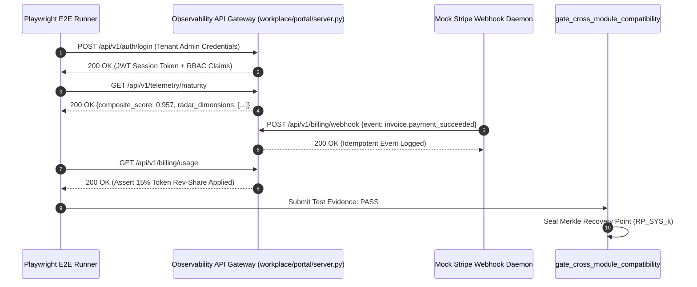
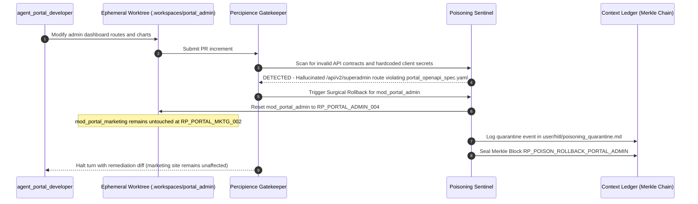

# Layerable Context Engineering Plan: Enterprise SaaS & Corporate Portal Space

### Executive Overview & Domain Grounding
This document is a **Layerable Domain-Specific Context Engineering Plan** designed to overlay onto the generic **Parent Master Context Engineering Framework** (`.nb/plan/claude-context-engineering-parent-master-plan.md`). While the parent framework governs universal poly-module lifecycle orchestration, cryptographic Merkle state verification, AST token compression, and autonomous CI/CD, this domain layer injects concrete wire contracts, specialized subagents, and web application runtimes required for:

1. **Modern Frontend & Corporate Web Systems**: React, Next.js (App Router), Astro, Tailwind CSS, TypeScript, and accessible UI component design systems conforming to WCAG 2.1 AA and Core Web Vitals (LCP < 2.5s, CLS < 0.1, INP < 200ms).
2. **Multi-Tenant SaaS Portals & Management Dashboards**: Dynamic role-based access control (RBAC), tenant data isolation, customer self-service billing portals, and real-time observability telemetry hubs (`user/outputs/dashboard/index.html`).
3. **Decoupled API Gateways & Webhook Handlers**: High-throughput REST and GraphQL gateways (`workplace/portal/server.py`), Stripe/Paddle billing webhooks, and JWT/OAuth2 session management.
4. **End-to-End Web Verification & Quality Harnesses**: Headless browser automation (Playwright/Puppeteer), Jest/Vitest component testing, and axe-core accessibility regression gates.

---

## 1. Domain-Specific Quad-Space Mapping

When layered onto the Parent Master Plan, the workspace instantiates domain-specialized structures across the four clean directories:

```
.
├── context/
│   ├── contracts/
│   │   ├── portal_openapi_spec.yaml         # REST/JSON API contract between frontend portal & backend services
│   │   ├── billing_webhook_contract.json    # Stripe/Paddle subscription event lifecycle schemas
│   │   └── rbac_permission_matrix.json     # Role-based access control & tenant boundary definitions
│   └── rules/
│       ├── web_performance_invariants.md    # Core Web Vitals (LCP/CLS/INP) and bundle size thresholds (< 150KB gzip)
│       └── wcag_accessibility_rules.md      # WCAG 2.1 AA color contrast, ARIA landmarks, keyboard navigation
├── agentic/
│   ├── custom/agents/
│   │   ├── portal_developer.yaml            # Subagent: React/Next.js/Tailwind frontend & UX specialist
│   │   └── saas_backend_developer.yaml      # Subagent: Python/Node.js microservices, billing & auth specialist
│   └── custom/workflows/
│       └── saas_portal_delivery_flow.yaml   # Orchestrates UI component build -> API gateway -> Playwright E2E
├── workplace/
│   ├── modules/
│   │   ├── mod_portal_marketing/            # Customer-Facing Corporate & Marketing Site (Next.js / Astro)
│   │   │   ├── config/                      # Tailwind theme tokens, next.config.js, SEO sitemaps
│   │   │   ├── src/                         # Landing pages, pricing tables, MDX blogs, lead forms
│   │   │   └── tests/                       # Component tests & Lighthouse CI performance fixtures
│   │   └── mod_portal_admin/                # Multi-Tenant Cloud SaaS Management Console
│   │       ├── config/                      # Route guards, telemetry refresh intervals, auth config
│   │       ├── src/                         # 5-tab observability dashboard, tenant settings, analytics
│   │       └── tests/                       # Playwright E2E authentication & permission test suites
│   ├── portal/
│   │   └── server.py                        # Standalone Python HTTP/API Gateway bridging dashboard & local daemon
│   └── shared/
│       ├── schemas/                         # Shared TypeScript interfaces and JSON schemas
│       └── styles/                          # Global CSS design tokens, utility classes, and font configurations
└── user/
    ├── inputs/
    │   ├── corp_site_mvs_spec.yaml          # Sitemap sketch, brand color hexes, typography, lead fields
    │   └── saas_portal_mvs_spec.yaml        # Tenant roles, dashboard widget metrics, billing tiers, API quotas
    ├── hitl/
    │   └── poisoning_quarantine.md          # Quarantined hallucinated UI routes or invalid CSS token payloads
    └── outputs/
        ├── dashboard/
        │   └── index.html                   # 5-tab zero-dependency interactive context observability portal
        ├── context_maturity_report.md       # Quantitative 6-dimensional scorecard including web performance
        └── token_savings_report.md          # FinOps token metering, AST compression ratio, 15% rev-share ledger
```

---

## 2. Wire Contracts & Safety Invariants (`context/contracts/`, `context/rules/`)

The domain layer establishes non-overridable wire contracts verified by the pre-commit gatekeeper:

### 2.1. `context/contracts/portal_openapi_spec.yaml`
```yaml
openapi: 3.1.0
info:
  title: "Enterprise SaaS Portal & Gateway API"
  version: "1.0.0"
paths:
  /api/v1/telemetry/maturity:
    get:
      summary: "Retrieve 6-dimensional context maturity score"
      responses:
        '200':
          content:
            application/json:
              schema:
                $ref: '#/components/schemas/MaturityScoreResponse'
  /api/v1/agents/plugins:
    get:
      summary: "List registered autonomous custom agents"
    post:
      summary: "Register new custom agent plugin"
  /api/v1/cicd/pipeline/run:
    post:
      summary: "Trigger autonomous self-sustaining CI/CD verification cycle"
```

### 2.2. `context/contracts/billing_webhook_contract.json`
Enforces idempotency and payload schema verification for customer subscription events (`customer.subscription.created`, `invoice.payment_succeeded`, `invoice.payment_failed`), ensuring zero double-charging or billing race conditions.

### 2.3. `context/rules/web_performance_invariants.md`
- **First Contentful Paint (FCP)**: $\le 1.2	ext{s}$
- **Largest Contentful Paint (LCP)**: $\le 2.5	ext{s}$
- **Cumulative Layout Shift (CLS)**: $\le 0.1$
- **Interaction to Next Paint (INP)**: $\le 200	ext{ms}$
- **Production JS Bundle Budget**: $\le 150	ext{KB}$ gzipped initial payload

---

## 3. Specialized Domain Subagents & Workflows (`agentic/custom/`)

### 3.1. `agentic/custom/agents/portal_developer.yaml`
```yaml
agent_id: "agent_portal_developer"
name: "SaaS Portal & Corporate Web Specialist"
version: "1.0.0"
category: "frontend_engineering"
model_tiering:
  active_tier: "Tier_A"
  tier_a_model: "claude-3-7-sonnet / pro"
  tier_b_model: "claude-3-5-haiku / flash"
system_prompt_ref: "agentic/prompts/portal_developer_prompt.md"
budget_limits:
  max_tokens_per_turn: 25000
  max_ast_pruned_tokens: 12000
permissions:
  allow_worktree_isolation: true
  allowed_module_paths:
    - "workplace/modules/mod_portal_marketing"
    - "workplace/modules/mod_portal_admin"
    - "user/outputs/dashboard"
enforced_invariants:
  - "Zero uncompressed context leaks (> 50% AST compression required)"
  - "Lighthouse Performance Score >= 90 / Accessibility Score >= 95"
  - "Strict responsive breakpoints (mobile, tablet, desktop) on all UI components"
```

### 3.2. `agentic/custom/agents/saas_backend_developer.yaml`
```yaml
agent_id: "agent_saas_backend_developer"
name: "SaaS Backend, Billing & Auth Specialist"
version: "1.0.0"
category: "backend_engineering"
model_tiering:
  active_tier: "Tier_A"
  tier_a_model: "claude-3-7-sonnet / pro"
  tier_b_model: "claude-3-5-haiku / flash"
budget_limits:
  max_tokens_per_turn: 30000
permissions:
  allow_worktree_isolation: true
  allowed_module_paths:
    - "workplace/modules/mod_billing_metering"
    - "workplace/portal"
    - "context/contracts"
```

---

## 4. Virtual Emulation & End-to-End Web Verification Bridge



---

## 5. Domain-Specific Surgical Rollback & Poisoning Defense

In a multi-module SaaS deployment with `mod_portal_marketing` and `mod_portal_admin`, context poisoning or invalid API contracts in one module do not destabilize the other:



---

## 6. Encrypted Packaging & Layer Consumption Workflow (`.nbpack`)

To protect proprietary SaaS design systems, prompt architectures, and pricing heuristics, this layerable plan can be compiled into an encrypted `.nbpack` binary envelope:

### 6.1. Compiling the Sealed Domain Bundle
```bash
./bin/percipience layer pack \
  --plan .nb/plan/claude-context-engineering-saas-portal-domain-plan.md \
  --output .nb/bundles/saas_portal_domain.nbpack \
  --include-spaces context/contracts,context/rules,agentic/custom
```

### 6.2. Consuming the Encrypted Bundle in Target Repository
```bash
# Hydrate and layer directly into secure RAM enclave without writing plaintext to disk
./bin/percipience layer apply \
  --pack .nb/bundles/saas_portal_domain.nbpack \
  --in-memory-only \
  --mode multi_module
```

When consumed:
1. The **Percipience Enclave Runtime** verifies the binary header `NBPACK_V2_SEALED` and SHA-256 signature.
2. Domain contracts and subagent prompt trees are mounted exclusively into volatile sandbox memory.
3. The master context ledger registers the layered domain with a newly sealed cryptographic Merkle block.

---

## 7. CLI Layering Commands & Verification Protocol

To apply this domain onto a repository and verify full end-to-end compatibility:

```bash
# 1. Initialize repository with multi-module SaaS configuration
./bin/percipience init --mode multi_module --parent-plan .nb/plan/claude-context-engineering-parent-master-plan.md

# 2. Apply the SaaS Portal domain layer
./bin/percipience layer apply --plan .nb/plan/claude-context-engineering-saas-portal-domain-plan.md

# 3. Register and integrate domain subagents into PR gatekeeper
./bin/percipience agent create --name portal_developer --template cicd_quality --role "SaaS Portal Specialist" --module "workplace/modules/mod_portal_admin"
./bin/percipience agent integrate --agent agent_portal_developer --workflow wf_pr_gatekeeper --after step_contract_compat

# 4. Launch local real-time telemetry API gateway & browser console
python3 workplace/portal/server.py --port 8080 &
open user/outputs/dashboard/index.html

# 5. Run full autonomous CI/CD verification cycle
./bin/percipience cicd run
```
