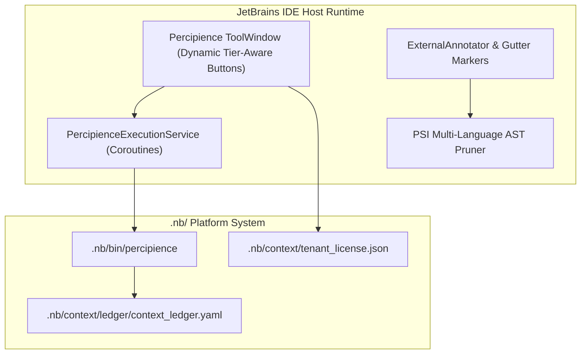

# Layerable Context Engineering Plan: IntelliJ IDEA & PyCharm Plugin Space (Concise Plan)

### Executive Overview & Domain Grounding

This document is a **Layerable Domain-Specific Context Engineering Plan** designed to overlay onto the generic **Parent Master Context Engineering Framework**. It injects concrete IDE integration patterns, JetBrains Platform SDK APIs, Program Structure Interface (PSI) tree analysis, ToolWindow orchestration, and dynamic tier-permission-aware Control Plane action button matrix required for:

1. **JetBrains Platform SDK & IntelliJ / PyCharm ToolWindow Control Plane**: Kotlin plugin with Gradle IntelliJ Platform tools, dockable JCEF living dashboard, dynamic tier-aware Control Plane panel, and background coroutine service.
2. **Dynamic Tier-Aware Action Matrix**: Real-time evaluation of `tenant_license.json` / `PERCIPIENCE_PLAN`, dynamically rendering Free (Gatekeeper/Audit/CI/CD), Team (+Worktrees/Agents/Drift), Business (+NBPack Layer Packaging/Gateway Provisioner), and Enterprise (+Swarm Triad/VPC/WORM Egress) action buttons.
3. **Program Structure Interface (PSI) Tree Analysis**: Multi-language AST symbol extraction (Python, Kotlin/Java, TypeScript) providing $60-85\%$ token reduction.
4. **In-Editor Annotators, Gutter Icons & Quick-Fix Intentions**: Real-time contract verification, line markers, and action triggers.
5. **Hermetic Threading & Read/Write Action Safety**: Strict EDT freedom ($<16\text{ms}$ latency) and background execution.



---

## 1. Domain-Specific Quad-Space Mapping

- `.nb/context/contracts/`: `intellij_plugin_manifest_contract.json`, `psi_ast_bridge_contract.yaml`, `daemon_rpc_contract.json`
- `.nb/context/rules/`: `jetbrains_platform_threading_rules.md`, `psi_read_lock_invariants.md`, `jcef_security_invariants.md`
- `.nb/agentic/custom/agents/`: `agent_jetbrains_plugin_architect.yaml`, `agent_psi_ast_bridge_specialist.yaml`, `agent_intellij_ui_ux_engineer.yaml`
- `workplace/modules/mod_intellij_plugin/`: Kotlin source code, Gradle build, dynamic tier Control Plane, and packaged offline assets.
- `user/outputs/`: Metrics, maturity report, and JCEF dashboard.

---

## 2. Dynamic Tier Action Matrix & CLI Governance

| Tier | Entitled Buttons & Features | Platform Tools Exposure |
| :--- | :--- | :--- |
| **Free Community** (`plan_free`) | 🚀 Bootstrap, 🚦 Gatekeeper, 🛡️ Merkle Audit, ▶ CI/CD, 🔍 Validate Layer, ⚡ Token Summary | Safe Gatekeeper Actions Only (Internal tools unexposed) |
| **Team Tier** (`plan_team`) | + 🌿 Worktrees, 🤖 Agent Registry, 🔄 Anti-Drift Check | Safe Gatekeeper Actions + Custom Agents |
| **Business Tier** (`plan_business`) | + 📦 Sealed NBPack Packaging, 🌐 Gateway Provisioner, 🧠 Cognitive Parity Report | Standard & Full Platform Tool APIs + Encrypted Packaging |
| **Enterprise Dedicated** (`plan_enterprise`) | + 🐝 Swarm Triad Orchestrator, 🔒 Private VPC Enclave, 📜 Immutable WORM Egress | Full Unrestricted Platform Tool APIs + Air-gapped VPC |

---

## 3. CLI, Multi-Tier Packaging & Layer Management

```bash
# Package standard universal layer bundle
./.nb/bin/percipience layer pack --plan .nb/plan/l1/intellij-pycharm-plugin/concise.md --output .nb/bundles/intellij_pycharm_plugin_domain.nbpack

# Package separate tier-specific plugin bundles for permission verification
python workplace/modules/mod_intellij_plugin/package_plugin.py --tier all

# Apply layer bundle
./.nb/bin/percipience layer apply --pack .nb/bundles/intellij_pycharm_plugin_domain.nbpack --in-memory-only
```
