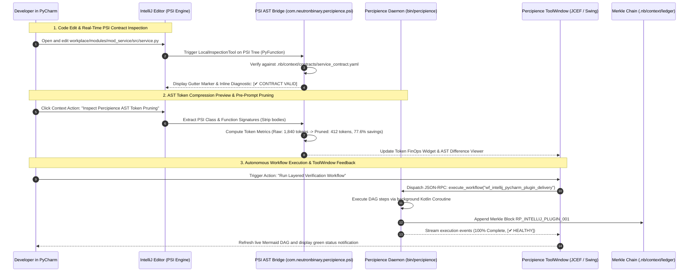
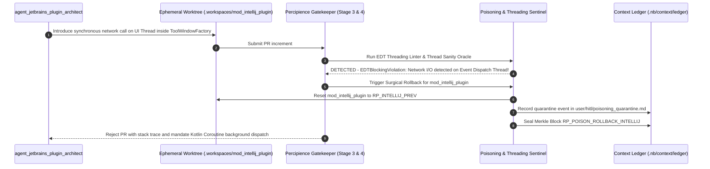

# Layerable Context Engineering Plan: IntelliJ IDEA & PyCharm Plugin Space — Detailed Implementation Guide

### Executive Overview & Domain Grounding

<!-- Plan Co-Location Notice -->
> **Co-Located Agent Specifications**: Agent definitions for this plan are stored along-with the plan in [`.nb/agentic/custom/agents/`](file:///Users/lakhwinder/PycharmProjects/nb_fairyfly/.nb/agentic/custom/agents/) and embedded directly in Section 3. In newly created projects where the `agentic/` directory does not yet exist, `./bin/percipience layer apply` automatically extracts and hydra-instantiates these files into `.nb/agentic/custom/agents/`.

This document is a **Layerable Domain-Specific Context Engineering Plan** designed to overlay onto the generic **Parent Master Context Engineering Framework** (`master/parent-master-plan/concise.md`). While the parent framework governs universal poly-module lifecycle orchestration, cryptographic Merkle state verification, AST token compression, and autonomous CI/CD, this domain layer injects concrete IDE integration patterns, JetBrains Platform SDK APIs, Program Structure Interface (PSI) tree analysis, and ToolWindow orchestration required for:

1. **JetBrains Platform SDK & IntelliJ / PyCharm ToolWindow Control Plane**:
   - Modern Kotlin-based plugin built with Gradle IntelliJ Plugin (`org.jetbrains.intellij.platform`).
   - Integrated dockable `ToolWindow` ("Percipience OS") offering live Merkle DAG chain visualization, workflow execution status, AST token FinOps meters, and living documentation viewer (JCEF / Java Chromium Embedded Framework).
   - Project-level background services (`ProjectService`) maintaining synchronized state with the local Percipience daemon via non-blocking Kotlin Coroutines (`Dispatchers.Default` and `Dispatchers.EDT`).

2. **Program Structure Interface (PSI) Tree Analysis & Real-Time AST Token Optimization**:
   - Deep PSI inspection for multi-language workspaces (Python via `PyFile`/`PyClass`/`PyFunction`, Kotlin/Java via `PsiClass`/`PsiMethod`, TypeScript/JavaScript).
   - Real-time token calculation engine diffing raw source vs. AST-pruned interfaces ($60-85\%$ token reduction).
   - Pre-prompt AST pruning inspection popup allowing developers to visually inspect and verify stripped function bodies before dispatching prompts to LLM agents.

3. **In-Editor Annotators, Gutter Icons & Quick-Fix Intentions**:
   - `ExternalAnnotator` and `LocalInspectionTool` verifying active wire contracts (`.nb/context/contracts/`) against calling code in real time.
   - Editor gutter icons highlighting active workflow steps, live Merkle recovery points, and verified test assertions.
   - Quick-fix intention actions (`Alt+Enter` / `Option+Return`) triggering automatic wire contract re-synchronization, AST living doc synthesis, and PR gate checks.

4. **Hermetic Threading & Read/Write Action Safety**:
   - Strict adherence to JetBrains Platform threading models (`ReadAction`, `WriteAction`, `ProgressIndicator`, `runBackgroundableTask`).
   - Non-blocking daemon communication over local UNIX domain sockets or IPC loopback bridges, avoiding UI freezes (EDT latency $< 16\text{ms}$).

---

## 1. Domain-Specific Quad-Space Mapping

```
.
├── .nb/context/
│   ├── contracts/
│   │   ├── intellij_plugin_manifest_contract.json # Plugin XML manifest, compatibility ranges (2024.1 - 2026.2+)
│   │   ├── psi_ast_bridge_contract.yaml           # PSI symbol extraction schema, token calculation interfaces
│   │   └── daemon_rpc_contract.json               # JSON-RPC 2.0 schema for IntelliJ <-> Percipience daemon IPC
│   └── rules/
│       ├── jetbrains_platform_threading_rules.md  # Non-blocking EDT, ReadAction/WriteAction and Coroutine rules
│       ├── psi_read_lock_invariants.md            # Smart mode checks, DumbService handling & PSI lifecycle
│       └── jcef_security_invariants.md            # Sandboxed JCEF webview CSP, local asset URI restrictions
├── .nb/agentic/
│   └── custom/
│       ├── agents/
│       │   ├── agent_jetbrains_plugin_architect.yaml # Domain Expert: JetBrains SDK, Gradle, PSI, ToolWindow UI
│       │   ├── agent_psi_ast_bridge_specialist.yaml   # Subagent: PSI visitor, AST compression & inspection annotator
│       │   └── agent_intellij_ui_ux_engineer.yaml     # Subagent: Swing/JCEF ToolWindow, gutter icons & quick-fixes
│       └── workflows/
│           └── intellij_pycharm_plugin_delivery_flow.yaml # Manifest -> PSI Engine -> ToolWindow -> Daemon Bridge -> Verifier
├── workplace/
│   ├── docs/
│   │   ├── intellij_pycharm_plugin_architecture.md           # System C4 component topologies & module interfaces (Mermaid)
│   │   ├── intellij_pycharm_plugin_sequence.md               # End-to-end execution sequence flows (Mermaid)
│   │   ├── intellij_pycharm_plugin_data_flow.md              # Topological data flow & contract exchange DAGs (Mermaid)
│   │   ├── intellij_pycharm_plugin_entity_relation.md        # Entity-relationship & state transition models (Mermaid)
│   │   └── intellij_pycharm_plugin_contracts_registry.md     # Machine-readable contract registry & artifact handoff matrix
│   ├── modules/
│   │   └── mod_intellij_plugin/
│   │       ├── build.gradle.kts                       # Gradle IntelliJ Platform plugin configuration
│   │       ├── src/main/kotlin/com/neutronbinary/percipience/
│   │       │   ├── services/                          # Project & Application level background services
│   │       │   ├── psi/                               # PSI symbol extractors, visitors & token calculators
│   │       │   ├── toolwindow/                        # Dockable ToolWindow factory, JCEF dashboard & tree views
│   │       │   ├── annotators/                        # Wire contract inspection annotators & line markers
│   │       │   └── actions/                           # Editor popup actions, quick-fixes & toolbar buttons
│   │       ├── src/main/resources/
│   │       │   ├── META-INF/plugin.xml                # Extension points, listeners, actions & plugin metadata
│   │       │   └── percipience/                       # Bundled offline Free Tier runtime assets
│   │       │       ├── bin/percipience                # Unified executable CLI entrypoint
│   │       │       ├── config/                        # Free tier billing & AST token rules
│   │       │       ├── core/                          # 38 essential platform core engines (.nb/core/*.py)
│   │       │       ├── plan/                          # Parent master free plan template
│   │       │       └── workflows/                     # Basic autonomous CI/CD workflow definition
│   │       └── src/test/kotlin/                       # LightPlatformTestCase & fixtures for PSI assertions
│   └── templates/bridge/
│       ├── mock_jetbrains_daemon.py                   # Loopback JSON-RPC server simulating IntelliJ actions
│       └── virtual_psi_fixture.py                     # Synthetic PSI tree generator for offline CI validation
└── user/
    ├── inputs/
    │   ├── intellij_plugin_config.yaml                # Target IDE versions (PyCharm, IDEA Ultimate, Community)
    │   └── ui_theme_tokens.json                       # Dark/Light theme colors, typography and icon definitions
    ├── hitl/
    │   └── poisoning_quarantine.md                    # Quarantined plugin bytecode or invalid PSI transformations
    └── outputs/
        ├── dashboard/
        │   └── index.html                             # JCEF rendered living dashboard & Merkle state viewer
        ├── intellij_plugin_metrics.json               # PSI parse throughput, EDT frame time, token savings
        └── context_maturity_report.md                 # 6-dimensional context scorecard with IDE plugin audit
```

---

## 2. Wire Contracts & Safety Invariants (`.nb/context/contracts/`, `.nb/context/rules/`)

### 2.1. IntelliJ Plugin Manifest Contract (`.nb/context/contracts/intellij_plugin_manifest_contract.json`)
```json
{
  "$schema": "http://json-schema.org/draft-07/schema#",
  "title": "IntelliJPluginManifestContract",
  "type": "object",
  "required": ["plugin_id", "plugin_name", "version", "since_build", "dependencies", "extension_points"],
  "properties": {
    "plugin_id": { "type": "string", "pattern": "^[a-z0-9.]+$", "example": "com.neutronbinary.percipience" },
    "plugin_name": { "type": "string", "example": "Percipience Context Engineering OS" },
    "version": { "type": "string", "pattern": "^[0-9]+\\.[0-9]+\\.[0-9]+$" },
    "since_build": { "type": "string", "example": "241.0" },
    "until_build": { "type": "string", "example": "262.*" },
    "dependencies": {
      "type": "array",
      "items": { "type": "string" },
      "uniqueItems": true
    },
    "extension_points": {
      "type": "object",
      "required": ["toolWindow", "externalAnnotator", "inspectionTool"],
      "properties": {
        "toolWindow": { "type": "string" },
        "externalAnnotator": { "type": "string" },
        "inspectionTool": { "type": "string" }
      }
    }
  }
}
```

### 2.2. PSI AST Bridge Contract (`.nb/context/contracts/psi_ast_bridge_contract.yaml`)
```yaml
schema_version: "2.0.0"
contract_id: "psi_ast_bridge_contract"
supported_languages:
  - id: "python"
    psi_root: "com.jetbrains.python.psi.PyFile"
    prunable_elements: ["PyFunction", "PyClass", "PyDocStringExpression"]
  - id: "kotlin"
    psi_root: "org.jetbrains.kotlin.psi.KtFile"
    prunable_elements: ["KtNamedFunction", "KtClass", "KtProperty"]
  - id: "java"
    psi_root: "com.intellij.psi.PsiJavaFile"
    prunable_elements: ["PsiMethod", "PsiClass"]
performance_targets:
  max_psi_traversal_ms: 35
  max_memory_per_file_kb: 512
  min_token_reduction_ratio: 0.60
```

### 2.3. JetBrains Platform Threading & PSI Invariants (`.nb/context/rules/jetbrains_platform_threading_rules.md`)
```markdown
# JetBrains Platform Threading & PSI Invariants

1. **Absolute Event Dispatch Thread (EDT) Freedom**:
   - Network requests, JSON-RPC IPC calls, and heavy AST token calculations MUST NEVER run on the EDT.
   - All external execution must use Kotlin Coroutines (`withContext(Dispatchers.Default)`) or `ProgressManager.getInstance().run(Task.Backgroundable)`.
   - UI updates to ToolWindows and editor popups MUST be dispatched via `Dispatchers.EDT` or `ApplicationManager.getApplication().invokeLater()`.

2. **Read/Write Lock Synchronization**:
   - All PSI tree reads must occur inside a read action (`runReadAction`).
   - All modifications to documents or workspace files must execute inside a write action (`runWriteAction`) within a Command (`CommandProcessor.getInstance().executeCommand()`).
   - If the IDE is in "Dumb Mode" (indexing), PSI resolution features must either defer execution via `DumbService.getInstance(project).runWhenSmart()` or display informative placeholder badges.

3. **JCEF Webview Security Constraints**:
   - Java Chromium Embedded Framework (JCEF) browser instances hosting the Percipience Dashboard must enforce strict Content-Security-Policy (CSP) with `script-src 'self'`.
   - Communication between JCEF JavaScript and the Kotlin plugin layer must use asynchronous query handlers (`CefMessageRouterHandlerAdapter`) with verified request nonce validation.
```

---

## 3. Specialized Domain Subagents & Workflows (`.nb/agentic/custom/`)

### 3.1. `.nb/agentic/custom/agents/agent_jetbrains_plugin_architect.yaml`
- **Role**: JetBrains Platform SDK, Gradle IntelliJ Plugin, PSI Navigation & ToolWindow Architecture Auditor
- **Model Tier**: `Tier_A` (`claude-3-7-sonnet / pro`, `gemini-2.0-pro`, `gpt-4o`)
- **Sandboxed Worktree**: `.workspaces/wt_jetbrains_arch_01`
- **Module Scope**: `workplace/modules/mod_intellij_plugin/`

### 3.2. `.nb/agentic/custom/agents/agent_psi_ast_bridge_specialist.yaml`
- **Role**: PSI Visitor, AST Token Compression & Wire Contract Inspection Annotator
- **Model Tier**: `Tier_B` (`claude-3-5-haiku / flash`, `gemini-2.0-flash`, `gpt-4o-mini`)
- **Sandboxed Worktree**: `.workspaces/wt_psi_bridge_01`
- **Module Scope**: `workplace/modules/mod_intellij_plugin/src/main/kotlin/com/neutronbinary/percipience/psi/`

### 3.3. `.nb/agentic/custom/agents/agent_intellij_ui_ux_engineer.yaml`
- **Role**: Swing/JCEF ToolWindow, Gutter LineMarkers, Context Actions & Quick-Fixes
- **Model Tier**: `Tier_A` (`claude-3-7-sonnet / pro`, `gemini-2.0-pro`, `gpt-4o`)
- **Sandboxed Worktree**: `.workspaces/wt_intellij_ui_01`
- **Module Scope**: `workplace/modules/mod_intellij_plugin/src/main/kotlin/com/neutronbinary/percipience/toolwindow/`

---

## 4. Virtual End-to-End Emulation Bridge



---

## 5. Domain-Specific Surgical Rollback & Poisoning Defense



---

## 6. Encrypted Packaging & Layer Consumption Workflow (`.nbpack`)

### 6.1. Compiling the Sealed Domain Bundle
```bash
./bin/percipience layer pack \
  --plan .nb/plan/l1/intellij-pycharm-plugin/concise.md \
  --output .nb/bundles/intellij_pycharm_plugin_domain.nbpack \
  --include-spaces .nb/context/contracts,.nb/context/rules,.nb/agentic/custom
```

### 6.2. Consuming the Encrypted Bundle in Target Repository
```bash
./bin/percipience layer apply \
  --pack .nb/bundles/intellij_pycharm_plugin_domain.nbpack \
  --in-memory-only \
  --mode multi_module
```

### 6.3. Bundled Free Tier Platform Core Assets & Autonomous Bootstrapping
The IntelliJ/PyCharm plugin ZIP distribution (`.nb/bundles/percipience-intellij-plugin-1.0.0.zip`) packages the entire offline platform engine within the plugin JAR (`percipience/core/` containing all 38 Python modules + `__init__.py`). When initialized via `BootstrapWorkspaceAction` or the interactive startup prompt (`PercipienceProjectStartupActivity`), `WorkspaceBootstrapper.kt` extracts:
1. `percipience/bin/percipience` with Unix `0755` executable permissions.
2. `percipience/core/*.py` into `.nb/core/` (AST optimizer, Merkle engine, CI/CD, token tracker, etc.).
3. `percipience/config/` (`billing_plans.yaml`, `token_compression_rules.yaml`).
4. `percipience/workflows/` (`basic_autonomous_cicd.yaml`).
5. `percipience/plan/` (`claude-context-engineering-parent-master-free_plan.md`).
6. Genesis Merkle state ledger (`.nb/context/ledger/context_ledger.yaml`).
