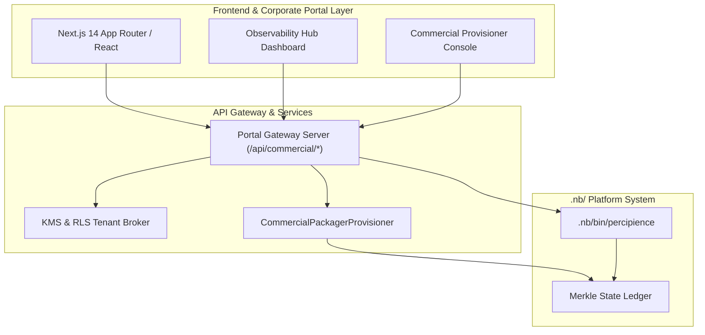

# Layerable Context Engineering Plan: Enterprise SaaS & Corporate Portal Space (Concise Plan)

### Executive Overview & Domain Grounding

This document is a **Layerable Domain-Specific Context Engineering Plan** designed to overlay onto the generic **Parent Master Context Engineering Framework**. It injects web frontend systems, SaaS customer portals, billing gateways, commercial package provisioners, and real-time observability telemetry dashboards:

1. **Modern Frontend & Corporate Web Systems**: Next.js 14 App Router, dynamic MDX documentation, and Core Web Vitals ($< 1.2\text{s}$ LCP).
2. **Multi-Tenant SaaS Portals & Access Control**: PostgreSQL Row-Level Security (RLS), tenant isolation, and CMEK key brokerage.
3. **Commercial Package Provisioner & Licensing**: Automated tier packaging (`CommercialPackagerProvisioner`), cryptographic Ed25519 license minting, and cross-IDE/SaaS provisioning.
4. **Decoupled API Gateways & Billing Handlers**: Stripe billing webhooks and automated 15% token savings revenue-share calculation.
5. **Observability Hub Dashboard**: Live WebSocket and REST telemetry feed (`user/outputs/dashboard/index.html`) with interactive commercial provisioner console.



---

## 1. Domain-Specific Quad-Space Mapping

- `.nb/context/contracts/`: `onboarding_contract.yaml`, `billing_meter_contract.yaml`, `commercial_provisioning_contract.yaml`, `observability_contract.yaml`
- `.nb/context/rules/`: `web_accessibility_rules.md`, `tenant_isolation_invariants.md`, `commercial_tier_permissioning_rules.md`
- `.nb/agentic/custom/agents/`: `agent_saas_portal_architect.yaml`, `agent_commercial_packager_provisioner.yaml`, `agent_billing_integration_engineer.yaml`, `agent_observability_frontend_specialist.yaml`
- `.nb/agentic/custom/workflows/`: `saas_portal_delivery_flow.yaml`, `commercial_packaging_provisioning_flow.yaml`
- `.nb/core/`: `commercial_packager_provisioner.py`
- `workplace/modules/`: `mod_corp_site/`, `mod_saas_portal/`, `mod_billing_engine/`, `mod_api_gateway/`
- `user/outputs/`: Maturity reports, commercial bundle packages, and live dashboard feeds.

---

## 2. CLI & Layer Management

```bash
# Package layer bundle
./.nb/bin/percipience layer pack --plan .nb/plan/l1/saas-portal-domain/concise.md --output .nb/bundles/saas_portal_domain.nbpack

# Apply layer bundle
./.nb/bin/percipience layer apply --pack .nb/bundles/saas_portal_domain.nbpack --in-memory-only

# Commercial packaging & provisioning
./.nb/bin/percipience commercial package --tier enterprise --tenant tenant_acme_fintech
./.nb/bin/percipience commercial provision --tenant tenant_acme_fintech --tier enterprise --target all
```
