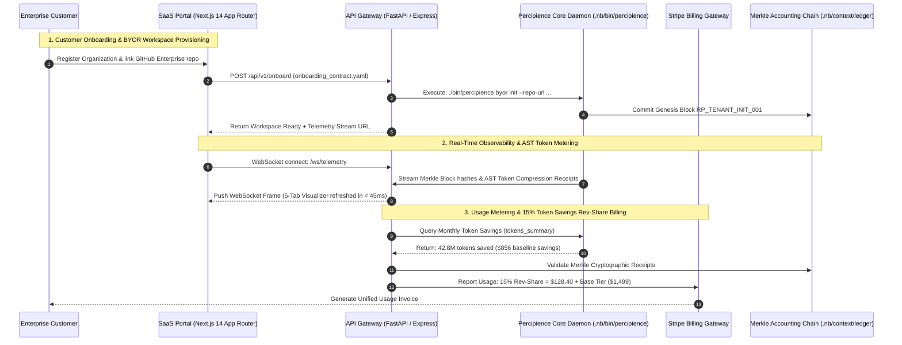
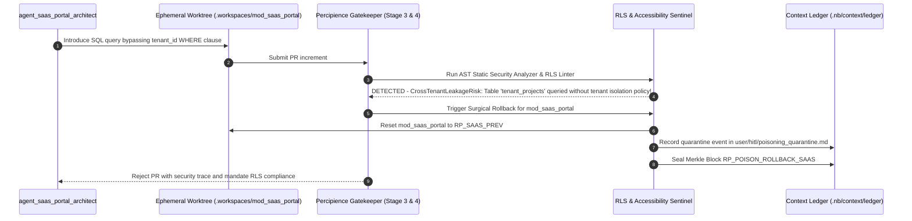

# Layerable Context Engineering Plan: Enterprise SaaS & Corporate Portal Space — Detailed Implementation Guide

### Executive Overview & Domain Grounding

<!-- Plan Co-Location Notice -->
> **Co-Located Agent Specifications**: Agent definitions for this plan are stored along-with the plan in [`.nb/agentic/custom/agents/`](file:///Users/lakhwinder/PycharmProjects/nb_fairyfly/.nb/agentic/custom/agents/) and embedded directly in Section 3. In newly created projects where the `agentic/` directory does not yet exist, `./bin/percipience layer apply` automatically extracts and hydra-instantiates these files into `.nb/agentic/custom/agents/`.

This document is a **Layerable Domain-Specific Context Engineering Plan** designed to overlay onto the generic **Parent Master Context Engineering Framework** (`master/parent-master-plan/concise.md`). While the parent framework governs universal poly-module lifecycle orchestration, cryptographic Merkle state verification, AST token compression, and autonomous CI/CD, this domain layer injects web frontend systems, SaaS customer portals, billing gateways, and real-time observability telemetry dashboards:

1. **Modern Frontend & Corporate Web Systems**:
   - Modern Jamstack / SSR frontend architectures (Next.js 14 App Router, React Server Components, Astro, Tailwind CSS).
   - Strict performance and accessibility standards: Core Web Vitals ($< 1.2\text{s}$ LCP, $0.00$ CLS), WCAG 2.1 AA compliance, and responsive multi-device layouts.
   - Dynamic MDX documentation engines rendering interactive Mermaid sequence diagrams, living architectural DAGs, and interactive AST token ROI calculators.

2. **Multi-Tenant SaaS Portals & Access Control**:
   - Secure customer onboarding and workspace management with fine-grained RBAC (Role-Based Access Control) and OAuth2 / OIDC authentication flows.
   - Multi-tenant data partitioning, tenant-isolated workspace contexts, and zero-leakage security boundaries.
   - Self-serve project registration, Bring Your Own Repository (BYOR) Git integrations, and customer-managed encryption key (CMEK) brokerage.

3. **Decoupled API Gateways & Billing Handlers**:
   - High-throughput API gateway layer (FastAPI / Node.js Express / Go Gin) bridging external user clients to internal `.nb/` platform orchestration engines.
   - Stripe / Paddle usage-based metering, subscription lifecycle webhooks, and the automated 15% token savings revenue-share calculation backed by the SHA-256 Merkle accounting ledger.

4. **Observability Hub Dashboard & Telemetry Feeds**:
   - Single-Pane-of-Glass living visualizer (`user/outputs/dashboard/index.html`) featuring 5 dedicated tabs:
     1. Executive Overview & System Topology
     2. Context Attention & Token FinOps Meters
     3. Merkle DAG Block Explorer & Time-Travel Debugger
     4. Real-Time Swarm Worktree Status & CI/CD Telemetry
     5. Context Maturity Scorecard (6D Radar Chart)
   - Real-time WebSocket event bus streaming live subagent actions, AST file modifications, and PR Gatekeeper evaluations.

---

## 1. Domain-Specific Quad-Space Mapping

```
.
├── .nb/context/
│   ├── contracts/
│   │   ├── onboarding_contract.yaml        # Tenant onboarding, BYOR repo link & CMEK schema
│   │   ├── billing_meter_contract.yaml     # Usage-based metering & 15% rev-share calculation schema
│   │   └── observability_contract.yaml     # Real-time WebSocket telemetry event schema
│   └── rules/
│       ├── web_accessibility_rules.md      # WCAG 2.1 AA, Lighthouse performance (>95) & SEO invariants
│       └── tenant_isolation_invariants.md  # Multi-tenant data segregation, RLS & workspace isolation
├── .nb/agentic/
│   └── custom/
│       ├── agents/
│       │   ├── agent_saas_portal_architect.yaml       # Domain Expert: Next.js, API Gateway, RBAC, Multi-tenancy
│       │   ├── agent_billing_integration_engineer.yaml # Subagent: Stripe/Paddle, Webhooks & Metering Ledger
│       │   └── agent_observability_frontend_specialist.yaml # Subagent: Tailwind, Dashboard UI, WebSocket Visualizer
│       └── workflows/
│           └── saas_portal_delivery_flow.yaml          # Onboarding -> Billing -> UI Dashboard -> Gateway -> Verifier
├── workplace/
│   ├── docs/
│   │   ├── saas_portal_architecture.md            # System C4 component topologies & module interfaces (Mermaid)
│   │   ├── saas_portal_sequence.md                # End-to-end execution sequence flows (Mermaid)
│   │   ├── saas_portal_data_flow.md               # Topological data flow & contract exchange DAGs (Mermaid)
│   │   ├── saas_portal_entity_relation.md         # Entity-relationship & state transition models (Mermaid)
│   │   └── saas_portal_contracts_registry.md      # Machine-readable contract registry & artifact handoff matrix
│   └── modules/
│       ├── mod_corp_site/                         # Public marketing site, MDX docs, AST ROI calculator
│       ├── mod_saas_portal/                       # Tenant customer portal, RBAC, workspace management
│       ├── mod_billing_engine/                    # Stripe webhook consumers, usage metering & rev-share logic
│       └── mod_api_gateway/                       # Unified REST & WebSocket telemetry gateway
└── user/
    ├── inputs/
    │   ├── tenant_onboarding_config.yaml          # Tenant identity, Git provider credentials, billing plan tier
    │   └── branding_tokens.json                   # Theme colors, typography, logos and navigation schemas
    ├── hitl/
    │   └── poisoning_quarantine.md                # Quarantined frontend bundles or corrupted tenant records
    └── outputs/
        ├── dashboard/
        │   └── index.html                         # Unified 5-Tab Observability Hub Dashboard
        ├── telemetry_feed.json                    # Real-time telemetry snapshot for dashboard consumption
        └── context_maturity_report.md             # 6-dimensional context scorecard with SaaS audit
```

---

## 2. Wire Contracts & Safety Invariants (`.nb/context/contracts/`, `.nb/context/rules/`)

### 2.1. Tenant Onboarding Contract (`.nb/context/contracts/onboarding_contract.yaml`)
```yaml
schema_version: "2.0.0"
contract_id: "tenant_onboarding_contract"
required_fields:
  - tenant_id
  - organization_name
  - billing_tier
  - byor_vcs_provider
  - admin_email
properties:
  tenant_id: { type: "string", format: "uuid" }
  organization_name: { type: "string", minLength: 2, maxLength: 100 }
  billing_tier: { type: "string", enum: ["free", "team", "business", "enterprise"] }
  byor_vcs_provider: { type: "string", enum: ["github_enterprise", "gitlab_self_managed", "bitbucket_dc"] }
  cmek_key_arn: { type: "string", nullable: true }
```

### 2.2. Billing Metering & Rev-Share Contract (`.nb/context/contracts/billing_meter_contract.yaml`)
```yaml
schema_version: "2.0.0"
contract_id: "billing_meter_contract"
calculation_formula: "monthly_charge = base_tier_price + (net_tokens_saved * token_rate * 0.15)"
required_fields:
  - invoice_period_id
  - tenant_id
  - base_fee_cents
  - gross_tokens_consumed
  - raw_baseline_tokens
  - net_tokens_saved
  - rev_share_fee_cents
  - merkle_receipt_hash
```

### 2.3. Web Accessibility & Performance Invariants (`.nb/context/rules/web_accessibility_rules.md`)
```markdown
# Web Accessibility & Performance Invariants

1. **Lighthouse Core Web Vitals Mandate**:
   - Largest Contentful Paint (LCP) MUST be under 1.2 seconds on standard mobile and desktop test profiles.
   - Cumulative Layout Shift (CLS) MUST NOT exceed 0.01 across any viewport size.
   - First Input Delay (FID) / Interaction to Next Paint (INP) MUST remain below 50ms.

2. **WCAG 2.1 AA Compliance Invariant**:
   - All interactive components, buttons, and form controls must provide accessible ARIA attributes (`aria-label`, `role`, `aria-expanded`).
   - Color contrast ratio for body text must meet or exceed 4.5:1 against the background theme.

3. **Tenant Data Isolation Invariant**:
   - No SQL query, GraphQL resolver, or REST endpoint may return data belonging to a different `tenant_id`.
   - PostgreSQL Row-Level Security (RLS) policies MUST be enforced on all tenant-facing database tables.
```

---

## 3. Specialized Domain Subagents & Workflows (`.nb/agentic/custom/`)

### 3.1. `.nb/agentic/custom/agents/agent_saas_portal_architect.yaml`
- **Role**: Next.js App Router, Gateway Architecture, RBAC & Multi-Tenant Security Auditor
- **Model Tier**: `Tier_A` (`claude-3-7-sonnet / pro`, `gemini-2.0-pro`, `gpt-4o`)
- **Sandboxed Worktree**: `.workspaces/wt_saas_arch_01`
- **Module Scope**: `workplace/modules/mod_saas_portal/`, `workplace/modules/mod_api_gateway/`

### 3.2. `.nb/agentic/custom/agents/agent_billing_integration_engineer.yaml`
- **Role**: Stripe/Paddle Subscriptions, Usage-Based Metering & Rev-Share Ledger Engineer
- **Model Tier**: `Tier_B` (`claude-3-5-haiku / flash`, `gemini-2.0-flash`, `gpt-4o-mini`)
- **Sandboxed Worktree**: `.workspaces/wt_billing_01`
- **Module Scope**: `workplace/modules/mod_billing_engine/`

### 3.3. `.nb/agentic/custom/agents/agent_observability_frontend_specialist.yaml`
- **Role**: Tailwind CSS, 5-Tab Observability Hub UI & Real-Time WebSocket Telemetry Specialist
- **Model Tier**: `Tier_A` (`claude-3-7-sonnet / pro`, `gemini-2.0-pro`, `gpt-4o`)
- **Sandboxed Worktree**: `.workspaces/wt_observability_01`
- **Module Scope**: `workplace/modules/mod_corp_site/`, `user/outputs/dashboard/`

---

## 4. Virtual End-to-End Emulation Bridge



---

## 5. Domain-Specific Surgical Rollback & Poisoning Defense



---

## 6. Encrypted Packaging & Layer Consumption Workflow (`.nbpack`)

### 6.1. Compiling the Sealed Domain Bundle
```bash
./bin/percipience layer pack \
  --plan .nb/plan/l1/saas-portal-domain/concise.md \
  --output .nb/bundles/saas_portal_domain.nbpack \
  --include-spaces .nb/context/contracts,.nb/context/rules,.nb/agentic/custom
```

### 6.2. Consuming the Encrypted Bundle in Target Repository
```bash
./bin/percipience layer apply \
  --pack .nb/bundles/saas_portal_domain.nbpack \
  --in-memory-only \
  --mode multi_module
```
