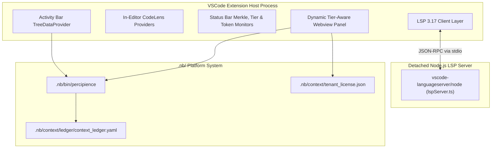

# Layerable Context Engineering Plan: Visual Studio Code Extension Space (Concise Plan)

### Executive Overview & Domain Grounding

This document is a **Layerable Domain-Specific Context Engineering Plan** designed to overlay onto the generic **Parent Master Context Engineering Framework**. It injects concrete IDE integration patterns, VSCode Extension API protocols, Language Server Protocol (LSP 3.17) implementations, Webview UI orchestration, and dynamic tier-permission-aware Control Plane button governance required for:

1. **VSCode Extension API & Dynamic Tier-Aware VSIX Packaging**: TypeScript extension built with `esbuild`, Activity Bar tree views (`agentTreeProvider.ts`, `workflowTreeProvider.ts`), dynamic tier-aware Control Plane Webview, and status bar telemetry (`statusBarManager.ts`).
2. **Dynamic Tier Action Matrix**: Real-time evaluation of `tenant_license.json` / `PERCIPIENCE_PLAN`, dynamically rendering Free (Gatekeeper/Audit/CI/CD), Team (+Worktrees/Agents/Drift), Business (+NBPack Layer Packaging/Gateway Provisioner), and Enterprise (+Swarm Triad/VPC/WORM Egress) action buttons, synced with IntelliJ.
3. **Language Server Protocol (LSP 3.17) Client-Server Subsystem**: Detached Node.js language server (`lspServer.ts`, `lspClient.ts`) with in-editor CodeLens triggers (`codeLensProvider.ts`), contract validation, and real-time diagnostic annotators (`diagnosticProvider.ts`).
4. **Secure Webview Panel & Interactive Visualizer**: Nonce-based CSP protected visualizer (`dashboardPanel.ts`) matching active VSCode themes.



---

## 1. Domain-Specific Quad-Space Mapping

- `.nb/context/contracts/`: `package_json_manifest_contract.json`, `lsp_protocol_contract.yaml`, `webview_message_rpc_contract.json`
- `.nb/context/rules/`: `webview_security_invariants.md`, `vscode_activation_invariants.md`, `secret_storage_rules.md`
- `.nb/agentic/custom/agents/`: `agent_vscode_extension_architect.yaml`, `agent_lsp_language_features_specialist.yaml`, `agent_vscode_webview_ux_engineer.yaml`
- `workplace/modules/mod_vscode_extension/`: TypeScript extension, language server, dynamic Webview dashboard, and multi-tier VSIX bundles.
- `user/outputs/`: Status telemetry and Webview dashboard feeds.

---

## 2. Dynamic Tier Action Matrix & CLI Governance

| Tier | Entitled Buttons & Features | Platform Tools Exposure |
| :--- | :--- | :--- |
| **Free Community** (`plan_free`) | 🚀 Bootstrap, 🚦 Gatekeeper, 🛡️ Merkle Audit, ▶ CI/CD, 🔍 Validate Layer, ⚡ Token Summary | Safe Gatekeeper Actions Only (Internal tools unexposed) |
| **Team Tier** (`plan_team`) | + 🌿 Worktrees, 🤖 Agent Registry, 🔄 Anti-Drift Check | Safe Gatekeeper Actions + Custom Agents |
| **Business Tier** (`plan_business`) | + 📦 Sealed NBPack Packaging, 🌐 Gateway Provisioner, 🧠 Cognitive Parity Report | Standard & Full Platform Tool APIs + Encrypted Packaging |
| **Enterprise Dedicated** (`plan_enterprise`) | + 🐝 Swarm Triad Orchestrator, 🔒 Private VPC Enclave, 📜 Immutable WORM Egress | Full Unrestricted Platform Tool APIs + Air-gapped VPC |

---

## 3. CLI, Multi-Tier Packaging & Layer Management

```bash
# Package standard universal layer bundle
./.nb/bin/percipience layer pack --plan .nb/plan/l1/vscode-plugin/concise.md --output .nb/bundles/vscode_plugin_domain.nbpack

# Package separate tier-specific VSIX extension bundles for permission verification
python workplace/modules/mod_vscode_extension/package_extension.py --tier all

# Apply layer bundle
./.nb/bin/percipience layer apply --pack .nb/bundles/vscode_plugin_domain.nbpack --in-memory-only
```
