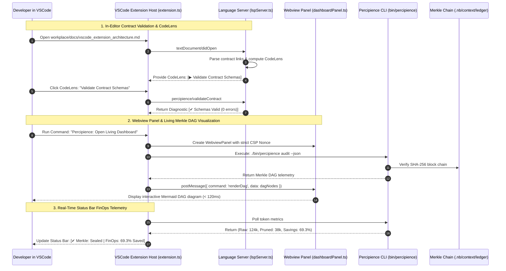
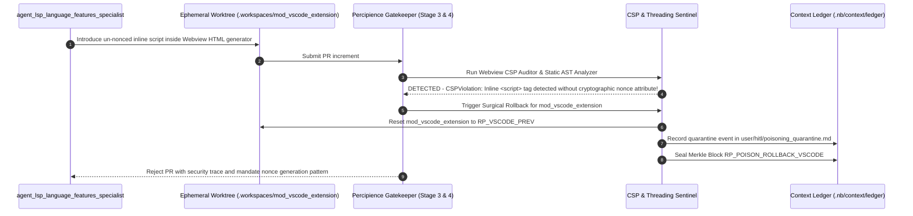

# Layerable Context Engineering Plan: Visual Studio Code Extension Space — Detailed Implementation Guide

### Executive Overview & Domain Grounding

<!-- Plan Co-Location Notice -->
> **Co-Located Agent Specifications**: Agent definitions for this plan are stored along-with the plan in [`.nb/agentic/custom/agents/`](file:///Users/lakhwinder/PycharmProjects/nb_fairyfly/.nb/agentic/custom/agents/) and embedded directly in Section 3. In newly created projects where the `agentic/` directory does not yet exist, `./bin/percipience layer apply` automatically extracts and hydra-instantiates these files into `.nb/agentic/custom/agents/`.

This document is a **Layerable Domain-Specific Context Engineering Plan** designed to overlay onto the generic **Parent Master Context Engineering Framework** (`master/parent-master-plan/concise.md`). While the parent framework governs universal poly-module lifecycle orchestration, cryptographic Merkle state verification, AST token compression, and autonomous CI/CD, this domain layer injects concrete IDE integration patterns, VSCode Extension API protocols, Language Server Protocol (LSP 3.17) implementations, and Webview UI orchestration required for:

1. **VSCode Extension API & VSIX Packaging Architecture**:
   - Modern TypeScript extension built with `esbuild` and packaged via `@vscode/vsce`.
   - Custom Activity Bar container with collapsible `TreeDataProvider` views for Workflows (`workflowTreeProvider.ts`), Agent Registry (`agentTreeProvider.ts`), Wire Contracts, and Merkle Snapshots with live status badges.
   - Status bar items (`statusBarManager.ts`) indicating real-time Merkle chain continuity (`[✔ Merkle: Sealed]`) and real-time token FinOps savings.

2. **Language Server Protocol (LSP 3.17) Client-Server Subsystem**:
   - Dedicated Language Server running in a detached Node.js process via `vscode-languageclient/node` (`lspClient.ts`) and `vscode-languageserver/node` (`lspServer.ts`).
   - In-editor CodeLens triggers (`codeLensProvider.ts`) on wire contracts (`.nb/context/contracts/`) and workflow steps (`.nb/agentic/custom/workflows/`), allowing one-click execution.
   - Real-time diagnostic annotators (`diagnosticProvider.ts`) highlighting schema validation errors, breaking contract changes, or unanchored dependencies directly on editor lines.
   - Hover and auto-completion providers for agent references, recovery points, and rule invariants.

3. **Secure Webview Panel & Interactive Visualizer**:
   - Isolated Webview panels (`dashboardPanel.ts`) rendering live Merkle DAG block chains, interactive Mermaid diagrams, and living documentation.
   - Strict Content-Security-Policy (CSP) enforcement using nonce-based script injection and `webview.asWebviewUri()`.
   - UI consistency with the user's active VSCode theme (Light, Dark, High Contrast) via `@vscode/webview-ui-toolkit` and native CSS variables (`var(--vscode-editor-background)`).

4. **Non-Blocking IPC & Extension Host Performance**:
   - Clean separation of concerns between UI extension host and LSP background worker threads.
   - Fast JSON-RPC IPC over local socket streams or named pipes, keeping extension host latency $< 12\text{ms}$.

---

## 1. Domain-Specific Quad-Space Mapping

```
.
├── .nb/context/
│   ├── contracts/
│   │   ├── package_json_manifest_contract.json  # package.json contributes schema, activationEvents, commands
│   │   ├── lsp_protocol_contract.yaml           # Custom JSON-RPC methods between VSCode client and language server
│   │   └── webview_message_rpc_contract.json    # JSON-RPC contract for Webview <-> Extension Host postMessage
│   └── rules/
│       ├── webview_security_invariants.md       # Nonce generation, script-src 'nonce-*', localResourceRoots rules
│       ├── vscode_activation_invariants.md       # Lazy activation, onStartupFinished, and memory constraints
│       └── secret_storage_rules.md              # VSCode SecretStorage API for API keys and tokens
├── .nb/agentic/
│   └── custom/
│       ├── agents/
│       │   ├── agent_vscode_extension_architect.yaml      # Domain Expert: VSCode API, TypeScript, esbuild, vsce
│       │   ├── agent_lsp_language_features_specialist.yaml # Subagent: LSP 3.17, JSON-RPC, CodeLens & Diagnostics
│       │   └── agent_vscode_webview_ux_engineer.yaml       # Subagent: Webview panels, Mermaid renderer, Toolkit
│       └── workflows/
│           └── vscode_plugin_delivery_flow.yaml           # Manifest -> LSP -> Webview -> Packaging -> Verifier
├── workplace/
│   ├── docs/
│   │   ├── vscode_extension_architecture.md           # System C4 component topologies & module interfaces (Mermaid)
│   │   ├── vscode_extension_sequence.md               # End-to-end execution sequence flows (Mermaid)
│   │   ├── vscode_extension_data_flow.md              # Topological data flow & contract exchange DAGs (Mermaid)
│   │   ├── vscode_extension_entity_relation.md        # Entity-relationship & state transition models (Mermaid)
│   │   └── vscode_extension_contracts_registry.md     # Machine-readable contract registry & artifact handoff matrix
│   ├── modules/
│   │   └── mod_vscode_extension/
│   │       ├── package.json                           # VSCode extension manifest & configuration
│   │       ├── tsconfig.json                          # TypeScript compiler options
│   │       ├── esbuild.js                             # Multi-target bundle script (extension + server)
│   │       ├── src/
│   │       │   ├── extension.ts                       # Extension entrypoint, commands, views & status bar
│   │       │   ├── lsp/
│   │       │   │   ├── lspClient.ts                   # LanguageClient initialization and lifecycle
│   │       │   │   └── lspServer.ts                   # LanguageServer connection and JSON-RPC dispatch
│   │       │   ├── providers/
│   │       │   │   ├── agentTreeProvider.ts           # TreeDataProvider for Agent Registry
│   │       │   │   ├── workflowTreeProvider.ts        # TreeDataProvider for Workflows & DAGs
│   │       │   │   ├── codeLensProvider.ts            # In-editor CodeLens triggers for contracts
│   │       │   │   └── diagnosticProvider.ts          # YAML/JSON schema validation diagnostics
│   │       │   ├── statusbar/
│   │       │   │   └── statusBarManager.ts            # Status bar item controllers (Merkle & Token FinOps)
│   │       │   └── webview/
│   │       │       └── dashboardPanel.ts              # WebviewPanel provider, CSP nonce generator & RPC handlers
│   │       └── test/                                  # Suite of vscode-test and mocha verification suites
│   └── templates/bridge/
│       ├── mock_vscode_ipc_host.py                    # IPC emulator simulating VSCode Extension Host RPC calls
│       └── virtual_lsp_fixture.py                     # Synthetic LSP client fixture for headless CI verification
└── user/
    ├── inputs/
    │   ├── vscode_extension_config.yaml               # Target VSCode engine ranges (^1.85.0 - ^1.99.0)
    │   └── webview_theme_tokens.json                  # Theme styling tokens for custom webview components
    ├── hitl/
    │   └── poisoning_quarantine.md                    # Quarantined extension bundles or broken LSP schemas
    └── outputs/
        ├── dashboard/
        │   └── index.html                             # Webview rendered living dashboard & Merkle state viewer
        ├── vscode_extension_metrics.json              # LSP request latency, memory usage & VSIX bundle size
        └── context_maturity_report.md                 # 6-dimensional context scorecard with VSCode audit
```

---

## 2. Wire Contracts & Safety Invariants (`.nb/context/contracts/`, `.nb/context/rules/`)

### 2.1. VSCode Package Manifest Contract (`.nb/context/contracts/package_json_manifest_contract.json`)
```json
{
  "$schema": "http://json-schema.org/draft-07/schema#",
  "title": "VSCodePackageManifestContract",
  "type": "object",
  "required": ["name", "displayName", "version", "publisher", "engines", "categories", "contributes"],
  "properties": {
    "name": { "type": "string", "pattern": "^[a-z0-9-]+$", "example": "percipience-vscode" },
    "displayName": { "type": "string", "example": "Percipience Context Engineering OS" },
    "version": { "type": "string", "pattern": "^[0-9]+\\.[0-9]+\\.[0-9]+$" },
    "publisher": { "type": "string", "example": "neutronbinary" },
    "engines": {
      "type": "object",
      "required": ["vscode"],
      "properties": {
        "vscode": { "type": "string", "example": "^1.85.0" }
      }
    },
    "contributes": {
      "type": "object",
      "required": ["viewsContainers", "views", "commands", "menus"],
      "properties": {
        "viewsContainers": { "type": "object" },
        "views": { "type": "object" },
        "commands": { "type": "array" },
        "menus": { "type": "object" }
      }
    }
  }
}
```

### 2.2. LSP Protocol Contract (`.nb/context/contracts/lsp_protocol_contract.yaml`)
```yaml
schema_version: "2.0.0"
contract_id: "lsp_protocol_contract"
protocol_version: "3.17"
custom_methods:
  - method: "percipience/validateContract"
    params:
      contractUri: "string"
      schemaType: "yaml | json"
    result:
      isValid: "boolean"
      diagnostics: "Diagnostic[]"
  - method: "percipience/queryTokenSavings"
    params:
      documentUri: "string"
    result:
      rawTokens: "number"
      prunedTokens: "number"
      savingsRatio: "number"
performance_targets:
  p95_diagnostics_latency_ms: 45
  max_server_memory_mb: 256
```

### 2.3. Webview Content Security Policy Invariants (`.nb/context/rules/webview_security_invariants.md`)
```markdown
# VSCode Webview Content Security Policy Invariants

1. **Mandatory Cryptographic Nonce Injection**:
   - Every `<script>` tag rendered within the Webview HTML MUST contain a cryptographically secure 32-character random nonce (`crypto.randomBytes(16).toString('base64')`).
   - Hardcoded, predictable, or omitted nonces trigger immediate PR Gatekeeper rejection.

2. **Strict Script & Resource Directives**:
   - `default-src 'none'`: All unexplicit sources are blocked.
   - `script-src 'nonce-${nonce}'`: Inline scripts without valid nonces and external remote scripts are forbidden.
   - `style-src ${webview.asWebviewUri(styleUri)} 'unsafe-inline'`: Styles must load from local bundle URIs.
   - `img-src ${webview.asWebviewUri(imageUri)} https: data:`: Images restricted to local asset roots or HTTPS.

3. **Restricted Local Resource Roots**:
   - `localResourceRoots` configuration in `WebviewPanelOptions` MUST strictly restrict filesystem access to `context.extensionUri` and `workspaceRoot/user/outputs/dashboard/`.
```

---

## 3. Specialized Domain Subagents & Workflows (`.nb/agentic/custom/`)

### 3.1. `.nb/agentic/custom/agents/agent_vscode_extension_architect.yaml`
- **Role**: VSCode Extension API, TypeScript, esbuild Bundler & VSIX Packaging Auditor
- **Model Tier**: `Tier_A` (`claude-3-7-sonnet / pro`, `gemini-2.0-pro`, `gpt-4o`)
- **Sandboxed Worktree**: `.workspaces/wt_vscode_arch_01`
- **Module Scope**: `workplace/modules/mod_vscode_extension/`

### 3.2. `.nb/agentic/custom/agents/agent_lsp_language_features_specialist.yaml`
- **Role**: LSP 3.17 Protocol Implementation, JSON-RPC, CodeLens & Diagnostic Annotations
- **Model Tier**: `Tier_B` (`claude-3-5-haiku / flash`, `gemini-2.0-flash`, `gpt-4o-mini`)
- **Sandboxed Worktree**: `.workspaces/wt_lsp_spec_01`
- **Module Scope**: `workplace/modules/mod_vscode_extension/src/lsp/`, `workplace/modules/mod_vscode_extension/src/providers/`

### 3.3. `.nb/agentic/custom/agents/agent_vscode_webview_ux_engineer.yaml`
- **Role**: Webview Panel UI, Nonce CSP Security, Mermaid Graph Renderer & Toolkit
- **Model Tier**: `Tier_A` (`claude-3-7-sonnet / pro`, `gemini-2.0-pro`, `gpt-4o`)
- **Sandboxed Worktree**: `.workspaces/wt_vscode_ui_01`
- **Module Scope**: `workplace/modules/mod_vscode_extension/src/webview/`, `user/outputs/dashboard/`

---

## 4. Virtual End-to-End Emulation Bridge



---

## 5. Domain-Specific Surgical Rollback & Poisoning Defense



---

## 6. Encrypted Packaging & Layer Consumption Workflow (`.nbpack`)

### 6.1. Compiling the Sealed Domain Bundle
```bash
./bin/percipience layer pack \
  --plan .nb/plan/l1/vscode-plugin/concise.md \
  --output .nb/bundles/vscode_plugin_domain.nbpack \
  --include-spaces .nb/context/contracts,.nb/context/rules,.nb/agentic/custom
```

### 6.2. Consuming the Encrypted Bundle in Target Repository
```bash
./bin/percipience layer apply \
  --pack .nb/bundles/vscode_plugin_domain.nbpack \
  --in-memory-only \
  --mode multi_module
```
