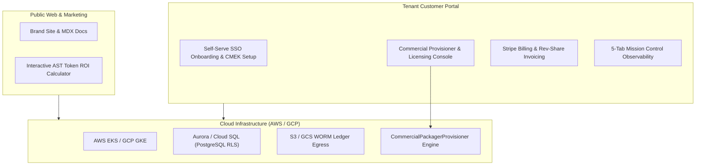

# Percipience Cloud SaaS Portal & Enterprise Corporate Site (Concise Plan)

**Plan ID**: `play_3_corp_site_saas`  
**Capability Rating**: `L2 Self-Evolution & Commercial Portal`  
**Version**: `3.1.0`  
**Parent Plan**: `master/parent-master-plan/concise.md`  

---

## 1. Executive Summary & Strategic Positioning

The **Percipience Cloud SaaS Portal & Corporate Platform** provides the commercial web interface connecting public brand marketing, customer self-service onboarding, usage-based billing, automated commercial tier packaging & multi-IDE provisioning, and real-time context observability:

1. **Unified Enterprise Portal**: $< 1.2\text{s}$ LCP performance, WCAG 2.1 AA accessibility, dynamic MDX documentation, and interactive AST token calculators.
2. **Autonomous Multi-Tenant Onboarding**: Self-serve registration, SSO/SAML 2.0 auth (WorkOS/Clerk), automated workspace bootstrapping (`percipience init`), and CMEK key provisioning.
3. **Commercial Packaging & Multi-Target Provisioning**: Automated tier packaging (`CommercialPackagerProvisioner`), cryptographic Ed25519 license minting, and cross-IDE provisioning.
4. **Usage-Based Metering & Rev-Share Engine**: Stripe billing for base subscriptions ($1,499 Team, $4,499 Business, $9,999 Enterprise) and automated 15% token savings revenue-share calculation.
5. **Mission-Control Observability Dashboard**: Real-time token burn velocity, prompt cache hit ratios, active worktrees, Merkle DAG transitions, commercial provisioner UI, and one-click rollbacks.
6. **Shared-to-Decoupled Infrastructure**: Initial shared hosting with Play 3 core infrastructure keeping OpEx $< \$350/\text{month}$, with zero-refactoring decoupling capability.



---

## 2. Multi-Module Directory Architecture

Structured under the `mode: multi_module` Quad-Space convention:

```text
├── .nb/
│   ├── context/contracts/     # onboarding_contract, commercial_provisioning_contract, billing_meter
│   ├── agentic/custom/        # agent_commercial_packager_provisioner, commercial_packaging_flow
│   └── core/                  # commercial_packager_provisioner.py
├── workplace/
│   ├── modules/
│   │   ├── mod_corp_site/       # Next.js 14 public site & MDX documentation
│   │   ├── mod_saas_portal/     # Multi-tenant customer dashboard & commercial provisioner console
│   │   ├── mod_billing_engine/  # Stripe billing webhooks & rev-share calculator
│   │   └── mod_api_gateway/     # Unified REST & WebSocket gateway (/api/commercial/*)
│   └── shared/                  # Common TypeScript schemas and contracts
```

---

## 3. Milestones & Delivery Schedule

- **Sprint 1**: Public corporate brand pages, MDX documentation, and interactive ROI calculator.
- **Sprint 2**: Commercial Packager & Provisioner engine integration and SaaS portal control plane.
- **Sprint 3**: Multi-tenant auth (SSO/SAML), workspace onboarding wizard, and PostgreSQL RLS.
- **Sprint 4**: Stripe billing webhooks and automated 15% token savings rev-share ledger.
- **Sprint 5**: 5-Tab Observability Hub integration, real-time WebSocket feeds, and E2E Playwright tests.
