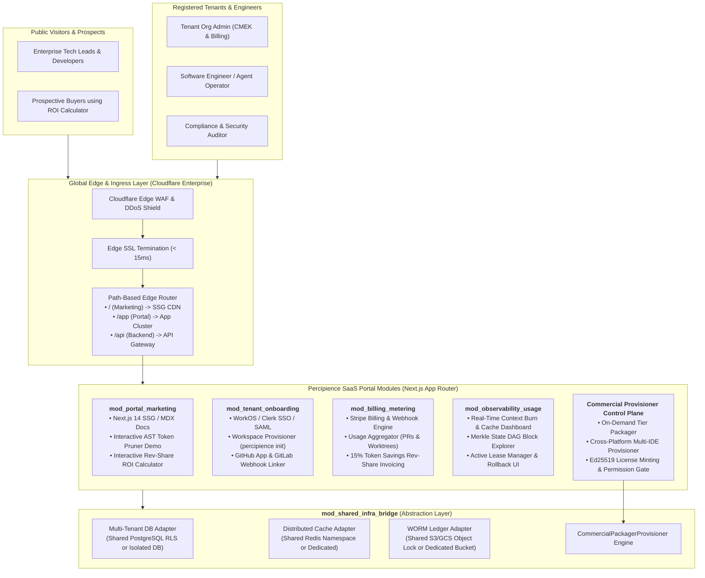
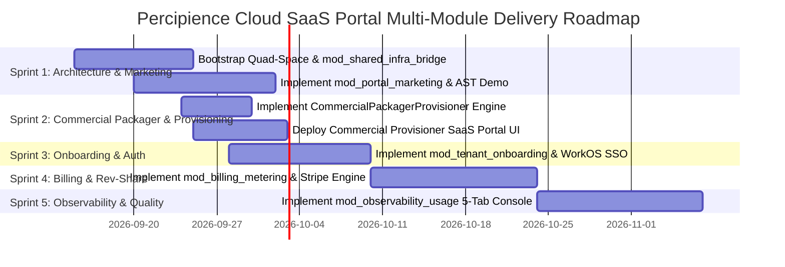

# Percipience Cloud SaaS Portal & Enterprise Corporate Site: Detailed Multi-Module Engineering Plan
**Parent Specification Reference**: Inherits from [Parent Master Context Engineering Plan](file:///Users/lakhwinder/PycharmProjects/nb_fairyfly/.nb/plan/master/parent-master-plan/detailed.md) and [Corporate Website Space Plan](file:///Users/lakhwinder/PycharmProjects/nb_fairyfly/.nb/plan/l1/saas-portal-domain/detailed.md).  
**Associated Commercial Play**: [Play 3: Enterprise Context Engineering OS & CI/CD Gatekeeper](file:///Users/lakhwinder/PycharmProjects/nb_fairyfly/.nb/plan/l2/enterprise-context-engineering-os/detailed.md).  
**Organization**: **Neutron Binary**  
**Product**: **Percipience**  
**Operating Mode**: `mode: multi_module`  
**Execution Spaces**: `context/`, `agentic/`, `workplace/`, `user/`

---

## 1. Executive Summary & Strategic Positioning

To commercialize **Neutron Binary Percipience** (the Enterprise Context Engineering OS & CI/CD Gatekeeper), enterprises, scale-ups, and AI engineering studios require a unified, mission-critical web application that bridges **public corporate brand presence**, **frictionless developer/enterprise onboarding**, **metered billing and revenue-share financial operations**, **automated commercial tier packaging & multi-IDE provisioning**, and **real-time context observability**.

This document defines the production engineering plan for the **Percipience Cloud SaaS Portal & Corporate Platform**. Built using a zero-overhead **`multi_module` Quad-Space architecture**, this system integrates the high-performance static rendering of modern Jamstack architectures (Next.js 14 App Router / React / Tailwind CSS) with a robust, enterprise-grade multi-tenant control plane.

### Core Strategic Mandates
1. **Unified Enterprise Portal & Corporate Brand**: Deliver $< 1.2\text{s}$ LCP Core Web Vitals performance, WCAG 2.1 AA accessibility, dynamic MDX technical documentation, interactive AST token compression visualizers, and ROI calculators.
2. **Autonomous Multi-Tenant Onboarding**: Self-serve registration, SSO/SAML 2.0 enterprise authentication (WorkOS / Clerk), automated workspace bootstrapping (`percipience init`), Customer-Managed Encryption Key (CMEK) provisioning, and one-click GitHub App / GitLab CI/CD webhook installations.
3. **Usage-Based Metering & Rev-Share Financial Engine**: Seamless Stripe Billing integration managing base recurring subscriptions ($1,499 Team, $4,499 Business, $9,999 Enterprise), real-time usage meters (PR verification checks, active worktree compute hours), and automated **15% token savings revenue-share calculation** backed by cryptographic proof logs.
4. **Commercial Packaging & Multi-Target Tenant Provisioning**: Automated packaging engine (`CommercialPackagerProvisioner`) dynamically compiling tier distributions (`plan_free`, `plan_team`, `plan_business`, `plan_enterprise`), issuing signed Ed25519 licenses, and provisioning IntelliJ IDEA, VSCode, and SaaS Gateway targets.
5. **Mission-Control Context Observability Dashboard**: A live management interface exposing real-time token burn velocity, prompt cache hit ratios, Tree-Sitter AST compression efficiency, active ephemeral worktree leases, Merkle DAG state transitions, test quarantine alerts, and one-click surgical rollback triggers.
6. **Shared-to-Decoupled Infrastructure Bridge**: Enables the portal to **share existing Play 3 hosting infrastructure** (AWS EKS / GCP GKE, Aurora / Cloud SQL, Redis Cluster, S3 / GCS WORM storage, Cloudflare Edge) during initial launch, keeping incremental hosting OpEx below **$350/month**, while maintaining strict modular abstraction boundaries so that the portal can be completely decoupled into a dedicated VPC or standalone edge runtime later with zero code refactoring.

---

## 2. Multi-Module Quad-Space Directory Architecture

The platform is structured strictly under the standardized `multi_module` Quad-Space convention, cleanly separating governance, agentic prompt trees, decoupled application modules, and customer input/output artifacts:

```text
.
├── .nb/context/                              # [OBFUSCATED / ENCLAVE-SEALED] Governance & Schemas
│   ├── contracts/                            # Formal inter-module interface schemas
│   │   ├── onboarding_contract.yaml          # Onboarding <-> Core Control Plane payload spec
│   │   ├── billing_meter_contract.yaml       # Usage Metering <-> Stripe billing events
│   │   ├── commercial_provisioning_contract.yaml # Commercial packaging & provisioning schema
│   │   └── observability_contract.yaml       # Worker Telemetry <-> UI Dashboard feeds
│   ├── rules/
│   │   ├── web_accessibility_rules.md        # WCAG 2.1 AA accessibility invariants
│   │   ├── tenant_isolation_invariants.md    # Multi-tenant data segregation & RLS
│   │   └── commercial_tier_permissioning_rules.md # Commercial feature gate boundaries
│   ├── ledger/
│   │   ├── context_ledger.yaml               # Master Merkle DAG state ledger
│   │   └── context_ledger.public.yaml        # Disk-safe sanitized status projection
│   ├── recovery_points/                      # Immutable verified rollback snapshots
│   └── schemas/                              # Zod & JSON schema validation models
├── .nb/agentic/                              # [OBFUSCATED / ENCLAVE-SEALED] Prompt Suites & Workflows
│   ├── custom/
│   │   ├── agents/
│   │   │   ├── agent_saas_portal_architect.yaml
│   │   │   ├── agent_commercial_packager_provisioner.yaml
│   │   │   ├── agent_billing_integration_engineer.yaml
│   │   │   └── agent_observability_frontend_specialist.yaml
│   │   └── workflows/
│   │       ├── saas_portal_delivery_flow.yaml
│   │       └── commercial_packaging_provisioning_flow.yaml
│   ├── methodologies/                        # Design token & web quality guidelines
│   └── prompts/                              # Autonomous site derivation prompt suites
├── .nb/core/
│   └── commercial_packager_provisioner.py    # Commercial tier packaging & multi-IDE provisioning
├── workplace/                                # [TRANSPARENT CLIENT REPO] Customer Source & Modules
│   ├── config/                               # Global site configs, feature flags, Tailwind themes
│   │   ├── site_config.yaml                  # Multi-module routing, domain bindings, locales
│   │   ├── billing_plans.yaml                # Pricing tiers, quotas, rev-share formulas
│   │   └── tailwind.config.ts                # Shared Neutron Binary design tokens & styling
│   ├── shared/                               # Shared cross-module libraries & typed DTOs
│   │   ├── dto/                              # Shared TypeScript interfaces & types
│   │   ├── crypto/                           # Merkle hash proof validators & Ed25519 JWT utils
│   │   └── ui-primitives/                    # Headless accessible UI components (Shadcn/Tailwind)
│   └── modules/                              # Independent, decoupled architectural modules
│       ├── mod_portal_marketing/             # 1. Public marketing, SEO, MDX docs, ROI calculator
│       ├── mod_tenant_onboarding/            # 2. Self-serve onboarding, auth, Quad-Space setup
│       ├── mod_billing_metering/             # 3. Stripe billing, usage metering, rev-share ledger
│       ├── mod_observability_usage/          # 4. Live telemetry dashboard, Merkle visualizer
│       └── mod_shared_infra_bridge/          # 5. Shared-to-decoupled infrastructure adapter
└── user/                                     # [TRANSPARENT CLIENT REPO] User Inputs, HITL & Outputs
    ├── inputs/                               # Brand tokens, pricing parameters, sitemap specs
    ├── hitl/                                 # Poisoning quarantines, billing exception reviews
    └── outputs/                              # Build artifacts, sitemaps, maturity scorecards
```

---

## 3. High-Level System Architecture & Component Interactions



---

## 4. Commercial Packaging & Tenant Provisioning Control Plane

The SaaS Portal includes a dedicated Commercial Provisioner subsystem (`/api/commercial/*`) backed by `CommercialPackagerProvisioner`:

### 4.1. Core Capabilities
- **On-Demand Commercial Packaging**: Dynamically filters core engine scripts, configurations, and prompt workflows according to commercial pricing tiers (`plan_free`, `plan_team`, `plan_business`, `plan_enterprise`).
- **Cryptographic License Minting**: Generates Ed25519 signed and SHA-256 sealed license manifests (`PERCIPIENCE_LICENSE.json`).
- **Cross-Platform Target Provisioning**: Seamlessly deploys and permissions packages to JetBrains IntelliJ IDEA plugins, VSCode extensions, and SaaS API Gateways.
- **RBAC & Zero-Trust Entitlement Verification**: Verifies feature flags (`allow_worm_egress`, `allow_nbpack_compilation`, `allow_custom_agent_creation`) in real time before allowing execution.

### 4.2. REST API Specification
- `GET /api/commercial/tiers`: Fetches complete specifications, pricing models, seat quotas, worktrees, PR audit limits, and allowed engine matrix.
- `GET /api/commercial/entitlements`: Returns active tenant entitlement utilization.
- `GET /api/commercial/packages`: Returns compiled bundles in `.nb/bundles/` with SHA-256 signatures.
- `POST /api/commercial/package`: Assembles and seals a tier-specific distribution bundle.
- `POST /api/commercial/provision`: Provisions runtime license and permissions for a specified tenant and target.
- `POST /api/commercial/verify-permission`: Evaluates zero-trust permission rules for a tenant and requested action.

---

## 5. Phased 90-Day Implementation & Delivery Roadmap


