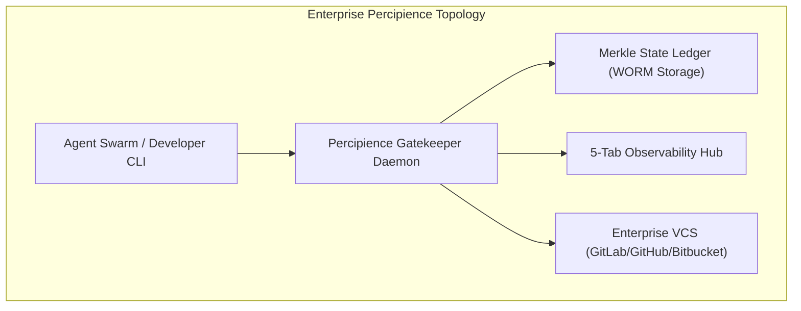

# Play 3: Enterprise Context Engineering OS & CI/CD Gatekeeper (Concise Plan)

**Plan ID**: `play_3_enterprise_os`  
**Capability Rating**: `L2 Self-Evolution & Commercial OS`  
**Version**: `3.0.0`  
**Parent Plan**: `master/parent-master-plan/concise.md`  

---

## 1. Executive Summary & Market Problem

**Percipience** by **Neutron Binary** is an enterprise-grade Context Engineering Platform as a Service (CEPaaS) and CI/CD gatekeeper. It wraps autonomous coding agents and developer swarms in a deterministic execution environment:

1. **Context Poisoning Mitigation**: Isolates regressions into quarantine and triggers surgical module rollbacks to clean recovery points ($RP_k$).
2. **Automated Token Compression**: AST symbol pruning, unified diff updates, and prompt cache prefix pinning reducing token overhead by 50–70%.
3. **Cryptographic Merkle State Ledger**: Immutable SHA-256 hash chains securing all state transitions, test results, and prompt lineages.
4. **Proprietary Space Obfuscation (`.nbpack`)**: Binary compilation and AES-256-GCM encryption sealing platform logic away from client filesystems.
5. **Bring Your Own Repository (BYOR)**: Multi-VCS adapter for GitLab Self-Managed, GitHub Enterprise, Bitbucket Data Center, and AWS CodeCommit.

---

## 2. Ideal Customer Profiles (ICPs) & Quantified ROI

- **ICP 1: AI Dev Agencies & Agentic Studios**: Eliminates manual code review bottlenecks and regression cascades across client deliverables.
- **ICP 2: Enterprise Software Orgs (50–500 Engineers)**: Slashes runaway LLM inference budgets ($15k–$80k/mo) by 50%–70% while satisfying SOC 2 Type II auditability.
- **ICP 3: Autonomous Agent Platforms**: Provides deterministic sandboxing and surgical rollback infrastructure for autonomous agent swarms.

---

## 3. Commercial Pricing & Revenue Model

| Tier | Monthly Base | Included Seats / Quotas | Token Savings Rev-Share | SLA |
| :--- | :--- | :--- | :--- | :--- |
| **Free Community** | $0 | 1 local developer / 2 worktrees | 0% | Community |
| **Team** | $1,499 | Up to 15 developers / 10 worktrees | 15% net savings | 99.5% / 8hr response |
| **Business** | $4,499 | Up to 50 developers / 30 worktrees | 15% net savings | 99.9% / 4hr response |
| **Enterprise** | $9,999 | Unlimited / Dedicated VPC | 15% net savings | 99.99% / 1hr response (24/7) |

---

## 4. Implementation Phases

- **Phase 1: Platform Core Hardening & Merkle Engine**: SHA-256 block ledger, AST pruning profiles, and surgical rollback logic.
- **Phase 2: IDE Plugin Spaces & LSP Infrastructure**: IntelliJ Platform SDK and VSCode extension packaging.
- **Phase 3: Multi-Tenant Gateway & Observability Hub**: FastAPI/Node.js gateway, PostgreSQL RLS, and 5-tab dashboard.
- **Phase 4: Multi-Cloud IaC & Canary Verification**: Terraform AWS/GCP modules, Redis worktree caching, and WORM egress storage.
