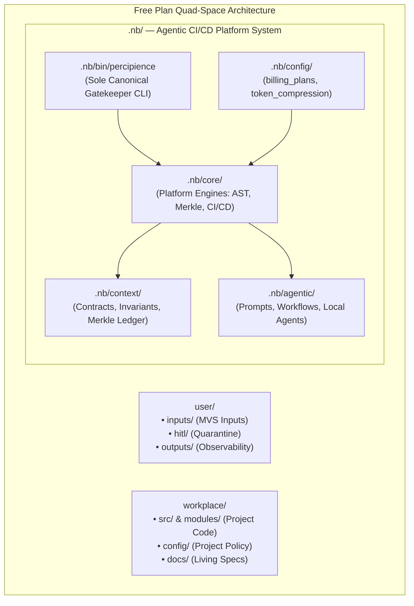

# Parent Master Context Engineering Plan (Free Community Edition) — Concise Specification

## 1. Executive Summary & Free Plan Scope

The **Percipience Parent Master Context Engineering Plan (Free Community Edition)** delivers a deterministic, tamper-evident, and token-efficient AI-driven software engineering framework for individual developers, open-source maintainers, and community teams:
- **Unified Agentic Platform in `.nb/`**: Complete platform engine, gatekeeper CLI, and test suites self-contained inside `.nb/`.
- **Single Canonical Binary (`.nb/bin/percipience`)**: Sole, cross-platform executable platform entry point.
- **Embedded Free Tier Assets in IDE Plugins**: Bundled runtime assets directly in IntelliJ / VSCode plugin distributions for zero-dependency operation.
- **Interactive Workspace Startup Activity**: Automated detection and prompt on project open for uninitialized workspaces.
- **High-Efficiency Token Reduction**: 60%–80% context compression via AST skeletonization and attention budgeting.
- **Cryptographic Merkle State Chain**: Continuous SHA-256 tamper-evident ledger tracking all artifact modifications.
- **Basic Autonomous CI/CD Setup**: Lightweight workspace hygiene, single-attempt bounded self-repair, and contract verification.
- **Granular Sandbox Permissions**: Security broker for local and embedded LLMs.



---

## 2. Core Gatekeeper CLI & Workflows

```bash
# Gatekeeper verification
./.nb/bin/percipience gate

# Merkle ledger audit
./.nb/bin/percipience audit

# Autonomous CI/CD pipeline
./.nb/bin/percipience cicd run

# Layered context validation
./.nb/bin/percipience validate --layered

# Token FinOps metrics summary
./.nb/bin/percipience tokens summary

# Commercial packaging & provisioning
./.nb/bin/percipience package --tier free
./.nb/bin/percipience provision --tenant tenant_community_default --tier free --target all
./.nb/bin/percipience permission check --tier free --feature basic_platform_tools_exposure
```
