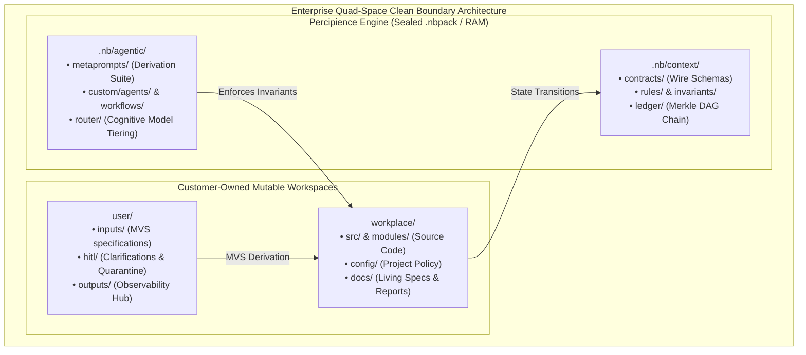

# Master Parent Context Engineering Framework (Concise Agentic Specification)

**Plan ID**: `master_parent_framework`  
**Capability Rating**: `Master (CAP-01 to CAP-36)`  
**Version**: `7.5.0`  
**Operating Modes**: `single_module | multi_module`  

---

## 1. Executive Summary & Core Architectural Invariants

The **Parent Master Context Engineering Framework** establishes an enterprise-grade, domain-agnostic agentic orchestration standard designed to eliminate context poisoning, prevent regression loops, enforce cryptographic auditability, and slash LLM token burn by 50%–70% across heterogeneous software systems.



---

## 2. Thirty-Six (36) Foundational Capabilities (CAP-01 to CAP-36)

1. **CAP-01: Autonomous MVS Input Derivation**: Auto-normalizes sparse specs (OpenAPI, Markdown, Jira exports) in `user/inputs/` into an Abstract Semantic Graph (ASG) to bootstrap systems without manual boilerplate.
2. **CAP-02: Context Poisoning Detection & Incremental Replay**: Continuous purity audits; isolates hallucinations into `user/hitl/poisoning_quarantine.md` and rolls back to clean recovery point $RP_k$.
3. **CAP-03: Context Compression & Token FinOps**: AST symbol pruning, unified diff updates, and prompt cache prefix pinning reducing token overhead by 50–70%.
4. **CAP-04: Dynamic Multi-Model Cascading**:
   - **Tier A (High-Reasoning)**: Architecture, cross-module contracts, security audits (`claude-3-7-sonnet`, `gemini-2.0-pro`, `gpt-4o`, `deepseek-r1`).
   - **Tier B (High-Throughput)**: AST extraction, test scaffolding, diff application (`claude-3-5-haiku`, `gemini-2.0-flash`, `gpt-4o-mini`).
   - **Tier C (Deterministic/Offline)**: AST pruning, SHA-256 Merkle chain verification, regex scanning.
5. **CAP-05: Git Worktree Workspace Isolation**: Ephemeral worktrees (`.workspaces/subagent_<id>/`) preventing concurrent file conflicts during parallel swarm execution.
6. **CAP-06: Spec-to-Code Semantic Parity & Anti-Drift Engine**: Mathematical vector similarity and AST contract scoring (0.00–1.00) with Revert and Evolve modes.
7. **CAP-07: Bounded TDD Self-Healing & Test Quarantine**: Maximum 3 self-repair retries before quarantining failing tests in `context_ledger.yaml`.
8. **CAP-08: Cryptographic Ledger Hash-Chain (Merkle Engine)**: Immutable SHA-256 chaining of all artifact diffs, test evidence, and state transitions.
9. **CAP-09: Time-Travel Debugging & Visual DAG Dashboard**: Lightweight web dashboard (`user/outputs/dashboard/index.html`) with DAG inspection and diff visualizer.
10. **CAP-10: 6-Dimensional Context Maturity Evaluation**: Requirement Coverage, Architecture Grounding, Code Quality, Test Coverage, Security, and FinOps Token Efficiency.
11. **CAP-11: Master Context Ledger (`context_ledger.yaml`)**: Structured DAG recording requirement traceability, git commits, remaining issues, and recovery points.
12. **CAP-12: Quad-Space Clean Folder Bootstrapping**: Strict isolation between mutable user directories (`workplace/`, `user/`) and platform directories (`.nb/`).
13. **CAP-13: Zero-Overhead Dual-Mode Architecture**: Seamless configuration via `project.mode: single_module | multi_module`.
14. **CAP-14: Proprietary Context Obfuscation (`.nbpack`)**: AES-256-GCM authenticated encryption sealing proprietary prompts and schemas into binary envelopes.
15. **CAP-15: External Issue Tracker & Jira MCP Integration**: Bidirectional MCP server bridge for Jira, Linear, GitHub Issues, and Azure DevOps.
16. **CAP-16: Autonomous Closed-Loop CI/CD Triad**: Self-Sustaining worktree hygiene, Self-Recovering surgical rollbacks, and Self-Improving AST calibration.
17. **CAP-17: Extensible Custom Agent Plugin Architecture**: Open plugin interface (`.nb/core/agent_plugin_engine.py`) for custom specialist agents in `.nb/agentic/custom/agents/`.
18. **CAP-18: Production Token FinOps & Rev-Share Metering**: Tracks raw vs AST-pruned tokens and logs accounting to `.nb/context/ledger/token_savings_ledger.yaml`.
19. **CAP-19: 5-Tab Enterprise Observability Hub**: Browser control plane with Radar diagnostics, Swarm manager, DAG visualizer, FinOps calculator, and CI/CD triad controls.
20. **CAP-20: 3-Tier Layered Context Precedence Hierarchy & BYOR Adapter**: Tier 1 Base Invariants > Tier 2 Enterprise Global Rules > Tier 3 Team Custom Context; multi-VCS adapter for GitLab, GitHub Enterprise, Bitbucket.
21. **CAP-21: Multi-Module Cross-Dependency Contract Engine**: Formal wire contract verification across decoupled microservice subtrees.
22. **CAP-22: Granular Sandbox Permission Broker**: Security broker intercepting file system, network, and subprocess calls.
23. **CAP-23: Native Tree-Sitter AST Optimization Daemon**: High-throughput background AST parsing daemon supporting 12+ programming languages.
24. **CAP-24: Diagnostic Re-Prompting Loop**: Self-correcting feedback loop extracting syntax errors from compiler output to guide surgical patches.
25. **CAP-25: Multi-Tenant Enterprise Isolation & KMS Key Brokerage**: PostgreSQL Row-Level Security (RLS) and AWS/GCP KMS key isolation.
26. **CAP-26: Attention Slicing with Dynamic Quotas**: Per-agent token quotas and sliding context window attention budgets.
27. **CAP-27: Enhanced Diagnostic Log Pruning & Tiered SLA**: Log noise reduction preserving only critical stack traces and Merkle assertion blocks.
28. **CAP-28: Living Documentation & Mermaid Visualizer**: Auto-generates markdown and Mermaid state diagrams synchronized with codebase AST changes.
29. **CAP-29: Corporate UI & Web Accessibility CI Harness**: Automated WCAG 2.1 AA and Core Web Vitals regression testing in CI/CD.
30. **CAP-30: Terraform Multi-Cloud Blueprints**: Production IaC templates for AWS (EKS/RDS/S3) and GCP (GKE/Cloud SQL/GCS).
31. **CAP-31: Ephemeral Worktree Redis Cache & Canary Deployments**: Distributed redis locking for worktree concurrency and canary verification.
32. **CAP-32: WORM Egress Storage Manager**: Write-Once-Read-Many tamper-proof cloud storage for audit compliance (SOC2/ISO27001).
33. **CAP-33: One-Click Tenant & Project Scaffolding Wizard**: Automated CLI and Web wizard bootstrapping multi-tenant environments in $< 3$ seconds.
34. **CAP-34: Cross-Plugin IDE Synchronizer**: Seamless state and contract sync across JetBrains (IntelliJ/PyCharm) and VSCode extensions.
35. **CAP-35: Dual-Format Plan Synchronization Engine**: Automated SHA-256 versioning maintaining bi-directional consistency between concise and detailed specifications.
36. **CAP-36: Commercial Pricing Tier Packaging & Cross-Platform Provisioning**: End-to-end packaging, filtering, and provisioning of runtime assets and licenses across IntelliJ, VSCode, and SaaS Portal per commercial tiers (`plan_free`, `plan_team`, `plan_business`, `plan_enterprise`).

---

## 3. Core Engine Architecture

```
.nb/
├── bin/percipience                       # Sole canonical executable gatekeeper CLI
├── config/
│   ├── billing_plans.yaml                # Plan entitlement tiers
│   ├── token_compression_rules.yaml      # AST pruning policies
│   └── byor_config.yaml                  # Enterprise VCS adapter settings
├── context/
│   ├── contracts/                        # Inter-module and plugin wire contracts
│   ├── invariants/                       # Non-overridable platform invariants
│   ├── rules/                            # Enterprise global policies
│   └── ledger/                           # Merkle DAG state ledgers
├── core/                                 # 38 Python platform engines
│   ├── ast_optimizer.py                  # Tree-Sitter AST compression
│   ├── merkle_engine.py                  # SHA-256 state chain
│   ├── autonomous_cicd.py                # Self-healing CI/CD triad
│   ├── surgical_rollback.py              # Context poisoning isolation
│   └── nbpack_envelope.py                # Encrypted envelope packaging
└── agentic/
    ├── custom/agents/                    # Custom agent manifests
    └── custom/workflows/                 # Declarative YAML workflow DAGs
```

---

## 4. Verification & Gatekeeper Commands

```bash
# Verify Merkle DAG chain integrity
./.nb/bin/percipience audit

# Run Layered Context hierarchy validation
./.nb/bin/percipience validate --layered

# Execute Autonomous CI/CD pipeline
./.nb/bin/percipience cicd run

# Compute Token FinOps savings
./.nb/bin/percipience tokens summary
```
