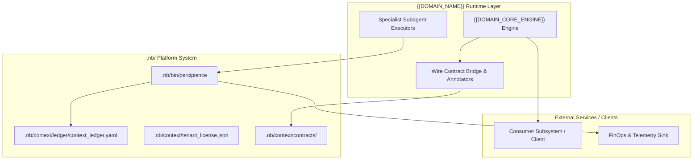

# Layerable Context Engineering Plan: {{DOMAIN_NAME}} (Concise Plan)

### Executive Overview & Domain Grounding

This document is a standardized **Layerable Domain-Specific Context Engineering Plan** designed to overlay onto the generic **Parent Master Context Engineering Framework**. While the parent framework governs universal poly-module lifecycle orchestration, cryptographic Merkle state verification, AST token compression, and autonomous CI/CD, this domain layer injects domain-specific wire contracts, specialized subagents, and verification bridges required for:

1. **{{DOMAIN_CAPABILITY_1}}**: Core technology stack, target protocols, APIs, or runtimes.
2. **{{DOMAIN_CAPABILITY_2}}**: Domain data structures, state machines, and transactional boundaries.
3. **{{DOMAIN_CAPABILITY_3}}**: Domain invariants, compliance requirements, and latency/memory budgets.
4. **{{DOMAIN_CAPABILITY_4}}**: Automated testing harnesses, virtual mock loopbacks, and boundary simulation.



---

## 1. Domain-Specific Quad-Space Mapping

- `.nb/context/contracts/`: `{{DOMAIN_WIRE_CONTRACT_1}}.yaml`, `{{DOMAIN_WIRE_CONTRACT_2}}.json`.
- `.nb/context/rules/`: `{{DOMAIN_INVARIANT_RULE_1}}.md`, `{{DOMAIN_INVARIANT_RULE_2}}.md`.
- `.nb/agentic/custom/agents/`: `agent_{{SPECIALIST_AGENT_1}}.yaml`, `agent_{{SPECIALIST_AGENT_2}}.yaml`.
- `.nb/agentic/custom/workflows/`: `{{DELIVERY_WORKFLOW}}.yaml`.
- `workplace/modules/`: `mod_{{MODULE_PROVIDER}}/`, `mod_{{MODULE_CONSUMER}}/`.
- `user/outputs/`: Domain artifacts, test reports, and verification certificates.

---

## 2. Dynamic Tier Action Matrix & CLI Governance

| Tier | Entitled Buttons & Features | Platform Tools Exposure | Domain Capabilities |
| :--- | :--- | :--- | :---: |
| **Free Community** (`plan_free`) | 🚀 Bootstrap, 🚦 Gatekeeper, 🛡️ Merkle Audit, ▶️ CI/CD, 🔍 Validate Layer, ⚡ Token Summary | Safe Gatekeeper Actions Only (Internal tools unexposed) | Basic syntax & schema validation |
| **Team Tier** (`plan_team`) | + 🌿 Worktrees, 🤖 Agent Registry, 🔄 Anti-Drift Check | Safe Gatekeeper Actions + Custom Agents | Multi-agent handoffs & mock loops |
| **Business Tier** (`plan_business`) | + 📦 Sealed NBPack Packaging, 🌐 Gateway Provisioner, 🧠 Cognitive Parity Report | Standard & Full Platform Tool APIs + Encrypted Packaging | Automated contract fuzzing & AST pruning |
| **Enterprise Dedicated** (`plan_enterprise`) | + 🐝 Swarm Triad Orchestrator, 🔒 Private VPC Enclave, 📜 Immutable WORM Egress | Full Unrestricted Platform Tool APIs + Air-gapped VPC | Complete hardware/cloud emulation |

---

## 3. CLI, Multi-Tier Packaging & Layer Management

```bash
# Package standard universal layer bundle
./.nb/bin/percipience layer pack \
  --plan .nb/plan/{{LAYER_LEVEL}}/{{DOMAIN_SLUG}}/concise.md \
  --output .nb/bundles/{{DOMAIN_SLUG}}_domain.nbpack

# Apply layer bundle to ephemeral context
./.nb/bin/percipience layer apply \
  --pack .nb/bundles/{{DOMAIN_SLUG}}_domain.nbpack \
  --in-memory-only

# Verify domain invariants via Gatekeeper
./.nb/bin/percipience gate
```
