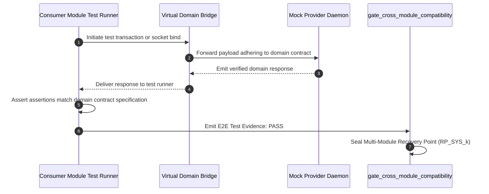

# Layerable Context Engineering Plan: {{DOMAIN_NAME}} Space

> **Standard Template Kit**: [`.nb/plan/templates/`](file:///Users/lakhwinder/PycharmProjects/nb_fairyfly/.nb/plan/templates/)  
> **Concrete Reference Sample**: [`.nb/plan/templates/sample/`](file:///Users/lakhwinder/PycharmProjects/nb_fairyfly/.nb/plan/templates/sample/)  
> **Parent Master Framework**: [`.nb/plan/master/parent-master-plan/`](file:///Users/lakhwinder/PycharmProjects/nb_fairyfly/.nb/plan/master/parent-master-plan/)

---

### Executive Overview & Domain Grounding

This document is a standardized **Layerable Domain-Specific Context Engineering Plan Specification** designed to overlay onto the generic **Parent Master Context Engineering Framework** (`.nb/plan/master/parent-master-plan/concise.md`). While the parent framework governs universal poly-module lifecycle orchestration, cryptographic Merkle state verification, AST token compression, and autonomous CI/CD, this domain layer injects domain-specific wire contracts, specialized subagents, and verification bridges required for:

1. **{{DOMAIN_CORE_CAPABILITY_1}}**: Description of core technology stack, target protocols, or runtimes.
2. **{{DOMAIN_CORE_CAPABILITY_2}}**: Description of domain data structures, state machines, or transactional boundaries.
3. **{{DOMAIN_CORE_CAPABILITY_3}}**: Description of security, compliance, or strict domain-level invariant constraints.
4. **{{DOMAIN_CORE_CAPABILITY_4}}**: Automated testing harnesses, virtual mock loopbacks, or hardware/runtime simulators.

---

## 1. Standard 4-File Plan Organization

Under the Percipience Context Engineering architecture, each domain plan directory is partitioned into four synchronized files:

```
.nb/plan/<layer_level>/<domain-slug>/
├── README.md        # Human-readable navigation, quick links, and capability summary
├── MANIFEST.yaml    # Cryptographic ledger, line counts, dependencies & SHA-256 hashes
├── concise.md       # Compact domain specification for token-optimized agent context (~80-120 lines)
└── detailed.md      # Comprehensive engineering blueprint, wire contracts & test harnesses (~300-500 lines)
```

- For quick agent context injection, inject [`concise.md`](file:///Users/lakhwinder/PycharmProjects/nb_fairyfly/.nb/plan/templates/concise.md) ($60-80\%$ token savings).
- For deep implementation, refactoring, and test authoring, consult [`detailed.md`](file:///Users/lakhwinder/PycharmProjects/nb_fairyfly/.nb/plan/templates/detailed.md).
- To sync versions, line counts, and SHA-256 hashes, run:
  ```bash
  python3 .nb/plan/scripts/sync_plan_versions.py
  ```

---

## 2. Domain-Specific Quad-Space Mapping

When layered onto the Parent Master Plan, the workspace instantiates domain-specialized structures across the four clean directories:

```
.
├── .nb/
│   ├── context/
│   │   ├── contracts/
│   │   │   ├── {{DOMAIN_WIRE_CONTRACT_1}}.yaml      # Primary inter-module communication wire contract
│   │   │   └── {{DOMAIN_WIRE_CONTRACT_2}}.json      # Domain event payloads or state schema validations
│   │   └── rules/
│   │       ├── {{DOMAIN_INVARIANTS_RULE_1}}.md      # Domain architectural invariant rules
│   │       └── {{DOMAIN_INVARIANTS_RULE_2}}.md      # Memory, latency, or throughput bounds
│   └── agentic/
│       └── custom/
│           ├── agents/
│           │   ├── agent_{{SPECIALIST_AGENT_1}}.yaml # Domain producer/driver specialist subagent
│           │   └── agent_{{SPECIALIST_AGENT_2}}.yaml # Domain consumer/client specialist subagent
│           └── workflows/
│               └── {{DOMAIN_DELIVERY_WORKFLOW}}.yaml # Domain-specific verification and build pipeline DAG
├── workplace/
│   ├── modules/
│   │   ├── mod_{{PROVIDER_MODULE}}/                 # Core provider subsystem implementation
│   │   └── mod_{{CONSUMER_MODULE}}/                 # Consumer application or client implementation
│   └── tests/
│       └── test_{{DOMAIN_SLUG}}_space.py            # Unit & loopback integration tests
└── user/
    ├── inputs/
    │   └── {{DOMAIN_MVS_SPEC}}.yaml                 # Sparse initial user specification / requirements
    └── hitl/
        └── poisoning_quarantine.md                  # Quarantine ledger for domain-specific contract violations
```

---

## 3. Wire Contracts & Safety Invariants (`.nb/context/contracts/`, `.nb/context/rules/`)

The domain layer establishes non-overridable wire contracts verified by the pre-commit gatekeeper:

### 3.1. `.nb/context/contracts/{{DOMAIN_WIRE_CONTRACT_1}}.yaml`
```yaml
schema_version: "1.0.0"
domain: "{{DOMAIN_SLUG}}"
contract_type: "RPC_OR_REST_OR_STREAM"
service_endpoint: "/api/v1/{{DOMAIN_SLUG}}"
payload_schema:
  type: "object"
  required: ["id", "timestamp", "payload"]
  properties:
    id: { type: "string", format: "uuid" }
    timestamp: { type: "string", format: "date-time" }
    payload: { type: "object" }
```

### 3.2. `.nb/context/rules/{{DOMAIN_INVARIANTS_RULE_1}}.md`
- **Domain Invariant 1**: Strict contract conformity across producer and consumer modules.
- **Domain Invariant 2**: Memory budget, latency, or throughput bounds enforced via sentinels.
- **Domain Invariant 3**: Zero-drift compliance with parent cryptographic Merkle verification.

---

## 4. Specialized Domain Subagents & Workflows (`.nb/agentic/custom/`)

### 4.1. `.nb/agentic/custom/agents/agent_{{SPECIALIST_AGENT_1}}.yaml`
```yaml
agent_id: "agent_{{SPECIALIST_AGENT_1}}"
name: "{{DOMAIN_NAME}} Specialist"
version: "1.0.0"
category: "domain_engineering"
model_tiering:
  active_tier: "Tier_A"
  tier_a_model: "claude-3-7-sonnet / pro"
  tier_b_model: "claude-3-5-haiku / flash"
system_prompt_ref: ".nb/agentic/prompts/{{SPECIALIST_AGENT_1}}_prompt.md"
budget_limits:
  max_tokens_per_turn: 25000
  max_ast_pruned_tokens: 12000
permissions:
  allow_worktree_isolation: true
  allowed_module_paths:
    - "workplace/modules/mod_{{PROVIDER_MODULE}}"
    - ".nb/context/contracts"
enforced_invariants:
  - "Zero AST contract drift"
  - "Mandatory unit and simulation test coverage >= 85%"
```

---

## 5. Virtual Emulation & End-to-End Simulation Loopback Bridge

In autonomous CI/CD pipelines, external hardware or remote environments may be unavailable. The domain test harness creates a virtual integration bridge:



---

## 6. Domain-Specific Surgical Rollback & Poisoning Defense

Under this domain plan, recovery points are strictly isolated per module:
- `RP_{{PROVIDER_PREFIX}}_001`: Verified clean state of provider module.
- `RP_{{CONSUMER_PREFIX}}_002`: Verified clean state of consumer module.

**Failure Mitigation**:
If an agent hallucinates an incompatible field or introduces a dependency breach in `mod_{{CONSUMER_MODULE}}`:
1. `PoisoningSentinel.execute_surgical_rollback` restores only `workplace/modules/mod_{{CONSUMER_MODULE}}/` to its last verified recovery point.
2. Sibling module `workplace/modules/mod_{{PROVIDER_MODULE}}/` remains untouched.
3. The invalid state is logged to `user/hitl/poisoning_quarantine.md`, and a new Merkle block is sealed.

---

## 7. Dynamic Commercial Tier Matrix

| Tier | Entitled Features | Module Scope | Packaging Output |
| :--- | :--- | :--- | :--- |
| **Free Community** (`plan_free`) | Gatekeeper checks, local AST pruning | Local provider module | Local repo only |
| **Team Tier** (`plan_team`) | + Ephemeral worktrees, custom agents | Provider + Consumer modules | Local + IDE plugins |
| **Business Tier** (`plan_business`) | + Sealed .nbpack packaging, API gateway | All domain modules | Cloud SaaS + IDE plugins |
| **Enterprise Dedicated** (`plan_enterprise`) | + Swarm Triad, VPC enclave, WORM vault | Full repository + custom contracts | Dedicated multi-tenant cluster |

---

## 8. CLI Commands & Verification Protocol

```bash
# 1. Verify and synchronize plan versions
python3 .nb/plan/scripts/sync_plan_versions.py

# 2. Package into sealed .nbpack envelope
./.nb/bin/percipience layer pack \
  --plan .nb/plan/{{LAYER_LEVEL}}/{{DOMAIN_SLUG}}/concise.md \
  --output .nb/bundles/{{DOMAIN_SLUG}}_domain.nbpack

# 3. Apply layer bundle to target environment
./.nb/bin/percipience layer apply \
  --pack .nb/bundles/{{DOMAIN_SLUG}}_domain.nbpack \
  --in-memory-only

# 4. Run PR Gatekeeper verification
./.nb/bin/percipience gate
```
