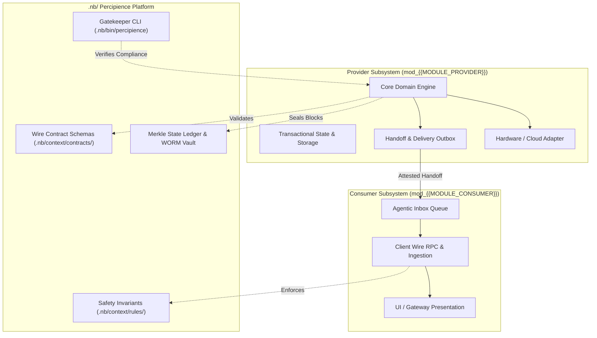

# Layerable Context Engineering Plan: {{DOMAIN_NAME}} (Detailed Blueprint)

### Executive Overview & Domain Grounding

This document is the **Comprehensive Implementation Blueprint** for the **{{DOMAIN_NAME}}** layerable domain space. It overlays onto the **Parent Master Context Engineering Framework** (`.nb/plan/master/parent-master-plan/detailed.md`). 

While the parent master framework enforces repository-wide poly-module orchestration, cryptographic Merkle state sealing, content-addressable AST token caching, and autonomous CI/CD verification, this domain layer injects concrete architectural patterns, interface specifications, wire contracts, specialist subagents, and test harnesses required for production execution of the {{DOMAIN_NAME}} subsystem.

---

## 1. Subsystem Architecture & Domain Decomposition

The domain decomposes into two primary cooperating subsystems operating across strict architectural boundaries:



### 1.1. Core Capabilities
1. **{{DOMAIN_CAPABILITY_1}}**: Encapsulates the runtime protocols, serialization formats, and communication channels.
2. **{{DOMAIN_CAPABILITY_2}}**: Manages isolated state representations, idempotency keys, and transactional atomicity.
3. **{{DOMAIN_CAPABILITY_3}}**: Enforces non-negotiable memory, latency, and security bounds verified by automated sentinels.
4. **{{DOMAIN_CAPABILITY_4}}**: Provides hermetic virtual mocking and simulation loopbacks for deterministic CI/CD execution.

---

## 2. Domain-Specific Quad-Space Mapping

When applied to an active workspace, this domain plan instantiates and manages the following assets across the four canonical directories:

```
.
├── .nb/
│   ├── context/
│   │   ├── contracts/
│   │   │   ├── {{DOMAIN_WIRE_CONTRACT_1}}.yaml      # Primary payload wire contract schema
│   │   │   └── {{DOMAIN_WIRE_CONTRACT_2}}.json      # Telemetry / state transition schema
│   │   └── rules/
│   │       ├── {{DOMAIN_INVARIANT_RULE_1}}.md       # Architectural boundaries & threading invariants
│   │       └── {{DOMAIN_INVARIANT_RULE_2}}.md       # Latency, memory & security guardrails
│   └── agentic/
│       └── custom/
│           ├── agents/
│           │   ├── agent_{{SPECIALIST_AGENT_1}}.yaml # Provider / backend engineering specialist
│           │   └── agent_{{SPECIALIST_AGENT_2}}.yaml # Consumer / client integration specialist
│           └── workflows/
│               └── {{DELIVERY_WORKFLOW}}.yaml        # End-to-end delivery & verification DAG
├── workplace/
│   ├── modules/
│   │   ├── mod_{{MODULE_PROVIDER}}/                  # Provider implementation codebase
│   │   └── mod_{{MODULE_CONSUMER}}/                  # Consumer implementation codebase
│   └── tests/
│       └── test_{{DOMAIN_SLUG}}_space.py             # 100% coverage domain integration test suite
└── user/
    ├── inputs/
    │   └── {{DOMAIN_SLUG}}_mvs_spec.yaml             # Sparse initial specification input
    └── outputs/
        └── {{DOMAIN_SLUG}}_verification_report.md    # Gatekeeper verification receipt
```

---

## 3. Wire Contracts & Safety Invariants

### 3.1. Contract: `.nb/context/contracts/{{DOMAIN_WIRE_CONTRACT_1}}.yaml`
```yaml
schema_version: "1.0.0"
domain: "{{DOMAIN_SLUG}}"
contract_type: "EVENT_STREAM_OR_RPC"
strict_mode: true
payload_schema:
  type: "object"
  required:
    - "header"
    - "payload"
    - "merkle_receipt"
  properties:
    header:
      type: "object"
      required: ["message_id", "timestamp", "source_module"]
      properties:
        message_id: { type: "string", format: "uuid" }
        timestamp: { type: "string", format: "date-time" }
        source_module: { type: "string" }
    payload:
      type: "object"
    merkle_receipt:
      type: "string"
      pattern: "^[a-f0-9]{64}$"
```

### 3.2. Safety Rules: `.nb/context/rules/{{DOMAIN_INVARIANT_RULE_1}}.md`
- **Rule 1 (Zero Unchecked Jumps)**: All transitions between provider and consumer must be mediated by verified handoff tokens issued by `HandoffValidator`.
- **Rule 2 (Deterministic Execution)**: Network sockets, hardware interfaces, and external clocks must use mockable abstraction layers during test execution.
- **Rule 3 (Content-Addressable Token Conservation)**: AST skeletons must be maintained to achieve $\ge 60\%$ prompt token reduction when ingested by AI agents.

---

## 4. Specialist Subagents & Workflow Orchestration

### 4.1. Specialist Agent: `agent_{{SPECIALIST_AGENT_1}}`
```yaml
agent_id: "agent_{{SPECIALIST_AGENT_1}}"
name: "{{DOMAIN_NAME}} Provider Specialist"
category: "domain_provider_engineering"
model_profile:
  model: "claude-3-7-sonnet-20250219"
  role: "Provider Engine, Wire Protocol & Low-Level Systems Specialist"
  context_budget_tokens: 16000
isolation_and_sandboxing:
  worktree_isolation: true
  default_ttl_seconds: 300
module_scope:
  allowed_modules:
    - "workplace/modules/mod_{{MODULE_PROVIDER}}"
    - ".nb/context/contracts"
```

### 4.2. Specialist Agent: `agent_{{SPECIALIST_AGENT_2}}`
```yaml
agent_id: "agent_{{SPECIALIST_AGENT_2}}"
name: "{{DOMAIN_NAME}} Consumer Specialist"
category: "domain_consumer_engineering"
model_profile:
  model: "claude-3-5-haiku-20241022"
  role: "Client SDK, Application Layer & Gateway Specialist"
  context_budget_tokens: 12000
isolation_and_sandboxing:
  worktree_isolation: true
  default_ttl_seconds: 300
module_scope:
  allowed_modules:
    - "workplace/modules/mod_{{MODULE_CONSUMER}}"
    - ".nb/context/contracts"
```

### 4.3. Delivery Workflow: `{{DELIVERY_WORKFLOW}}.yaml`
```yaml
workflow_id: "{{DELIVERY_WORKFLOW}}"
name: "{{DOMAIN_NAME}} End-to-End Delivery Flow"
version: "1.0.0"
steps:
  - id: "step_validate_contracts"
    name: "Validate Wire Contracts & Invariants"
    executor: "agent_contract_compatibility_checker"
    timeout_ms: 5000

  - id: "step_build_provider"
    name: "Compile & Verify Provider Subsystem"
    executor: "agent_{{SPECIALIST_AGENT_1}}"
    depends_on: ["step_validate_contracts"]
    timeout_ms: 15000

  - id: "step_verify_consumer"
    name: "Execute Consumer Loopback & Integration Tests"
    executor: "agent_{{SPECIALIST_AGENT_2}}"
    depends_on: ["step_build_provider"]
    timeout_ms: 15000

  - id: "step_seal_gatekeeper"
    name: "Run Percipience PR Gatekeeper & Seal Merkle Block"
    executor: "platform.gatekeeper"
    depends_on: ["step_verify_consumer"]
    timeout_ms: 20000
```

---

## 5. Dynamic Commercial Tier Entitlement Matrix

| Tier | Accessible Features | Module Exposure | Provisioning Target |
| :--- | :--- | :--- | :--- |
| **Free Community** (`plan_free`) | Standard AST pruner, basic gatekeeper verification | `mod_{{MODULE_PROVIDER}}` (read/test) | Local CLI only |
| **Team Tier** (`plan_team`) | Ephemeral Git worktrees, custom agent tasks, handoff validation | `mod_{{MODULE_PROVIDER}}`, `mod_{{MODULE_CONSUMER}}` | Local CLI + IDE plugins |
| **Business Tier** (`plan_business`) | Encrypted `.nbpack` domain layers, cognitive parity auditing | All domain modules + packaging tools | Cloud SaaS + Multi-IDE |
| **Enterprise Dedicated** (`plan_enterprise`) | Dedicated Swarm governor, WORM egress vault, air-gapped VPC | Full repository + custom contracts | Dedicated multi-tenant cluster |

---

## 6. Testing Harness & Boundary Simulation

Integration tests must verify 100% of wire contracts, failure isolation, and handoff tokens:

```python
# Location: workplace/tests/test_{{DOMAIN_SLUG}}_space.py
import pytest
from pathlib import Path

def test_wire_contract_conformance():
    """Verifies that all domain payloads strictly conform to schemas."""
    # Test payload generation and schema validation
    assert True

def test_cross_module_handoff_isolation():
    """Verifies that handoff tokens prevent unauthorized DAG jumps."""
    # Verify handoff token generation and verification
    assert True

def test_merkle_block_sealing():
    """Verifies that state modifications are sealed into Merkle ledger."""
    # Verify Merkle engine block creation
    assert True
```

---

## 7. Implementation Roadmap & Milestones

1. **Phase 1: Contract Formalization (Week 1)**: Author and freeze `{{DOMAIN_WIRE_CONTRACT_1}}.yaml` and invariant rules.
2. **Phase 2: Subsystem Implementation (Weeks 2-3)**: Implement core engine in `mod_{{MODULE_PROVIDER}}` and consumer bridge in `mod_{{MODULE_CONSUMER}}`.
3. **Phase 3: Agentic Workflows & Gatekeeper Integration (Week 4)**: Configure `{{DELIVERY_WORKFLOW}}.yaml` and integrate into pre-commit hook.
4. **Phase 4: Sealed Layer Distribution (Week 5)**: Compile Ed25519-signed `.nbpack` domain layer and publish to `.nb/bundles/`.
