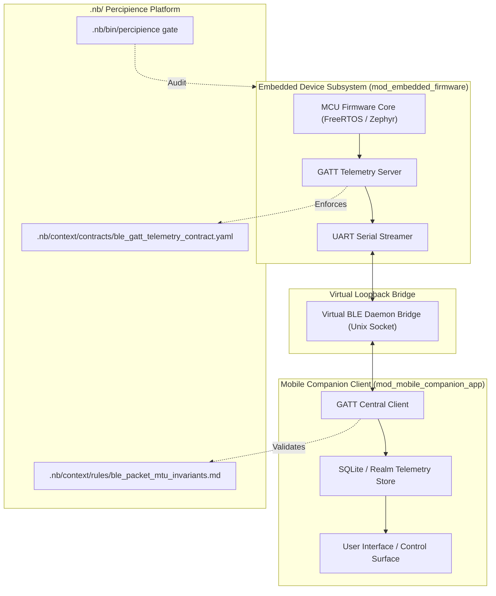

# Layerable Context Engineering Plan: Sample IoT & Mobile Space (Concise Plan)

### Executive Overview & Domain Grounding

This document is a sample **Layerable Domain-Specific Context Engineering Plan** demonstrating how to layer device-level embedded firmware and mobile application architectures onto the generic **Parent Master Context Engineering Framework**. It injects concrete Bluetooth Low Energy (BLE 5.3) GATT wire contracts, FreeRTOS / Zephyr MCU simulators, mobile client state stores, and virtual socket bridges required for:

1. **Embedded Firmware & MCU Subsystem (`mod_embedded_firmware`)**: C/C++ embedded code running under FreeRTOS / Zephyr OS abstractions with low-power state machines.
2. **Mobile Companion Application (`mod_mobile_companion_app`)**: Kotlin Multiplatform / Swift client managing connection pools, background sync, and telemetry ingestion.
3. **BLE 5.3 GATT Wire Contracts**: Strictly typed binary packet specifications with MTU bounded payloads ($244\text{ bytes}$) and CRC-32 integrity.
4. **Virtual Socket Bridge Simulator**: Inter-process Unix domain socket daemon bridging MCU serial emulators with mobile clients for deterministic CI testing.



---

## 1. Domain-Specific Quad-Space Mapping

- `.nb/context/contracts/`: `ble_gatt_telemetry_contract.yaml`, `device_command_rpc_contract.json`.
- `.nb/context/rules/`: `ble_packet_mtu_invariants.md`, `firmware_memory_bounds.md`.
- `.nb/agentic/custom/agents/`: `agent_iot_developer.yaml`, `agent_mobile_developer.yaml`.
- `.nb/agentic/custom/workflows/`: `iot_mobile_delivery_flow.yaml`.
- `workplace/modules/`: `mod_embedded_firmware/`, `mod_mobile_companion_app/`.
- `user/outputs/`: Device telemetry logs, MTU compliance receipts, and test reports.

---

## 2. Dynamic Tier Action Matrix & CLI Governance

| Tier | Entitled Buttons & Features | Platform Tools Exposure | Domain Capabilities |
| :--- | :--- | :--- | :---: |
| **Free Community** (`plan_free`) | 🚀 Bootstrap, 🚦 Gatekeeper, 🛡️ Merkle Audit, ▶️ CI/CD, 🔍 Validate Layer, ⚡ Token Summary | Safe Gatekeeper Actions Only (Internal tools unexposed) | Basic C/Kotlin syntax checks & contract validation |
| **Team Tier** (`plan_team`) | + 🌿 Worktrees, 🤖 Agent Registry, 🔄 Anti-Drift Check | Safe Gatekeeper Actions + Custom Agents | Multi-agent firmware/mobile handoffs & mock loops |
| **Business Tier** (`plan_business`) | + 📦 Sealed NBPack Packaging, 🌐 Gateway Provisioner, 🧠 Cognitive Parity Report | Standard & Full Platform Tool APIs + Encrypted Packaging | Virtual socket bridge daemon & packet fuzzing |
| **Enterprise Dedicated** (`plan_enterprise`) | + 🐝 Swarm Triad Orchestrator, 🔒 Private VPC Enclave, 📜 Immutable WORM Egress | Full Unrestricted Platform Tool APIs + Air-gapped VPC | Full hardware-in-the-loop (HIL) automation |

---

## 3. CLI, Multi-Tier Packaging & Layer Management

```bash
# Package standard universal layer bundle
./.nb/bin/percipience layer pack \
  --plan .nb/plan/templates/sample/concise.md \
  --output .nb/bundles/sample_iot_mobile_domain.nbpack

# Apply layer bundle to ephemeral context
./.nb/bin/percipience layer apply \
  --pack .nb/bundles/sample_iot_mobile_domain.nbpack \
  --in-memory-only

# Verify domain invariants via Gatekeeper
./.nb/bin/percipience gate
```
