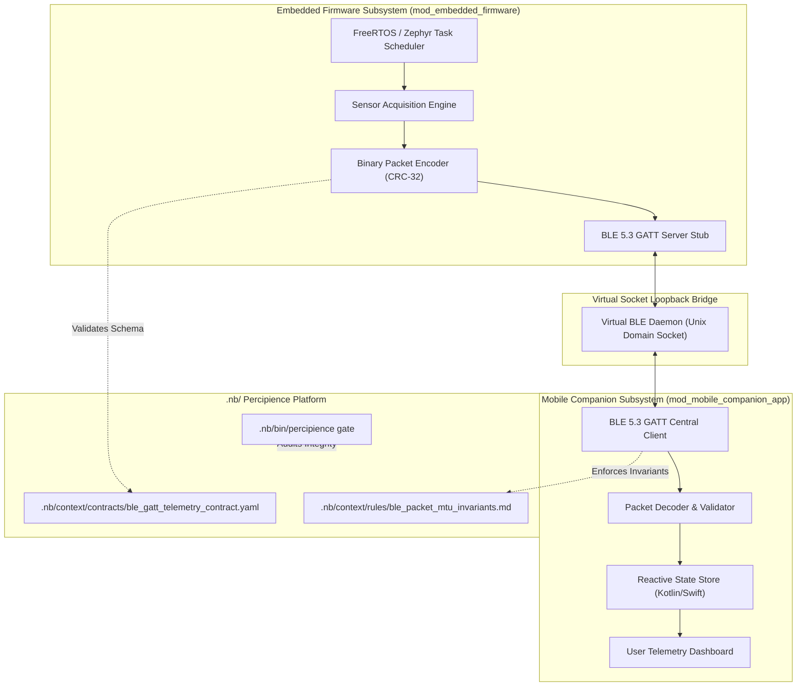

# Layerable Context Engineering Plan: Sample IoT & Mobile Space (Detailed Blueprint)

### Executive Overview & Domain Grounding

This document is the **Comprehensive Implementation Blueprint** for the **Sample IoT & Mobile BLE Ecosystem** domain space. It overlays onto the **Parent Master Context Engineering Framework** (`.nb/plan/master/parent-master-plan/detailed.md`).

This sample demonstrates how to structure embedded systems, hardware telemetry streams, and mobile client applications within the Percipience Context Engineering OS. It provides concrete specifications for C/C++ MCU firmware, Kotlin/Swift companion code, Bluetooth Low Energy (BLE 5.3) GATT characteristic wire contracts, virtual loopback sockets, and automated pre-commit gates.

---

## 1. Subsystem Architecture & Domain Decomposition

The domain decomposes into three primary components: an embedded firmware producer, a mobile companion consumer, and a virtual socket bridge emulator.



### 1.1. Core Capabilities
1. **Low-Power Firmware State Machine**: Implements power modes (Deep Sleep, Active Scanning, Connected) with memory usage capped under $64\text{ KB}$ SRAM.
2. **Deterministic Packet Serialization**: Encodes numeric metrics into fixed-size binary frames protected by 32-bit CRC checksums.
3. **Resilient Mobile Reconnection**: Implements exponential backoff reconnect logic with local SQLite caching when disconnected.
4. **Virtual Unix Socket Loopback**: Emulates BLE transport during automated tests without requiring physical hardware.

---

## 2. Domain-Specific Quad-Space Mapping

```
.
├── .nb/
│   ├── context/
│   │   ├── contracts/
│   │   │   ├── ble_gatt_telemetry_contract.yaml   # Binary frame & characteristic schema
│   │   │   └── device_command_rpc_contract.json   # Downlink command JSON schema
│   │   └── rules/
│   │       ├── ble_packet_mtu_invariants.md       # Maximum Transmission Unit boundary rules
│   │       └── firmware_memory_bounds.md          # Stack & heap boundary limits
│   └── agentic/
│       └── custom/
│           ├── agents/
│           │   ├── agent_iot_developer.yaml       # Embedded C/C++ firmware specialist
│           │   └── agent_mobile_developer.yaml    # Kotlin / Swift mobile specialist
│           └── workflows/
│               └── iot_mobile_delivery_flow.yaml  # 4-stage delivery & loopback test DAG
├── workplace/
│   ├── modules/
│   │   ├── mod_embedded_firmware/                 # C/C++ firmware codebase
│   │   └── mod_mobile_companion_app/              # Mobile companion app codebase
│   └── tests/
│       └── test_iot_mobile_space.py               # Loopback & wire contract test suite
└── user/
    ├── inputs/
    │   └── device_specs.yaml                      # Hardware sensor pins & frequency specs
    └── outputs/
        └── telemetry_verification.md              # Automated gatekeeper verification receipt
```

---

## 3. Wire Contracts & Safety Invariants

### 3.1. Contract: `.nb/context/contracts/ble_gatt_telemetry_contract.yaml`
```yaml
schema_version: "1.0.0"
domain: "sample_iot_mobile"
service_uuid: "0000180D-0000-1000-8000-00805F9B34FB"
characteristic_uuid: "00002A37-0000-1000-8000-00805F9B34FB"
max_payload_bytes: 244
properties: ["NOTIFY", "READ"]
packet_structure:
  header:
    offset: 0
    size: 4
    type: "uint32"
    description: "Magic byte identifier (0xABCD1234)"
  sequence_id:
    offset: 4
    size: 4
    type: "uint32"
    description: "Monotonically increasing sequence number"
  timestamp_epoch:
    offset: 8
    size: 8
    type: "uint64"
    description: "Milliseconds since Unix epoch"
  temperature_centi_celsius:
    offset: 16
    size: 2
    type: "int16"
    description: "Temperature in centi-degrees Celsius"
  battery_level_pct:
    offset: 18
    size: 1
    type: "uint8"
    description: "Battery percentage (0-100)"
  crc32_checksum:
    offset: 19
    size: 4
    type: "uint32"
    description: "IEEE 802.3 CRC-32 checksum across bytes 0..18"
```

### 3.2. Safety Rules: `.nb/context/rules/ble_packet_mtu_invariants.md`
- **Invariant 1 (Strict MTU Ceiling)**: No single GATT packet notification may exceed $244\text{ bytes}$ under any condition. Payloads exceeding this must be fragmented.
- **Invariant 2 (CRC Integrity Gate)**: Any received frame failing CRC-32 checksum validation must be discarded immediately and increment the telemetry error counter.
- **Invariant 3 (Thread Isolation)**: Radio I/O operations must run asynchronously outside UI and critical control loops.

---

## 4. Specialist Subagents & Delivery Workflows

### 4.1. Specialist Agent: `agent_iot_developer`
```yaml
agent_id: "agent_iot_developer"
name: "Embedded Firmware & MCU Systems Engineer"
category: "domain_engineering"
model_profile:
  model: "claude-3-7-sonnet-20250219"
  role: "Embedded C/C++, FreeRTOS, Zephyr OS & BLE 5.3 Specialist"
  context_budget_tokens: 16000
module_scope:
  allowed_modules:
    - "workplace/modules/mod_embedded_firmware"
    - ".nb/context/contracts"
```

### 4.2. Specialist Agent: `agent_mobile_developer`
```yaml
agent_id: "agent_mobile_developer"
name: "Cross-Platform Mobile Bluetooth & Systems Engineer"
category: "domain_engineering"
model_profile:
  model: "claude-3-5-haiku-20241022"
  role: "Kotlin Multiplatform, Swift, CoreBluetooth & Mobile Architecture Specialist"
  context_budget_tokens: 14000
module_scope:
  allowed_modules:
    - "workplace/modules/mod_mobile_companion_app"
    - ".nb/context/contracts"
```

### 4.3. Delivery Workflow: `iot_mobile_delivery_flow.yaml`
```yaml
workflow_id: "wf_iot_mobile_delivery"
name: "IoT & Mobile Ecosystem End-to-End Delivery Flow"
version: "1.0.0"
steps:
  - id: "step_verify_gatt_contract"
    name: "Validate GATT Packet Contract & MTU Limits"
    executor: "agent_contract_compatibility_checker"
    timeout_ms: 5000

  - id: "step_build_firmware_stub"
    name: "Compile C/C++ Firmware Stubs"
    executor: "agent_iot_developer"
    depends_on: ["step_verify_gatt_contract"]
    timeout_ms: 15000

  - id: "step_test_mobile_loopback"
    name: "Run Mobile App Virtual Socket Loopback Tests"
    executor: "agent_mobile_developer"
    depends_on: ["step_build_firmware_stub"]
    timeout_ms: 20000

  - id: "step_gatekeeper_seal"
    name: "Percipience PR Gatekeeper Merkle Seal"
    executor: "platform.gatekeeper"
    depends_on: ["step_test_mobile_loopback"]
    timeout_ms: 15000
```

---

## 5. Testing Harness & Virtual Socket Loopback

```python
# Location: workplace/tests/test_iot_mobile_space.py
import pytest
import struct
import zlib

def test_gatt_telemetry_packet_serialization():
    """Validates binary packet encoding and CRC-32 verification."""
    magic = 0xABCD1234
    seq = 42
    ts = 1791280000000
    temp = 2350  # 23.50 C
    battery = 98

    # Pack bytes 0..18
    raw_header = struct.pack(">IIQhB", magic, seq, ts, temp, battery)
    checksum = zlib.crc32(raw_header)
    packet = raw_header + struct.pack(">I", checksum)

    assert len(packet) == 23
    assert len(packet) <= 244  # MTU check passed
    
    # Verify checksum
    payload, received_crc = packet[:19], struct.unpack(">I", packet[19:])[0]
    assert zlib.crc32(payload) == received_crc
```

---

## 6. Implementation Roadmap & Rollout Phases

1. **Phase 1: Wire Contract & Invariant Freezing**: Author and freeze `ble_gatt_telemetry_contract.yaml`.
2. **Phase 2: Firmware & Mobile Stubs**: Implement core frame decoders and state stores.
3. **Phase 3: Virtual Loopback Bridge**: Deploy Unix socket bridge and automated loopback test suite.
4. **Phase 4: Sealed Layer Packaging**: Compile Ed25519 `.nbpack` layer and distribute across pricing tiers.
