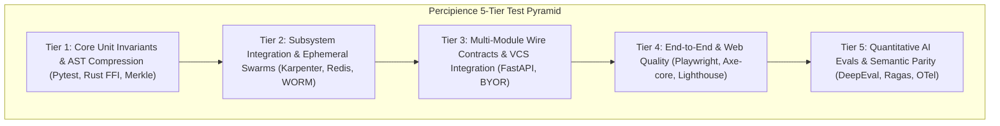

# ⚡ Percipience Master Test Plan (Concise Specification)

> **Purpose**: High-density testing specification optimized for rapid AI context ingestion, autonomous CI/CD gatekeeper integration, and determinism verification.

---

## 1. Test Pyramid & Framework Architecture



### Framework Technology Stack
- **Execution Engine**: `pytest >= 8.4.1` with `pytest-asyncio`, `pytest-mock`, `pytest-xdist`.
- **Reporting & Telemetry**: `allure-pytest >= 2.13.0`, `pytest-json-report`, OpenTelemetry GenAI W3C spans.
- **AI Evaluation**: `DeepEval / Ragas` (Faithfulness, Context Relevancy, Hallucination Freedom, G-Eval).
- **Web & E2E**: `Playwright >= 1.48.0`, `vitest >= 2.1.0`, `@axe-core/playwright` (WCAG 2.1 AA).
- **IaC Verification**: Terraform 1.7+ blueprint structure and syntax assertion harness.

---

## 2. Core Subsystem Test Catalog

```text
workplace/tests/
├── test_play3_suite.py                    ← Core 25 Subsystem Integration Tests (CAP-01 - CAP-35)
├── test_todo_capabilities.py              ← Comprehensive Capability Coverage (58 Invariant Tests)
├── test_solution_simplification.py        ← Unified 5-Point Policy Engine & Invariant Verification
├── test_runtime_guardrails.py             ← Prompt Injection, PII Sanitization, Output Guards
├── test_dynamic_dag_orchestrator.py       ← Kahn Acyclicity, Topological Dispatch, Subagent Waves
├── test_portal_commercial_provisioning.py ← Tenant Onboarding, KMS CMEK Derivation, API Keys
├── test_portal_observability_auth.py      ← Merkle DAG API, Surgical Rollback Trigger, JWT Auth
├── test_portal_swarm_governance.py        ← Swarm Authority Hierarchy, Anti-Drift Handover Gates
├── test_ide_plugins_space.py              ← VS Code LSP 3.17 & PyCharm PSI AST Invariant Tests
├── test_fleet_telemetry_finops.py         ← Workstation Daemon, Redis Heartbeats, 15% FinOps Billing
├── test_container_plan_executor.py        ← Sandboxed Docker Plan Derivation & Worktree Isolation
├── test_git_bundle_transport.py           ← Streaming Git Bundle Packaging, Zero-Cloud Clutter
├── test_tool_contract_validator.py        ← Tool Definition Schema Enforcement & Parameter Scoping
├── test_self_reflection_engine.py         ← Autonomous Retrospective Diagnosis & Self-Healing Patch
├── test_consensus_quorum_engine.py        ← Multi-Agent Voting, PBFT Quorum & Disagreement Resolution
├── test_hitl_checkpoint_manager.py        ← Human-in-the-Loop Quarantine Spool & Approval Gating
├── test_few_shot_retriever.py             ← Semantic Context Retrieval & Prompt Exemplar Dynamic Paging
├── test_agent_memory_engine.py            ← Working, Episodic, and Semantic Memory Tier Isolation
├── test_agent_capability_guard.py         ← Capability-Based Access Control (CBAC) HMAC Tokens
└── benchmarks/
    └── test_agent_benchmarks.py           ← Token Reduction, Latency Waterfalls, AST Parsing Throughput
```

---

## 3. AI-Assisted Test Automation Protocol

1. **Autonomous Test Invocation**:
   ```bash
   python3 .nb/plan/test/test_runner.py --tier all --report json,html
   ```
2. **Machine-Readable Result Output**:
   Emits `.scratch/test_reports/test_results.json` containing:
   ```json
   {
     "status": "PASSED",
     "total_tests": 250,
     "passed": 249,
     "failed": 0,
     "skipped": 1,
     "duration_seconds": 14.8,
     "semantic_parity_score": 0.985,
     "average_token_savings_pct": 58.4,
     "failures": []
   }
   ```
3. **AI Failure Diagnosis & Self-Healing SLA**:
   - If a test fails, `test_runner.py --ai-triage` invokes `workplace/core/diagnostic_reprompt.py`.
   - Synthesizes isolated AST failure diffs (70–88% token reduction, zero conversational noise).
   - Maximum 3 self-healing retry iterations before falling back to surgical rollback ($RP_k$).

---

## 4. Quality Gates & Acceptance Criteria

| Gate Metric | Target Threshold | Verification Mechanism |
| :--- | :---: | :--- |
| **Unit & Integration Pass Rate** | **100% (Zero Failures)** | `pytest workplace/tests/` |
| **6-Vector Semantic Parity** | **$S_{SP} \ge 0.95$** | `percipience drift check` |
| **AST Token Compression Ratio** | **$\ge 40.0\%$ (Avg $\ge 50\%$)** | `TokenTracker.get_summary()` |
| **AST Pruning Latency** | **$\le 120\text{ms}$** | `TreeSitterDaemon.prune()` |
| **Web Accessibility Standard** | **WCAG 2.1 AA (0 Violations)** | `axe_accessibility_test.ts` |
| **Documentation & Link Integrity** | **100% Valid (0 Broken URIs)**| `link_checker_script.sh` |
| **LLM Faithfulness & Hallucination** | **$\ge 0.90$ Faithfulness, $\ge 0.95$ Hallucination-Free** | `EvalScoringEngine` |
| **Merkle State Chain Integrity** | **Cryptographically Valid** | `MerkleEngine.verify_chain()` |

---
*Certified for CI Gatekeeper Execution via `percipience gate` Step 5/7.*
