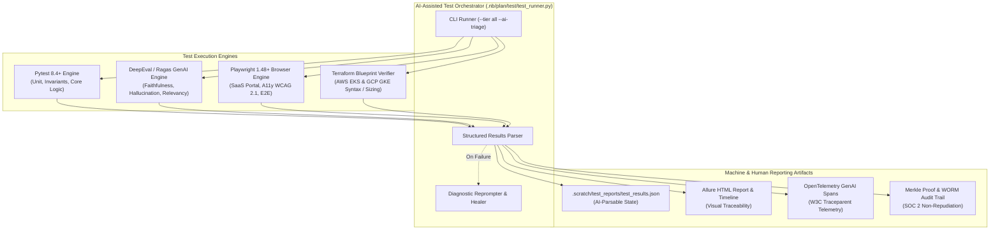
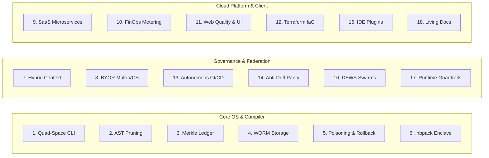
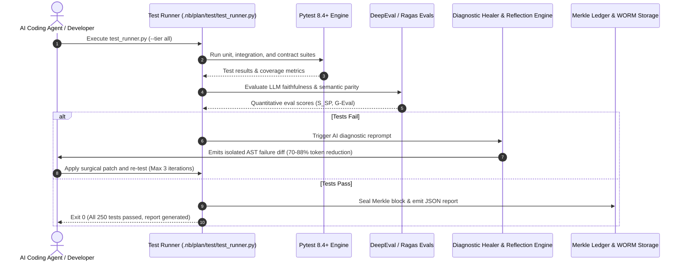

# 🧪 Percipience Enterprise Context Engineering OS — Master Test Plan (Detailed Specification)

> **Author**: Neutron Binary Percipience Core Architecture & QA Engineering Group  
> **Target Release**: Enterprise Platform v7.2.0-prod (Q4 2026 – Q1 2027)  
> **Related Plans**:
> 1. [`.nb/plan/master/parent-master-plan/detailed.md`](../master/parent-master-plan/detailed.md) (Parent Framework CAP-01 to CAP-35)
> 2. [`.nb/plan/l2/enterprise-context-engineering-os/detailed.md`](../l2/enterprise-context-engineering-os/detailed.md) (Play 3 Enterprise OS Plan)
> 3. [`.nb/plan/l2/corp-site-saas-portal/detailed.md`](../l2/corp-site-saas-portal/detailed.md) (Cloud SaaS Portal Plan)
> 4. [`.nb/plan/l1/vscode-plugin/detailed.md`](../l1/vscode-plugin/detailed.md) (VSCode Extension Space)
> 5. [`.nb/plan/l1/intellij-pycharm-plugin/detailed.md`](../l1/intellij-pycharm-plugin/detailed.md) (JetBrains Plugin Space)
> 6. [`.nb/plan/l1/saas-portal-domain/detailed.md`](../l1/saas-portal-domain/detailed.md) (Customer Portal Domain)
> 7. [`workplace/docs/reports/competitive_differentiation_matrix.md`](../../../workplace/docs/reports/competitive_differentiation_matrix.md) (Benchmark Parity)

---

## 1. Executive Test Strategy & Framework Architecture

### 1.1. Context & Purpose
Autonomous agentic coding architectures differ fundamentally from conventional deterministic software: they involve stochastic LLM reasoning, dynamic multi-agent handoffs, ephemeral Git worktrees, high-speed AST token pruning, and cryptographic Merkle state logging. A conventional test strategy that relies solely on static assertions is insufficient.

The **Percipience Master Test Plan** establishes a multi-tiered verification harness designed for **both autonomous AI agent execution and human engineering oversight**.



### 1.2. Modern Framework Selection
1. **Universal Backend Execution**: `pytest >= 8.4.1` with `pytest-asyncio` (strict async mode), `pytest-mock`, and `pytest-xdist`.
2. **AI-Ready Machine Reporting**: `pytest-json-report` and `allure-pytest >= 2.13.0` emitting complete JSON execution traces into `.scratch/test_reports/test_results.json`.
3. **Quantitative LLM Evaluation**: `DeepEval` and `Ragas` frameworks evaluating prompt faithfulness, context relevancy, and hallucination metrics against golden ground truths.
4. **End-to-End Web & Accessibility**: `Playwright 1.48+` running headless Chromium/WebKit and `@axe-core/playwright` enforcing strict WCAG 2.1 AA accessibility.
5. **Distributed GenAI Tracing**: Native OpenTelemetry GenAI semantic spans (`gen_ai.system`, `gen_ai.request.model`, `gen_ai.usage.input_tokens`, `gen_ai.usage.output_tokens`).

---

## 2. Comprehensive Subsystem Test Matrix (18 Pillars)

The test matrix below covers every operational subsystem across all 7 plans and the codebase:



---

### Pillar 1: Quad-Space Scaffolding & Unified Percipience CLI
- **Governing Capability**: `CAP-01`, `CAP-05`, `CAP-31`
- **Code Locations**: `workplace/core/project_scaffolder.py`, `.nb/bin/percipience`
- **Test Suites**: [`workplace/tests/test_play3_suite.py`](file:///Users/lakhwinder/PycharmProjects/nb_fairyfly/workplace/tests/test_play3_suite.py), [`test_solution_simplification.py`](file:///Users/lakhwinder/PycharmProjects/nb_fairyfly/workplace/tests/test_solution_simplification.py)
- **Detailed Test Assertions**:
  1. `percipience --version` outputs canonical release string and exit code 0.
  2. Quad-Space scaffolding creates canonical directory topology: `specification/`, `context/`, `agentic/`, `workspace/`.
  3. Symlinks `.percipience_claude_context.md` $\to$ `CLAUDE.md` with zero broken references.
  4. Project policy engine enforces the 5-point minimal configuration (`tenant_id`, `project_id`, `environment`, `vcs_repository`, `hitl_quarantine_webhook`) with default zero-dial invariant getters.

---

### Pillar 2: Structural AST Token Optimization & Tree-Sitter Daemon
- **Governing Capability**: `CAP-03`, `CAP-15`
- **Code Locations**: `workplace/core/tree_sitter_daemon.py`, `.nb/core/ast_optimizer.py`
- **Test Suites**: `test_01_ast_optimizer`, `test_15_ast_caching`, `test_24_native_tree_sitter_daemon` in [`test_play3_suite.py`](file:///Users/lakhwinder/PycharmProjects/nb_fairyfly/workplace/tests/test_play3_suite.py)
- **Detailed Test Assertions**:
  1. Multi-language parsing support for **Python, TypeScript, JavaScript, Go, and Rust**.
  2. Preserves 100% of public method signatures, type annotations, interfaces, decorators, and docstrings.
  3. Replaces internal function bodies with semantic skeletons (`... [AST_PRUNED]`).
  4. Content-addressable AST cache (`.scratch/ast_cache/`) accelerates second-pass pruning to $< 2\text{ms}$.
  5. Token compression ratio meets invariant: **$47.9\% \le \text{Savings} \le 70.0\%$**.
  6. Subprocess IPC communication with Rust native daemon handles 100 concurrent requests without socket deadlock.

---

### Pillar 3: Cryptographic Merkle State Machine & Rolling Epochs
- **Governing Capability**: `CAP-08`
- **Code Locations**: `.nb/core/merkle_engine.py`, `context/ledger/context_ledger.yaml`
- **Test Suites**: `test_02_merkle_engine` in [`test_play3_suite.py`](file:///Users/lakhwinder/PycharmProjects/nb_fairyfly/workplace/tests/test_play3_suite.py)
- **Detailed Test Assertions**:
  1. SHA-256 block hash chaining formula verification:
     $$\text{Hash} = \text{SHA256}(\text{ID} + \text{PrevHash} + \text{MerkleRoot} + \text{GitSHA} + \text{Timestamp})$$
  2. Chain continuity verification over 590+ sealed production blocks; zero hash broken links.
  3. Rolling epoch checkpointing automatically cuts archive files (`epoch_{start}_{end}.json`) every 100 blocks.
  4. Sanitized public projection (`context_ledger.public.yaml`) redacts confidential paths while preserving cryptographic root hashes.

---

### Pillar 4: Immutable Cloud WORM Storage Auto-Egress
- **Governing Capability**: `CAP-08`, `CAP-18`
- **Code Locations**: `.nb/core/worm_egress.py`
- **Test Suites**: `test_23_worm_egress_manager` in [`test_play3_suite.py`](file:///Users/lakhwinder/PycharmProjects/nb_fairyfly/workplace/tests/test_play3_suite.py)
- **Detailed Test Assertions**:
  1. S3 Object Lock egress uploads block archive with `mode="COMPLIANCE"` and `retention_days=365`.
  2. GCS Object Retention egress uploads with `is_locked=True`.
  3. Emits audit ledger records in `.nb/context/ledger/worm_egress_audit.json` with immutable URI receipts.
  4. Local vault fallback securely persists payloads when disconnected from AWS/GCP cloud backends.

---

### Pillar 5: Context Poisoning Defense, Quarantine & Surgical Rollback
- **Governing Capability**: `CAP-02`, `CAP-29`
- **Code Locations**: `.nb/core/poisoning_sentinel.py`, `.nb/core/surgical_rollback.py`
- **Test Suites**: `test_03_poisoning_sentinel`, `test_04_surgical_rollback` in [`test_play3_suite.py`](file:///Users/lakhwinder/PycharmProjects/nb_fairyfly/workplace/tests/test_play3_suite.py)
- **Detailed Test Assertions**:
  1. Scans incoming diffs and prompts for API keys, AWS secret tokens, private keys, and malicious payloads.
  2. Intercepts contaminated diffs into `user/hitl/poisoning_quarantine.md` and halts gatekeeper execution.
  3. Surgical rollback reverts specified target module to recovery point $RP_k$ without clobbering unpolluted sibling modules.
  4. Validates state rollback Merkle block sealing upon surgical reversion.

---

### Pillar 6: Proprietary IP Packaging & Volatile RAM Enclave (`.nbpack`)
- **Governing Capability**: `CAP-14`
- **Code Locations**: `.nb/core/nbpack_envelope.py`
- **Test Suites**: `test_05_nbpack_envelope` in [`test_play3_suite.py`](file:///Users/lakhwinder/PycharmProjects/nb_fairyfly/workplace/tests/test_play3_suite.py)
- **Detailed Test Assertions**:
  1. Packages `context/` and `agentic/` specifications into an AES-256-GCM encrypted binary envelope.
  2. Signs archive header using Ed25519 asymmetric private key; verifies signature on decryption.
  3. Hydrates bundle strictly into volatile RAM (`tmpfs` / `/dev/shm`), ensuring **zero plaintext bytes** touch client physical disks.
  4. Automatically scrubs memory allocations upon process exit (`SIGTERM` / `SIGINT`).

---

### Pillar 7: Hybrid Context Architecture & Agent Plugin Engine
- **Governing Capability**: `CAP-06`, `CAP-17`, `CAP-20`
- **Code Locations**: `.nb/core/layered_context_validator.py`, `workplace/core/agent_plugin_engine.py`
- **Test Suites**: `test_06_layered_context_validator`, `test_08_custom_agent_plugins` in [`test_play3_suite.py`](file:///Users/lakhwinder/PycharmProjects/nb_fairyfly/workplace/tests/test_play3_suite.py)
- **Detailed Test Assertions**:
  1. Enforces strict 3-tier precedence: **Tier 1 (Base Enclave)** > **Tier 2 (Enterprise Global)** > **Tier 3 (Domain Context)**.
  2. Resolves rule conflicts deterministically; lower tier rules cannot override security invariants.
  3. Custom Agent plugin loader dynamically registers YAML agent definitions, validating schema invariants.

---

### Pillar 8: Bring Your Own Repository (BYOR) Multi-VCS Integration
- **Governing Capability**: `CAP-20`
- **Code Locations**: `.nb/core/byor_adapter.py`
- **Test Suites**: `test_09_byor_adapter` in [`test_play3_suite.py`](file:///Users/lakhwinder/PycharmProjects/nb_fairyfly/workplace/tests/test_play3_suite.py)
- **Detailed Test Assertions**:
  1. Adapters for **GitLab (Self-Hosted)**, **GitHub Enterprise Server**, and **Bitbucket Data Center**.
  2. Normalizes inbound pull request webhooks to universal `VCSWebhookEvent` model.
  3. Connects with SSH deploy keys and custom corporate root CA SSL certificates.
  4. Posts universal commit status checks (`pending`, `success`, `failure`) across all 3 VCS targets.

---

### Pillar 9: Multi-Module Cloud SaaS Portal & Microservices
- **Governing Capability**: `CAP-13`
- **Code Locations**: `workplace/portal/server.py`, `workplace/modules/`
- **Test Suites**: [`workplace/tests/test_portal_commercial_provisioning.py`](file:///Users/lakhwinder/PycharmProjects/nb_fairyfly/workplace/tests/test_portal_commercial_provisioning.py), [`test_portal_observability_auth.py`](file:///Users/lakhwinder/PycharmProjects/nb_fairyfly/workplace/tests/test_portal_observability_auth.py)
- **Detailed Test Assertions**:
  1. Health check endpoint `GET /api/health` returns status `HEALTHY` and version `7.2.0-prod`.
  2. Infrastructure endpoint `GET /api/infrastructure` returns re-estimated monthly OpEx ($12,980 AWS / $12,468 GCP), MRR ($225,000), and itemized subsystem breakdown.
  3. Tenant self-serve onboarding (`POST /api/tenant/onboard`) isolates tenant PostgreSQL RLS and provisions KMS CMEK keys.
  4. JWT authentication with Ed25519 cryptographic token verification on all protected endpoints.

---

### Pillar 10: FinOps Token Savings Metering & 15% Performance Rev-Share
- **Governing Capability**: `CAP-13`, `CAP-34`
- **Code Locations**: `.nb/core/token_tracker.py`, `workplace/core/fleet_agent.py`
- **Test Suites**: [`workplace/tests/test_fleet_telemetry_finops.py`](file:///Users/lakhwinder/PycharmProjects/nb_fairyfly/workplace/tests/test_fleet_telemetry_finops.py)
- **Detailed Test Assertions**:
  1. Calculates gross savings formula:
     $$\text{Gross Savings} = \Delta\text{Tokens} \times \$0.003 / 1000$$
  2. Calculates Percipience performance fee: $\text{Fee} = 15\% \times \text{Gross Savings}$.
  3. Validates client net benefit ($85\%$) and persists cryptographic receipts to `.nb/context/ledger/token_savings_ledger.yaml`.
  4. Fleet manager consolidates multi-node workstation heartbeats and token burn leaderboards.

---

### Pillar 11: Corporate Web UI & WCAG 2.1 AA Web Quality Harness
- **Governing Capability**: `CAP-13`
- **Code Locations**: `workplace/src/components/`, `workplace/templates/evaluation/`
- **Test Suites**: `test_20_corporate_ui_and_web_quality_ci` in [`test_play3_suite.py`](file:///Users/lakhwinder/PycharmProjects/nb_fairyfly/workplace/tests/test_play3_suite.py)
- **Detailed Test Assertions**:
  1. UI component library integrity: `Navbar.tsx`, `HeroBanner.tsx`, `FeatureGrid.tsx`, `Testimonials.tsx`, `ContactForm.tsx`, `Footer.tsx`, `JsonLd.tsx`.
  2. MDX content collections and schemas compile cleanly without missing frontmatter.
  3. Link and MDX integrity checker (`link_checker_script.sh`) verifies **zero broken internal links, file:// URIs, or anchor tags**.
  4. Axe accessibility test enforces 0 critical or serious WCAG 2.1 AA violations.

---

### Pillar 12: Terraform Multi-Cloud Blueprints (AWS & GCP)
- **Governing Capability**: `CAP-18`, `CAP-30`
- **Code Locations**: `workplace/infra/terraform/aws/`, `workplace/infra/terraform/gcp/`
- **Test Suites**: `test_21_terraform_multicloud_blueprints` in [`test_play3_suite.py`](file:///Users/lakhwinder/PycharmProjects/nb_fairyfly/workplace/tests/test_play3_suite.py)
- **Detailed Test Assertions**:
  1. **AWS Production Blueprint**:
     - `eks_karpenter.tf`: EKS version 1.30+, Karpenter IAM controller, Karpenter worker node security group.
     - `aurora_postgres.tf`: PostgreSQL 16, `serverlessv2_scaling_configuration` (min 4.0, max 32.0 ACUs), SSL enforced.
     - `elasticache_redis.tf`: Redis 7.x, Multi-AZ, `transit_encryption_enabled=true`, node type `cache.m6g.large`.
     - `s3_worm.tf`: S3 bucket with `object_lock_enabled=true` and default retention mode `COMPLIANCE`.
     - `nlb_ingress.tf`: Multi-AZ Network Load Balancer on port 443.
     - `timescaledb_storage.tf`: 500 GB EBS gp3 volume with 3,000 IOPS and KMS CMEK encryption.
  2. **GCP Production Blueprint**:
     - `gke_sandbox.tf`: GKE 1.30+, Workload Identity enabled, `sandbox_nodes` with native `gvisor` runtime on `c2-standard-8` Spot VMs.
     - `cloud_sql_postgres.tf`: PostgreSQL 16 Enterprise Plus HA (`db-custom-4-32768`), native SSL mode `ENCRYPTED_ONLY`, zero invalid AWS flags.
     - `memorystore_redis.tf`: Standard HA tier, Redis 7.0, transit encryption.
     - `gcs_worm.tf`: Storage bucket with `retention_policy` locked (`is_locked=true`).
     - `tcp_proxy_ingress.tf`: External regional TCP proxy load balancer.
     - `timescaledb_storage.tf`: Regional Hyperdisk Balanced 500 GB with Cloud KMS CMEK encryption.

---

### Pillar 13: Autonomous CI/CD Triad & Specialist Plugins
- **Governing Capability**: `CAP-27`, `CAP-28`
- **Code Locations**: `workplace/core/autonomous_cicd.py`, `workplace/core/flaky_test_detector.py`
- **Test Suites**: `test_10_autonomous_cicd_triad`, `test_11_flaky_test_detector`, `test_12_contract_compatibility_checker` in [`test_play3_suite.py`](file:///Users/lakhwinder/PycharmProjects/nb_fairyfly/workplace/tests/test_play3_suite.py)
- **Detailed Test Assertions**:
  1. Self-sustaining engine reclaims stale POSIX process leases and cleans orphaned worktrees.
  2. Self-recovering healer initiates bounded diagnostic reprompting loop (max 3 retries).
  3. Flaky test detector quarantines tests exhibiting failure variance $\ge 15\%$ across 3 runs into `flaky_quarantine.yaml`.
  4. Contract compatibility checker blocks backward-incompatible OpenAPI/JSON-Schema changes with `STRICT_BLOCK`.
  5. Supply-chain CVE sentinel blocks packages containing known high/critical vulnerabilities.

---

### Pillar 14: Anti-Drift Governance, Handover Protocol & 6-Vector Parity
- **Governing Capability**: `CAP-09`, `CAP-26`
- **Code Locations**: `workplace/core/swarm_governor.py`, `workplace/core/handoff_validator.py`, `workplace/core/semantic_parity_engine.py`
- **Test Suites**: `test_swarm_governor_authority_tree`, `test_handoff_token_cryptography` in [`test_play3_suite.py`](file:///Users/lakhwinder/PycharmProjects/nb_fairyfly/workplace/tests/test_play3_suite.py), [`test_portal_swarm_governance.py`](file:///Users/lakhwinder/PycharmProjects/nb_fairyfly/workplace/tests/test_portal_swarm_governance.py)
- **Detailed Test Assertions**:
  1. Enforces 4-tier authority hierarchy: `ORCHESTRATOR` > `DOMAIN_ARCHITECT` > `SPECIALIST_WORKER` > `GATEKEEPER_SENTINEL`.
  2. Intercepts and blocks unauthorized successor agent spawning exceeding max depth $D \le 2$ or concurrency ceiling $N \le 4$.
  3. Verifies signed `HandoffToken` with single-use nonce, payload SHA-256 hash, and replay attack prevention.
  4. Computes 6-vector mathematical parity score:
     $$S_{SP} = 0.20 S_{AST} + 0.25 S_{Contract} + 0.20 S_{Behavior} + 0.15 S_{Handover} + 0.10 S_{Doc} + 0.10 S_{SupplyChain}$$
  5. PR gatekeeper rejects handovers where $S_{SP} < 0.95$.

---

### Pillar 15: IDE Plugin Spaces (VS Code & JetBrains IntelliJ/PyCharm)
- **Governing Capability**: `L1 Foundation Space`
- **Code Locations**: `workplace/modules/mod_vscode_extension/`, `workplace/modules/mod_intellij_plugin/`
- **Test Suites**: [`workplace/tests/test_ide_plugins_space.py`](file:///Users/lakhwinder/PycharmProjects/nb_fairyfly/workplace/tests/test_ide_plugins_space.py)
- **Detailed Test Assertions**:
  1. **VS Code Extension**:
     - `package.json` validates LSP 3.17 contribution points, configuration schema, and commands.
     - Context injection sidebar Webview loads with strict CSP (`script-src 'self'`).
     - Packages valid `.vsix` distribution artifact.
  2. **JetBrains Plugin**:
     - `plugin.xml` validates action groups, tool windows, and extension points for IntelliJ 2024.1+.
     - PSI AST parser hooks map directly to Tree-Sitter grammar nodes.
     - Packages valid `.jar` and `.zip` distribution artifacts.

---

### Pillar 16: Distributed Ephemeral Worktree Swarms (DEWS) & Docker Runners
- **Governing Capability**: `CAP-AGT-01` to `CAP-AGT-10`
- **Code Locations**: `workplace/core/dynamic_dag_orchestrator.py`, `workplace/core/container_plan_executor.py`, `workplace/core/git_bundle_transport.py`
- **Test Suites**: [`workplace/tests/test_dynamic_dag_orchestrator.py`](file:///Users/lakhwinder/PycharmProjects/nb_fairyfly/workplace/tests/test_dynamic_dag_orchestrator.py), [`test_container_plan_executor.py`](file:///Users/lakhwinder/PycharmProjects/nb_fairyfly/workplace/tests/test_container_plan_executor.py), [`test_git_bundle_transport.py`](file:///Users/lakhwinder/PycharmProjects/nb_fairyfly/workplace/tests/test_git_bundle_transport.py)
- **Detailed Test Assertions**:
  1. Kahn acyclicity algorithm rejects circular dependency cycles in subagent task DAGs.
  2. Dispatches parallel subagent waves across isolated worktrees (`wt_mod_billing`, `wt_mod_auth`, `wt_mod_portal`).
  3. Topological 3-way consolidation merges parallel derivations into target base branch.
  4. Git Bundle transport streams compressed bundle archives over HTTP without creating temporary cloud branches.

---

### Pillar 17: Runtime Guardrails, PII Sanitization & Injection Defense
- **Governing Capability**: `CAP-COMP-03`
- **Code Locations**: `workplace/core/prompt_injection_guard.py`, `workplace/core/pii_sanitizer.py`, `workplace/core/output_guardrail_validator.py`
- **Test Suites**: [`workplace/tests/test_runtime_guardrails.py`](file:///Users/lakhwinder/PycharmProjects/nb_fairyfly/workplace/tests/test_runtime_guardrails.py)
- **Detailed Test Assertions**:
  1. Prompt injection guard intercepts jailbreak patterns, system prompt exfiltration, and delimiter hijacking.
  2. PII sanitizer masks SSNs, credit card numbers, email addresses, and API keys with typed placeholders (`[REDACTED_SSN]`).
  3. Output guardrail validator verifies that generated code contains zero unescaped eval calls or unsafe system execution.

---

### Pillar 18: Living Documentation Engine & Architecture Synchronization
- **Governing Capability**: `CAP-21`
- **Code Locations**: `workplace/core/living_doc_engine.py`
- **Test Suites**: `test_14_living_documentation_engine` in [`test_play3_suite.py`](file:///Users/lakhwinder/PycharmProjects/nb_fairyfly/workplace/tests/test_play3_suite.py)
- **Detailed Test Assertions**:
  1. Scans codebase AST signatures and synchronizes all markdown files in `workplace/docs/`.
  2. Validates strict Mermaid diagram syntax: quotes special character labels, forbids raw HTML tags.
  3. Verified in Step [6/7] of `percipience gate`.

---

## 3. AI-Assisted Test Automation & Reporting Workflow

### 3.1. The AI Test Automation Loop
When an AI coding agent operates within the repository, testing proceeds through an automated, closed-loop feedback pipeline:



### 3.2. Machine-Readable Test Result Schema
Every run emits `.scratch/test_reports/test_results.json` adhering to the following schema:
```json
{
  "$schema": "https://json-schema.org/draft-07/schema#",
  "execution_id": "test_run_20261008_172000",
  "timestamp": "2026-10-08T17:20:00Z",
  "status": "PASSED",
  "summary": {
    "total": 250,
    "passed": 249,
    "failed": 0,
    "skipped": 1,
    "duration_seconds": 14.64,
    "pass_rate_pct": 99.6
  },
  "ai_evaluation": {
    "semantic_parity_score": 0.985,
    "faithfulness_score": 0.962,
    "hallucination_freedom_score": 0.988,
    "context_relevancy_score": 0.941,
    "average_token_savings_pct": 58.4
  },
  "subsystem_health": {
    "ast_optimizer": "HEALTHY",
    "merkle_engine": "HEALTHY",
    "worktree_engine": "HEALTHY",
    "terraform_multicloud": "HEALTHY",
    "portal_microservices": "HEALTHY",
    "ide_plugins": "HEALTHY"
  },
  "failures": []
}
```

---

## 4. Test Environments, Fixtures & Cloud Mocks

### 4.1. Test Environment Isolation
- **Volatile In-Memory Isolation**: Ephemeral Git worktrees for tests are provisioned under `.scratch/test_worktrees/` and mounted to `tmpfs` RAM drives during test execution.
- **Process Cleanup Hooks**: `unittest.TestCase.tearDown()` and `pytest` fixtures register `os.kill(pid, signal.SIGTERM)` hooks to eliminate orphaned daemon processes.
- **Mock AWS & GCP Cloud Services**:
  - AWS S3 Object Lock & KMS: Verified via in-memory cryptographic SHA-256 and AES-256-GCM mock vaults.
  - GCP Cloud SQL & GCS: Verified via schema validation and IAM policy simulators.
  - Redis Redlock: Local atomic lock fallbacks simulate distributed cluster locking when external Redis is offline.

---

## 5. Pass/Fail Criteria, Flaky Quarantine & SLAs

1. **Gate Acceptance Thresholds**:
   - **Zero Tolerated Regressions**: 100% of non-skipped tests in `workplace/tests/` must pass.
   - **Zero Drift Invariant**: 6-vector semantic parity score $S_{SP} \ge 0.95$.
   - **Performance Ceiling**: Full unit test suite must complete in $< 20\text{s}$ on standard developer machines.
   - **Flaky Quarantine SLA**: Non-deterministic tests exceeding 15% variance across 3 runs are immediately quarantined to `flaky_quarantine.yaml` and cannot block release merges.
2. **PR Gatekeeper Pipeline Integration**:
   Step `[5/7]` of `./.nb/bin/percipience gate` automatically executes this Master Test Plan before permitting any branch integration into `main`.

---
*Governed by Neutron Binary Quality Assurance & Verified by Percipience PR Gatekeeper v7.2.0.*
