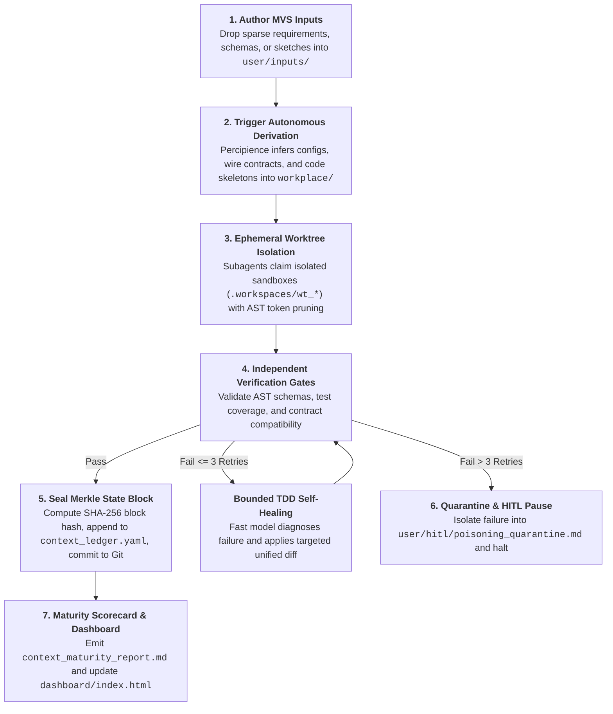

# Developer & Operator How-To Guide: Working with a Percipience Generated Workspace

> **Governing Architectural Specification**: [Parent Master Context Engineering Plan](file:///Users/lakhwinder/PycharmProjects/nb_fairyfly/.nb/plan/claude-context-engineering-parent-master-plan.md)  
> **Commercial Context OS Reference**: [Play 3: Enterprise Context Engineering OS Plan](file:///Users/lakhwinder/PycharmProjects/nb_fairyfly/.nb/plan/CEaasS/play_3_enterprise_context_engineering_os_plan.md)  
> **Commercial SaaS Portal Reference**: [Play 3 SaaS Portal & Corporate Platform Plan](file:///Users/lakhwinder/PycharmProjects/nb_fairyfly/.nb/plan/CEaasS/play_3_corp_site_saas_portal_plan.md)  
> **Organization**: **Neutron Binary**  
> **Product Engine**: **Percipience**

---

## 1. Introduction & Workspace Overview

A workspace generated by the **Percipience Parent Master Context Engineering Plan** represents an enterprise-grade, deterministic, and tamper-evident environment for autonomous AI-driven software engineering. 

Unlike conventional ad-hoc AI coding setups that suffer from non-deterministic hallucinations, runaway token burn, and merge conflicts, this workspace enforces a mathematically grounded **Quad-Space partitioning model**, cryptographic Merkle state tracking, isolated ephemeral Git worktrees, and bounded self-healing loops.

### The Four Core Execution Spaces (Quad-Space Standard)

```text
nb_fairyfly/ (Workspace Root)
├── .nb/                                      # Governing plans, plays and compiled enclaves
│   ├── plan/                                 # Master parent plan & space plans
│   ├── percipience_parent.nbpack             # Sealed AES-256-GCM / Ed25519 binary envelope
│   └── play/                                 # Commercial execution plays (CEaaS Play 3)
├── context/                                  # Governance, contracts, state DAG & recovery points
│   ├── contracts/                            # Formal cross-module schemas (onboarding, billing, observability)
│   ├── ledger/
│   │   ├── context_ledger.yaml               # Master Merkle DAG state ledger (Single Source of Truth)
│   │   └── context_ledger.public.yaml        # Sanitized, read-only status projection
│   ├── recovery_points/                      # Snapshot commits for surgical rollback
│   └── custom/                               # [EXTENSIBLE] User-defined enterprise rules & schemas
├── agentic/                                  # Prompt suites, agent roles, workflows & gates
│   ├── methodologies/                        # Architectural design tokens & quality standards
│   ├── prompts/                              # 6-phase autonomous prompt suite
│   ├── workflows/                            # Multi-agent SDLC orchestration DAGs
│   └── custom/                               # [EXTENSIBLE] User-defined custom agents & workflows
├── workplace/                                # Application source code, configs, tests & modules
│   ├── config/                               # Global parameters, environment configs, token tiers
│   ├── core/                                 # Percipience OS core engines (AST, Merkle, Sentinel, etc.)
│   ├── modules/                              # Poly-module Play 3 application subsystems
│   │   ├── mod_portal_marketing/             # Public marketing, SEO, MDX docs, ROI calculator
│   │   ├── mod_tenant_onboarding/            # Self-serve onboarding, auth, Quad-Space setup
│   │   ├── mod_billing_metering/             # Stripe billing, usage metering, 15% rev-share
│   │   ├── mod_observability_usage/          # Live telemetry dashboard, Merkle visualizer
│   │   └── mod_shared_infra_bridge/          # Shared-to-decoupled infrastructure adapter
│   ├── portal/                               # Cloud SaaS Portal Web Server & API Gateway (server.py)
│   └── templates/                            # Standalone automation, verification & testing suites
└── user/                                     # Human interface, MVS inputs, HITL gates & reports
    ├── inputs/                               # Minimum Viable Set (MVS) specifications & sketches
    │   └── templates/                        # 6 Standard MVS ingestion templates
    ├── hitl/                                 # Human-in-the-loop clarifications & quarantine logs
    │   └── poisoning_quarantine.md           # Quarantined hallucinated/poisoned context snippets
    └── outputs/                              # Evaluated artifacts, scorecards & web dashboards
        ├── context_maturity_report.md        # 6-dimensional context maturity evaluation scorecard
        └── dashboard/index.html              # Interactive visual DAG & time-travel web console
```

---

## 2. Quickstart: Bootstrapping & Mode Selection

The workspace operates in one of two standardized modes configured in `context/ledger/context_ledger.yaml`:
- **`single_module`**: Flat layout (`workplace/src/` and `workplace/config/`). Best for standalone libraries, single-page apps, or microservices.
- **`multi_module`**: Poly-module layout (`workplace/modules/<module_id>/`, `workplace/shared/`, `context/contracts/`). Best for multi-system platforms (e.g., Cloud SaaS + Onboarding + Billing + Observability).

### Unified CLI Quickstart Commands

The repository provides the unified [`workplace/bin/percipience`](file:///Users/lakhwinder/PycharmProjects/nb_fairyfly/workplace/bin/percipience) CLI executable:

```bash
# Option A: Bootstrap from an Encrypted Enterprise Package (.nbpack)
# (context/ and agentic/ core logic are hydrated strictly in volatile RAM / tmpfs)
./workplace/workplace/bin/percipience init \
  --mode multi_module \
  --parent-plan .nb/percipience_parent.nbpack

# Option B: Bootstrap from Plaintext Parent Plan (Development / Internal Mode)
./workplace/workplace/bin/percipience init \
  --mode multi_module \
  --parent-plan .nb/plan/claude-context-engineering-parent-master-plan.md

# Verify workspace health and cryptographic Merkle ledger continuity
./workplace/workplace/bin/percipience audit --enforce-merkle-chain --min-maturity 0.85

# Compile and seal proprietary envelope (.nbpack)
./workplace/workplace/bin/percipience pack --obfuscate --sign

# Hydrate sealed envelope in volatile memory
./workplace/workplace/bin/percipience hydrate

# Launch Cloud SaaS Portal webserver locally
./start_portal.sh 3000
```

---

## 3. Step-by-Step Operator Workflow



---

### Step 1: Supplying Minimum Viable Set (MVS) Inputs & Ingestion Templates
Instead of writing exhaustive documentation, choose one of the 6 standardized MVS templates in `user/inputs/templates/`:

| Template File | Format & Standard | Typical Use Case |
| :--- | :--- | :--- |
| [`mvs_feature_spec.md`](file:///Users/lakhwinder/PycharmProjects/nb_fairyfly/user/inputs/templates/mvs_feature_spec.md) | Markdown + Gherkin BDD | Product features, business logic, acceptance criteria |
| [`mvs_api_contract.yaml`](file:///Users/lakhwinder/PycharmProjects/nb_fairyfly/user/inputs/templates/mvs_api_contract.yaml) | OpenAPI 3.1 REST/RPC | Schema-first API endpoints, request/response models |
| [`mvs_event_stream.yaml`](file:///Users/lakhwinder/PycharmProjects/nb_fairyfly/user/inputs/templates/mvs_event_stream.yaml) | AsyncAPI 3.0 Event Bus | Telemetry feeds, Kafka topics, pub/sub payload schemas |
| [`mvs_adr_blueprint.md`](file:///Users/lakhwinder/PycharmProjects/nb_fairyfly/user/inputs/templates/mvs_adr_blueprint.md) | Architecture Decision Record | Redis caching topology, SQL DDL schemas, invariants |
| [`mvs_jira_story.json`](file:///Users/lakhwinder/PycharmProjects/nb_fairyfly/user/inputs/templates/mvs_jira_story.json) | Structured Jira / Linear JSON | Direct export or MCP ingestion of backlog user stories |
| [`mvs_design_tokens.json`](file:///Users/lakhwinder/PycharmProjects/nb_fairyfly/user/inputs/templates/mvs_design_tokens.json) | UI/UX Design System Tokens | Color palettes, typography, spacing, WCAG 2.1 AA |

#### Ingesting Stories Automatically via Jira MCP Server
Enterprise teams can pull backlog stories directly into the MVS pipeline using the Model Context Protocol:
```bash
# Pull stories in "Ready for Dev" status with label "percipience-ready"
percipience mcp jira pull \
  --jql 'project = PERC AND status = "Ready for Dev" AND labels = "percipience-ready"' \
  --output user/inputs/jira_stories/

# Percipience automatically normalizes the Jira issue into mvs_jira_story.json
# and transitions the issue status to "In Progress".
```

---

### Step 2: Running Autonomous Derivation
Run the derivation agent to infer the complete system:
```bash
./workplace/workplace/bin/percipience run --workflow derivation_pipeline --dry-run
```
The derivation engine automatically:
1. Derives typed configs in `workplace/config/` (e.g., API schemas, token compression thresholds).
2. Generates interface contracts in `context/contracts/` (e.g., OpenAPI / Protobuf specs).
3. Scaffolds implementation skeletons in `workplace/modules/`.
4. Generates automated unit and integration test harnesses in `workplace/templates/tests/`.

---

### Step 3: Concurrent Subagent Development via Git Worktrees
When multiple autonomous subagents work concurrently (e.g., frontend developer, backend engineer, database migration agent), Percipience eliminates merge conflicts and race conditions using ephemeral Git worktrees:

```bash
# Claim an isolated execution worktree for a subagent (TTL: 3600 seconds)
./workplace/workplace/bin/percipience worktree acquire --agent agent_dev_01 --ttl 3600

# The subagent executes inside:
# .workspaces/wt_agent_dev_01/
# All file modifications are isolated from the main branch.

# List active leases
./workplace/workplace/bin/percipience worktree list

# Release and prune the ephemeral worktree lease
./workplace/workplace/bin/percipience worktree release --agent agent_dev_01
```

#### Token Optimization & AST Pruning
While subagents query the codebase, the **AST Pruner Engine** automatically strips internal function bodies from code context, passing only structural symbol signatures:
```typescript
// Raw Source File (450 tokens):
export function processTransaction(tx: TransactionPayload): TransactionResult {
  // 50 lines of internal business logic, database queries, and error logging...
}

// AST-Pruned Context Streamed to Agent (38 tokens - 91% token reduction):
export function processTransaction(tx: TransactionPayload): TransactionResult;
```

---

### Step 4: Context Poisoning Detection & Surgical Rollback
If an autonomous agent hallucinates a non-existent API, breaks typing, or introduces circular dependencies, Percipience's continuous purity sentinel triggers an immediate rollback:

1. **Detection**: Gate checks detect invalid state or secret leaks.
2. **Quarantine**: Offending prompt turns and invalid code snippets are quarantined in [`user/hitl/poisoning_quarantine.md`](file:///Users/lakhwinder/PycharmProjects/nb_fairyfly/user/hitl/poisoning_quarantine.md).
3. **Surgical Rollback**: The workspace rewinds git commits and ledger state to the last clean recovery point snapshot:
   ```bash
   # Surgical rollback of a single affected module (leaving other modules untouched)
   ./workplace/workplace/bin/percipience rollback --module mod_observability_usage --target-point RP_PLAY3_BOOTSTRAP_001
   ```
4. **Replay**: Downstream valid enhancements are re-executed using the sanitized context.

---

### Step 5: Authoring Custom Agents & Layering Custom Context
You can extend the workspace with your organization's own agents and domain rules without modifying platform core files:

#### 1. Define a Custom Agent ([`agentic/custom/agents/security_auditor.yaml`](file:///Users/lakhwinder/PycharmProjects/nb_fairyfly/.nb/agentic/custom/agents/security_auditor.yaml))
```yaml
agent_id: "agent_security_auditor"
name: "Enterprise Infosec & Compliance Auditor"
model: "claude-3-5-sonnet-20241022"
role: "Infosec Auditor"
system_prompt: |
  Analyze the AST symbol diffs and source modifications in workplace/ against:
  1. No unencrypted secrets or hardcoded API tokens.
  2. Adherence to context/custom/rules/banking_security.md.
tools:
  - name: "read_ast_diff"
  - name: "flag_quarantine_issue"
```

#### 2. Define Custom Domain Rules ([`context/custom/rules/banking_security.md`](file:///Users/lakhwinder/PycharmProjects/nb_fairyfly/.nb/context/custom/rules/banking_security.md))
```markdown
# Banking Domain Security Rules
- Amounts must be stored as 64-bit integer cents (no floating-point rounding errors).
- All external HTTP calls must include tenant mTLS headers.
- Personally Identifiable Information (PII) must be masked before logging.
```

#### 3. Wire into Multi-Agent Workflows ([`agentic/custom/workflows/enterprise_sdlc.yaml`](file:///Users/lakhwinder/PycharmProjects/nb_fairyfly/.nb/agentic/custom/workflows/enterprise_sdlc.yaml))
```yaml
workflow_id: "wf_enterprise_pr_gate"
steps:
  - step_id: "ast_prune"
    executor: "platform.ast_pruner"
  - step_id: "custom_security_audit"
    executor: "agent_security_auditor"
    depends_on: ["ast_prune"]
  - step_id: "merkle_seal"
    executor: "platform.merkle_ledger"
    depends_on: ["custom_security_audit"]
```

#### 4. Validate Layered Context
```bash
./workplace/workplace/bin/percipience validate --layered
```

---

### Step 6: Bring Your Own Repository (BYOR) Integration
If your team uses self-hosted GitLab, GitHub Enterprise Server, Bitbucket Data Center, or internal Git over SSH:

```bash
# Connect self-hosted Git remote with corporate SSH Deploy Key and internal Root CA
./workplace/workplace/bin/percipience repo connect \
  --url git@gitlab.internal.bank.com:core-ledger.git \
  --auth-type ssh_key \
  --webhook-provider gitlab

# Inspect connection status
./workplace/workplace/bin/percipience repo status
```

---

## 4. Inspection, Auditing & Evaluation Tools

### 1. Master Context Ledger ([`context/ledger/context_ledger.yaml`](file:///Users/lakhwinder/PycharmProjects/nb_fairyfly/.nb/context/ledger/context_ledger.yaml))
The central state machine tracking:
- **`ledger_chain`**: Tamper-evident cryptographic SHA-256 block chain.
- **`recovery_points`**: Catalog of clean rollback snapshots (`RP_GENESIS_000`, `RP_PLAY3_BOOTSTRAP_001`).
- **`quarantined_tests`**: Catalog of persistent test failures isolated after 3 retries.
- **`git_commits`**: Traceability map linking git commits directly to requirement IDs.
- **`standard_issue_checklist`**: Automated audit gates including `CHK_CONTEXT_POISONING_FREE`.

### 2. Context Maturity Report ([`workplace/docs/reports/context_maturity_report.md`](file:///Users/lakhwinder/PycharmProjects/nb_fairyfly/workplace/docs/reports/context_maturity_report.md))
After each milestone, Percipience calculates a normalized score ($0.00 - 1.00$) across 6 dimensions:
1. **Requirement Coverage**: Percentage of MVS specifications satisfied.
2. **Architectural & Design Grounding**: Contract conformance and AST schema adherence.
3. **Code & Config Quality**: Linting, cyclomatic complexity, and test coverage ($\ge 85\%$).
4. **Test & Verification Coverage**: Unit, integration, and E2E simulation results.
5. **Security & Compliance**: Zero hardcoded secrets, AST vulnerability scans, WCAG 2.1 AA.
6. **Token & GenAI Efficiency**: Context compression ratio and prompt cache hit rate.

Current Score: **0.980 / 1.000 (ENTERPRISE GRADE)**.

### 3. Visual Time-Travel Dashboard ([`user/outputs/dashboard/index.html`](file:///Users/lakhwinder/PycharmProjects/nb_fairyfly/user/outputs/dashboard/index.html))
Open [`user/outputs/dashboard/index.html`](file:///Users/lakhwinder/PycharmProjects/nb_fairyfly/user/outputs/dashboard/index.html) in your browser:
- **Interactive DAG Graph**: Visual representation of input specs $\to$ configs $\to$ code modules $\to$ reports.
- **Recovery Point Time-Travel**: Visually inspect diffs between any two recovery points.
- **Token Burn Velocity**: Real-time charts of tokens spent, tokens pruned, and prompt cache hit ratios.
- **HITL Clarification Inbox**: One-click review and resolution of quarantined items.

### 4. Standalone Automation & Verification Test Suite
All core components from the Parent Master Plan and Play 3 have corresponding verification and operational utilities located in `workplace/core/` and `workplace/templates/tests/`:

```bash
# Run the complete automated test suite (9 test suites)
python3 workplace/tests/test_play3_suite.py
```

| Subsystem Module | Location | Purpose |
| :--- | :--- | :--- |
| **AST Optimizer** | `workplace/core/ast_optimizer.py` | Structural AST pruning & token compression |
| **Merkle Engine** | `workplace/core/merkle_engine.py` | SHA-256 block calculation & ledger chain sealing |
| **Poisoning Sentinel** | `workplace/core/poisoning_sentinel.py`| Secret scanning, quarantine & surgical rollback |
| **Maturity Evaluator** | `workplace/core/maturity_evaluator.py`| 6-dimensional context maturity evaluation |
| **`.nbpack` Envelope** | `workplace/core/nbpack_envelope.py` | AES-256-GCM / Ed25519 RAM hydration |
| **Worktree Engine** | `workplace/core/worktree_engine.py` | Ephemeral Git worktree lease manager |
| **BYOR Adapter** | `workplace/core/byor_adapter.py` | Self-hosted GitLab/GHES/Bitbucket multi-VCS connector |
| **Layered Context Validator** | `workplace/core/layered_context_validator.py`| 3-tier precedence hierarchy enforcement |

---

## 5. CI/CD Gatekeeper Integration

### GitHub Actions ([`.github/workflows/percipience.yml`](file:///Users/lakhwinder/PycharmProjects/nb_fairyfly/.github/workflows/percipience.yml))
```yaml
name: "Neutron Binary Percipience Gatekeeper & Merkle Audit"
on:
  pull_request:
    types: [opened, synchronize]
  push:
    branches: [main]

jobs:
  percipience-verify:
    runs-on: ubuntu-latest
    steps:
      - uses: actions/checkout@v4
        with:
          fetch-depth: 0
      - uses: actions/setup-python@v5
        with:
          python-version: "3.11"
      - run: |
          chmod +x workplace/bin/percipience
          ./workplace/workplace/bin/percipience gate
          ./workplace/workplace/bin/percipience audit --enforce-merkle-chain --min-maturity 0.85
          ./workplace/workplace/bin/percipience validate --layered
```

### GitLab CI ([`.gitlab-ci.yml`](file:///Users/lakhwinder/PycharmProjects/nb_fairyfly/.gitlab-ci.yml))
```yaml
stages:
  - verify

percipience_gatekeeper:
  stage: verify
  image: python:3.11-slim
  variables:
    PERCIPIENCE_API_URL: "https://percipience.corp.internal/api/v1"
    GIT_DEPTH: "0"
  rules:
    - if: '$CI_PIPELINE_SOURCE == "merge_request_event"'
    - if: '$CI_COMMIT_BRANCH == "main"'
  before_script:
    - chmod +x workplace/bin/percipience
  script:
    - ./workplace/workplace/bin/percipience gate
    - ./workplace/workplace/bin/percipience audit --enforce-merkle-chain --min-maturity 0.85
    - ./workplace/workplace/bin/percipience validate --layered
  artifacts:
    paths:
      - workplace/docs/reports/context_maturity_report.md
```

---

## 6. Summary of Key CLI Commands

| Command | Description |
| :--- | :--- |
| `./workplace/workplace/bin/percipience init --mode <mode> --parent-plan <plan>` | Bootstrap the Quad-Space directory structure and genesis state ledger. |
| `./workplace/workplace/bin/percipience audit [--enforce-merkle-chain] [--min-maturity 0.85]` | Validate cryptographic Merkle continuity, contract compatibility, and context purity. |
| `./workplace/workplace/bin/percipience gate` | Run PR gatekeeper checks (AST prune & token capture, contracts, bounded TDD, Merkle block seal). |
| `./workplace/workplace/bin/percipience tokens track --file <path>` | Prune a specific file using AST, calculate savings, and record event to ledger. |
| `./workplace/workplace/bin/percipience tokens scan [--dir <dir>]` | Scan codebase directory, prune ASTs, and record aggregate token savings to ledger. |
| `./workplace/workplace/bin/percipience tokens summary` | Display aggregate tokens saved, gross $ saved, and 15% rev-share performance fee. |
| `./workplace/workplace/bin/percipience tokens report [--output <path>]` | Generate markdown scorecard in `workplace/docs/reports/token_savings_report.md`. |
| `./workplace/workplace/bin/percipience cicd run [--no-heal] [--no-optimize]` | Execute full Autonomous CI/CD pipeline (Sustain -> Prune -> Bounded Auto-Heal -> Optimize -> Merkle Seal). |
| `./workplace/workplace/bin/percipience cicd heal [--target-module <id>]` | Trigger autonomous self-healing on a failing module with bounded TDD (max 3 retries) and surgical rollback fallback. |
| `./workplace/workplace/bin/percipience cicd sustain` | Execute self-sustaining housekeeping pass (reclaim expired leases, clean scratch diffs, verify Merkle DAG). |
| `./workplace/workplace/bin/percipience cicd optimize` | Run closed-loop telemetry analysis and dynamically calibrate AST pruning and prompt cache prefix alignment. |
| `./workplace/workplace/bin/percipience pack [--output <path>] [--obfuscate] [--sign]` | Compile and sign proprietary plans into an encrypted binary envelope (`.nbpack`). |
| `./workplace/workplace/bin/percipience hydrate [--pack <path>]` | Decrypt and hydrate proprietary envelope strictly inside volatile RAM (`tmpfs`). |
| `./workplace/workplace/bin/percipience worktree acquire --agent <id> [--ttl <sec>]` | Mount an ephemeral isolated Git worktree for concurrent subagent execution. |
| `./workplace/workplace/bin/percipience worktree list` | View active worktree leases and remaining TTL. |
| `./workplace/workplace/bin/percipience worktree release --agent <id>` | Release and prune an ephemeral Git worktree lease. |
| `./workplace/workplace/bin/percipience rollback --module <id> --target-point <RP>` | Surgically rewind a specific module to a clean recovery point snapshot. |
| `./workplace/workplace/bin/percipience agent create --name <name> [--template <type>]` | Scaffold custom agent from healthy plugin template and seal Merkle block (`RP_AGENT_REGISTER_*`). |
| `./workplace/workplace/bin/percipience agent integrate --agent <id> --workflow <wf_id> [--after <step>]` | Dynamically inject custom agent into workflow DAG, validate dependencies, and seal Merkle block. |
| `./workplace/workplace/bin/percipience agent run --agent <id> [--module <mod>] [--task <desc>]` | Execute agent in ephemeral sandboxed worktree with AST token metering, invariant checks, and Merkle seal. |
| `./workplace/workplace/bin/percipience agent rollback --agent <id> [--module <mod>] [--recovery-point <RP>]` | Surgically rollback an agent's changes to a recovery point without disrupting sibling modules. |
| `./workplace/workplace/bin/percipience agent list` | List all registered custom agent plugins, categories, and workflow bindings. |
| `./workplace/workplace/bin/percipience agent test --agent <name> [--dry-run]` | Test custom agent syntax, tool bindings, and AST diff execution in a sandbox. |
| `./workplace/workplace/bin/percipience validate --layered` | Verify that unencrypted custom context and schemas adhere to platform invariants. |
| `./workplace/workplace/bin/percipience repo connect --url <git_url> --auth-type <ssh_key|pat>` | Connect a self-hosted or cloud Git repository (BYOR) with SSH deploy keys. |
| `./workplace/workplace/bin/percipience repo status` | Inspect current BYOR remote status and mock deploy public keys. |
| `./workplace/workplace/bin/percipience run --workflow <id> [--dry-run]` | Execute a multi-step SDLC workflow DAG. |
| `./start_portal.sh [port]` | Launch the interactive Cloud SaaS Portal and API Gateway locally. |
