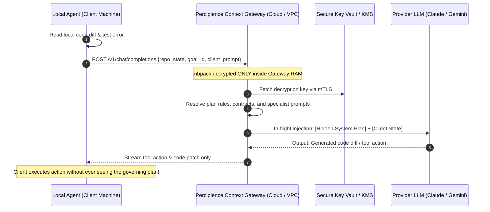
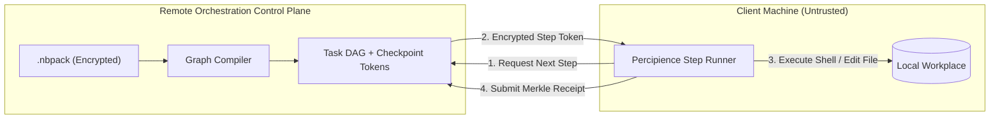
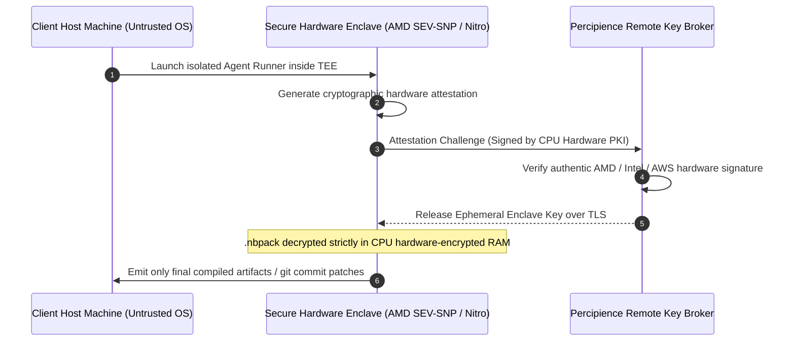

To prevent the proprietary plans within `.nbpack` bundles from being decrypted or inspected on client machines while still allowing autonomous agents to execute them, you must solve the fundamental security dilemma of client-side execution:

> [!CAUTION]
> **The Fundamental Law of Client-Side Security**:
> If the decryption key or plaintext plan ever resides in client-accessible RAM or disk, a user with `root` / kernel access, a debugger (`gdb`, `lldb`, `ptrace`), or a memory dumper can extract it. True IP protection requires either **Architectural Isolation** (remote processing) or **Hardware Isolation** (Confidential Computing).

Here are the **4 viable architectural options**, ranked from most practical and secure to specialized enterprise setups.

---

### Comparison Matrix

| Option | Security Guarantee | Client Exposure | Offline Support | Latency Impact | Best Fit |
|:---|:---:|:---:|:---:|:---:|:---|
| **1. Context Gateway (In-Flight Injection)** | **High (Zero client exposure)** | 0% (Client never receives plan) | No (Requires API) | Minimal (+20–40ms) | **SaaS / CEaaS (Play 3)** |
| **2. Blind Step Orchestrator (DAG Engine)** | **High (Opaque atomic steps)** | 0% (Client only sees atomic tool calls) | No | Low | **CI/CD & Poly-agent workflows** |
| **3. Hardware Confidential Enclave (TEE)** | **Very High (Hardware-enforced)** | 0% (Encrypted in CPU memory) | Yes (Local hardware) | Zero | **Enterprise On-Prem / VPC** |
| **4. Blind Tokenized WASM Virtual Machine** | **Medium (Security through obfuscation)** | Obfuscated bytecode (reversible) | Yes | Zero | **Air-gapped offline edge** |

---

### Option 1: Context Gateway with In-Flight Prompt Injection *(Recommended)*

In this architecture, the client agent works on the local repository (code, tests, git), but **never possesses the plan or the decryption key**. When the agent needs guidance, context, or rules from the plan, it queries an intermediate **Percipience Context Gateway**.

- **How It Works**:
  1. The `.nbpack` and its decryption key live strictly in your server-side gateway or private cloud KMS.
  2. The client agent sends its current context (AST snippet, test output, error trace) to the gateway.
  3. The gateway injects the relevant plan invariants, wire contracts, and prompt methodologies into the LLM system context.
  4. The LLM produces concrete code edits or tool executions. The gateway strips out any internal plan prompts and streams only the resulting code/patch back to the client.
- **Pros**:
  - **Zero plaintext or key leakage** on the client machine.
  - Full control over plan versioning, usage telemetry, and revoking client access.
  - Provider-agnostic (works seamlessly with Anthropic, Google Gemini, OpenAI).
- **Cons**: Requires network connectivity to the gateway.

---

### Option 2: Blind Step Orchestrator (Opaque Task DAG Engine)

Instead of sending the plan to the client, compile the `.nbpack` into a **Compiled Execution Graph (DAG)** where each node is an opaque, signed instruction token.

- **How It Works**:
  1. The `.nbpack` plan is converted on the server into a state-machine DAG (e.g., Step 1: Run AST linter on `mod_iot`; Step 2: Generate GATT characteristic `char_telemetry`).
  2. The client runner receives **only the immediate task payload** needed for the current micro-step, accompanied by an ephemeral cryptographic grant.
  3. The client executes the file write or test, signs a Merkle execution proof, and requests the next step.
- **Pros**:
  - The client agent never sees the overarching blueprint, commercial models, or proprietary prompt libraries.
  - The client only ever holds a 5-line atomic task in memory at any given time.

---

### Option 3: Hardware Confidential Enclaves (TEE / AMD SEV / AWS Nitro Enclaves)

If execution *must* happen on client infrastructure (e.g., enterprise client on-prem or private cloud), you enforce hardware-isolated **Confidential Computing**.

- **How It Works**:
  1. The agent runs inside a Trusted Execution Environment (AWS Nitro Enclave, AMD SEV-SNP, Intel SGX/TDX, or Apple Secure Enclave).
  2. The enclave generates a hardware-signed attestation document proving its code has not been tampered with.
  3. The remote KMS verifies the attestation and releases the decryption key **directly into the CPU-encrypted memory** of the enclave.
  4. Even a `root` user or hypervisor administrator inspecting RAM sees only encrypted ciphertext.
- **Pros**:
  - Uncompromised cryptographic isolation on client hardware.
  - Suitable for banking, defense, and high-security enterprise deployments.
- **Cons**: Requires TEE-capable hardware (modern server instances or specific CPU architectures).

---

### Option 4: Local Sandboxed Runner with Ephemeral Memory Protection (Air-Gapped / Semi-Trusted)

For scenarios where zero remote calls are allowed and hardware TEE is unavailable:
- **How It Works**:
  1. The plan compiler translates the plan into **compiled WebAssembly (WASM) / native Rust binaries** with embedded bytecode logic rather than raw markdown.
  2. Keys are wrapped using OS Keyrings (macOS Keychain / Linux SecretService) with process-level access control.
  3. Use anti-debugging controls (`ptrace(PT_DENY_ATTACH)`, ASLR, symbol stripping) to prevent trivial dumping.
- **Caveat**: Determined reverse engineers with physical/root access can eventually dump memory. This is suitable for casual protection, but **not** for high-value proprietary IP.

---

### Recommended Approach for Percipience OS

For **Play 3 (Enterprise Context Engineering OS / CEaaS)**:
1. **Implement Option 1 (Percipience Context Gateway)** as the primary distribution model:
   - Clients hold encrypted `.nbpack` references or local repo files.
   - All agent LLM completions route through the Context Gateway, which injects the encrypted plan context in-flight.
   - The user/client receives working code, clean git commits, and passes tests without ever seeing the proprietary context engineering prompt IP.
2. **Offer Option 3 (Confidential Enclave Deployment)** as the enterprise tier for on-prem clients requiring data sovereignty.