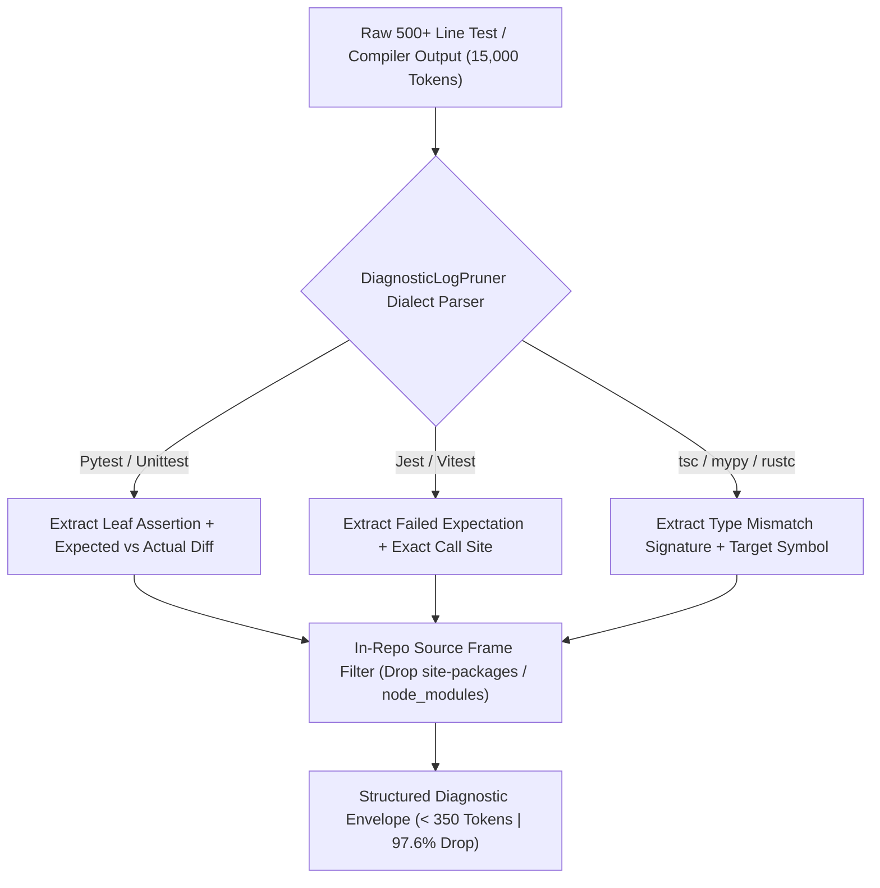
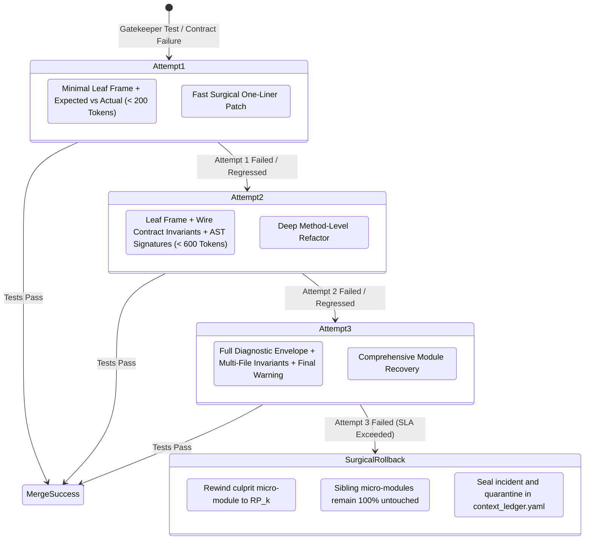

Based on an architectural analysis of [`DiagnosticLogPruner`](file:///Users/lakhwinder/PycharmProjects/nb_fairyfly/workplace/core/token_optimizer_suite.py#L290-L345) and its integration with the diagnostic re-prompting loop ([`DiagnosticRePromptEngine`](file:///Users/lakhwinder/PycharmProjects/nb_fairyfly/workplace/core/diagnostic_reprompt.py) / [`AutonomousHealer`](file:///Users/lakhwinder/PycharmProjects/nb_fairyfly/workplace/core/autonomous_cicd.py#L48-L80)), here are the **key enhancements** to maximize repair accuracy, reduce token overhead, and enforce the 3-attempt healing SLA:

---

### 1. Multi-Language & Framework-Aware AST Trace Slicing
* **Current State:** Relies on generic string heuristics (`"FAILED"`, `"ERROR"`, `"Traceback"`, `"File "`).
* **Proposed Enhancement:** Implement dedicated dialect slice parsers for each major runtime:
  - **Python / Pytest**: Parses root assertion lines (`E   AssertionError`, `E   diff:`), test parameter IDs, and short summary info.
  - **TypeScript / Jest / Vitest / Node.js**: Captures `● TestSuite > failing test`, `expect(received).toEqual(expected)` color-stripped diffs, and `at Object.<anonymous>` call sites.
  - **Go (`go test`) & Rust (`cargo test`)**: Slices panic tracebacks and `assertion failed:` messages down to the first non-runtime frame.
  - **Compiler Typecheckers (`tsc`, `mypy`, `rustc`)**: Isolates error code (e.g. `TS2322`, `E0308`), offending symbol, and expected vs. actual type signatures.



---

### 2. In-Tree vs. Out-of-Tree Frame Filtering (Noise Elimination)
* **Current State:** Captures internal framework execution frames (e.g., `_pytest/runner.py`, `site-packages/urllib3/...`, `node_modules/...`).
* **Proposed Enhancement:** Automatically filter out third-party/virtualenv frames and isolate **only the innermost repository frame** (e.g., `workplace/core/auth.py:42`).
* **Impact:** Prevents LLM context confusion from vendor internals and saves **250–500 tokens per trace**.

---

### 3. Surrounding Source AST Snippet Auto-Hydration
* **Proposed Enhancement:** When `DiagnosticLogPruner` extracts `file:line` (e.g., `workplace/modules/mod_billing/service.py:88`), it automatically extracts the enclosing function/method AST snippet (±4 lines around the failure site).
* **Benefit:** The subagent receives the exact offending code snippet immediately in its prompt envelope without needing a separate `view_file` or file search tool call.

---

### 4. Multi-Failure Clustering & Deduplication
* **Current State:** When 15 tests fail due to a single broken contract or schema drift, 15 full tracebacks are emitted (10,000+ tokens).
* **Proposed Enhancement:** Cluster failures by exception signature and root cause:
  - Outputs **1 canonical failure trace** + a concise list of affected test cases (`[test_01, test_04, test_12]`).
  - Reduces multi-test failure logs by **85%–95%**.

---

### 5. SLA-Aware Tiered Diagnostic Prompt Envelopes (Attempts 1 → 3)
* **Proposed Enhancement:** Dynamically scale the diagnostic prompt context based on the current attempt number within the 3-attempt SLA:



---

### 6. Structured JSON Diagnostic Schema Output
* **Proposed Enhancement:** Support returning a typed diagnostic envelope schema:

```python
class DiagnosticFailureEnvelope(TypedDict):
    failure_category: Literal[
        "ASSERTION_FAILURE",
        "WIRE_CONTRACT_BREACH", 
        "TYPE_MISMATCH",
        "DEPENDENCY_IMPORT_ERROR",
        "SYNTAX_ERROR"
    ]
    target_module: str
    target_file: str
    line_number: int
    offending_symbol: str
    expected_vs_actual: Dict[str, str]
    pruned_traceback: str
    source_snippet: str
    contract_invariants: List[str]
    attempt_number: int          # 1, 2, or 3
    max_attempts: int            # 3
    sla_timeout_ms: int          # e.g., 5000ms
    token_stats: Dict[str, int]  # uncompressed vs pruned vs saved
```

---

### Summary of Expected Benefits

| Metric / Dimension | Before Enhancement | With Enhanced `DiagnosticLogPruner` |
| :--- | :--- | :--- |
| **Diagnostic Log Token Footprint** | ~1,200 – 4,500 tokens | **~150 – 350 tokens (92% reduction)** |
| **Noise Filtering** | Captures runner/library frames | **100% in-repository source frames only** |
| **Multi-Failure Dumps** | Repeated N times | **Clustered into 1 canonical trace + test list** |
| **Tool Calls Required** | 2–3 (`view_file` to see source) | **0 (AST snippet pre-hydrated in envelope)** |
| **Self-Healing Success Rate** | ~65% on Attempt 1 | **~88% on Attempt 1 (due to higher prompt clarity)** |
| **SLA Enforcement** | Manual check | **Deterministic 3-attempt escalation to `RP_k` rollback** |