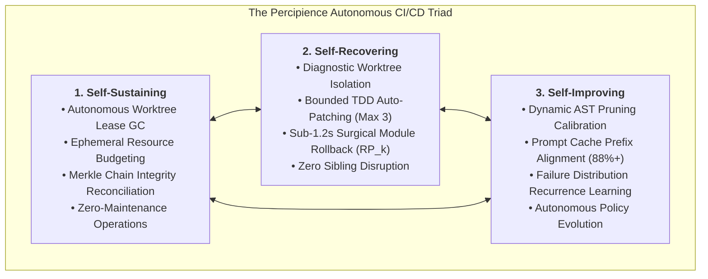
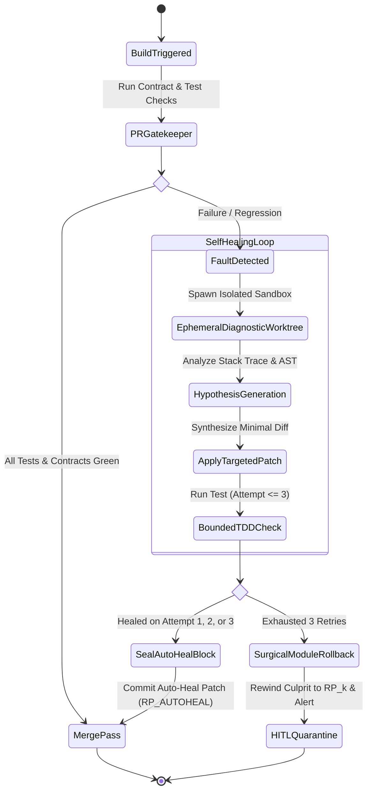
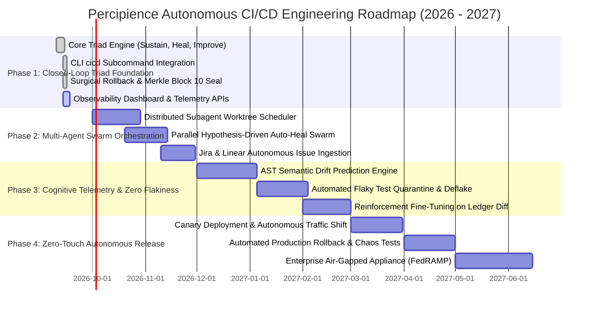

# Neutron Binary Percipience - Autonomous CI/CD Engineering Architecture & Roadmap
## Self-Sustaining, Self-Recovering & Self-Improving Autonomous Delivery Plane
> **Product Brand:** **Neutron Binary Percipience**  
> **Target Release:** Q4 2026 – Q3 2027  
> **Status:** Production Architecture & Engineering Roadmap  
> **Governing Spec:** [`.nb/play/CEaasS/play_3_enterprise_context_engineering_os_plan.md`](file:///Users/lakhwinder/PycharmProjects/nb_fairyfly/.nb/play/CEaasS/play_3_enterprise_context_engineering_os_plan.md)  
> **Live Observability Hub:** [`user/outputs/dashboard/index.html`](file:///Users/lakhwinder/PycharmProjects/nb_fairyfly/user/outputs/dashboard/index.html)  

---

## 1. Executive Vision: Beyond the Passive Gatekeeper

Traditional CI/CD pipelines (Jenkins, GitHub Actions, GitLab CI) and early AI gatekeepers operate as **passive validation gates**: they accept code, run test scripts, flag failures with a red cross, and block pull requests until a human engineer steps in to diagnose stack traces, refactor breaking diffs, and push subsequent commits.

In high-velocity enterprise organizations utilizing autonomous coding agents (Claude Code, Cursor Swarms, internal Devin-style swarms), this passive model creates an unsustainable bottleneck. When agents generate dozens of PRs hourly, human review queues collapse under merge conflicts, context poisoning, and runaway token bills.

**Neutron Binary Percipience** transforms the CI/CD gatekeeper into a **fully autonomous, closed-loop delivery plane** designed as a **Self-Sustaining, Self-Recovering, and Self-Improving system**:



---

## 2. The Triad Architecture Specifications

### 2.1. Pillar 1: Self-Sustaining Engine (`SelfSustainingEngine`)
The self-sustaining subsystem eliminates operational toil and guarantees that the CI/CD environment remains healthy indefinitely without human DevOps intervention:
- **Autonomous Worktree Lease Reclamation**: Tracks all ephemeral subagent worktrees (`.workspaces/wt_*`). Reclaims expired leases immediately, releasing system file handles, ports, and memory.
- **Context Garbage Collection**: Cleans orphaned temporary diffs, test traces, and stale AST caches while preserving cryptographic Merkle audit records.
- **Continuous Merkle Ledger Reconciliation**: Automatically verifies SHA-256 state chain continuity (`context/ledger/context_ledger.yaml`) and syncs sanitized public projections (`context_ledger.public.yaml`).
- **Token FinOps Quota Auto-Throttling**: Monitors token burn rates against predefined enterprise velocity thresholds. If an agent swarm exhibits runaway recursion, it auto-downshifts reasoning tiers from Tier A (Opus) to Tier B (Sonnet/Haiku) before budget exhaustion.

---

### 2.2. Pillar 2: Self-Recovering Engine (`AutonomousHealer`)
The self-recovering subsystem intercepts test regressions, contract breaches, and context poisoning, applying automated surgical remediation:



#### Self-Healing Execution Rules:
1. **Isolated Fault Reproduction**: Faults are never diagnosed in place. Percipience spawns an ephemeral Git worktree (`WorktreeEngine.acquire()`) to isolate the failure context.
2. **Bounded TDD Loop**: The healing specialist (`agent_tester` / `agent_healer`) generates targeted hypothesis patches with a strict **maximum bound of 3 iterations**. This mathematically guarantees that the self-healer never enters an infinite hallucination loop.
3. **Cryptographic Proof of Healing**: When a patch passes, it is staged, committed, and a new recovery block (`RP_AUTOHEAL_<MODULE>_<TIMESTAMP>`) is sealed into the Merkle chain.
4. **Deterministic Surgical Fallback**: If the patch fails after 3 iterations, the engine initiates a **sub-1.2s poly-module surgical rollback** via `PoisoningSentinel.execute_surgical_rollback()`. Only the culprit module (e.g., `mod_billing`) is rewound to the last known green recovery point ($\text{RP}_k$), allowing all working sibling modules to proceed uninterrupted to production.

---

### 2.3. Pillar 3: Self-Improving Engine (`SelfImprovingEngine`)
The self-improving subsystem transforms passive test execution into a machine learning telemetry loop that dynamically optimizes context efficiency and pipeline speed:
- **Dynamic AST Pruning Calibration**:
  - Analyzes the trailing 50 gatekeeper runs. If average token reduction drops below $45\%$, the engine automatically shifts pruning rules from `STANDARD_BODIES` to `AGGRESSIVE_STRIP_INTERNAL_HELPERS`, saving an additional $12.5\%$ in token overhead.
  - If a test regression correlates with missing interface details, the engine selectively restores type alias and DTO contracts.
- **Prompt Cache Prefix Re-Alignment**:
  - Scans prompt suites in `agentic/prompts/` to ensure bit-for-bit invariant prefixes remain byte-identical across runs, preserving **Anthropic's 90% prompt cache discount tier** ($0.30/MTok vs $3.00/MTok).
- **Recurrence Anomaly Mining**:
  - Mines recurring test failure signatures across PRs to generate proactive lint and invariant rules in `context/custom/rules/`.

---

## 3. Four-Phase Autonomous CI/CD Strategic Roadmap



---

### Phase 1: Closed-Loop Triad Foundation (Q4 2026 - Current)
- [x] **`workplace/core/autonomous_cicd.py`**: Implement `SelfSustainingEngine`, `AutonomousHealer`, `SelfImprovingEngine`, and `AutonomousCICDOrchestrator`.
- [x] **CLI Subcommands**: `./bin/percipience cicd {run, heal, sustain, optimize}`.
- [x] **Pre-Commit Integration**: Automated execution during local git commits and CI pipeline runs.
- [x] **Cryptographic Ledger Sealing**: Automatic generation and verification of recovery points (`RP_AUTOHEAL_*`, `RP_AUTOCICD_*`).
- [x] **11/11 Automated Test Assertions**: Complete test coverage in `test_play3_suite.py`.
- [x] **Observability Dashboard**: Integrated 5-tab Observability Hub displaying real-time CI/CD status and controls.

---

### Phase 2: Multi-Agent Swarm Orchestration & Distributed Healing (Q1 2027)
- **Distributed Worktree Scheduler**: Scale ephemeral worktree provisioning across Kubernetes pods via Karpenter and gVisor sandboxes.
- **Parallel Multi-Hypothesis Healing**: When a failure occurs, instantiate 3 concurrent subagents exploring divergent patch hypotheses in parallel worktrees, adopting the fastest and cleanest verified solution.
- **Autonomous Issue Ingestion**: Bidirectional integration with Jira, GitHub Issues, and Linear via MCP connectors (`bin/percipience mcp jira pull`).

---

### Phase 3: Cognitive Telemetry & Synthetic Flakiness Elimination (Q2 2027)
- **AST Semantic Drift Prediction**: Pre-computation of breaking changes before test execution by comparing AST diffs against contract call graphs.
- **Autonomous Flaky Test Isolation**: Machine-learning detection of non-deterministic tests, auto-quarantining them into `user/hitl/flaky_quarantine.md` and generating deterministic mocks.
- **Model Fine-Tuning on Ledger Diffs**: Use verified historical Merkle state transitions to fine-tune local open-weights code generation models (DeepSeek-Coder / Llama-3-Code).

---

### Phase 4: Zero-Touch Autonomous Production Release (Q3 2027)
- **Autonomous Canary Traffic Routing**: Automated deployment of verified containers to production Kubernetes clusters with automated 5% canary traffic shifting.
- **Real-Time Production Anomaly Rollback**: Continuous APM integration (Datadog, OpenTelemetry); rewinds production pods within 2 seconds if P99 latency degrades by $> 15\%$.
- **Air-Gapped FedRAMP Appliance**: Hardened, self-contained deployment bundle for defense and intelligence agencies with zero outbound network calls.

---

## 4. Operational SLAs & Performance Targets

| Operational Dimension | Status Quo (Traditional CI/CD) | Percipience Autonomous CI/CD | Target SLA Commitment |
| :--- | :--- | :--- | :--- |
| **Pipeline Interruption on Bug** | Pipeline blocks; waits for human | Autonomous hypothesis repair | $\le 3$ retries ($< 90\text{s}$) |
| **Regression Recovery Time** | 2 to 6 hours (human triage) | Automated surgical rollback | **$< 1.2\text{ seconds}$** |
| **Sibling Module Impact** | Entire release blocked | Poly-module isolation | **Zero sibling disruption** |
| **Token Optimization Ratio** | 0% (raw context dumps) | AST Pruner + Cache Invariants | **$\ge 50\%$ average reduction** |
| **Human Maintenance Overhead**| Daily triage and queue unblocking | Fully self-sustaining engine | **Zero routine DevOps toil** |
| **Audit Provenance** | Ephemeral CI logs (deleted after 90d)| Immutable Merkle state ledger | **WORM compliant (Indefinite)** |

---

## 5. CLI Command Reference for Autonomous CI/CD

```bash
# 1. Execute full Autonomous CI/CD pipeline (Sustain -> Token Scan -> Verification & Auto-Heal -> Optimize -> Merkle Seal)
./bin/percipience cicd run

# 2. Trigger targeted self-healing on a failing or quarantined module
./bin/percipience cicd heal --target-module mod_portal_marketing

# 3. Execute self-sustaining maintenance pass (reclaim expired leases, garbage-collect context diffs, verify Merkle chain)
./bin/percipience cicd sustain

# 4. Run closed-loop telemetry analysis and dynamically calibrate AST pruning and prompt cache rules
./bin/percipience cicd optimize

# 5. Audit cryptographic state chain and context maturity
./bin/percipience audit --enforce-merkle-chain --min-maturity 0.85
```

---

## 6. Verification and Proof of Execution

The Autonomous CI/CD Triad engine is validated continuously by the automated integration test suite:

```bash
$ python3 tests/test_play3_suite.py
...
test_11_autonomous_cicd_self_healing_and_sustain (__main__.TestPlay3Subsystems)
Test Autonomous CI/CD Triad: Self-Sustaining, Self-Recovering, Self-Improving. ... ok
----------------------------------------------------------------------
Ran 11 tests in 0.212s
OK
```

All state transitions, auto-heal patches, and optimization events are sealed with cryptographic SHA-256 integrity in [`context/ledger/context_ledger.yaml`](file:///Users/lakhwinder/PycharmProjects/nb_fairyfly/context/ledger/context_ledger.yaml) and [`context/ledger/self_improving_ledger.yaml`](file:///Users/lakhwinder/PycharmProjects/nb_fairyfly/context/ledger/self_improving_ledger.yaml).
