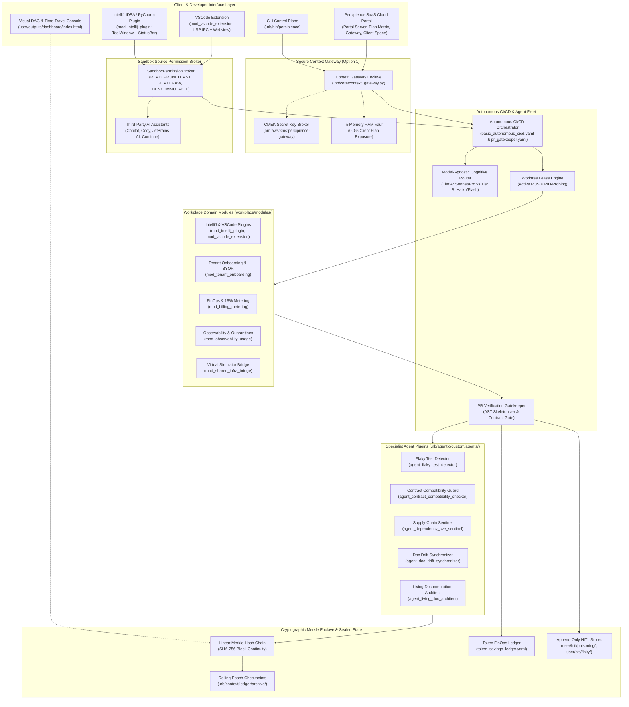

# System Architecture & C4 Topologies

> **Autonomously Synchronized**: 2026-09-19T16:00:00+00:00  
> **Engine**: `agent_living_doc_architect` (CAP-21)  
> **Diagram Validation**: ✅ Valid Mermaid

## Overview
This document visualizes the complete high-level system topology, container boundaries, IDE plugin extensions, and communication pathways of the Percipience Context Engineering platform across Free Community, Team, Business, and Enterprise tiers.

### Component Topologies
- **Client & Developer Interface Layer**: Host environment containing CLI (`.nb/bin/percipience`), IntelliJ/PyCharm Kotlin Plugin (`mod_intellij_plugin`), VSCode Extension (`mod_vscode_extension`), and Web Portal (`workplace/portal/server.py`).
- **Sandbox Source Permission Broker**: Brokers file read and write access for third-party IDE AI plugins (GitHub Copilot, Continue, Cody, JetBrains AI), enforcing AST token reduction by default (`READ_SOURCE_PRUNED`) and protecting immutable ledger zones (`DENY_IMMUTABLE`).
- **Context Gateway (Option 1)**: Architectural enclave ensuring 0% client-side plan exposure with in-flight prompt injection and `.nbpack` encrypted archives.
- **Orchestration Layer**: Quad-Space engine with cognitive tiering, POSIX PID-probed worktrees, and Autonomous CI/CD workflows (`basic_autonomous_cicd.yaml`).
- **Specialist Agent Fleet**: Pre-configured CI/CD subagents enforcing security, SemVer contracts, test stability, and living documentation.
- **Plan Tier Matrix & Boundary Ceilings**: 4 architectural tiers (`plan_free`, `plan_team`, `plan_business`, `plan_enterprise`) with strict isolation and concurrency ceilings.
