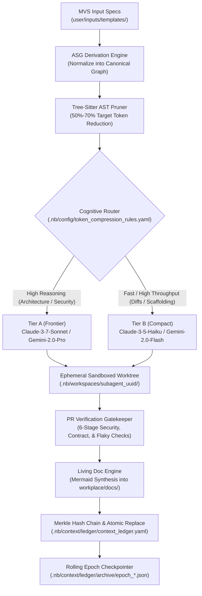
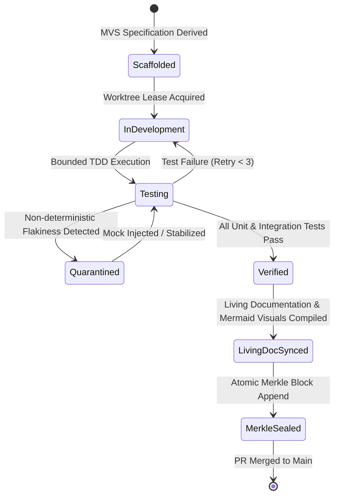

# Data Transformation Pipelines & Event Streams

> **Autonomously Synchronized**: 2026-09-17T14:43:42.017830+00:00  
> **Engine**: `agent_living_doc_architect` (CAP-21)  
> **Diagram Validation**: Pipeline: ✅ Valid | State: ✅ Valid

## End-to-End Ingestion & Execution Pipeline

## Artifact State Lifecycle

