# Active Layered Domain Extensions

> **Autonomously Synchronized**: 2026-09-16T21:17:36.537928+00:00  
> **Engine**: `agent_living_doc_architect` (CAP-21)  
> **Diagram Validation**: ✅ Valid Mermaid

## Multi-Domain Deep Dives

```mermaid
graph TD
  subgraph Blockchained_Audio_P2P["Decentralized Audio Streaming & Capability Loans"]
    EIP712["EIP-712 Loan Vault<br/>(Ephemeral Capability Delegation)"]
    SwarmMesh["BitTorrent P2P Swarm Mesh<br/>(Distributed Audio Chunk Streaming)"]
    IPFS["IPFS Content Addressing<br/>(Immutable Audio Manifests & Stem Hashes)"]
    RoyaltySplitter["Smart Contract Royalty Splitter<br/>(Automated Micro-Settlement on Merkle Seal)"]
    EIP712 --> SwarmMesh
    SwarmMesh --> IPFS
    SwarmMesh --> RoyaltySplitter
  end

  subgraph IoT_Mobile_Edge["Connected IoT & Embedded Hardware"]
    GATT["BLE GATT Table<br/>(0xFF01 Telemetry / 0xFF02 Command)"]
    FreeRTOS["FreeRTOS / Zephyr Ring-Buffer<br/>(Mutex-Locked Non-Blocking Circular Queue)"]
    DualBankOTA["Dual-Bank A/B OTA Partitions<br/>(Atomic Rollback on Watchdog Fault)"]
    GATT --> FreeRTOS
    FreeRTOS --> DualBankOTA
  end

  subgraph SaaS_Portal_Cloud["Enterprise SaaS Multi-Tenant Cloud"]
    RBAC["Multi-Tenant RBAC Hierarchy<br/>(Owner, Admin, Operator, Auditor)"]
    StripeWebhook["Stripe & Paddle Webhook Reconciler<br/>(Automated 15% Rev-Share Billing)"]
    WCAG["WCAG 2.1 AA Design Tokens<br/>(Dark-Mode High-Contrast CSS Primitives)"]
    RBAC --> StripeWebhook
    StripeWebhook --> WCAG
  end
```

