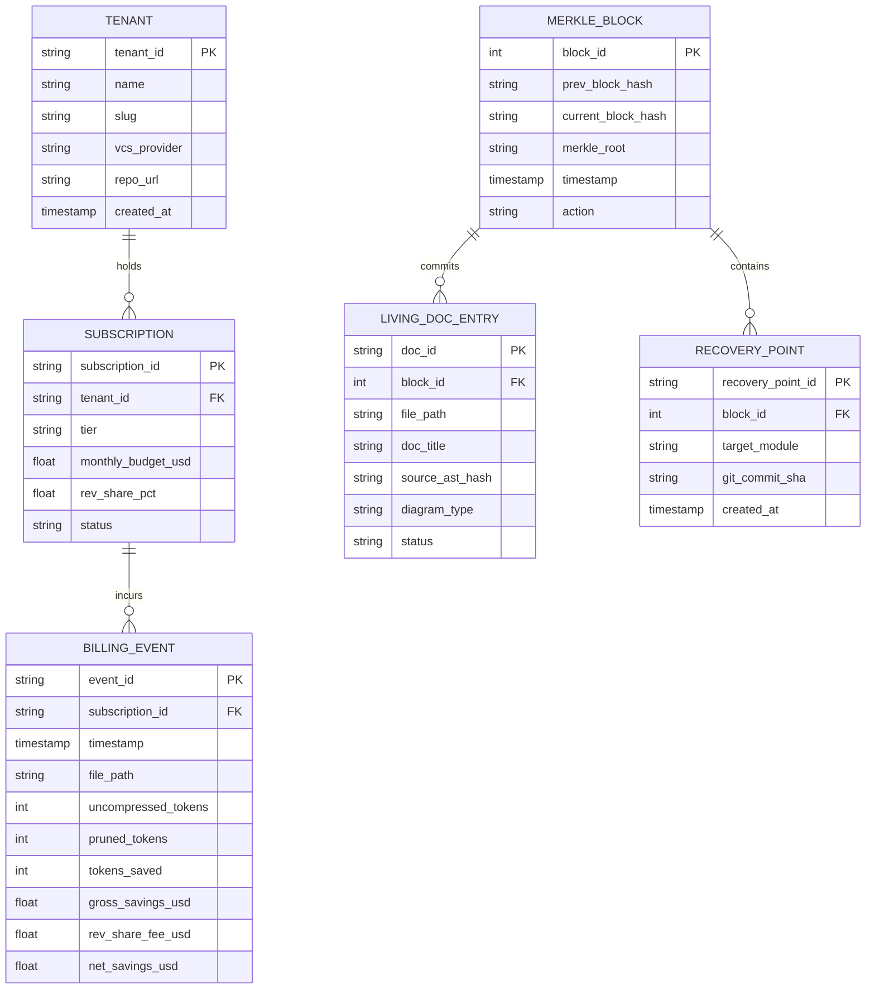

# Domain Models & Entity-Relationship Schemas

> **Autonomously Synchronized**: 2026-09-16T20:09:28.075582+00:00  
> **Engine**: `agent_living_doc_architect` (CAP-21)  
> **Diagram Validation**: ✅ Valid Mermaid

## Core Relational Schema & State Entities

