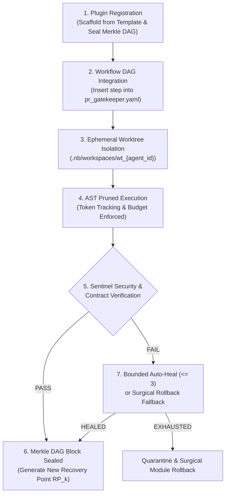

# Percipience Custom Agent Plugin Architecture & Healthy Integration Guide

> **Standard:** Enterprise Autonomous CI/CD Plugin Specification  
> **Schema:** [`agentic/templates/custom_agent_template.yaml`](/.nb/agentic/templates/custom_agent_template.yaml)  
> **Engine:** [`.nb/core/agent_plugin_engine.py`](/.nb/core/agent_plugin_engine.py)  
> **Control Plane Subcommand:** `./.nb/bin/percipience agent {create, integrate, run, rollback, list}`  

---

## 1. Introduction: The Healthy Agent Plugin Paradigm

In autonomous software engineering, adding custom agents without rigorous boundaries creates fatal architectural failure modes:
1. **Workspace Pollution:** Multiple agents concurrently editing the same working directory cause race conditions and dirty uncommitted clobbering.
2. **Context Poisoning:** Hallucinated external dependencies or leaky secrets cascade into sibling modules.
3. **Infinite Hallucination Loops:** When an agent attempts to fix its own syntax errors without bounds, it burns thousands of tokens without terminating.
4. **Untracked State Transitions:** When an agent modifies code without an immutable audit trail, debugging failures becomes impossible.

The **Percipience Healthy Integration Pattern** solves this by establishing a contract-driven plugin system governed by the **Autonomous CI/CD Triad**:

```mermaid
flowchart TD
  Register["1. Plugin Registration<br/>(Scaffold from Template & Seal Merkle DAG)"]
  Integrate["2. Workflow DAG Integration<br/>(Insert step into pr_gatekeeper.yaml)"]
  AcquireWT["3. Ephemeral Worktree Isolation<br/>(.nb/workspaces/wt_{agent_id})"]
  ASTExec["4. AST Pruned Execution<br/>(Token Tracking & Budget Enforced)"]
  SentCheck{"5. Sentinel Security &<br/>Contract Verification"}
  SealMerkle["6. Merkle DAG Block Sealed<br/>(Generate New Recovery Point RP_k)"]
  SurgicalRoll["7. Bounded Auto-Heal (<= 3)<br/>or Surgical Rollback Fallback"]

  Register --> Integrate --> AcquireWT --> ASTExec --> SentCheck
  SentCheck -- PASS --> SealMerkle
  SentCheck -- FAIL --> SurgicalRoll
  SurgicalRoll -- HEALED --> SealMerkle
  SurgicalRoll -- EXHAUSTED --> Isolate["Quarantine & Surgical Module Rollback"]
```

---

## 2. The 6 Pillars of the Healthy Integration Pattern

### Pillar 1: Declarative Module Scoping & Invariant Protection
Custom agents must explicitly declare `allowed_modules` in their YAML manifest. Access to Tier 1 invariant files (`context/invariants/`) and repository control files (`.git`, `.workspaces`) is blocked at the operating system level.

### Pillar 2: Ephemeral Worktree Isolation
Custom agents **never** touch the active developer working directory. The `AgentPluginEngine` requests an isolated ephemeral Git worktree via `WorktreeEngine.acquire()`. If the agent crashes or fails, its worktree is pruned (`WorktreeEngine.release()`), leaving the main working tree pristine.

### Pillar 3: AST Skeletonization & Token FinOps Metering
Rather than ingesting multi-thousand-line source files, the plugin receives structural AST skeletons pruned by `ASTOptimizer`. Every token consumed and saved is measured and recorded in `.nb/context/ledger/token_savings_ledger.yaml` via `TokenTracker`.

### Pillar 4: Bounded TDD Self-Healing ($\le 3$ Retries)
If the custom agent encounters test or contract errors during execution, it is granted a maximum of **3 bounded hypothesis attempts** to auto-heal. Unchecked recursive hallucination is mathematically prevented.

### Pillar 5: Cryptographic Merkle State Sealing
Upon passing all pre- and post-execution checks, the agent's work is merged and sealed as an immutable SHA-256 block in `context/ledger/context_ledger.yaml` with a designated recovery point (`RP_AGENT_<ID>_<TIMESTAMP>`).

### Pillar 6: Sub-1.2s Surgical Module Rollback Fallback
If the agent fails verification and cannot auto-heal within 3 attempts, the engine triggers an automated surgical rollback (`PoisoningSentinel.execute_surgical_rollback()`). The affected module is rewound to the previous stable checkpoint ($\text{RP}_k$), and the violation is quarantined to `user/hitl/poisoning_quarantine.md`. Sibling services continue uninterrupted.

---

## 3. Section 17.1 Swarm Governance & Security Integrations

Custom agent plugins execute within the Section 17.1 Swarm Governance Framework:
1. **Capability-Based Access Control (CBAC)**: Agent plugins are issued HMAC-SHA256 capability tokens (`AgentCapabilityGuard`). Privileges (such as filesystem write or network egress) are explicitly scoped and dynamically downgraded if anomalous behavior is detected.
2. **Tool Contract Validation**: All tool invocations executed by custom agents must conform strictly to JSON Schema (Draft-07) schemas enforced by `ToolContractValidator`.
3. **3-Tier Memory Model**: Agents can persist episodic context across turns using `AgentMemoryEngine` (Working memory for active tasks and Long-term memory with relevance scoring and decay).
4. **5-Pillar Reflexion Critic**: Before merging diffs, candidate outputs can be vetted through the `SelfReflectionEngine` in a zero-disk-write sandbox.

---

## 4. Manifest Specification (`custom_agent_template.yaml`)

| YAML Field | Type | Description |
| :--- | :--- | :--- |
| `metadata.agent_id` | `string` | Unique identifier (prefixed with `agent_`). |
| `metadata.category` | `enum` | One of: `cicd_quality`, `security`, `finops`, `self_healing`, `refactor`. |
| `isolation_and_sandboxing.worktree_isolation` | `boolean` | Must be `true` to enforce ephemeral worktree sandboxing. |
| `module_scope.allowed_modules` | `list` | Modules the agent is authorized to modify. |
| `autonomous_cicd_hooks.target_workflows` | `list` | List of workflow insertion points (`wf_pr_gatekeeper`, `wf_derivation_pipeline`). |
| `autonomous_cicd_hooks.bounded_sla.max_retries` | `integer` | Bounded iteration limit ($\le 3$). |
| `cryptographic_governance.seal_merkle_block_on_success`| `boolean` | Appends verified block to `context_ledger.yaml`. |
| `cryptographic_governance.rollback_policy.enabled` | `boolean` | Enables automatic surgical rollback on unhealable failure. |

---

## 5. Built-in Autonomous CI/CD Specialist Plugins

The Percipience platform ships with five pre-configured, production-ready specialist agent plugins located in [`agentic/custom/agents/`](/.nb/agentic/custom/agents/):

| Agent Plugin ID | Manifest File | Cognitive Tier | Primary Responsibility |
| :--- | :--- | :---: | :--- |
| **`agent_flaky_test_detector`** | [`flaky_test_detector.yaml`](/.nb/agentic/custom/agents/flaky_test_detector.yaml) | **Tier B** | Multi-run stability analysis, quarantines non-deterministic tests into `user/hitl/flaky_quarantine.yaml` without halting CI. |
| **`agent_contract_compatibility_checker`** | [`contract_compatibility_checker.yaml`](/.nb/agentic/custom/agents/contract_compatibility_checker.yaml) | **Tier A** | SemVer evolution guard; diffs JSON/YAML wire contracts in `context/contracts/` to block breaking removals or mutations. |
| **`agent_dependency_cve_sentinel`** | [`dependency_cve_sentinel.yaml`](/.nb/agentic/custom/agents/dependency_cve_sentinel.yaml) | **Tier B** | Supply-chain security; audits AST imports and manifests for known CVEs, typosquatting packages, and viral licenses. |
| **`agent_doc_drift_synchronizer`** | [`doc_drift_synchronizer.yaml`](/.nb/agentic/custom/agents/doc_drift_synchronizer.yaml) | **Tier B** | Blueprint synchronization; verifies exported AST symbols against `.nb/plan/` specifications and flags doc drift. |
| **`agent_living_doc_architect`** | [`agent_living_doc_architect.yaml`](/.nb/agentic/custom/agents/agent_living_doc_architect.yaml) | **Tier B** | Living documentation synthesizer; verifies and generates Mermaid architectural and sequence diagrams in `workplace/docs/`. |

All specialist plugins are integrated into the 7-stage verification gatekeeper in [`agentic/workflows/pr_gatekeeper.yaml`](/.nb/agentic/workflows/pr_gatekeeper.yaml).
