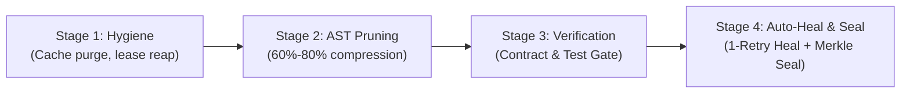

# CI/CD Gatekeeper & Autonomous Pipeline Integration

Percipience acts as an autonomous gatekeeper across local developer environments, GitHub Actions, GitLab CI, and Bitbucket Pipelines.

---

## 1. Basic Autonomous CI/CD Workflow (`basic_autonomous_cicd.yaml`)
For Free Community Plan (`plan_free`) and small teams, Percipience provides an out-of-the-box 4-stage autonomous pipeline:



### Stage Details
1. **Self-Sustaining Workspace Hygiene** (`platform.self_sustaining_engine`): Purges stale caches, prunes dead worktrees, and checks Merkle chain continuity.
2. **AST Token Reduction** (`platform.ast_pruner`): Skeletonizes source files across Python, Kotlin, TypeScript, Go, and Rust before test execution or model dispatch.
3. **Basic Contract & Test Verification Gate** (`platform.contract_verifier`): Validates cross-module contracts in `context/contracts/` and runs unit/integration tests.
4. **Bounded Auto-Repair & Merkle State Seal** (`platform.autonomous_healer` & `platform.merkle_ledger`): Attempts 1 bounded diagnostic repair if failures occur; upon pass, seals a SHA-256 block into `.nb/context/ledger/context_ledger.yaml`.

---

## 2. Multi-Stage Enterprise Gatekeeper (`pr_gatekeeper.yaml`)
For Team, Business, and Enterprise plans, the full 6-stage gatekeeper coordinates specialist subagents:

1. **AST Symbol Pruning & Complexity Linting**: Strips function bodies from diffs to verify structural signatures in under 15ms.
2. **Contract Compatibility Guard** (`agent_contract_compatibility_checker`): Validates that producer and consumer data models align in `context/contracts/`.
3. **Supply-Chain & CVE Sentinel** (`agent_dependency_cve_sentinel`): Audits AST imports for typosquatting and vulnerabilities.
4. **Flaky Test Detector** (`agent_flaky_test_detector`): Quarantines non-deterministic tests into `user/hitl/flaky_quarantine.yaml` without blocking PR merges.
5. **Bounded TDD Loop**: Executes tests with up to 3 hypothesis retries; isolates persistent failures.
6. **Living Documentation & Merkle Block Sealing**: Synchronizes architecture docs and appends a SHA-256 block hash to `context/ledger/context_ledger.yaml`.

---

## 3. GitHub Actions Integration Example
```yaml
name: Percipience Autonomous Gatekeeper
on: [push, pull_request]

jobs:
  gatekeeper:
    runs-on: ubuntu-latest
    steps:
      - uses: actions/checkout@v4
      - name: Set up Python & Dependencies
        uses: actions/setup-python@v5
        with:
          python-version: '3.11'
      - name: Execute Autonomous CI/CD Gate
        run: |
          chmod +x .nb/.nb/bin/percipience
          ./.nb/bin/percipience gate
          ./.nb/bin/percipience audit --enforce-merkle-chain --min-maturity 0.85
```
