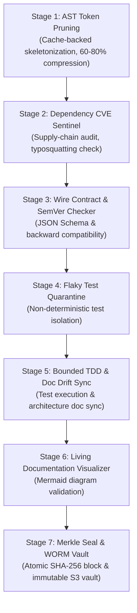

# CI/CD Gatekeeper & Autonomous Pipeline Integration

Percipience acts as an autonomous, self-healing delivery gatekeeper across local developer workstations, Docker container topologies, GitHub Actions, GitLab CI, and Bitbucket Pipelines.

---

## 1. The 7-Stage Enterprise Gatekeeper Architecture

Every proposed code change, pull request, or agentic code generation task must traverse the 7-stage verification gate before it can be merged into production:


```mermaid
flowchart TD
  S1["Stage 1: AST Token Pruning<br/>(Cache-backed skeletonization, 60-80% compression)"]
  S2["Stage 2: Dependency CVE Sentinel<br/>(Supply-chain audit, typosquatting check)"]
  S3["Stage 3: Wire Contract & SemVer Checker<br/>(JSON Schema & backward compatibility)"]
  S4["Stage 4: Flaky Test Quarantine<br/>(Non-deterministic test isolation)"]
  S5["Stage 5: Bounded TDD & Doc Drift Sync<br/>(Test execution & architecture doc sync)"]
  S6["Stage 6: Living Documentation Visualizer<br/>(Mermaid diagram validation)"]
  S7["Stage 7: Merkle Seal & WORM Vault<br/>(Atomic SHA-256 block & immutable S3 vault)"]

  S1 --> S2 --> S3 --> S4 --> S5 --> S6 --> S7
```

### Stage-by-Stage Breakdown

1. **Stage 1: AST Token Pruning & Metering (`platform.ast_pruner`)**:
   - Strips non-interface function bodies and comments from source files across Python, TypeScript, Go, Kotlin, and Rust.
   - Utilizes content-addressable AST caching (`.nb/cache/ast/`) to achieve sub-15ms extraction.
   - Meters token savings and commits entries to the token savings ledger.

2. **Stage 2: Supply-Chain & Dependency CVE Sentinel (`agent_dependency_cve_sentinel`)**:
   - Audits all newly introduced third-party dependencies against the National Vulnerability Database (NVD) and GitHub Advisory Database.
   - Enforces license compatibility (preventing accidental AGPL viral infection in commercial microservices) and guards against typosquatting.

3. **Stage 3: Cross-Module Wire Contracts & SemVer Checker (`agent_contract_compatibility_checker`)**:
   - Validates that producer and consumer data models align with JSON Schema (Draft-07) specifications in `.nb/context/contracts/`.
   - Prevents breaking API changes across microservices without explicit SemVer major version bumps.

4. **Stage 4: Flaky Test Quarantine (`agent_flaky_test_detector`)**:
   - Detects non-deterministic test failures across repeated executions.
   - Automatically isolates flaky tests to `user/hitl/flaky_quarantine.yaml` without blocking mission-critical PR merges, and opens targeted remediation tasks.

5. **Stage 5: Bounded TDD Validation & Doc Drift Sync (`agent_doc_drift_synchronizer`)**:
   - Executes unit and integration test suites.
   - Enforces a bounded TDD hypothesis loop (maximum 3 retry attempts) in an isolated Git worktree.
   - Synchronizes any drift between code implementations and architectural markdown files.

6. **Stage 6: Living Documentation & Mermaid Visualizer (`agent_living_doc_architect`)**:
   - Parses and validates all Mermaid diagram syntax across all 53+ markdown files in `workplace/docs/`.
   - Ensures no rendering errors, invalid HTML tags, or unquoted labels exist.

7. **Stage 7: Cryptographic Merkle State Sealing & S3 WORM Vault Mirroring (`platform.merkle_ledger`)**:
   - Appends an immutable SHA-256 block hash to `.nb/context/ledger/context_ledger.yaml`.
   - Atomically mirrors the sealed block JSON into the SEC 17a-4 / FINRA compliant WORM vault (`.nb/workspaces/worm_vault/block_*.json`) with immutable file flags.

---

## 2. Running the Gatekeeper

### Local CLI Execution
```bash
# Execute full 7-stage gatekeeper locally
chmod +x .nb/bin/percipience
./.nb/bin/percipience gate
```

### Containerized Execution (Hermetic Docker Test Runner)
```bash
# Run the gatekeeper inside an isolated Docker container with mounted volumes
./workplace/infra/docker/docker-test.sh gate
```

---

## 3. Continuous Integration Workflows

### GitHub Actions Integration (`.github/workflows/gatekeeper.yml`)
```yaml
name: Percipience Autonomous Gatekeeper
on: [push, pull_request]

jobs:
  gatekeeper:
    runs-on: ubuntu-latest
    steps:
      - uses: actions/checkout@v4
      - name: Set up Python
        uses: actions/setup-python@v5
        with:
          python-version: '3.11'
      - name: Execute Autonomous CI/CD Gate
        run: |
          chmod +x .nb/bin/percipience
          ./.nb/bin/percipience gate
          ./.nb/bin/percipience audit --enforce-merkle-chain --min-maturity 0.85
```

### GitLab CI Integration (`.gitlab-ci.yml`)
```yaml
stages:
  - verify

percipience_gatekeeper:
  stage: verify
  image: python:3.11-slim
  script:
    - chmod +x .nb/bin/percipience
    - ./.nb/bin/percipience gate
    - ./.nb/bin/percipience audit --enforce-merkle-chain --min-maturity 0.85
  artifacts:
    paths:
      - workplace/docs/reports/token_savings_report.md
      - .nb/context/ledger/context_ledger.yaml
```
