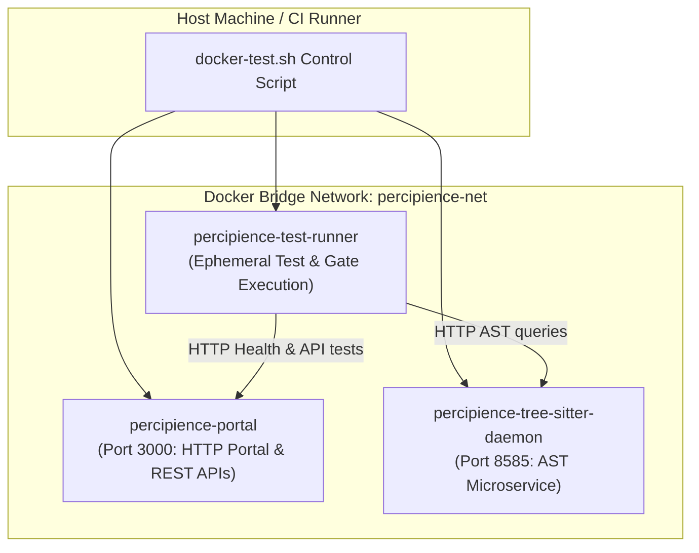

# Percipience Docker Local Testing Harness Guide

> **Location:** [`workplace/infra/docker/`](file:///Users/lakhwinder/PycharmProjects/nb_fairyfly/workplace/infra/docker/)  
> **Compose Manifest:** [`workplace/infra/docker/docker-compose.yml`](file:///Users/lakhwinder/PycharmProjects/nb_fairyfly/workplace/infra/docker/docker-compose.yml)  
> **Control Script:** [`workplace/infra/docker/docker-test.sh`](file:///Users/lakhwinder/PycharmProjects/nb_fairyfly/workplace/infra/docker/docker-test.sh)  

---

## 1. Overview & Architectural Motivation

To guarantee hermetic test execution and prevent host environment pollution across macOS, Linux, and Windows, Percipience provides a containerized multi-service testing harness.

The Docker topology isolates the three core execution components:
1. **SaaS Portal Service (`percipience-portal`)**: Serves the 15-tab governance and observability portal on port 3000.
2. **Tree-Sitter Daemon Service (`percipience-tree-sitter-daemon`)**: High-performance HTTP daemon microservice on port 8585 performing multi-language AST extraction and skeletonization.
3. **Hermetic Test Runner (`percipience-test-runner`)**: Ephemeral test execution container that mounts the repository and runs unit tests, integration tests, and the 7-stage PR Gatekeeper.



---

## 2. Container Topology & Components

### 2.1. SaaS Portal (`Dockerfile.portal`)
- **Base Image:** `python:3.11-slim`
- **Exposed Port:** `3000`
- **Command:** `python3 workplace/portal/server.py`
- **Health Check:** `curl -f http://localhost:3000/api/health || exit 1`
- **Volume Bind:** Read-only repository mount ensuring changes can be previewed live without rebuilding.

### 2.2. Tree-Sitter AST Daemon (`Dockerfile.tree_sitter_daemon`)
- **Base Image:** `python:3.11-slim`
- **Exposed Port:** `8585`
- **Command:** `python3 .nb/platform/tree_sitter_daemon.py --port 8585`
- **Function:** Provides AST parsing, complexity scoring, and function skeletonization for Python, TypeScript, Go, Rust, and Kotlin with sub-10ms response times.
- **Endpoints:**
  - `GET /health`: Daemon status and loaded grammar engines.
  - `POST /parse`: Receives source code and language identifier; returns pruned AST skeletons and symbol tables.

### 2.3. Hermetic Test Runner (`Dockerfile.test_runner`)
- **Base Image:** `python:3.11-slim`
- **Environment:** Pre-installed dependencies, test utilities, and verification tools.
- **Function:** Runs isolated test suites and gatekeeper verification without requiring local Python environments or pip packages on the developer host.

---

## 3. CLI Commands Reference (`docker-test.sh`)

The executable harness script [`workplace/infra/docker/docker-test.sh`](file:///Users/lakhwinder/PycharmProjects/nb_fairyfly/workplace/infra/docker/docker-test.sh) automates all container lifecycle operations:

```bash
# Check Docker engine availability and current container status
./workplace/infra/docker/docker-test.sh status

# Build Docker images and start services in the background
./workplace/infra/docker/docker-test.sh up

# Run unit and integration tests inside the hermetic test runner
./workplace/infra/docker/docker-test.sh test

# Run portal-specific integration tests against the live portal container
./workplace/infra/docker/docker-test.sh test-portal

# Test the Tree-Sitter daemon AST microservice over HTTP IPC
./workplace/infra/docker/docker-test.sh test-daemon

# Execute the complete 7-stage CI/CD Gatekeeper inside the container
./workplace/infra/docker/docker-test.sh gate

# Tail logs across running containers
./workplace/infra/docker/docker-test.sh logs

# Stop and remove all containers and network interfaces cleanly
./workplace/infra/docker/docker-test.sh down
```

---

## 4. Continuous Integration Integration

To run the containerized harness in GitHub Actions:

```yaml
name: Hermetic Docker CI Gate
on: [push, pull_request]

jobs:
  docker-gatekeeper:
    runs-on: ubuntu-latest
    steps:
      - uses: actions/checkout@v4
      - name: Build and Start Containers
        run: ./workplace/infra/docker/docker-test.sh up
      - name: Run Hermetic Test Suite
        run: ./workplace/infra/docker/docker-test.sh test
      - name: Run 7-Stage Gatekeeper
        run: ./workplace/infra/docker/docker-test.sh gate
      - name: Teardown Containers
        if: always()
        run: ./workplace/infra/docker/docker-test.sh down
```
