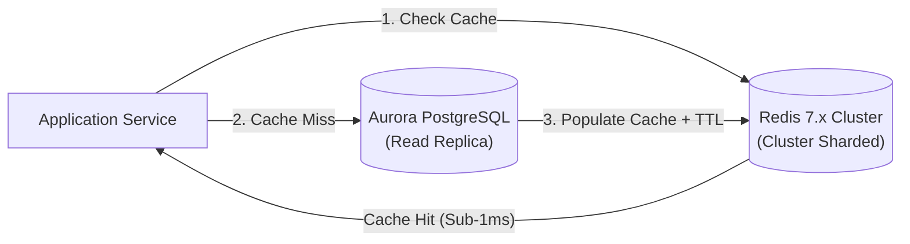

# MVS Architecture Decision Record (ADR): Distributed In-Memory Caching Architecture

> **ADR Number**: `ADR-0042`  
> **Status**: `ACCEPTED`  
> **Author**: `agent_architect`  
> **Date**: `2026-09-15`  
> **Related Wire Contracts**: `context/contracts/observability_contract.yaml`, `context/contracts/billing_meter_contract.yaml`  

---

## 1. Context & Problem Statement
High read volume on relational database partitions is degrading p99 query latency during peak market hours ($> 350\text{ ms}$). A distributed caching layer is required to absorb $85\%$ of read traffic while enforcing deterministic cache eviction and preventing stale reads.

## 2. Decision & Architectural Topology
We will implement a Redis 7.x cluster operating in a Cache-Aside pattern with Write-Through invalidation:



### Key Technical Decisions:
1. **TTL Strategy**: Adaptive dynamic TTL (60s default, scaled down to 5s for volatile balance queries).
2. **Key Namespacing**: Strict multi-tenant key prefixes: `tenant_{tenant_id}:session:{session_id}`.
3. **Cache Stampede Prevention**: Distributed Mutex locks via Redlock algorithm on cache misses.

## 3. Database Schema & Data Models
```sql
CREATE TABLE cache_metadata (
    cache_key VARCHAR(255) PRIMARY KEY,
    tenant_id VARCHAR(64) NOT NULL,
    version INT NOT NULL DEFAULT 1,
    last_invalidated_at TIMESTAMP WITH TIME ZONE DEFAULT CURRENT_TIMESTAMP,
    ttl_seconds INT NOT NULL
);
CREATE INDEX idx_cache_tenant ON cache_metadata (tenant_id);
```

## 4. Consequences & Verification
- **Positive**: Absorbs $85\%$ read volume, drops p99 latency to $< 1.2\text{ ms}$.
- **Negative**: Cache warming overhead required during rolling cluster restarts.
- **Verification Rule**: Automated Canary checks verify cache hit-rate $> 80\%$ before production traffic shift.
