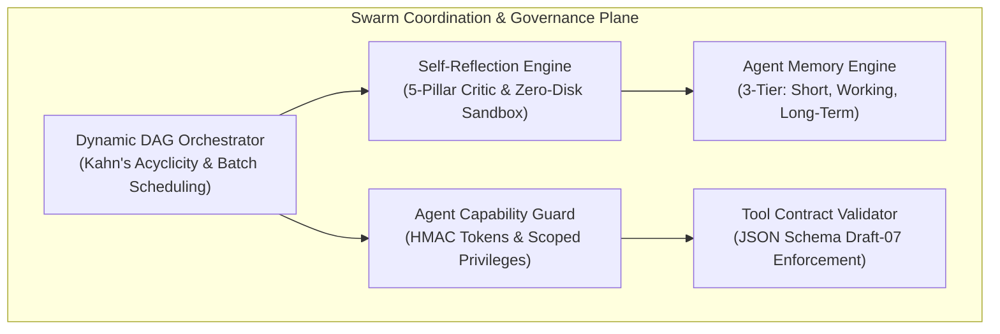

# Agent Swarm Coordination & Governance Guide (Section 17.1)

> **Governing Spec:** [`.nb/plan/master/parent-master-free-plan/detailed.md`](file:///Users/lakhwinder/PycharmProjects/nb_fairyfly/.nb/plan/master/parent-master-free-plan/detailed.md) (Section 17.1)  
> **Core Subsystems:** [`.nb/core/dynamic_dag_orchestrator.py`](file:///Users/lakhwinder/PycharmProjects/nb_fairyfly/.nb/core/dynamic_dag_orchestrator.py), [`.nb/core/self_reflection_engine.py`](file:///Users/lakhwinder/PycharmProjects/nb_fairyfly/.nb/core/self_reflection_engine.py), [`.nb/core/agent_memory_engine.py`](file:///Users/lakhwinder/PycharmProjects/nb_fairyfly/.nb/core/agent_memory_engine.py), [`.nb/core/agent_capability_guard.py`](file:///Users/lakhwinder/PycharmProjects/nb_fairyfly/.nb/core/agent_capability_guard.py), [`.nb/core/tool_contract_validator.py`](file:///Users/lakhwinder/PycharmProjects/nb_fairyfly/.nb/core/tool_contract_validator.py)  
> **Portal Dashboard:** Tab 15 (`#swarm-governance`) on `http://localhost:3000`  

---

## 1. Overview & Architectural Vision

As autonomous agent swarms scale, uncoordinated agent execution leads to race conditions, circular task dependencies, unconstrained hallucinations, and privilege escalation.

Section 17.1 establishes a production-grade **Agent Coordination, Governance & Swarm Topology** framework comprising five synchronized architectural engines:



---

## 2. Core Architectural Subsystems

### 2.1. Dynamic DAG Orchestrator (`DynamicDAGOrchestrator`)
- **Runtime Dependency Resolution:** Synthesizes task dependency graphs dynamically at runtime based on incoming intent.
- **Cycle Prevention Invariant:** Strictly evaluates DAG acyclicity via Kahn's algorithm before dispatch. Cyclic graphs are rejected with informative cycle traces.
- **Topological Batch Scheduling:** Groups mutually independent tasks into concurrent execution waves, respecting configured concurrency limits (`max_concurrency`).
- **Degraded Fallback:** Automatically downshifts to sequential execution or graceful task degradation if worker pool saturation occurs.

### 2.2. Self-Reflection Engine (`SelfReflectionEngine`)
- **5-Pillar Critic Scoring:** Evaluates candidate agent outputs across 5 quantitative dimensions:
  1. *Syntax & Semantics:* Code compiles and passes AST linting.
  2. *Contract Integrity:* Adheres strictly to cross-module interfaces and wire contracts.
  3. *Invariant Adherence:* Preserves inviolable repository rules in `.nb/context/invariants/`.
  4. *Security & Safety:* Free of CVE vulnerabilities, credential leaks, and unsafe system calls.
  5. *Token & FinOps Efficiency:* Stays within allocated token and latency budgets.
- **Zero-Disk-Write Sandbox:** Executes evaluation tests entirely in-memory using `SandboxExecutionBroker`, ensuring candidate code never writes dirty files to disk prior to validation.
- **Bounded Reflection Loops:** Constrains self-revision to a maximum of 3 iterations (or until composite score $\ge 0.85$). If iterations exhaust without meeting the threshold, the output is quarantined.

### 2.3. Agent Memory Engine (`AgentMemoryEngine`)
- **3-Tier Persistent Memory Model:**
  1. *Tier 1: Short-Term Memory:* High-resolution ephemeral context window for the active conversation turn.
  2. *Tier 2: Working Memory:* Episodic scratchpad storing intermediate task state, hypothesis attempts, and active subagent leases.
  3. *Tier 3: Long-Term Memory:* Cross-session semantic memory with relevance scoring, configurable exponential decay factors, and TTL expiration.
- **Automated Memory Maintenance:** Regularly prunes expired entries to prevent memory bloating while retaining high-salience historical solutions.

### 2.4. Agent Capability Guard (`AgentCapabilityGuard`)
- **Capability-Based Access Control (CBAC):** Agents do not possess ambient system privileges. Every tool execution requires an explicitly scoped CBAC token.
- **Cryptographic Token Verification:** Tokens are HMAC-SHA256 signed with strict validity windows (TTL) and granular action scopes (e.g., `fs:read`, `net:egress`, `exec:subagent`).
- **Dynamic Privilege Downgrade:** If an agent attempts an unauthorized action or receives a low reflexion safety score, its token capabilities are automatically downgraded.

### 2.5. Tool Contract Validator (`ToolContractValidator`)
- **Strict Schema Enforcement:** Validates all agent tool invocation arguments and returned outputs against JSON Schema (Draft-07) definitions.
- **Type Safety:** Ensures required fields are present and prevents type coercion bugs before tools are invoked.
- **Violation Quarantine:** Intercepts malformed payloads and routes them to diagnostic logs without crashing the swarm.

---

## 3. Supported Swarm Topologies

| Topology | Description | Best Suited For |
| :--- | :--- | :--- |
| **Hierarchical** | Leader agent decomposes tasks and directs specialized subordinates. | Complex feature development with strict PR oversight. |
| **Mesh / Decentralized** | Autonomous agents communicate peer-to-peer via event pub/sub. | Distributed microservice linting and independent refactoring. |
| **Sequential Pipeline** | Deterministic stage-by-stage handoff with formal contracts. | CI/CD gatekeeper verification and release builds. |
| **Dynamic Adaptive DAG** | Runtime task graph dynamically generated and topologically scheduled. | Exploratory debugging, root-cause triage, and complex refactors. |

---

## 4. Swarm Governance REST API Catalog

All endpoints are hosted by `workplace/portal/server.py` under the `/api/swarm/` route prefix:

```bash
# Query active DAG execution graph
curl -s http://localhost:3000/api/swarm/dag | jq .

# Submit a multi-node DAG for execution
curl -s -X POST http://localhost:3000/api/swarm/dag \
  -H "Content-Type: application/json" \
  -d '{"nodes": [{"id": "build", "deps": []}, {"id": "test", "deps": ["build"]}]}'

# Query agent memory by tier
curl -s "http://localhost:3000/api/swarm/memory?tier=working" | jq .

# Trigger 5-pillar reflexion evaluation
curl -s -X POST http://localhost:3000/api/swarm/reflection \
  -H "Content-Type: application/json" \
  -d '{"candidate_code": "def solve(): pass", "context": "TDD task"}'

# Mint a scoped CBAC capability token
curl -s -X POST http://localhost:3000/api/swarm/capabilities \
  -H "Content-Type: application/json" \
  -d '{"agent_id": "agent_tester", "capabilities": ["fs:read", "exec:test"]}'

# Validate tool call payload against JSON schema contract
curl -s -X POST http://localhost:3000/api/swarm/contracts \
  -H "Content-Type: application/json" \
  -d '{"tool_name": "ast_prune", "args": {"file_path": "server.py"}}'
```
