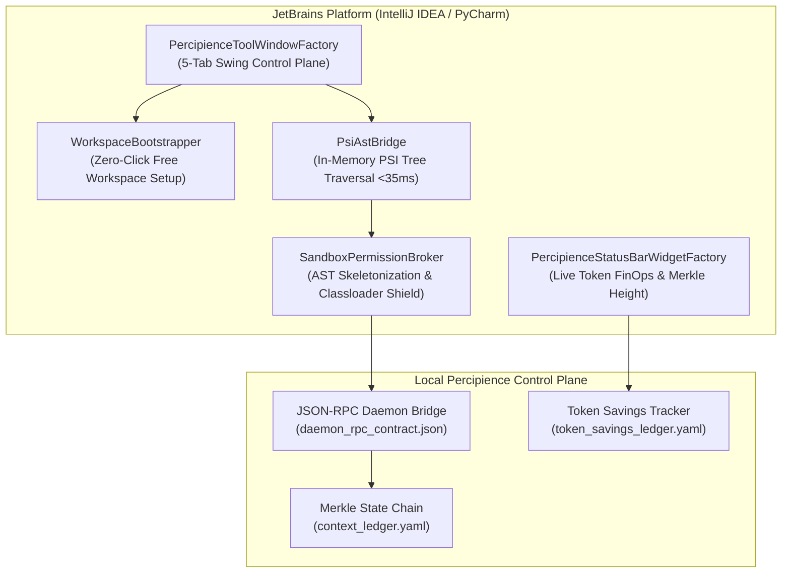

# IntelliJ IDEA & PyCharm Plugin Space Architecture

> **Autonomously Maintained by**: `agent_jetbrains_plugin_architect`  
> **Status**: ✅ Verified Valid Mermaid  
> **Canonical Target**: `workplace/modules/mod_intellij_plugin/`

## 1. System Topology & Component Layout

## 2. Component Specifications
- **`PercipienceToolWindowFactory`**: Swing-safe multi-tab tool window presenting Control Plane, Sandbox Permissions, Capabilities, Agent Swarms, and User Guides without CSS parser NPEs.
- **`PercipienceStatusBarWidgetFactory`**: Real-time status bar widget tracking token savings ($0.003/1K tokens) and Merkle block height.
- **`SandboxPermissionBroker`**: Classloader-level permission broker routing third-party IDE AI plugins to skeletonized AST signatures.
- **`PsiAstBridge`**: High-performance PSI visitor traversing Python, Kotlin, Java, and TypeScript files in under 35ms.
