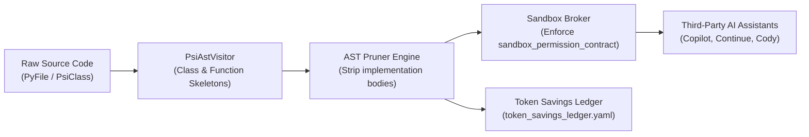

# IntelliJ IDEA & PyCharm Plugin Data Flow & Pipeline Streams

```mermaid
flowchart LR
  Source["Raw Source Code<br/>(PyFile / PsiClass)"]
  Visitor["PsiAstVisitor<br/>(Class & Function Skeletons)"]
  Pruner["AST Pruner Engine<br/>(Strip implementation bodies)"]
  Broker["Sandbox Broker<br/>(Enforce sandbox_permission_contract)"]
  LLM["Third-Party AI Assistants<br/>(Copilot, Continue, Cody)"]
  Ledger["Token Savings Ledger<br/>(token_savings_ledger.yaml)"]

  Source --> Visitor --> Pruner --> Broker --> LLM
  Pruner --> Ledger
```
