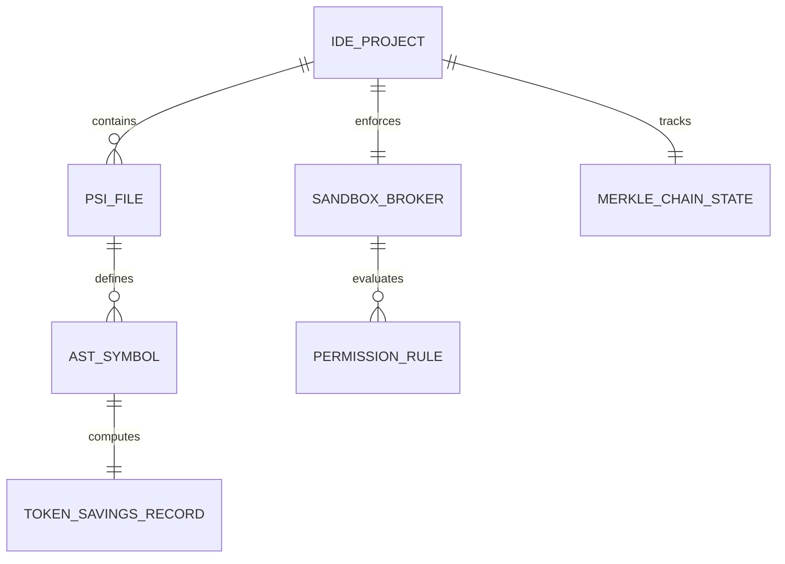

# IntelliJ IDEA & PyCharm Plugin Entity-Relationship Models

```mermaid
erDiagram
  IDE_PROJECT ||--o{ PSI_FILE : contains
  PSI_FILE ||--o{ AST_SYMBOL : defines
  AST_SYMBOL ||--|| TOKEN_SAVINGS_RECORD : computes
  IDE_PROJECT ||--|| SANDBOX_BROKER : enforces
  SANDBOX_BROKER ||--o{ PERMISSION_RULE : evaluates
  IDE_PROJECT ||--|| MERKLE_CHAIN_STATE : tracks
```
