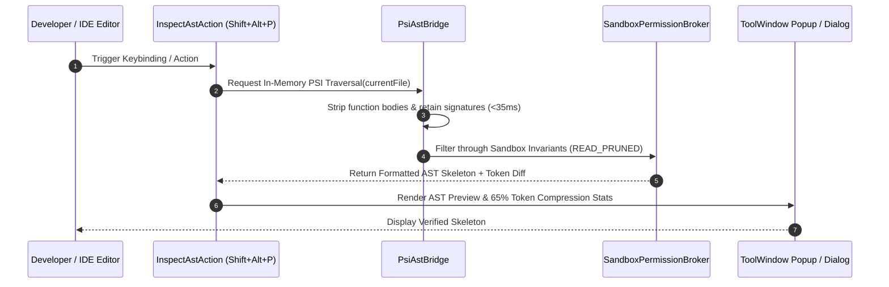

# IntelliJ IDEA & PyCharm Plugin Runtime Execution & Sequence Flows

```mermaid
sequenceDiagram
  autonumber
  participant Dev as Developer / IDE Editor
  participant Action as InspectAstAction (Shift+Alt+P)
  participant PSI as PsiAstBridge
  participant Broker as SandboxPermissionBroker
  participant Popup as ToolWindow Popup / Dialog

  Dev->>Action: Trigger Keybinding / Action
  Action->>PSI: Request In-Memory PSI Traversal(currentFile)
  PSI->>PSI: Strip function bodies & retain signatures (<35ms)
  PSI->>Broker: Filter through Sandbox Invariants (READ_PRUNED)
  Broker-->>Action: Return Formatted AST Skeleton + Token Diff
  Action->>Popup: Render AST Preview & 65% Token Compression Stats
  Popup-->>Dev: Display Verified Skeleton
```
