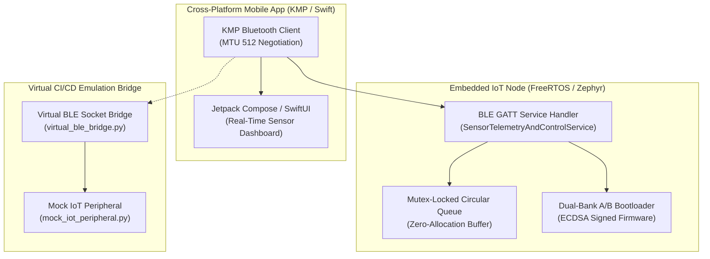

# Connected IoT & Mobile Management Domain Architecture

> **Autonomously Maintained by**: `agent_iot_mobile_ecosystem_architect`  
> **Status**: ✅ Verified Valid Mermaid  
> **Canonical Target**: `workplace/modules/mod_iot_mobile/` & `workplace/templates/bridge/`

## 1. System Topology & Component Layout

