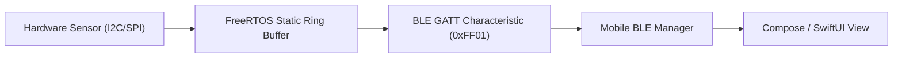

# Connected IoT & Mobile Management Data Flow & Event Streams

```mermaid
flowchart LR
  Sensor["Hardware Sensor (I2C/SPI)"]
  RingBuf["FreeRTOS Static Ring Buffer"]
  GATT["BLE GATT Characteristic (0xFF01)"]
  Mobile["Mobile BLE Manager"]
  UI["Compose / SwiftUI View"]

  Sensor --> RingBuf --> GATT --> Mobile --> UI
```
