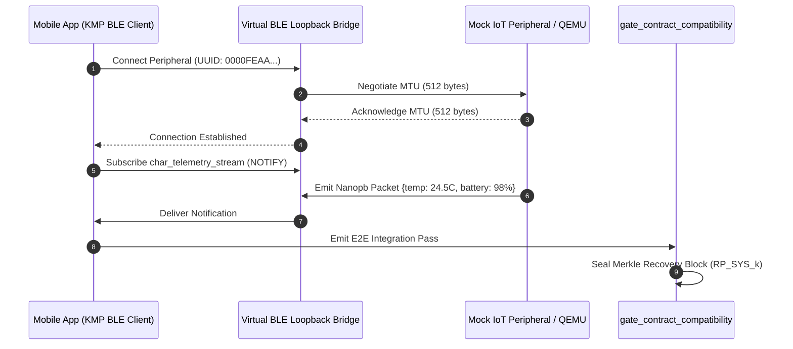

# Connected IoT & Mobile Management Runtime Execution & Sequence Flows

```mermaid
sequenceDiagram
  autonumber
  participant Mobile as Mobile App (KMP BLE Client)
  participant Bridge as Virtual BLE Loopback Bridge
  participant Peripheral as Mock IoT Peripheral / QEMU
  participant Verifier as gate_contract_compatibility

  Mobile->>Bridge: Connect Peripheral (UUID: 0000FEAA...)
  Bridge->>Peripheral: Negotiate MTU (512 bytes)
  Peripheral-->>Bridge: Acknowledge MTU (512 bytes)
  Bridge-->>Mobile: Connection Established
  Mobile->>Bridge: Subscribe char_telemetry_stream (NOTIFY)
  Peripheral->>Bridge: Emit Nanopb Packet {temp: 24.5C, battery: 98%}
  Bridge->>Mobile: Deliver Notification
  Mobile->>Verifier: Emit E2E Integration Pass
  Verifier->>Verifier: Seal Merkle Recovery Block (RP_SYS_k)
```
