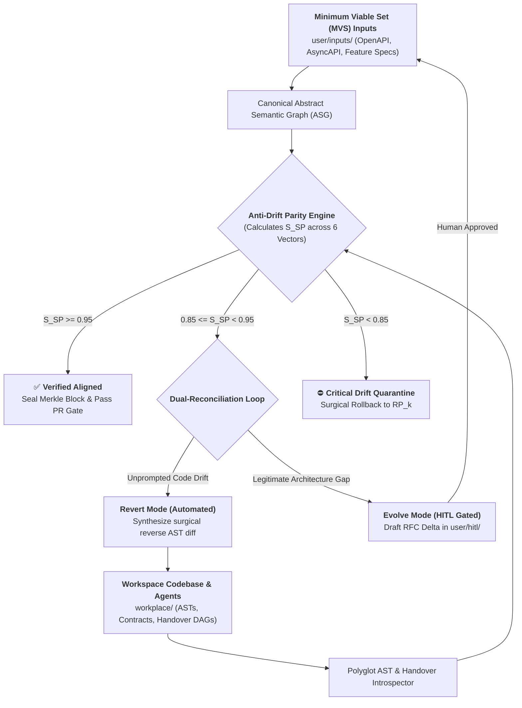
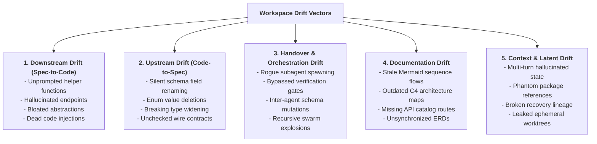
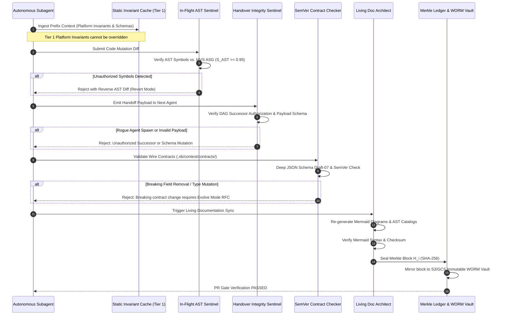
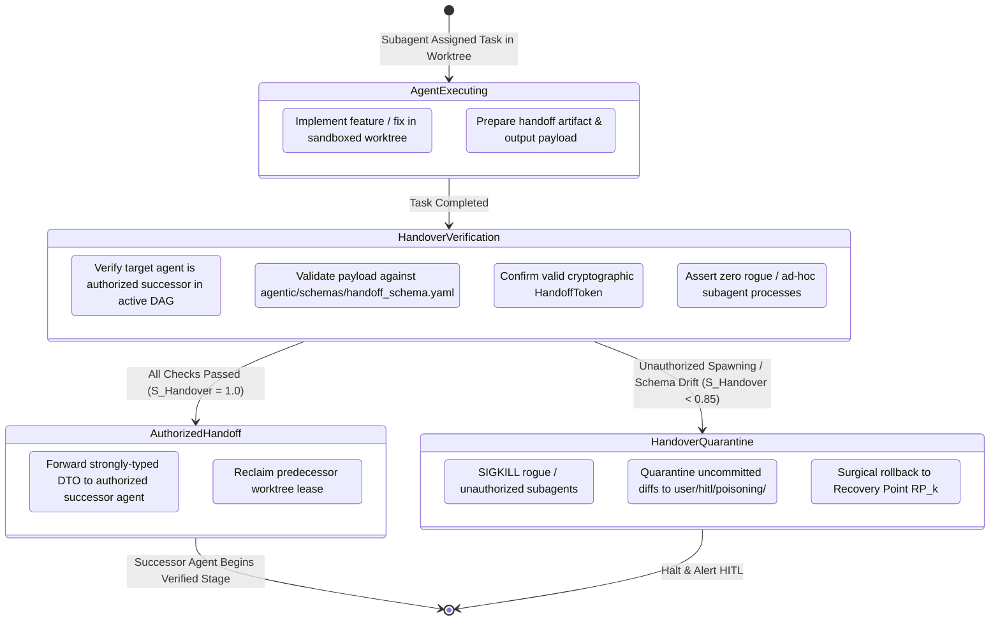
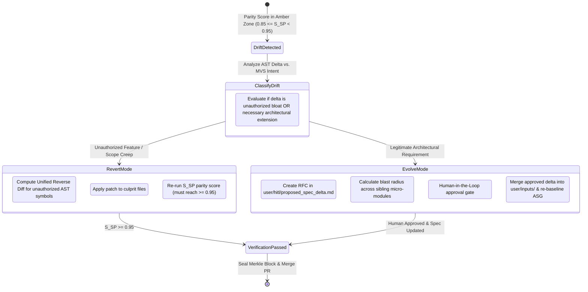

# Anti-Drift & Semantic Parity Protocol
## Enterprise Methodology for Zero-Drift Autonomous Coding, Specification Grounding, Multi-Agent Handover Integrity & Architectural Governance

> **Product Brand:** **Neutron Binary Percipience**  
> **Target Release:** Q4 2026 – Q3 2027  
> **Status:** Production Architecture & Engineering Methodology  
> **Governing Spec:** [`.nb/play/CEaasS/play_3_enterprise_context_engineering_os_plan.md`](file:///Users/lakhwinder/PycharmProjects/nb_fairyfly/.nb/play/CEaasS/play_3_enterprise_context_engineering_os_plan.md)  
> **Core Implementation:** [`workplace/core/layered_context_validator.py`](file:///Users/lakhwinder/PycharmProjects/nb_fairyfly/workplace/core/layered_context_validator.py), [`workplace/core/autonomous_cicd.py`](file:///Users/lakhwinder/PycharmProjects/nb_fairyfly/workplace/core/autonomous_cicd.py), [`workplace/core/living_doc_engine.py`](file:///Users/lakhwinder/PycharmProjects/nb_fairyfly/workplace/core/living_doc_engine.py)  

---

## 1. Executive Summary & The Multi-Dimensional Drift Crisis

In autonomous software development workflows powered by LLM agent swarms (Claude Code, Cursor Swarms, internal Devin-style subagents), **systemic drift** is the single greatest failure mode in enterprise codebases. Drift is not merely code divergence; it encompasses five distinct vectors:
1. **Unprompted Scope Creep (Spec-to-Code Drift)**: Agents hallucinate utility libraries, unnecessary abstractions, or unprompted features not specified in the Minimum Viable Set (MVS) input.
2. **Wire Contract Mutation (Code-to-Spec Drift)**: Agents silently alter API schemas, DTO field types, or database enum values, breaking upstream/downstream services.
3. **Documentation Desynchronization**: Code evolves while architecture diagrams, API catalogs, and sequence flows remain frozen in time.
4. **Context Poisoning & Latent Drift**: Hallucinated patterns or invalid assumptions propagate across multi-turn subagent dialogues.
5. **Multi-Agent Handover & Orchestration Drift**: Agents dynamically spawn unauthorized successor subagents, bypass predetermined verification gates, mutate inter-agent communication schemas, or delegate tasks outside authorized DAG boundaries.

The **Percipience Anti-Drift Protocol** establishes a mathematically bounded, multi-vector verification gatekeeper that guarantees $100\%$ lineage traceability, strict role governance, and deterministic execution across single-agent and multi-agent workflows.



---

## 2. Mathematical Formulation of Semantic Parity ($S_{SP}$)

The overall **Semantic Parity Score ($S_{SP}$)** is a composite metric normalized from $0.00$ to $1.00$, evaluated across six orthogonal verification vectors:

$$S_{SP} = w_1 \cdot S_{\text{AST}} + w_2 \cdot S_{\text{Contract}} + w_3 \cdot S_{\text{Behavior}} + w_4 \cdot S_{\text{Doc}} + w_5 \cdot S_{\text{SupplyChain}} + w_6 \cdot S_{\text{Handover}}$$

Where $\sum_{i=1}^{6} w_i = 1.00$, with calibrated enterprise production weights:

| Dimension Vector | Weight ($w_i$) | Metric Focus | Verification Mechanism |
| :--- | :---: | :--- | :--- |
| **AST Symbol Parity ($S_{\text{AST}}$)** | $0.20$ | Ratio of implemented functions, methods, and types mapped directly to MVS requirements with zero unauthorized symbols. | Tree-Sitter AST symbol diffing vs. MVS graph |
| **Wire Contract Invariance ($S_{\text{Contract}}$)** | $0.25$ | Backward compatibility and schema adherence of OpenAPI, AsyncAPI, and JSON Schema contracts. | SemVer contract diffing (`agent_contract_compatibility_checker`) |
| **Behavioral & TDD Coverage ($S_{\text{Behavior}}$)** | $0.20$ | Percentage of acceptance criteria verified by deterministic unit and integration test assertions. | Bounded TDD Runner (31/31 passing suites) |
| **Multi-Agent Handover Integrity ($S_{\text{Handover}}$)** | $0.15$ | Strict adherence to declarative workflow DAGs, authorized successor agent routing, typed handoff payloads, and zero rogue subagent spawning. | `SwarmGovernor` & `gate_agent_handover_verification` |
| **Living Documentation Parity ($S_{\text{Doc}}$)** | $0.10$ | Synchronization of Mermaid architecture diagrams, ERDs, sequence flows, and API catalogs with source ASTs. | `LivingDocEngine.sync_all_docs()` |
| **Supply Chain Purity ($S_{\text{SupplyChain}}$)** | $0.10$ | Absence of unapproved third-party dependencies, unpinned versions, or CVE vulnerabilities. | `agent_dependency_cve_sentinel` |

### Parity Gate Thresholds & Enforcement Policies

- **$S_{SP} \ge 0.95$ (Green - Merge Ready)**: PR Gatekeeper approves merge, seals Merkle block, and mirrors to immutable WORM vault.
- **$0.85 \le S_{SP} < 0.95$ (Amber - Reconciliation Required)**: Autonomous healer triggers the Dual-Reconciliation Loop (Revert or Evolve mode).
- **$S_{SP} < 0.85$ (Red - Critical Drift Rejection)**: Turn is immediately rejected; culprit micro-module and unauthorized subagents are terminated, quarantined, and rewound to the last verified Recovery Point ($\text{RP}_k$).

---

## 3. The Five Vectors of Workspace Drift



### 3.1. Downstream Drift (Spec-to-Code)
- **Definition**: The code contains entities, classes, or public endpoints not derived from `user/inputs/` specifications.
- **Remediation**: The AST pruner identifies unmapped symbols and generates a surgical removal patch.

### 3.2. Upstream Drift (Code-to-Spec)
- **Definition**: Code changes modify existing public contracts without an approved specification update.
- **Remediation**: Contract compatibility checkers block breaking changes, requiring an RFC-style specification evolution proposal in `user/hitl/proposed_spec_delta.md`.

### 3.3. Handover & Orchestration Drift (Multi-Agent Swarm Failure Modes)
Multi-agent swarms frequently exhibit failure modes during task delegation:

1. **Unauthorized Successor Spawning (Shadow Agent Creation)**:
   - *Failure Mode*: An agent encounters an edge case or tool limitation and attempts to define/spawn a brand-new subagent (e.g. ad-hoc `define_subagent`) instead of handing the task/output over to the predetermined, authorized successor defined in the workflow DAG (e.g. `agent_contract_compatibility_checker` or `agent_living_doc_architect`).
   - *Risk*: Bypasses system prompt invariants, runs outside sandboxed worktrees, consumes unmetered tokens, and breaks the cryptographic Merkle audit trail.
   - *Protocol Enforcement*: Runtime interceptor strictly blocks dynamic agent creation unless pre-authorized in `agentic/workflows/`; rogue subagents are instantly SIGKILLed.

2. **Bypassed Verification Gate Short-Circuiting**:
   - *Failure Mode*: An agent attempts to invoke a downstream release or deployment step directly, skipping intermediate mandatory verification gates (e.g. attempting to merge to `main` without running `gate_contract_compatibility`).
   - *Protocol Enforcement*: The workflow DAG engine enforces non-bypassable cryptographic state tokens (`HandoffToken`). Downstream agents refuse execution without a signed verification token from preceding gates.

3. **Inter-Agent Payload Contract Mutation (Schema Drift)**:
   - *Failure Mode*: An upstream agent alters the structure of the handoff payload (e.g. passing loose natural language summaries instead of strongly-typed JSON DTOs defined in `agentic/schemas/handoff_schema.yaml`), causing downstream receiver agents to hallucinate or drop invariant constraints.
   - *Protocol Enforcement*: `gate_agent_handover_verification` validates all inter-agent messages against JSON Schema Draft-07 contracts before routing.

4. **Recursive Swarm Explosions & Worktree Exhaustion**:
   - *Failure Mode*: Subagents recursively fork children to decompose trivial subtasks, exhausting OS process IDs, Redis lock handles, and sprint token budgets.
   - *Protocol Enforcement*: Hard ceiling on swarm depth ($D_{\max} = 2$) and concurrent worktrees ($N_{\max} = 4$), managed by `WorktreeEngine` with active PID probing.

5. **Role Usurpation & Privilege Escalation Drift**:
   - *Failure Mode*: A Tier B specialist agent (e.g. doc generator or diff pruner) attempts actions reserved exclusively for Tier A frontier agents (such as signing Merkle blocks, approving PR gates, or modifying wire contracts).
   - *Protocol Enforcement*: Role-Based Access Control (RBAC) matrix in `layered_context_validator.py` blocks unauthorized capability execution.

### 3.4. Documentation Drift
- **Definition**: Implementation details diverge from system documentation in `workplace/docs/`.
- **Remediation**: `agent_living_doc_architect` introspects source ASTs and updates all 31 living markdown documents with executable Mermaid diagrams before PR verification.

### 3.5. Context & Latent Drift
- **Definition**: Subagent dialogues accumulate hallucinated assumptions over long multi-turn sessions.
- **Remediation**: Context memory compactor and static prompt cache prefix alignment enforce clean, tiered context envelopes.

---

## 4. Multi-Phase Anti-Drift Interception Pipeline

The protocol enforces anti-drift validation across five deterministic lifecycle phases:



---

## 5. Multi-Agent Handover Governance & State Machine



---

## 6. Dual-Reconciliation Workflow: Revert vs. Evolve

When drift is detected ($0.85 \le S_{SP} < 0.95$), Percipience executes the **Dual-Reconciliation Protocol**:



---

## 7. CLI Management & Gatekeeper Integration

The anti-drift engine is accessible via the Percipience CLI and automatically wired into the CI/CD Gatekeeper:

```bash
# 1. Audit entire workspace for semantic drift & compute S_SP (including Handover parity)
./workplace/bin/percipience drift check

# 2. Detailed breakdown across all 6 parity vectors
./workplace/bin/percipience drift report --verbose

# 3. Audit active agent swarm for unauthorized successor spawning or orphaned worktrees
./workplace/bin/percipience swarm audit

# 4. Trigger automated Revert Mode on drifted symbols
./workplace/bin/percipience drift reconcile --mode revert --module mod_portal_marketing

# 5. Review and approve proposed specification evolution (Evolve Mode)
./workplace/bin/percipience drift approve-delta --delta-id DELTA_20260917_01

# 6. Run full 7-stage PR Gatekeeper with anti-drift & handover verification
./workplace/bin/percipience gate
```

---

## 8. Hard Invariants for Workspace Robustness

To ensure absolute resilience across all active workspaces:
1. **Tier 1 Immutability**: Platform security invariants in `context/invariants/` can never be modified or overridden by LLM prompts or custom user configs.
2. **Contract-First Development**: No source file in `workplace/` may expose a public API endpoint or message format not defined in `context/contracts/`.
3. **Strict Handover Authorization**: Subagents may only transfer state to predetermined, authorized successors registered in the active workflow DAG (`agentic/workflows/`). Dynamic rogue agent creation is prohibited.
4. **Typed Handoff Contracts**: All inter-agent payloads must strictly conform to JSON Schema Draft-07 definitions in `agentic/schemas/`.
5. **Atomic State Commitments**: Every code change and specification update must be atomically sealed into the cryptographic Merkle hash chain (`context_ledger.yaml`) with SHA-256 block proofs.
6. **Living Documentation Synchronization**: No PR may be merged if `LivingDocEngine` reports drift between codebase ASTs and markdown documentation in `workplace/docs/`.
7. **Bounded SLA Healing**: If semantic or handover drift cannot be resolved within 3 bounded healing attempts, the Turn is quarantined and the culprit module is surgically rolled back to $\text{RP}_k$.
